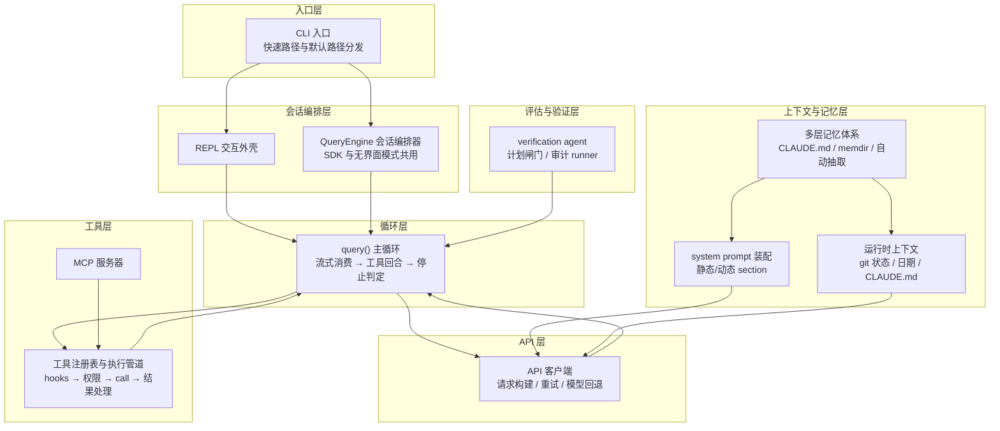
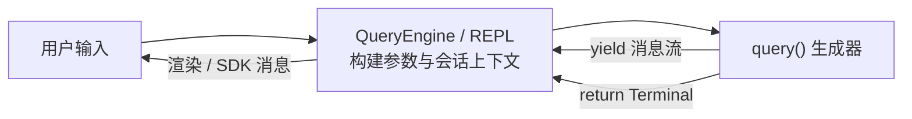
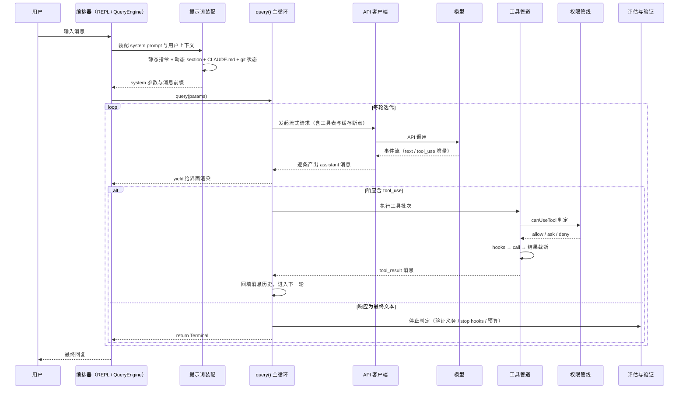
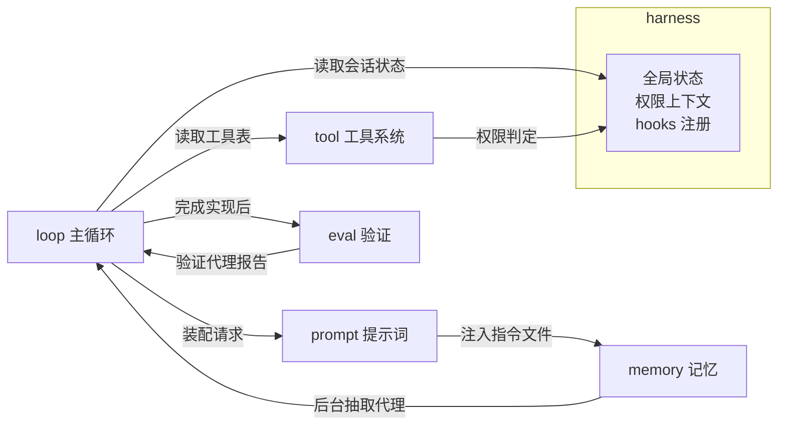

# 整体架构：Claude Code 的组件与协作

## 1 架构总览

Claude Code 围绕一条原则组织：模型只负责理解与决策，其余一切都由运行时（harness）提供。全部组件分成七个层次，模型处于中心，各层通过消息流与回调互相协作。

各层职责一句话：

| 层次 | 职责 |
|---|---|
| 入口层 | 按参数把进程分发到最轻量的路径；`--version` 不加载任何业务模块 |
| 会话编排层 | 为每个会话持有消息历史、文件状态与用量统计，把循环产出翻译成界面或 SDK 协议 |
| 循环层 | 唯一的 agent 主循环：调用模型、执行工具、回填结果，直到命中终止条件 |
| API 层 | 把内部消息与工具表转成 API 请求，处理流式事件、重试与模型回退 |
| 工具层 | 把模型可调用的能力统一成一个接口，外部 MCP 工具经适配后进入同一管道 |
| 上下文与记忆层 | 决定模型每轮"看到什么"：指令、环境信息、记忆文件与缓存断点 |
| 评估与验证层 | 在运行时对产出做独立检查，把 PASS/FAIL 判定与计划批准做成流程闸门 |

## 2 核心组件与职责

### 2.1 主循环 query() 与编排器 QueryEngine

`query()` 是一个异步生成器：向外产出消息流（供界面与转录消费），结束时返回一个带原因的终止对象。它不依赖任何界面框架，只通过回调按需读取会话状态。

`QueryEngine` 位于其上：每个会话一个实例，持有消息历史与中止信号，负责回合记账、用量累加、权限拒绝记录与转录。交互式 REPL 与无界面 SDK 调用的是同一个 `query()`，界面差异只存在于编排层。

### 2.2 工具接口与执行管道

所有工具实现同一个接口：zod 定义的输入 schema、执行方法 `call`、生成描述文本的 `prompt`、权限自检 `checkPermissions`、以及只读/并发安全/结果大小上限等元数据。工厂函数为未覆盖的字段填充保守默认值。

执行管道固定顺序：解析工具 → schema 校验 → 业务校验 → 输入回填 → PreToolUse hooks → 权限判定 → `call` → PostToolUse hooks → 结果截断与持久化 → 回填消息。

### 2.3 权限判定管线

权限判定收敛为一个函数，判定顺序固定且 deny 优先：整工具拒绝规则 → 整工具询问规则 → 工具自身权限检查 → 工具拒绝/交互要求/内容规则/安全检查 → 旁路模式 → 整工具允许规则 → 兜底转询问。判定之后还有模式后处理：dontAsk 模式把询问改写为拒绝，auto 模式把询问交给分类器。

### 2.4 system prompt 装配

system prompt 由两部分组成：跨会话稳定的静态指令在前，运行时会变的内容在后，中间用一个边界标记分隔。动态内容按 section 组织，每个 section 是一个"名称 + 计算函数 + 是否每轮重算"三元组，会话级缓存，`/clear` 与压缩时清空。

多来源提示词按优先级总装：覆盖提示词 > 协调器提示词 > agent 提示词 / 自定义提示词 / 默认提示词，附加提示词恒追加。

### 2.5 记忆体系

记忆分三层维护与注入：人工维护的 CLAUDE.md 指令文件在会话启动时合并进用户上下文；模型维护的 memdir 记忆目录通过"行为指引进 system prompt + 相关文件按需注入附件"两条渠道进入上下文；后台抽取代理在每个查询循环结束后把新记忆写回 memdir。

### 2.6 评估与验证

验证代理以独立上下文对"非平凡实现"做对抗式检查，产出 PASS/FAIL/PARTIAL 判定；计划批准通过 ExitPlanMode 工具把控制权交还用户；提示工程审计 runner 用静态断言防止提示词回归。三者分别覆盖行为验证、流程闸门与文本回归。

## 3 一次完整请求的生命周期

生命周期中的关键设计：

1. **流式增量**：模型输出的每个 block 完成即产出一条消息，界面无需等待整轮结束；文本增量先入数组、结束时一次合并。
2. **工具回合**：循环自己维护"是否出现工具调用"的状态，模型停在 tool_use 后由 harness 执行工具并回填结果，循环继续。
3. **停止判定分层**：中断优先于错误，错误优先于恢复（压缩、输出上限续跑），hooks 与预算收尾，最后才是正常完成。
4. **压缩时机**：每轮调用前判定上下文是否接近窗口上限，超限先用模型摘要压缩历史，再用新消息数组继续循环。

## 4 模块间协作关系

- **loop 与 tool**：循环持有工具表与权限函数，工具执行的结果以消息形态回填循环；循环只关心"执行了哪些工具、得到什么结果"，执行细节全部在工具管道内。
- **loop 与 harness**：循环通过回调读取权限上下文与全局状态，通过中止信号接收用户中断；harness 负责在循环之外执行 hooks 与权限弹窗。
- **loop 与 prompt**：每轮请求的 system 参数由提示词装配层产出；缓存断点的放置由提示词层与 API 层协商完成。
- **loop 与 memory**：记忆目录的自动抽取在循环收尾阶段触发，抽取代理以受限工具集写入记忆文件；读取侧在每轮输入时按相关性注入记忆附件。
- **loop 与 eval**：验证义务写在主代理的 system prompt 里，验证代理由 Agent 工具启动，判定结果驱动主代理修复或报告。

## 5 模块导读

| 模块 | 一句话定位 |
|---|---|
| [loop](<loop.md>) | 模型如何被反复调用、工具如何被执行、循环如何结束 |
| [harness](<harness.md>) | 模型之外的一切：入口、状态、权限、hooks、会话生命周期 |
| [prompt](<prompt.md>) | 模型每轮"看到什么指令"如何装配与缓存 |
| [tool](<tool.md>) | 能力如何被建模为统一接口并进入执行管道 |
| [eval](<eval.md>) | 产出如何被独立验证，计划如何经过批准闸门 |
| [memory](<memory.md>) | 跨会话信息如何分层保存、抽取与注入 |

## 6 关键设计思想

1. **循环与界面解耦**：主循环只暴露消息流与终止原因，同一循环服务交互终端与无界面 SDK 两种消费方。
2. **单一判定入口**：权限、工具执行、提示词装配都收敛到一个可顺序阅读的函数，每个决策携带"为什么这样判定"的依据。
3. **静态与动态分离**：稳定内容靠前、易变内容靠后，缓存行为由内容位置自动推导。
4. **统一接口加适配**：内置工具与外部 MCP 工具共享同一接口形态，外部能力经适配后复用全部管道。
5. **独立验证**：实现者与验证者上下文隔离，判定协议可解析（PASS/FAIL/PARTIAL），验证义务写入提示词并由工具结果提醒兜底。
6. **分层记忆**：人工指令、模型记忆目录、自动抽取三层各司其职，注入量用"索引常驻 + 相关子集按需 + 去重"控制。
