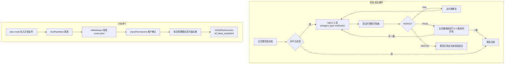
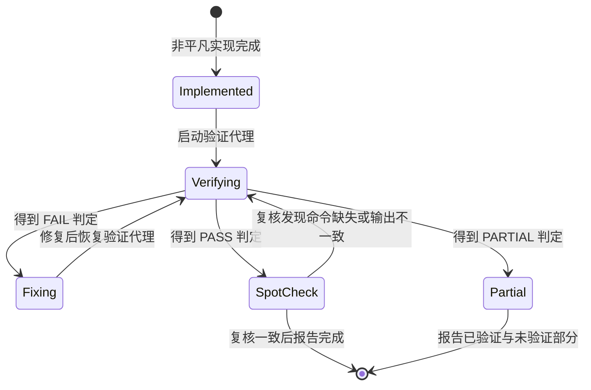
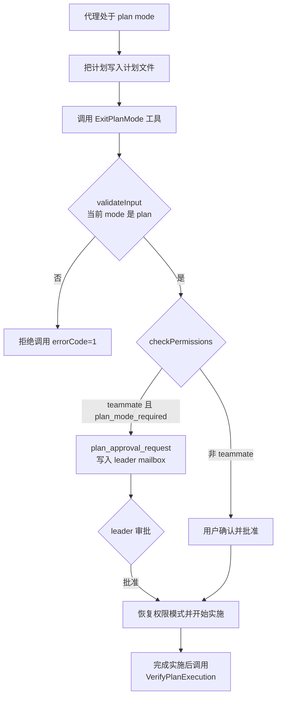

# Eval 模块：评估与验证机制

## 1 模块概览

本仓库（Claude Code 的反编译/还原版本）没有独立的评测框架目录，`CLAUDE.md` 的 Testing 部分只描述 `bun:test` 单元测试与集成测试。仓库中也不存在独立 eval 目录。评估与验证能力以三种形态嵌入运行流程：

- **对抗式验证代理（verification agent）**：主代理完成非平凡实现后，启动 `subagent_type="verification"` 的独立代理做对抗式检查，产出 `PASS` / `FAIL` / `PARTIAL` 判定。
- **计划闸门**：`ExitPlanMode` 工具把控制权交还用户批准；`VerifyPlanExecution` 工具确认执行与计划一致。
- **提示工程审计 runner**：`promptEngineeringAudit.runner.ts` 以静态 checklist 断言 system prompt 组装结果，防止提示词回归。

此外还有两处上游 eval 机制的痕迹：`microCompact.ts` 内嵌的时间触发规则评估（`evaluateTimeBasedTrigger`），以及 `memoryTypes.ts` 注释中对上游 `memory-prompt-iteration.eval.ts` 评测结果的引用。后者对应的 `.eval.ts` 文件与审计文档 `docs/features/opus-4.7-prompt-engineering-audit.md` 都未随反编译版本保留，仓库里只留下注释引用。

整体形态：



涉及文件清单：

| 文件路径 | 职责 | 关键导出 |
| --- | --- | --- |
| `src/constants/prompts.ts` | 组装 system prompt；写入主代理的验证义务文本 | `getSystemPrompt`（423 行起）、`getSessionSpecificGuidanceSection`（336 行起） |
| `packages/builtin-tools/src/tools/AgentTool/built-in/verificationAgent.ts` | 验证代理定义、系统提示词、判定输出格式 | `VERIFICATION_AGENT`（134 行） |
| `packages/builtin-tools/src/tools/AgentTool/constants.ts` | Agent 工具常量 | `AGENT_TOOL_NAME`、`LEGACY_AGENT_TOOL_NAME`、`VERIFICATION_AGENT_TYPE` |
| `packages/builtin-tools/src/tools/AgentTool/builtInAgents.ts` | 内置代理注册与 feature gate | `getBuiltInAgents` |
| `packages/builtin-tools/src/tools/AgentTool/AgentTool.tsx` | Agent 工具主体，`subagent_type` 分发 | `inputSchema`、`call`（322 行起） |
| `packages/builtin-tools/src/tools/TodoWriteTool/TodoWriteTool.ts` | 任务收尾时附加验证提醒 | `verificationNudgeNeeded`（72-84 行） |
| `packages/builtin-tools/src/tools/TaskUpdateTool/TaskUpdateTool.ts` | 同样的验证提醒（397 行） | — |
| `packages/builtin-tools/src/tools/VerifyPlanExecutionTool/VerifyPlanExecutionTool.ts` | 计划执行验证工具 | `VerifyPlanExecutionTool` |
| `packages/builtin-tools/src/tools/VerifyPlanExecutionTool/constants.ts` | 工具名常量 | `VERIFY_PLAN_EXECUTION_TOOL_NAME` |
| `packages/builtin-tools/src/tools/ExitPlanModeTool/ExitPlanModeV2Tool.ts` | 计划批准闸门 | `ExitPlanModeV2Tool`、`_sdkInputSchema` |
| `packages/builtin-tools/src/tools/ExitPlanModeTool/prompt.ts` | ExitPlanMode 工具提示词 | `EXIT_PLAN_MODE_V2_TOOL_PROMPT` |
| `src/utils/ultraplan/ccrSession.ts` | 远程会话中扫描 ExitPlanMode 结果 | `ExitPlanModeScanner`（80 行） |
| `src/utils/attachments.ts` | 计划验证提醒 attachment | `getVerifyPlanReminderAttachment`（3976 行起） |
| `src/state/AppStateStore.ts` | 计划验证状态定义 | `pendingPlanVerification`（420 行） |
| `src/constants/promptEngineeringAudit.runner.ts` | 提示工程审计主体（约 64 项断言） | 无导出，作为 `bun test` 子进程运行 |
| `src/constants/__tests__/promptEngineeringAudit.test.ts` | 审计子进程包装器 | 无 |
| `src/services/compact/microCompact.ts` | 时间触发 microcompact 的条件评估 | `evaluateTimeBasedTrigger`（426 行） |
| `src/services/compact/timeBasedMCConfig.ts` | 时间触发配置类型与读取 | `TimeBasedMCConfig`、`getTimeBasedMCConfig` |
| `src/memdir/memoryTypes.ts` | 记忆提示词文本；注释引用上游 eval 结果 | `WHAT_NOT_TO_SAVE_SECTION`、`WHEN_TO_ACCESS_SECTION`、`TRUSTING_RECALL_SECTION` |
| `src/services/analytics/growthbook.ts` | feature gate 读取与环境变量覆盖 | `getEnvOverrides`（170 行）、`hasGrowthBookEnvOverride`（199 行） |
| `src/constants/tools.ts` | `CORE_TOOLS` 白名单 | `CORE_TOOLS`（137 行起，含 `VerifyPlanExecution`） |

## 2 核心概念

### 2.1 对抗式验证（verification agent）

**概念定义**：`VERIFICATION_AGENT` 是一个内置代理定义（`BuiltInAgentDefinition`），`agentType` 为 `'verification'`（`verificationAgent.ts:135`）。主代理通过 `Agent` 工具以 `subagent_type="verification"` 启动它，它对"非平凡实现"做独立检查，输出 `PASS` / `FAIL` / `PARTIAL` 判定。

**设计动机**：实现者与验证者如果共享同一上下文（甚至同一模型），自我检查会重演同样的盲区。验证代理的提示词开篇就声明立场：`Your job is not to confirm the implementation works — it's to try to break it`（`verificationAgent.ts:10`），并列出两类已知失败模式：verification avoidance（只读代码、叙述本会如何测试、直接写 PASS）与被"前 80% 完成度"迷惑（`verificationAgent.ts:12`）。

**判定语义**（`verificationAgent.ts:117-129`）：

- `PASS`：全部检查通过，且每条 PASS 都带 `Command run` 代码块与实际输出。
- `FAIL`：找到可复现的缺陷，报告中须包含失败内容、精确错误输出与复现步骤。
- `PARTIAL`：仅限环境限制（缺少测试框架、工具不可用、服务无法启动）时使用；能运行检查就必须给出 `PASS` 或 `FAIL`。

**"不能自我验证"如何写进提示词**：主代理侧的义务文本（`prompts.ts:374-381`）写明 `only the verifier assigns a verdict; you cannot self-assign PARTIAL`；`TodoWriteTool.ts:107` 与 `TaskUpdateTool.ts:397` 在任务收尾时追加同样的提醒文本。验证代理侧通过 `disallowedTools` 禁止写文件工具（`verificationAgent.ts:139-145`），保证验证阶段只读。

**代码证据**：

- 注册条件：`builtInAgents.ts:62-67` 中 `feature('VERIFICATION_AGENT') && getFeatureValue_CACHED_MAY_BE_STALE('tengu_hive_evidence', false)` 成立时注册。
- 触发时机：`TodoWriteTool.ts:72-84` 在主线程代理把 3 项以上任务全部置为 completed、且列表中没有 verification 步骤时，把 `verificationNudgeNeeded` 置为 true。
- 分发：`AgentTool.tsx:141` 的 `subagent_type` 是可选 schema 字段；`AgentTool.tsx:377-382` 按 `agentDefinitions.activeAgents.find(a => a.agentType === subagent_type)` 查找代理定义。

### 2.2 计划批准闸门

**概念定义**：计划闸门由两个工具构成。`ExitPlanMode` 把控制权交还用户（用户批准后才退出 plan mode）；`VerifyPlanExecution` 在实施完成后确认全部计划步骤已执行。两者都在 `src/constants/tools.ts:160` 的 `CORE_TOOLS` 白名单里，始终对模型可见。

**设计动机**：plan mode 下模型只读。如果模型可以自行结束 plan mode，计划批准就失去意义。`ExitPlanModeV2Tool.ts:195-220` 的 `validateInput` 在权限询问之前校验当前 `mode`，plan mode 以外的调用直接返回 `errorCode: 1` 拒绝；`checkPermissions`（221-239 行）要求非 teammate 场景必须经用户确认。

**代码证据**：

- 工具不接收计划内容参数：`EXIT_PLAN_MODE_V2_TOOL_PROMPT` 写明 `This tool does NOT take the plan content as a parameter - it will read the plan from the file you wrote`（`prompt.ts:10`）。
- 批准后回写编辑：`ExitPlanModeV2Tool.ts:258-261` 在用户编辑了计划（CCR Web UI）时把 `inputPlan` 写入磁盘。
- 状态恢复：`ExitPlanModeV2Tool.ts:357-403` 把 `toolPermissionContext.mode` 恢复为 `prePlanMode`，并处理 auto mode 的 gate 失效回退（327-346 行）。
- 执行验证：`VerifyPlanExecutionTool.ts:85-92` 的 `call` 返回 `{ verified: input.all_steps_completed, summary: input.plan_summary }`。
- 提醒机制：`attachments.ts:3976-4011` 在 `pendingPlanVerification` 未开始时每 N 轮追加 `verify_plan_reminder` attachment；状态定义在 `AppStateStore.ts:418-424`。
- 批准后指令：`src/components/permissions/ExitPlanModePermissionRequest/ExitPlanModePermissionRequest.tsx:420-425` 在批准文案后追加 `You MUST call the "VerifyPlanExecution" tool directly`。

注意：`ExitPlanModeV2Tool.ts:315-316` 的注释提到 `registerPlanVerificationHook()` 在 `REPL.tsx` 中注册后台验证钩子，但仓库内 grep 找不到该函数实现，该部分未随反编译版本保留。

### 2.3 提示工程审计 runner

**概念定义**：`promptEngineeringAudit.runner.ts`（729 行）是一套静态 checklist：先调用 `getSystemPrompt()` 生成完整 system prompt，再用 `toContain` / `toMatch` 断言关键文本存在。它审计的是"提示词是否包含预期约束"，验证的对象是提示词文本本身。

**为什么是 runner 文件**：文件名后缀是 `.runner.ts`，不会被 `bun test` 直接收集。`__tests__/promptEngineeringAudit.test.ts`（33 行）是一个薄包装器，用 `Bun.spawn(['bun', 'test', RUNNER_REL])` 在独立子进程里运行 runner（`promptEngineeringAudit.test.ts:18-22`）。文件头注释（1-10 行）说明原因：runner 里有 30 多个 `mock.module()` 调用，Bun 的 `mock.module` 是进程全局的，独立子进程可以防止污染同批其他测试文件。

**审计维度**（对应 `promptEngineeringAudit.runner.ts` 的五部分）：

1. 提示词工程技巧验证（第一部分，`describe` #1-#10）：决策树工具选择（235-264 行）、反模式先行（270 行）、渐进式回退链（308 行）、few-shot 示例（335 行）、语言信号识别（370 行）、成本不对称（394 行）、反过度解释（419 行）、查询构造（441 行）、prompt injection 防御（467 行）、多步搜索（492 行）。
2. 行为规则验证（第二部分，#11-#23 的子集）：格式化纪律（505 行）、先搜索再说不知道（527 行）、温暖语气（543 行）、风险感知时说得更少（559 行）、不解释为什么搜索（570 行）、产品线信息（581 行）、对话结束尊重（612 行）、每回复一个问题（624 行）。
3. 已有行为锚点的回归测试（第三部分，636 行起）：`Default to helping`、anti-collapse、cutoff silence、no-machinery-narration、tool_discovery、false-claims mitigation、`CYBER_RISK_INSTRUCTION`。
4. `prependBullets` 工具函数测试（第四部分，688 行起）。
5. 环境信息与模型 cutoff 正确性（第五部分，708 行起）。

**如何产出报告**：runner 的运行结果就是 `bun test` 的通过/失败输出；包装器测试在子进程退出码不为 0 时抛出包含 stderr 与 stdout 尾部 3000 字符的错误信息（`promptEngineeringAudit.test.ts:24-31`），超时上限 60 秒（32 行）。

### 2.4 评测环境的确定性需求

**概念定义**：feature gate 的取值来自 GrowthBook 远程配置。评测环境里每次运行的 feature 组合必须相同，否则同一场景会得到不同行为。`growthbook.ts` 为此提供环境变量覆盖通道。

**代码证据**：

- `growthbook.ts:159-166` 注释定义 `CLAUDE_INTERNAL_FC_OVERRIDES`：一个 JSON 对象，把 feature key 映射到值，`to bypass remote eval and disk cache. Useful for eval harnesses that need to test specific feature flag configurations`，仅 `USER_TYPE === 'ant'` 时生效。
- `growthbook.ts:170-192` 的 `getEnvOverrides()` 解析该变量，解析失败记录错误。
- `growthbook.ts:204-210` 的注释写明优先级：env 覆盖优先于 `/config` Gates 的本地覆盖，`env wins so eval harnesses remain deterministic`。
- `growthbook.ts:758-762` 的 `getFeatureValueInternal` 第一行就是 `// Check env var overrides first (for eval harnesses)`；823、902、960、1013 行的其他 getter 沿用同一模式。
- `growthbook.ts:199-202` 的 `hasGrowthBookEnvOverride()` 让调用方在有覆盖时跳过等待初始化。

### 2.5 提示词迭代与 eval 文件

**概念定义**：上游仓库用 `.eval.ts` 文件对提示词变体做受控评估（同一组测试场景分别跑不同提示词版本，统计通过数），评估结果作为设计证据写回源码注释。本仓库保留了这些注释，但 `.eval.ts` 文件本身未被保留。

**代码证据**（`memoryTypes.ts`）：

- 143-154 行注释 `Eval-validated (memory-prompt-iteration.eval.ts, 2026-03-17)` 记录两个假设的评测结果：H1（验证记忆中的函数/文件声明）通过 `appendSystemPrompt` 追加时从 0/2 提升到 3/3，作为 "When to access" 下的条目时掉到 0/3——结论是提示词位置影响效果，该内容需要独立 section 级别的触发上下文；H5（读取侧噪声拒绝）追加时 0/2 提升到 3/3，内嵌条目时 2/3。
- 155-160 行注释记录标题措辞的 A/B 结果：`Before recommending from memory` 全文相同、仅标题不同时 3/3，抽象标题 `Trusting what you recall` 原位放置时 0/3。
- 107-109 行注释 `Eval-validated (memory-prompt-iteration case 3, 0/2 → 3/3)` 记录 H2（显式保存闸门）：防止"保存本周 PR 列表"演变成活动日志噪声。
- 122-130 行注释记录 H6（branch-pollution evals #22856）的失败模式与 token 预算变化（约 +3 tokens）。

### 2.6 harness 内嵌的规则评估：evaluateTimeBasedTrigger

**概念定义**：`evaluateTimeBasedTrigger`（`microCompact.ts:426-450`）是一个纯谓词函数，评估"距上一条主循环 assistant 消息的时间间隔是否超过阈值"这一条规则，返回 `{ gapMinutes, config }` 或 `null`。它是评估机制中最小的单元：条件判定内嵌在运行路径里，判定结果直接驱动上下文清理行为。

**代码证据**：

- `microCompact.ts:426-450`：条件链依次为 `config.enabled` 为真、`querySource` 存在且是主线程来源、存在上一条 assistant 消息、`gapMinutes` 是有限数且不低于 `config.gapThresholdMinutes`。
- `microCompact.ts:405-425` 的注释说明该函数被提取为独立谓词，供其他 pre-request 路径（如 snip force-apply）复用同一判定。
- `timeBasedMCConfig.ts:18-34`：配置类型 `TimeBasedMCConfig` 默认 `enabled: false`、`gapThresholdMinutes: 60`、`keepRecent: 5`；36-42 行从 GrowthBook key `tengu_slate_heron` 读取，覆盖默认值。
- `microCompact.ts:452-479` 的 `maybeTimeBasedMicrocompact` 消费判定结果：只保留最近 `keepRecent` 条可压缩工具结果，清空其余。

## 3 关键流程

### 3.1 实现-验证循环



分步讲解：

1. **义务生效**：system prompt 组装时，`getSessionSpecificGuidanceSection` 在 `feature('VERIFICATION_AGENT')`、GrowthBook key `tengu_hive_evidence` 为真、穷鬼模式关闭三个条件下写入验证义务文本（`prompts.ts:374-381`）。触发标准是"非平凡实现"：3 个以上文件编辑、backend/API 变更、基础设施变更。
2. **结构性提醒**：`TodoWriteTool.ts:72-84` 与 `TaskUpdateTool.ts:397` 在循环退出时刻（3 项以上任务全部完成且无 verification 步骤）追加提醒，防止"最后一个任务关闭后循环直接退出"的跳过路径。
3. **启动验证代理**：主代理调用 `Agent` 工具并传 `subagent_type="verification"`；`AgentTool.tsx:377-382` 按 `agentType` 查找到 `VERIFICATION_AGENT` 定义，`AgentTool.tsx:410-415` 决定 `effectiveType`。
4. **验证代理执行**：按 `verificationAgent.ts:42-49` 的通用基线（读 CLAUDE.md/README、跑构建、跑测试套件、跑 linter/类型检查、检查相关代码回归）加按变更类型适配的策略（30-40 行）加对抗探针（63-69 行）。
5. **判定输出**：报告以 `VERDICT: PASS` / `FAIL` / `PARTIAL` 结尾（`verificationAgent.ts:117-129`）。
6. **FAIL 循环**：主代理修复后把发现与修复一起传给验证代理恢复运行，重复到 PASS（`prompts.ts:380` 的 `On FAIL: fix, resume the verifier with its findings plus your fix, repeat until PASS`）。
7. **PASS 复核**：主代理重新运行报告中的 2-3 条命令，确认每条 PASS 都有 `Command run` 块且输出与重新运行的结果一致；缺失或不一致则恢复验证代理（`prompts.ts:380` 的 `On PASS: spot-check it`）。
8. **PARTIAL 报告**：向用户报告已验证部分与无法验证部分（`prompts.ts:380` 的 `On PARTIAL`）。

注意：提示词说判定行 `parsed by caller`（`verificationAgent.ts:117`），但仓库内 grep `VERDICT` 未找到对应的解析实现（只有提示词文本、`src/skills/bundled/ultracode.ts` 与 `packages/workflow-engine` 测试中的无关用法），判定解析代码未随反编译版本保留。

### 3.2 ExitPlanMode 到 VerifyPlanExecution



分步讲解：

1. **写入计划**：plan mode 期间代理把计划写入 plan 文件（`prompt.ts:9` 说明工具从文件读取计划）。
2. **调用与校验**：`ExitPlanModeV2Tool.ts:195-220` 的 `validateInput` 在权限询问之前检查 `getAppState().toolPermissionContext.mode`，plan mode 以外直接拒绝并记录 `tengu_exit_plan_mode_called_outside_plan` 事件。
3. **用户批准**：`checkPermissions`（`ExitPlanModeV2Tool.ts:221-239`）对非 teammate 返回 `behavior: 'ask'`，消息为 `Exit plan mode?`；teammate 场景跳过权限 UI。
4. **teammate 路径**：`ExitPlanModeV2Tool.ts:264-313` 对 `isPlanModeRequired()` 的 teammate 构造 `plan_approval_request` 写入 leader 的 mailbox（287-295 行），并更新任务状态为等待批准（300-302 行）。
5. **计划编辑回写**：`ExitPlanModeV2Tool.ts:258-261` 在用户编辑了计划时写回磁盘，供 `VerifyPlanExecution` / `Read` 看到最新版本。
6. **恢复权限模式**：`ExitPlanModeV2Tool.ts:357-403` 恢复 `prePlanMode`；327-346 行处理 auto mode 的 gate 失效回退（gate 关闭时回退到 `default` 并通知用户）。
7. **批准文案**：`mapToolResultToToolResultBlockParam`（419-492 行）区分等待 leader 批准、agent 批准、空计划、用户编辑计划（`Approved Plan (edited by user)`）四种结果。
8. **实施后验证**：实施完成后调用 `VerifyPlanExecution`（`VerifyPlanExecutionTool.ts:85-92`，`verified` 直接取 `all_steps_completed`）；若模型忘记调用，`attachments.ts:3976-4011` 的提醒机制按轮次追加提醒。
9. **远程会话**：`ExitPlanModeScanner`（`ccrSession.ts:80-134`）从 SDK 事件流判定 ExitPlanMode 结果，优先级为 approved > terminated > rejected > pending > unchanged（74 行注释），供 CCR Web UI 轮询使用。

## 4 关键代码精读

### 4.1 主代理的验证义务文本

`src/constants/prompts.ts:374-381`：

```ts
    hasAgentTool &&
    feature('VERIFICATION_AGENT') &&
    // 3P default: false — verification agent is ant-only A/B
    getFeatureValue_CACHED_MAY_BE_STALE('tengu_hive_evidence', false) &&
    // Poor mode: skip verification agent to save tokens
    !isPoorModeActive()
      ? `The contract: when non-trivial implementation happens on your turn, independent adversarial verification must happen before you report completion \u2014 regardless of who did the implementing (you directly, a fork you spawned, or a subagent). You are the one reporting to the user; you own the gate. Non-trivial means: 3+ file edits, backend/API changes, or infrastructure changes. Spawn the ${AGENT_TOOL_NAME} tool with subagent_type="${VERIFICATION_AGENT_TYPE}". Your own checks, caveats, and a fork's self-checks do NOT substitute \u2014 only the verifier assigns a verdict; you cannot self-assign PARTIAL. Pass the original user request, all files changed (by anyone), the approach, and the plan file path if applicable. Flag concerns if you have them but do NOT share test results or claim things work. On FAIL: fix, resume the verifier with its findings plus your fix, repeat until PASS. On PASS: spot-check it \u2014 re-run 2-3 commands from its report, confirm every PASS has a Command run block with output that matches your re-run. If any PASS lacks a command block or diverges, resume the verifier with the specifics. On PARTIAL (from the verifier): report what passed and what could not be verified.`
      : null,
```

讲解：

- 这是 `getSessionSpecificGuidanceSection` 的 `items` 数组中的一个条件项（382 行 `filter(item => item !== null)` 后统一加前缀）。`\u2014` 是模板字符串里的 em-dash 转义，原文在源码中以转义形式存放。
- 三层开关：`feature('VERIFICATION_AGENT')` 编译期 feature、GrowthBook key `tengu_hive_evidence` 远端灰度、`isPoorModeActive()` 穷鬼模式关闭。三者同时成立才写入该段。
- 义务主体是主代理：`You are the one reporting to the user; you own the gate`——无论实现者是谁（自己、fork、subagent），报告的代理持有闸门。
- 否定句集中写清三条边界：自己的检查不能替代验证代理、不能自我判定 PARTIAL、PASS 后还要重新运行 2-3 条命令做抽查。
- 这段文字与 `TodoWriteTool.ts:107`、`TaskUpdateTool.ts:397` 的提醒文本互相呼应，形成"提示词义务 + 工具结果提醒"的双层约束。

### 4.2 验证代理的对抗立场与失败模式

`packages/builtin-tools/src/tools/AgentTool/built-in/verificationAgent.ts:10-20`：

```ts
const VERIFICATION_SYSTEM_PROMPT = `You are a verification specialist. Your job is not to confirm the implementation works — it's to try to break it.

You have two documented failure patterns. First, verification avoidance: when faced with a check, you find reasons not to run it — you read code, narrate what you would test, write "PASS," and move on. Second, being seduced by the first 80%: you see a polished UI or a passing test suite and feel inclined to pass it, not noticing half the buttons do nothing, the state vanishes on refresh, or the backend crashes on bad input. The first 80% is the easy part. Your entire value is in finding the last 20%. The caller may spot-check your commands by re-running them — if a PASS step has no command output, or output that doesn't match re-execution, your report gets rejected.

=== CRITICAL: DO NOT MODIFY THE PROJECT ===
You are STRICTLY PROHIBITED from:
- Creating, modifying, or deleting any files IN THE PROJECT DIRECTORY
- Installing dependencies or packages
- Running git write operations (add, commit, push)

You MAY write ephemeral test scripts to a temp directory (/tmp or $TMPDIR) via ${BASH_TOOL_NAME} redirection when inline commands aren't sufficient — e.g., a multi-step race harness or a Playwright test. Clean up after yourself.
```

讲解：

- 提示词先声明目标（尝试破坏），再命名两类已知失败模式，这种"命名反模式"的写法让代理在行为失控时能够识别自身（该写法与 2.5 节 `memoryTypes.ts` 中 H6 注释"命名反模式"的思路一致）。
- "验证会被抽查"是提示词内置的可问责机制：调用方会重新运行命令，无输出的 PASS 会被拒绝。
- 只读约束以 `CRITICAL` 大写块呈现，并在 `VERIFICATION_AGENT` 定义里用 `disallowedTools` 做工具层面的强制（`verificationAgent.ts:139-145`，禁掉 `Agent`、`ExitPlanMode`、`Edit`、`Write`、`NotebookEdit`），提示词与工具白名单双层保障。
- 允许写临时测试脚本到 `/tmp` 或 `$TMPDIR`，为多步并发探测脚本留出通道，同时要求清理。

`verificationAgent.ts:42-51` 的通用基线与证据规则：

```ts
=== REQUIRED STEPS (universal baseline) ===
1. Read the project's CLAUDE.md / README for build/test commands and conventions. Check package.json / Makefile / pyproject.toml for script names. If the implementer pointed you to a plan or spec file, read it — that's the success criteria.
2. Run the build (if applicable). A broken build is an automatic FAIL.
3. Run the project's test suite (if it has one). Failing tests are an automatic FAIL.
4. Run linters/type-checkers if configured (eslint, tsc, mypy, etc.).
5. Check for regressions in related code.

Then apply the type-specific strategy above. Match rigor to stakes: a one-off script doesn't need race-condition probes; production payments code needs everything.

Test suite results are context, not evidence. Run the suite, note pass/fail, then move on to your real verification. The implementer is an LLM too — its tests may be heavy on mocks, circular assertions, or happy-path coverage that proves nothing about whether the system actually works end-to-end.
```

讲解：

- 基线步骤把"构建失败、测试失败"定义为自动 FAIL，两条硬规则。
- 关键断言 `Test suite results are context, not evidence`：实现者同为 LLM，其测试可能充满 mock 与循环断言，验证代理必须独立运行检查。
- 53-61 行的 `RECOGNIZE YOUR OWN RATIONALIZATIONS` 逐条列出验证代理自己的合理化借口（"代码看起来对""实现者的测试已经通过"等）并要求反其道而行。

### 4.3 验证代理的输出格式与判定协议

`packages/builtin-tools/src/tools/AgentTool/built-in/verificationAgent.ts:81-100`：

```
=== OUTPUT FORMAT (REQUIRED) ===
Every check MUST follow this structure. A check without a Command run block is not a PASS — it's a skip.

\`\`\`
### Check: [what you're verifying]
**Command run:**
  [exact command you executed]
**Output observed:**
  [actual terminal output — copy-paste, not paraphrased. Truncate if very long but keep the relevant part.]
**Result: PASS** (or FAIL — with Expected vs Actual)
\`\`\`

Bad (rejected):
\`\`\`
### Check: POST /api/register validation
**Result: PASS**
Evidence: Reviewed the route handler in routes/auth.py. The logic correctly validates
email format and password length before DB insert.
\`\`\`
(No command run. Reading code is not verification.)
```

`verificationAgent.ts:117-129`：

```
End with exactly this line (parsed by caller):

VERDICT: PASS
or
VERDICT: FAIL
or
VERDICT: PARTIAL

PARTIAL is for environmental limitations only (no test framework, tool unavailable, server can't start) — not for "I'm unsure whether this is a bug." If you can run the check, you must decide PASS or FAIL.

Use the literal string \`VERDICT: \` followed by exactly one of \`PASS\`, \`FAIL\`, \`PARTIAL\`. No markdown bold, no punctuation, no variation.
- **FAIL**: include what failed, exact error output, reproduction steps.
- **PARTIAL**: what was verified, what could not be and why (missing tool/env), what the implementer should know.
```

讲解：

- 报告格式以反例教学：给出一个"坏"报告（读了 `routes/auth.py` 就写 PASS）并标注 `(No command run. Reading code is not verification.)`，明确只有带 `Command run` 块的检查才是 PASS。
- 判定行协议刻意简化：固定前缀 `VERDICT: ` 加三个枚举之一，禁止 markdown、标点与变体，方便程序解析（`parsed by caller`）。
- `PARTIAL` 的语义收窄为环境限制，禁止用 PARTIAL 表达"我不确定"；能运行就必须二选一，这一条与主代理侧"不能自我判定 PARTIAL"（`prompts.ts:380`）对偶。

### 4.4 审计 runner 的 checklist 结构

`src/constants/promptEngineeringAudit.runner.ts:222-228`：

```ts
async function getFullPrompt(
  tools: Tools = standardTools,
  model = 'claude-opus-4-7',
): Promise<string> {
  const sections = await getSystemPrompt(tools, model)
  return sections.join('\n\n')
}
```

`src/constants/promptEngineeringAudit.runner.ts:235-264`：

```ts
describe('Opus 4.7 Prompt Engineering Audit', () => {
  // ------------------------------------------------------------------
  // #1 决策树结构 (Decision Tree)
  // TXT 来源: {request_evaluation_checklist} — Step 0→1→2→3
  // ------------------------------------------------------------------
  describe('#1 Decision tree for tool selection', () => {
    test('prompt contains tool selection guidance via dedicated tools', async () => {
      const prompt = await getFullPrompt()
      expect(prompt).toContain('Prefer dedicated tools')
      expect(prompt).toContain('Reserve')
      expect(prompt).toContain('shell operations')
    })

    test('guidance distinguishes dedicated tools from Bash', async () => {
      const prompt = await getFullPrompt()
      expect(prompt).toContain('dedicated tool')
    })

    test('lists core tools as directly callable', async () => {
      const prompt = await getFullPrompt()
      expect(prompt).toContain('Core tools')
      expect(prompt).toContain('can be called directly')
    })

    test('provides concrete tool preference examples', async () => {
      const prompt = await getFullPrompt()
      expect(prompt).toContain('over cat')
      expect(prompt).toContain('over sed')
    })
  })
```

讲解：

- checklist 的最小单元是"编号主题 + 多个字符串存在性断言"：每个 `test` 先调用 `getFullPrompt()` 生成完整 prompt，再用 `toContain` 验证关键短语。断言对象是最终产物，多数被测函数是 module-private，只能通过最终输出间接验证（文件头注释 8-9 行）。
- 每段注释标注 `TXT 来源`，把断言映射回上游提示词模板的来源文本（如 `{request_evaluation_checklist}`），形成"来源 → 编号主题 → 断言"的追踪链。
- 编号 #1-#23 对应文件头注释（2-5 行）提到的审计文档 `docs/features/opus-4.7-prompt-engineering-audit.md`，该文档未随反编译版本保留。
- 前置条件由 27-196 行的 mock 链处理：`bun:bundle` 的 `feature` 返回 false、GrowthBook 读取返回 false、`systemPromptSections` 直接执行传入函数，隔离所有副作用后只测提示词文本。
- 运行方式见 `__tests__/promptEngineeringAudit.test.ts:17-22`：单条测试 `runs 64 audit checks in isolated subprocess` 启动子进程执行全部 64 项断言。

## 5 设计思想

### 5.1 把验证义务写进系统提示词

验证规则的载体是提示词文本，写入位置经过分层设计：主代理侧写义务与闸门归属（`prompts.ts:374-381`），验证代理侧写立场、流程与输出协议（`verificationAgent.ts`），工具结果侧写循环退出时刻的提醒（`TodoWriteTool.ts:107`、`TaskUpdateTool.ts:397`）。三层针对同一行为的三个触发点：义务建立、执行、收尾，防止任何一层失效。

### 5.2 用工具实现闸门

计划批准与执行验证都做成工具：`validateInput` 在权限询问前拒绝非 plan 调用（`ExitPlanModeV2Tool.ts:195-220`），`checkPermissions` 强制用户确认（221-239 行），`call` 负责状态恢复（357-403 行）。闸门位于工具生命周期钩子中，模型无法绕过，因为钩子由运行时执行。

### 5.3 独立代理防止自我验证

验证代理拥有独立上下文与独立工具集：`disallowedTools` 禁写文件（`verificationAgent.ts:139-145`），`background: true` 后台运行（138 行），`model: 'inherit'` 继承模型但上下文独立。对抗立场写进系统提示词（10-12 行），自我合理化的借口被逐条列出并要求反做（53-61 行）。"防止自我验证"还延伸到主代理侧：自己的检查、fork 的自我检查都不能替代验证代理（`prompts.ts:380`）。

### 5.4 静态审计与动态验证互补

审计 runner 验证提示词文本包含预期约束（静态，`toContain` 断言）；验证代理验证行为结果（动态，运行命令看输出）。静态审计成本低、可回归，防的是"提示词被改坏"；动态验证成本高、覆盖真实执行，防的是"模型没按提示词做"。两者检查对象不同，配合使用。

### 5.5 评测确定性与覆盖通道

GrowthBook 的远程配置在评测环境里引入不确定性，`growthbook.ts` 用 `CLAUDE_INTERNAL_FC_OVERRIDES` 环境变量在最前面拦截（758-762 行），env 优先于本地覆盖（204-210 行注释）。评测基础设施复用生产读取路径，覆盖通道独立于生产逻辑。

### 5.6 可借鉴的做法

- **判定协议**：`VERDICT: PASS|FAIL|PARTIAL` 固定前缀加枚举、禁止变体（`verificationAgent.ts:117-129`），适合作为 agent 报告的可解析接口。
- **反例教学**：在提示词里给"坏报告"样本并注明拒绝原因（81-100 行），效果强于只描述格式。
- **checklist 断言**：用 `getSystemPrompt()` 生成产物后做字符串断言（`promptEngineeringAudit.runner.ts:235-264`），并给每个断言标注来源文本，形成可追溯的提示词回归测试。
- **子进程隔离**：把大量 `mock.module` 的审计放在独立 `bun test` 子进程（`promptEngineeringAudit.test.ts:18-22`），规避进程全局 mock 的污染问题。
- **eval 结果写回注释**：`memoryTypes.ts` 的注释记录评测编号、通过数变化（0/2 → 3/3）、结论（位置影响效果、标题措辞影响效果），让提示词修改有数据依据。
- **判定逻辑纯函数化**：`evaluateTimeBasedTrigger`（`microCompact.ts:426-450`）与 `ExitPlanModeScanner`（`ccrSession.ts:80`）都是无 I/O 的纯判定器，注释写明可以直接喂合成事件做单测。
