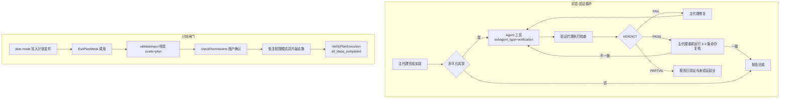
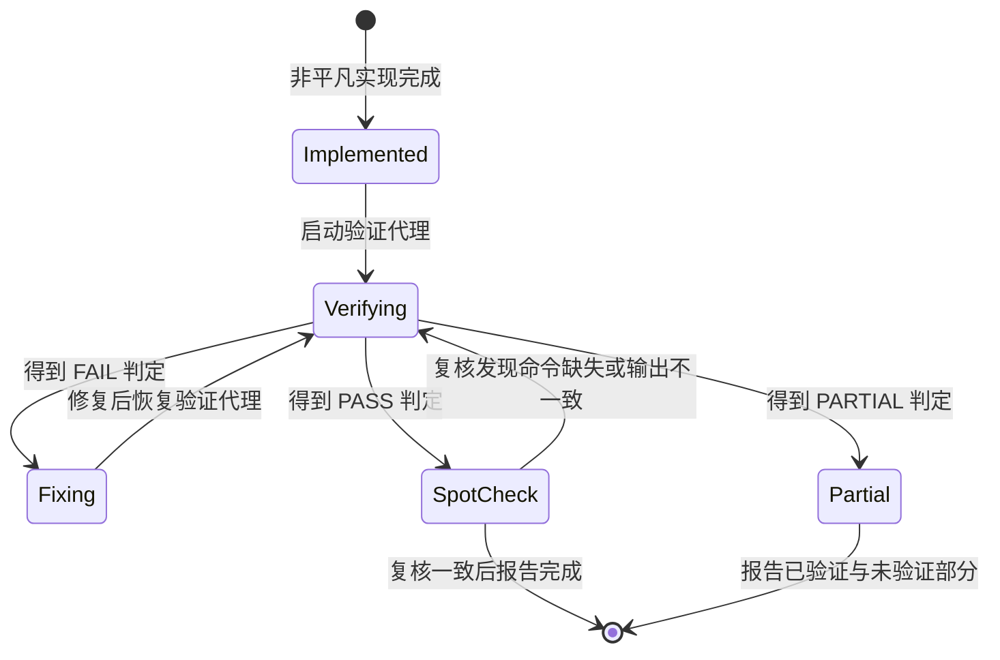
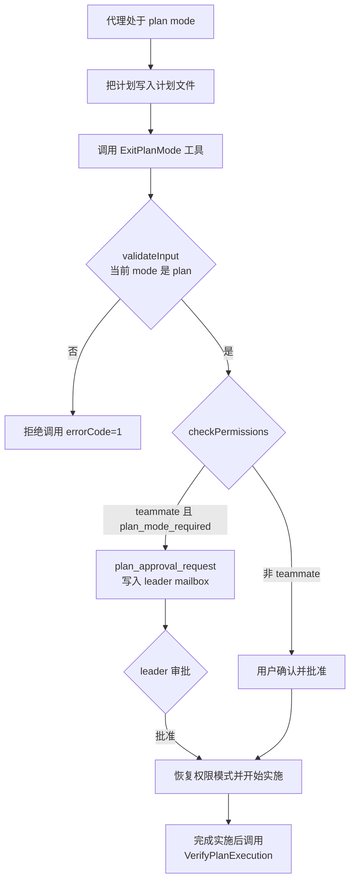
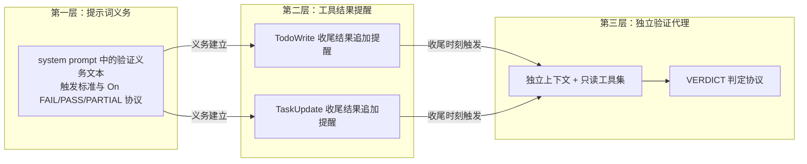
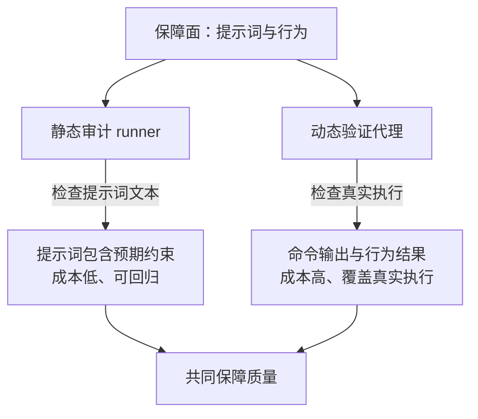

# Eval 模块：评估与验证机制

## 1 概述

本仓库（Claude Code 的反编译/还原版本）没有独立的评测框架目录，测试部分只描述 `bun:test` 单元测试与集成测试。评估与验证能力以三种形态嵌入运行流程：

- **对抗式验证代理（verification agent）**：主代理完成非平凡实现后，通过 `Agent` 工具启动 `subagent_type="verification"` 的独立代理做对抗式检查，产出 `PASS` / `FAIL` / `PARTIAL` 判定。
- **计划闸门**：`ExitPlanMode` 工具把控制权交还用户批准；`VerifyPlanExecution` 工具确认执行与计划一致。
- **提示工程审计 runner**：以静态 checklist 断言 system prompt 组装结果，防止提示词回归。

此外还有两处评估机制的痕迹：`evaluateTimeBasedTrigger` 是内嵌在上下文压缩路径里的规则判定函数；记忆提示词注释中引用了上游受控评估脚本的评测结果。后者的评估脚本与审计文档未随反编译版本保留，只留下注释引用。

三种形态对应三种评估对象：验证代理评估行为结果，计划闸门评估计划批准与执行一致性，审计 runner 评估提示词文本。评估机制没有独立成框架，因为三种形态的触发点都嵌在运行流程内部——验证发生在实现完成之后，闸门发生在计划与实施的交界处，审计发生在提示词装配之后。嵌入式设计让评估与执行共享同一套工具、权限与上下文，不需要单独的评测运行环境。



## 2 核心组件与职责

### 2.1 主代理侧的验证义务

验证义务的载体是 system prompt 中的一段条件文本，属于会话指引里的一个条件项，各条件项生成后经 `filter` 统一剔除空值再拼入提示词。

**三层开关**：编译期 feature、远端灰度配置、穷鬼模式三者同时成立，该段才写入提示词。任何一层关闭，主代理都不承担验证义务。

**触发标准**：非平凡实现，即 3 个以上文件编辑、backend/API 变更、基础设施变更。

**义务归属**：`You are the one reporting to the user; you own the gate`——无论实现者是谁（主代理自己、fork、subagent），向用户报告的主代理持有验证闸门，闸门不随实现者转移。

**三条边界**：自己的检查、说明与 fork 的自我检查都不能替代验证代理；只有验证代理有权给出判定，主代理不能自我判定 `PARTIAL`；验证代理给出 `PASS` 后，主代理还要重新运行报告中的 2-3 条命令做抽查。

**判定协议**：`On FAIL` 修复后把发现与修复一起交给验证代理恢复运行，重复到 `PASS`；`On PASS` 抽查每一条 `PASS` 都带 `Command run` 块且输出与重新运行一致，缺失或偏离则恢复验证代理；`On PARTIAL` 向用户报告已验证部分与无法验证部分。

验证义务文本：

```ts
The contract: when non-trivial implementation happens on your turn, independent adversarial verification must happen before you report completion \u2014 regardless of who did the implementing (you directly, a fork you spawned, or a subagent). You are the one reporting to the user; you own the gate. Non-trivial means: 3+ file edits, backend/API changes, or infrastructure changes. Spawn the ${AGENT_TOOL_NAME} tool with subagent_type="${VERIFICATION_AGENT_TYPE}". Your own checks, caveats, and a fork's self-checks do NOT substitute \u2014 only the verifier assigns a verdict; you cannot self-assign PARTIAL. Pass the original user request, all files changed (by anyone), the approach, and the plan file path if applicable. Flag concerns if you have them but do NOT share test results or claim things work. On FAIL: fix, resume the verifier with its findings plus your fix, repeat until PASS. On PASS: spot-check it \u2014 re-run 2-3 commands from its report, confirm every PASS has a Command run block with output that matches your re-run. If any PASS lacks a command block or diverges, resume the verifier with the specifics. On PARTIAL (from the verifier): report what passed and what could not be verified.
```

这段文本与收尾提醒、验证代理的提示词互相呼应，形成"提示词义务 + 工具结果提醒 + 独立代理"的三层约束。

### 2.2 验证代理（verification agent）

验证代理是一个内置代理定义，`agentType` 为 `'verification'`，由主代理通过 `Agent` 工具的 `subagent_type` 参数启动。它的提示词开篇声明立场：

> `Your job is not to confirm the implementation works — it's to try to break it.`

提示词先命名两类已知失败模式，让代理在行为失控时能够识别自身：verification avoidance（只读代码、叙述本会如何测试、直接写 PASS）与被前 80% 完成度迷惑（看到打磨过的界面或通过的测试套件就倾向放行，忽视一半按钮无效、状态刷新消失、后端异常输入崩溃）。

**只读约束是双层的**。提示词层用 `CRITICAL` 大写块禁止创建、修改、删除项目目录内的文件，禁止安装依赖与 git 写操作，允许写临时脚本到 `/tmp` 或 `$TMPDIR` 并事后清理；工具层用 `disallowedTools` 禁止写文件工具（`Agent`、`ExitPlanMode`、`Edit`、`Write`、`NotebookEdit`）。两层同时生效，提示词声明与工具白名单互相兜底。

**通用基线五步**：读取项目的 `CLAUDE.md` / `README` 获取构建与测试命令；运行构建；运行测试套件；运行 linter 与类型检查；检查相关代码的回归。构建失败与测试失败定义为自动 `FAIL`。

**证据规则**：`Test suite results are context, not evidence`——实现者同为 LLM，其测试可能充满 mock、循环断言与 happy-path 覆盖，验证代理必须独立运行检查。每条检查必须携带 `Command run` 代码块与实际输出，只有带命令输出的检查才算 `PASS`。

**判定协议**：报告以固定格式结尾，供调用方程序解析：

```
End with exactly this line (parsed by caller):

VERDICT: PASS
or
VERDICT: FAIL
or
VERDICT: PARTIAL

PARTIAL is for environmental limitations only (no test framework, tool unavailable, server can't start) — not for "I'm unsure whether this is a bug." If you can run the check, you must decide PASS or FAIL.

Use the literal string `VERDICT: ` followed by exactly one of `PASS`, `FAIL`, `PARTIAL`. No markdown bold, no punctuation, no variation.
- **FAIL**: include what failed, exact error output, reproduction steps.
- **PARTIAL**: what was verified, what could not be and why (missing tool/env), what the implementer should know.
```

三种判定的语义收得很窄：`PASS` 要求全部检查通过且每条都带命令输出；`FAIL` 要求给出失败内容、精确错误输出与复现步骤；`PARTIAL` 仅限环境限制（缺少测试框架、工具不可用、服务无法启动），能运行检查就必须二选一。报告格式采用反例教学：提示词里给出一个"坏"报告样本（只读代码、没有运行任何命令就写 PASS）并标注 `(No command run. Reading code is not verification.)`。

**运行形态**：独立上下文、`background: true` 后台运行、`model: 'inherit'` 继承模型但上下文独立。提示词声明判定行 `parsed by caller`，但本仓库中未见对应的解析实现，判定解析代码未随反编译版本保留。

**通用基线的顺序有意义**：五步从读取约定开始，再依次是构建、测试、lint、回归——构建失败与测试失败是自动 `FAIL` 的硬规则，linter 与回归检查只作为辅助信号。基线之后还有按变更类型适配的策略（前端起服务加浏览器自动化、后端 curl 加错误处理、CLI 边界输入、数据库迁移上下往返、重构对比公开接口等），以及至少一个对抗探针（并发、边界值、幂等、孤儿操作），探针结果即使"处理正确"也必须写进报告。

### 2.3 TodoWrite / TaskUpdate 收尾提醒

主代理有可能在最后一个任务关闭后直接退出循环，跳过验证。两个任务工具在收尾路径上拦截这个跳过窗口：当主线程代理把 3 项以上任务全部置为 `completed`、且列表中没有 verification 步骤时，工具结果的文案末尾追加提醒，要求主代理在写最终总结前启动验证代理。

该提醒与 2.1 的义务文本使用同一句话：`You cannot self-assign PARTIAL`，两处文字保持一致，防止模型在收尾时刻绕过提示词义务。

### 2.4 ExitPlanMode 计划批准闸门

plan mode 下模型只读。如果模型可以自行结束 plan mode，计划批准就失去意义，因此退出动作本身做成一个工具，由运行时执行其生命周期钩子，模型无法绕过。

**工具设计**：工具不接收计划内容参数，从计划文件读取——提示词写明 `This tool does NOT take the plan content as a parameter`。工具位于 `CORE_TOOLS` 白名单中，始终对模型可见。

**validateInput**：在权限询问之前校验当前权限模式，plan mode 以外的调用直接以 `errorCode: 1` 拒绝并记录事件，避免在错误模式弹出批准对话框。

**checkPermissions**：非 teammate 场景返回 `behavior: 'ask'`，消息为 `Exit plan mode?`，必须经用户确认；teammate 场景跳过权限 UI，由 `call` 处理。

**call**：用户批准后把权限模式从 `plan` 恢复为进入前的 `prePlanMode`，并处理 auto mode 的 gate 失效回退（gate 关闭时回退到 `default` 并通知用户）；用户通过 Web UI 编辑过计划时，先把编辑后的计划写回磁盘，供后续验证与读取看到最新版本；teammate 且 `plan_mode_required` 时构造 `plan_approval_request` 写入 leader 的 mailbox 并更新任务状态为等待批准。

**批准文案四种结果**：等待 leader 批准、agent 批准、空计划、用户编辑过的计划（标注 `Approved Plan (edited by user)`）。

远程会话侧有一个纯判定器 `ExitPlanModeScanner`，从 SDK 事件流判定 ExitPlanMode 结果，优先级为 approved > terminated > rejected > pending > unchanged，供 Web UI 轮询使用。另外，源码注释提到在 REPL 中注册后台验证钩子的函数，其实现未随反编译版本保留。

### 2.5 VerifyPlanExecution 与计划验证提醒

**VerifyPlanExecution** 是实施完成后的执行验证工具：输入为 `all_steps_completed` 与 `plan_summary`，`call` 直接返回 `{ verified: all_steps_completed, summary: plan_summary }`，验证结论取决于模型对自身执行情况的如实汇报。它同样位于 `CORE_TOOLS` 白名单，始终可见。

**双重提醒**保证模型调用它：批准文案的末尾追加 `You MUST call the "VerifyPlanExecution" tool directly`；如果模型仍未调用，harness 侧维护 `pendingPlanVerification` 状态，按轮次追加 `verify_plan_reminder` attachment 提醒，直到验证完成。

### 2.6 提示工程审计 runner

审计 runner 是一套静态 checklist：先调用 `getSystemPrompt()` 生成完整 system prompt，再用 `toContain` / `toMatch` 断言关键文本存在。它审计的是提示词是否包含预期约束，验证对象是提示词文本本身。

**子进程隔离**：runner 文件的后缀使其不会被 `bun test` 直接收集；一个薄包装器测试用 `Bun.spawn` 在独立子进程里运行 runner。原因写在文件头注释中：runner 内有 30 多个 `mock.module()` 调用，而 Bun 的 `mock.module` 是进程全局的，独立子进程可以防止污染同批其他测试文件。子进程退出码不为 0 时，包装器把 stderr 与 stdout 的尾部 3000 字符抛进错误信息，超时上限 60 秒。

**审计维度**分五部分：

1. 提示词工程技巧验证（#1-#10）：决策树工具选择、反模式先行、渐进式回退链、few-shot 示例、语言信号识别、成本不对称、反过度解释、查询构造、prompt injection 防御、多步搜索。
2. 行为规则验证（#11-#23 的子集）：格式化纪律、先搜索再说不知道、温暖语气、风险感知时说得更少、不解释为什么搜索、产品线信息、对话结束尊重、每回复一个问题。
3. 已有行为锚点的回归测试：`Default to helping`、anti-collapse、cutoff silence、no-machinery-narration、tool_discovery、false-claims mitigation、`CYBER_RISK_INSTRUCTION`。
4. `prependBullets` 工具函数测试。
5. 环境信息与模型 cutoff 正确性。

checklist 的最小单元：

```ts
async function getFullPrompt(tools: Tools = standardTools, model = 'claude-opus-4-7') {
  const sections = await getSystemPrompt(tools, model)
  return sections.join('\n\n')
}

describe('#1 Decision tree for tool selection', () => {
  test('prompt contains tool selection guidance via dedicated tools', async () => {
    const prompt = await getFullPrompt()
    expect(prompt).toContain('Prefer dedicated tools')
    expect(prompt).toContain('Reserve')
    expect(prompt).toContain('shell operations')
  })
})
```

每个 `test` 先调用 `getFullPrompt()` 生成完整提示词，再做字符串存在性断言。多数被测函数是 module-private，只能通过最终输出间接验证。每段注释标注 `TXT 来源`（如 `{request_evaluation_checklist}`），把断言映射回上游提示词模板的来源文本，形成"来源 → 编号主题 → 断言"的追踪链。编号对应的审计文档未随反编译版本保留。

断言选择 `toContain` 存在性检查，逐条绑定关键短语。这种方式只验证"约束是否存在"，不校验整段提示词的字节级快照，因此提示词的任何无关改动不会让审计失败，而关键约束被误删会立即触发回归。

### 2.7 评测确定性通道

feature gate 的取值来自 GrowthBook 远程配置，评测环境里每次运行的 feature 组合必须相同，否则同一场景会得到不同行为。为此提供环境变量覆盖通道：`CLAUDE_INTERNAL_FC_OVERRIDES` 是一个 JSON 对象，把 feature key 映射到值，用于绕过远端评估与磁盘缓存；各 feature getter 的第一行先检查 env 覆盖，env 优先于本地 `/config` Gates 覆盖，注释写明 `env wins so eval harnesses remain deterministic`；另有 `hasGrowthBookEnvOverride()` 让调用方在有覆盖时跳过等待初始化。评测基础设施复用生产读取路径，覆盖通道独立于生产逻辑。

### 2.8 提示词迭代的评测证据注释

上游仓库用受控评估脚本对提示词变体做评估：同一组测试场景分别运行不同提示词版本，统计通过数，结果作为设计证据写回源码注释。本仓库保留了这些注释，评估脚本本身未保留。注释记录了几个结论：

- H1（验证记忆中的函数/文件声明）：作为独立 section 追加时 0/2 提升到 3/3，埋在 "When to access" 下作为条目时掉到 0/3——提示词位置影响效果，该内容需要独立 section 级别的触发上下文。
- H5（读取侧噪声拒绝）：追加时 0/2 提升到 3/3，内嵌条目时 2/3。
- 标题措辞 A/B：`Before recommending from memory` 全文相同、仅标题不同时 3/3，抽象标题 `Trusting what you recall` 原位放置时 0/3。
- H2（显式保存闸门）：0/2 提升到 3/3，防止"保存本周 PR 列表"演变成活动日志噪声。
- H6：记录 ignore 反模式与 token 预算变化（约 +3 tokens）。

### 2.9 内嵌规则评估 evaluateTimeBasedTrigger

`evaluateTimeBasedTrigger` 是一个纯谓词函数，评估"距上一条主循环 assistant 消息的时间间隔是否超过阈值"这一条规则，返回 `{ gapMinutes, config }` 或 `null`。条件链依次为：配置启用、来源是主线程、存在上一条 assistant 消息、间隔分钟数是有限数且不低于阈值。配置默认 `enabled: false`、`gapThresholdMinutes: 60`、`keepRecent: 5`，可从远端配置覆盖。消费方拿到判定结果后，只保留最近 `keepRecent` 条可压缩工具结果，清空其余。它是评估机制中最小的单元：条件判定内嵌在运行路径里，判定结果直接驱动上下文清理行为。

## 3 关键流程

### 3.1 实现-验证循环



分步讲解：

1. **义务生效**：system prompt 组装时写入验证义务文本，触发标准是 3 个以上文件编辑、backend/API 变更、基础设施变更。
2. **收尾提醒**：TodoWrite / TaskUpdate 在循环退出时刻（3 项以上任务全部完成且无 verification 步骤）追加提醒，封住"最后一个任务关闭后直接退出"的跳过路径。
3. **启动验证代理**：主代理调用 `Agent` 工具并传 `subagent_type="verification"`，按 `agentType` 查找到验证代理定义。
4. **执行检查**：验证代理按通用基线五步执行，再按变更类型适配策略（前端起服务加浏览器自动化、后端 curl 加错误处理、CLI 边界输入、迁移上下往返等），并至少运行一个对抗探针（并发、边界值、幂等、孤儿操作）。
5. **判定输出**：报告以 `VERDICT: PASS` / `FAIL` / `PARTIAL` 结尾。
6. **FAIL 循环**：主代理修复后把发现与修复一起交给验证代理恢复运行，重复到 PASS。
7. **PASS 复核**：主代理重新运行报告中的 2-3 条命令，确认每条 PASS 都有 `Command run` 块且输出与重新运行一致；缺失或偏离则恢复验证代理。
8. **PARTIAL 报告**：向用户报告已验证部分与无法验证部分。

### 3.2 ExitPlanMode 到 VerifyPlanExecution



分步讲解：

1. **写入计划**：plan mode 期间代理把计划写入计划文件，工具从文件读取计划。
2. **调用与校验**：`validateInput` 在权限询问之前检查当前权限模式，plan mode 以外直接拒绝并记录事件。
3. **用户批准**：`checkPermissions` 对非 teammate 返回 `ask`；teammate 场景跳过权限 UI。
4. **teammate 路径**：对 `plan_mode_required` 的 teammate 构造 `plan_approval_request` 写入 leader 的 mailbox，并更新任务状态为等待批准。
5. **计划编辑回写**：用户编辑过计划时写回磁盘，供后续验证与读取看到最新版本。
6. **恢复权限模式**：把模式恢复为进入前的 `prePlanMode`；auto mode 的 gate 失效时回退到 `default` 并通知用户。
7. **批准文案**：区分等待 leader 批准、agent 批准、空计划、用户编辑计划四种结果，文案中追加 `You MUST call the "VerifyPlanExecution" tool directly`。
8. **实施后验证**：完成实施后调用 `VerifyPlanExecution`；若模型忘记调用，按轮次追加 `verify_plan_reminder` 提醒。
9. **远程会话**：`ExitPlanModeScanner` 从 SDK 事件流判定结果，供 Web UI 轮询使用。

### 3.3 三层验证义务的协作



三层针对同一行为的三个触发点：提示词层在会话开始时建立义务，工具结果层在任务收尾时刻触发提醒，验证代理层在实施完成后独立执行。任何一层失效都有下一层兜底：模型没记住提示词义务，收尾提醒会拦截；收尾提醒也没触发，主代理在报告前仍可能被义务文本约束；即使启动了验证代理，判定协议还要求主代理做 PASS 复核。

三层之间的传递通道各有形态：提示词层到验证代理层靠 `subagent_type` 参数与 `Agent` 工具分发，工具结果层到验证代理层靠结果文案里的启动指令，验证代理层回到主代理靠 `VERDICT` 报告与恢复运行。每条通道都承载同一份判定语义（PASS/FAIL/PARTIAL 与"不能自我判定"），语义在三个组件之间保持一致。

### 3.4 静态审计与动态验证的互补



静态审计防的是提示词被改坏：字符串断言成本低，每次提交都可运行，能捕捉"某段约束被误删"这类回归。动态验证防的是模型没按提示词做：验证代理真正运行命令并检查输出，能捕捉"约束在文本里、行为没跟上"这类偏差。两者检查对象不同，配合使用才能同时覆盖文本与行为。

## 4 设计思想

### 4.1 把验证义务写进系统提示词

验证规则的载体是提示词文本，写入位置经过分层设计：主代理侧写义务与闸门归属，验证代理侧写立场、流程与输出协议，工具结果侧写循环退出时刻的提醒。三层针对同一行为的三个触发点：义务建立、执行、收尾，防止任何一层失效。

### 4.2 用工具实现闸门

计划批准与执行验证都做成工具：`validateInput` 在权限询问前拒绝非 plan 调用，`checkPermissions` 强制用户确认，`call` 负责状态恢复。闸门位于工具生命周期钩子中，钩子由运行时执行，模型无法绕过。闸门工具还刻意保持输入极小（ExitPlanMode 不接收计划内容，从计划文件读取；VerifyPlanExecution 只接收一个布尔与一段摘要），把"谁有权批准"与"计划内容是什么"解耦，批准动作不会因为计划文本过大而增加模型负担。

### 4.3 独立代理防止自我验证

验证代理拥有独立上下文与独立工具集：`disallowedTools` 禁写文件、`background: true` 后台运行、`model: 'inherit'` 继承模型但上下文独立。对抗立场写进系统提示词，自我合理化的借口被逐条列出并要求反着做（"代码看起来对"→ 运行它；"实现者的测试已经通过"→ 独立验证）。防止自我验证还延伸到主代理侧：自己的检查、fork 的自我检查都不能替代验证代理。

### 4.4 静态审计与动态验证互补

审计 runner 验证提示词文本包含预期约束（静态，`toContain` 断言）；验证代理验证行为结果（动态，运行命令检查输出）。静态审计成本低、可回归，防的是提示词被改坏；动态验证成本高、覆盖真实执行，防的是模型没按提示词做。

### 4.5 评测确定性与覆盖通道

远程配置在评测环境里引入不确定性，环境变量覆盖通道在最前面拦截 feature 读取，env 优先于本地覆盖。评测基础设施复用生产读取路径，覆盖通道独立于生产逻辑，生产代码不需要感知评测环境。这条设计保证评测与生产跑的是同一份代码路径，评测结果可以直接归因到被评测的行为，不会因为评测专用分支引入额外变量。

### 4.6 提示词修改需要数据依据

提示词的任何改动都会改变模型行为，凭感觉修改难以度量效果。上游的做法是受控评估加注释回写：每个假设编号（H1、H2、H5、H6），记录通过数变化与结论（位置影响效果、标题措辞影响效果、token 预算变化）。提示词维护因此变成可回归的工程活动，后续维护者能从注释判断某段文本为什么长这样。

### 4.7 可借鉴的做法

- **判定协议**：`VERDICT: PASS|FAIL|PARTIAL` 固定前缀加枚举、禁止 markdown 与标点变体，适合作为 agent 报告的可解析接口；`PARTIAL` 语义收窄为环境限制，禁止用 PARTIAL 表达不确定。
- **反例教学**：在提示词里给"坏报告"样本并注明拒绝原因，效果强于只描述格式。
- **checklist 断言**：用 `getSystemPrompt()` 生成产物后做字符串断言，并给每个断言标注来源文本，形成可追溯的提示词回归测试。
- **子进程隔离**：把大量 `mock.module` 的审计放在独立 `bun test` 子进程，规避进程全局 mock 的污染问题。
- **评测结果写回注释**：注释记录评测编号、通过数变化（0/2 → 3/3）、结论（位置影响效果、标题措辞影响效果），让提示词修改有数据依据。
- **判定逻辑纯函数化**：`evaluateTimeBasedTrigger` 与 `ExitPlanModeScanner` 都是无 I/O 的纯判定器，可以直接输入合成或录制的事件做单测与离线重放。
