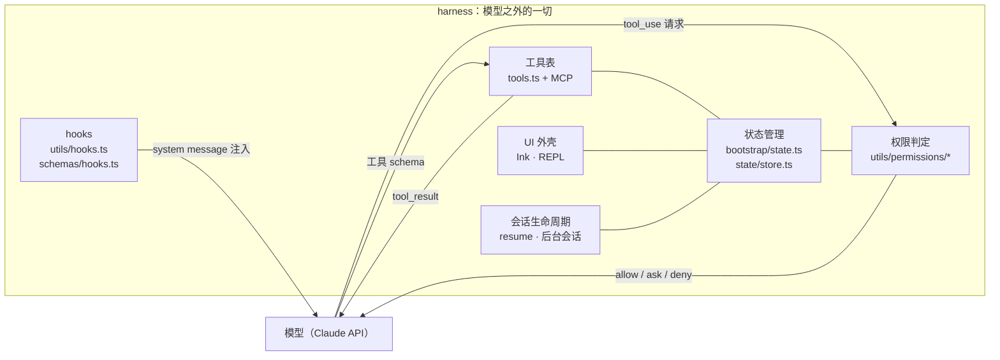
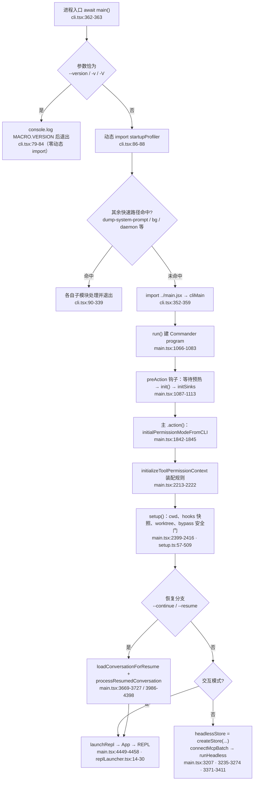
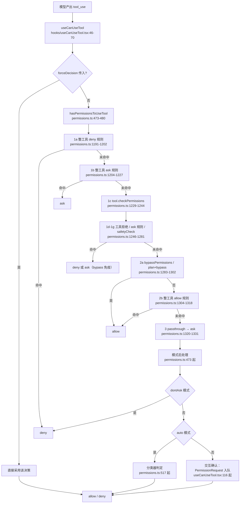

# Harness 模块：模型之外的一切

## 1 模块概览

harness 指运行时中围绕模型的一切设施：工具 schema、权限策略、状态管理、会话生命周期、hooks、UI 外壳。模型在这套设施中只承担一项工作：消费消息流、产出文本与 `tool_use` 请求。`tool_use` 本身没有任何副作用，真正执行命令、修改文件、读取目录的是 harness 中的工具实现；在工具执行之前，harness 的权限管线先做出 allow/ask/deny 判定，`hasPermissionsToUseTool`（`src/utils/permissions/permissions.ts:473`）是唯一入口。hooks 同样由 harness 在生命周期点执行，模型只能看到执行结果注入回来的 system message。整个仓库按此边界分成两块：`src/services/api/*` 与 `src/query.ts` 属于模型侧；本文涉及的全部模块属于 harness 侧。



### 涉及文件清单

| 文件路径 | 职责 | 关键导出 |
|---|---|---|
| src/entrypoints/cli.tsx | 进程入口与快速路径分发 | `main()` |
| src/entrypoints/init.ts | 一次性初始化（配置、网络、遥测） | `init`、`initializeTelemetryAfterTrust` |
| src/main.tsx | Commander CLI 定义与主 action 处理器 | `run()`、主 `.action()`、`preAction` 钩子 |
| src/setup.ts | 启动装配（cwd、hooks 快照、worktree、权限安全门） | `setup()` |
| src/bootstrap/state.ts | 模块级会话全局单例状态 | `getSessionId`、`switchSession`、`getProjectRoot`、`getMainLoopModelOverride` |
| src/state/store.ts | 通用响应式 store 容器 | `createStore` |
| src/state/AppState.tsx | store 的 React 绑定层 | `AppStateProvider`、`useAppState` |
| src/state/AppStateStore.ts | AppState 类型与默认状态 | `AppState`、`getDefaultAppState` |
| src/state/selectors.ts | 派生状态选择器 | `getViewedTeammateTask`、`getActiveAgentForInput` |
| src/utils/permissions/permissions.ts | 权限判定管线主体 | `hasPermissionsToUseTool`、`checkRuleBasedPermissions`、`getAllowRules`/`getDenyRules`/`getAskRules` |
| src/utils/permissions/permissionSetup.ts | 权限上下文装配与模式解析 | `initialPermissionModeFromCLI`、`initializeToolPermissionContext` |
| src/utils/permissions/PermissionMode.ts | 权限模式显示配置 | `PERMISSION_MODE_CONFIG`、`permissionModeFromString` |
| src/types/permissions.ts | 权限纯类型定义 | `PermissionMode`、`PermissionDecision`、`ToolPermissionContext` |
| src/schemas/hooks.ts | hooks 配置的 Zod schema | `HooksSchema`、`HookCommandSchema` |
| src/utils/hooks.ts | hooks 执行器集合 | `getMatchingHooks`、`executeNotificationHooks`、`executeSessionEndHooks` |
| src/services/mcp/client.ts | MCP 客户端与连接管理 | `connectToServer`、`ensureConnectedClient`、`getMcpToolsCommandsAndResources` |
| src/utils/settings/settings.ts | 配置加载与多来源合并 | `getInitialSettings`、`loadSettingsFromDisk`、`getSettingsForSource` |
| src/utils/settings/constants.ts | 配置来源常量 | `SETTING_SOURCES` |
| src/hooks/useCanUseTool.tsx | 权限判定的 React 入口 | `useCanUseTool`、`CanUseToolFn` |
| src/replLauncher.tsx | REPL 屏幕启动器 | `launchRepl` |
| src/entrypoints/sdk/coreSchemas.ts | SDK 基础 schema（含 hooks 事件表） | `HOOK_EVENTS` |

## 2 核心概念

### 2.1 快速路径与默认路径：为什么 `--version` 要零模块加载

`src/entrypoints/cli.tsx` 的 `main()`（第 76 行）先做一次纯字符串比较：当参数恰好是 `--version`/`-v`/`-V` 时直接 `console.log` 并 `return`（第 79-84 行）。此时进程只求值了文件顶部的三个 import（第 5-7 行：performance shim、`feature`、`isEnvTruthy`），`main.tsx` 及其全部依赖链从未进入模块图。

动机写在文件自己的注释里（第 71-75 行）："All imports are dynamic to minimize module evaluation for fast paths. Fast-path for --version has zero imports beyond this file." 模块求值的成本有源码记录：`main.tsx` 的 `preAction` 钩子注释记录 "subprocesses complete during the ~135ms of imports above"（`src/main.tsx:1090`）；`init.ts` 注释记录 OpenTelemetry 遥测模块约 400KB，必须用 `import()` 推迟加载（`src/entrypoints/init.ts:49-51`）。一条 `claude --version` 若加载全部模块，就会为一次版本号输出付出百余毫秒的求值与内存成本。

非快速路径从第 86 行开始：动态 import 启动剖析器（`startupProfiler.js`），随后按顺序尝试其余快速路径（`--dump-system-prompt` 第 93 行、`--claude-in-chrome-mcp` 第 106 行、daemon/bg 第 231/266 行等），每条路径都在自己的 `await import(...)` 之后立即处理并退出。全部未命中时进入默认路径（第 352-359 行）：捕获提前输入、`import('../main.jsx')`（对应源码文件 `src/main.tsx`）、调用 `cliMain()`。默认路径的模块成本只由真正需要完整 CLI 的调用者承担。

### 2.2 模块级单例状态与响应式 store 的分工

harness 有两套状态容器，各司其职：

- `src/bootstrap/state.ts`：模块级单例 `STATE`（第 423 行 `const STATE: State = getInitialState()`），保存会话全局事实：`sessionId`、`originalCwd`/`projectRoot`/`cwd`、token 计数与费用、`mainLoopModelOverride`、权限模式相关标记等。它不提供订阅机制，只有显式 getter/setter（如 `getSessionId` 第 425 行、`setProjectRoot` 第 517 行、`addToTotalCostState` 第 551 行）。文件头部与中部的注释反复警告 "DO NOT ADD MORE STATE HERE"（第 31 行）、"THINK THRICE BEFORE MODIFYING"（第 254 行）、"AND ESPECIALLY HERE"（第 422 行）。它面向进程内任何模块（工具实现、hooks 执行器、遥测计数），其中相当多调用方运行在 React 之外。
- `src/state/store.ts` + `AppState.tsx` + `AppStateStore.ts`：响应式 store。`createStore`（第 10-34 行）实现 `getState`/`setState`/`subscribe` 三件套，`setState` 用 `Object.is(next, prev)` 短路无变化更新，然后通知监听者。`AppStateProvider`（`AppState.tsx:59-102`）在挂载时创建一次 store，`useAppState(selector)`（第 129-146 行）通过 `useSyncExternalStore` 订阅，selector 返回值用 `Object.is` 比较，只有被选中的切片变化才触发重渲染。

分工依据是读取方所处的运行环境：工具执行、hooks、遥测运行在 React 组件树之外，读 bootstrap 单例；终端界面需要按字段订阅重渲染，读响应式 store。同一容器在两种场景同时使用：无界面模式不挂载 React，`main.tsx` 直接 `createStore(headlessInitialState, ...)` 建出 `headlessStore`（`src/main.tsx:3207`），说明 `createStore` 自身与 React 无耦合，React 只是它的一个消费者。

### 2.3 权限模式与 `canUseTool` 判定管线

模式集合定义在 `src/types/permissions.ts:15-39`：`acceptEdits`、`bypassPermissions`、`default`、`dontAsk`、`plan`，内部另加 `auto`。每种模式的显示配置在 `PermissionMode.ts:41-86` 的 `PERMISSION_MODE_CONFIG`。会话初始模式由 `initialPermissionModeFromCLI`（`permissionSetup.ts:689-811`）按优先级求取：`--dangerously-skip-permissions` > `--permission-mode` > settings 的 `permissions.defaultMode` > `default`（第 721-773 行构造 `orderedModes`，第 777-795 行取第一个有效项；`bypassPermissions` 被组织策略禁用时跳过，第 778-791 行）。

规则以三元组建模：`PermissionRule = { source, ruleBehavior, ruleValue }`（`types/permissions.ts:76-80`），`ruleValue` 是 `{ toolName, ruleContent? }`。来源分两类：配置文件来源沿用 `SETTING_SOURCES`（user/project/local/flag/policy，`settings/constants.ts:7-22`），外加运行时来源 `cliArg`、`command`、`session`（`permissions.ts:109-114`）。`ToolPermissionContext`（`types/permissions.ts:428-441`）把三类规则按来源存成 `alwaysAllowRules`/`alwaysDenyRules`/`alwaysAskRules`。

判定管线集中在 `hasPermissionsToUseToolInner`（`permissions.ts:1179-1340`），顺序是固定的：

1. **1a** 整工具 deny 规则命中，立即返回 deny（第 1191-1202 行）；
2. **1b** 整工具 ask 规则命中，返回 ask（沙箱自允许例外，第 1204-1227 行）；
3. **1c** 解析输入后调用工具自身的 `tool.checkPermissions`（第 1229-1244 行）——Bash 的逐命令规则在这里产生；
4. **1d** 工具自身拒绝（第 1246-1249 行）；**1e** `requiresUserInteraction`（第 1252-1257 行）；**1f** 内容级 ask 规则（第 1259-1271 行）；**1g** `safetyCheck`（第 1273-1281 行）依次返回；
5. **2a** `bypassPermissions` 模式（或 plan 模式且启动自 bypass）返回 allow（第 1283-1302 行）；
6. **2b** 整工具 allow 规则返回 allow（第 1304-1318 行）；
7. **3** `passthrough` 转为 `ask`（第 1320-1331 行）。

deny 优先体现在位置：1a 在 2a 之前执行，deny 规则命中时 bypass 永远走不到；ask 规则与 safetyCheck 也声明 bypass 免疫（第 1259-1264、1273-1275 行注释）。`hasPermissionsToUseTool`（第 473 行起）在管线之后做模式后处理：`dontAsk` 把 ask 转为 deny（第 502-516 行），`auto` 模式把 ask 交给分类器（第 517 行起）。UI 侧的 `useCanUseTool`（`src/hooks/useCanUseTool.tsx:46-70`）接收 `forceDecision` 短路参数并依据结果分发：allow 直接放行（第 84-104 行），ask 进入交互确认队列，deny 生成拒绝消息。

### 2.4 hooks 事件模型：外部脚本进入 harness 生命周期

事件白名单共 27 项，定义在 `src/entrypoints/sdk/coreSchemas.ts:362-390`：`PreToolUse`、`PostToolUse`、`PermissionRequest`、`SessionStart`、`SessionEnd`、`PreCompact`、`FileChanged`、`CwdChanged` 等。配置 schema 在 `src/schemas/hooks.ts`：`HooksSchema`（第 209-211 行）以事件名为键，值是 matcher 数组；每个 matcher 携带 `matcher` 字符串与 `hooks` 数组（第 192-202 行）；单个 hook 是四种类型之一——`command`（第 32-65 行）、`prompt`（第 67-95 行）、`http`（第 97-124 行）、`agent`（第 126-161 行）——用 `z.discriminatedUnion('type', ...)` 校验（第 181-186 行），并支持 `timeout`、`once`、`async` 与 `if` 条件（`if` 复用权限规则语法，第 16-27 行）。

hooks 由 harness 执行：`src/utils/hooks.ts` 为每个事件提供执行器（`executeNotificationHooks` 第 3714 行、`executePreCompactHooks` 第 4120 行、`executeSessionEndHooks` 第 4256 行、`executeFileChangedHooks` 第 4437 行等），`getMatchingHooks`（第 1739 行）先按 matcher 过滤再逐个运行。模型无法自行触发或绕过 hooks——模型只能产出 `tool_use`；`PreToolUse` 由 harness 在工具执行前运行并可阻断执行，`PermissionRequest` hook 直接嵌入权限管线（`permissions.ts:84` 导入 `executePermissionRequestHooks`，第 400-471 行在无界面 agent 自动拒绝之前给 hook 一次允许或拒绝的机会）。hook 输出进入模型可见上下文的唯一通道是 harness 注入：`SessionStart` hook 的结果经 `processSessionStartHooks` 收集成 `hookMessages`，随后作为初始 system message 传入 REPL，并在第一次 API 调用前等待完成（`main.tsx:2981-2987`、`4400-4407`）。SDK 回调与插件 matcher 统一注册进 bootstrap 单例的 `registeredHooks`（`bootstrap/state.ts:1397-1418`）。

### 2.5 MCP：工具表的可插拔提供方

MCP 服务器在 harness 中的接入路径分三段：

1. **配置解析**：`--mcp-config` 支持 JSON 字符串或文件路径（`main.tsx:1879-1933`），常规来源（`.mcp.json`、用户 settings、插件）经 `getClaudeCodeMcpConfigs` 读取，结果汇总在 `mcpConfigPromise`（`main.tsx:2276-2285`）。
2. **连接**：`connectToServer`（`client.ts:596`）用 `memoize` 包裹，同一服务器多次请求共享一个连接；按 `serverRef.type` 分支构造 transport（`sse` 第 620-677 行、`sse-ide` 第 679-708 行、`ws-ide` 第 709 行起），SSE 长连接与单次请求分开配置超时（第 644-648 行注释）。交互模式在信任对话框之后 `prefetchAllMcpResources` 预热（`main.tsx:2958`），预热与 hooks 启动并行，且不阻塞首轮渲染（`main.tsx:2989-2995` 注释：慢服务器在第二轮才可见）。
3. **汇入工具表**：连接结果 `{client, tools, commands}` 存入 `appState.mcp`（`AppStateStore.ts:180-191` 的 `mcp: { clients, tools, commands, resources }`）。交互模式 REPL 在渲染时合并内置工具与 `mcp.tools`；无界面模式先把 `mcpTools` 放进 `headlessStore`，再传给 `runHeadless`（`main.tsx:3181-3207`、`3371-3411`），`initialTools = mcpTools`（`main.tsx:3606`）说明 MCP 工具与内置工具在同一工具表形态中流转。权限规则对 MCP 工具按 `mcp__server__tool` 全名匹配，规则 `mcp__server1` 或 `mcp__server1__*` 可覆盖整个服务器（`permissions.ts:258-268`）。

### 2.6 会话生命周期：创建、恢复、后台化

- **创建**：bootstrap 状态初始化时用 `randomUUID()` 生成 `sessionId`（`bootstrap/state.ts:326`）；`setup()` 收到 `--session-id` 时用 `switchSession` 切换（`setup.ts:82-84`）。
- **切换**：`switchSession`（`bootstrap/state.ts:462-473`）把 `sessionId` 与 `sessionProjectDir` 作为一个整体原子替换（注释说明两者永远同步变化，第 450-461 行），并通过 `sessionSwitched` 信号（第 475-483 行）通知监听者（如 PID 文件里的 sessionId 同步）。`regenerateSessionId`（第 429-444 行）支持把当前 session 记为 `parentSessionId`，供 plan 模式到实现会话的血缘追踪。
- **恢复**：交互模式两条入口。`--continue`（`main.tsx:3669-3727`）调用 `loadConversationForResume` 取最近会话，`processResumedConversation` 重建消息、文件历史快照与 agent 定义，再 `launchRepl` 注入 `initialMessages`。`--resume`（`main.tsx:3986` 起）支持 UUID（第 3996 行）、自定义标题精确匹配（第 4014-4031 行）与交互选择器；处理完成后的 `resumeData` 决定直接渲染 REPL 或弹出 `launchResumeChooser`（第 4353-4398 行）。
- **后台化**：`--bg`/`--background` 在 `cli.tsx` 走独立快速路径（第 266-275 行）交给 `handleBgStart`；`claude daemon <subcommand>`（第 231-242 行）与旧名 `ps/logs/attach/kill`（第 278-294 行）都由 `BG_SESSIONS`/`DAEMON` feature 门控制。会话记录文件 `.jsonl` 的目录由 `sessionProjectDir` 决定（`bootstrap/state.ts:218-219` 注释）。

## 3 关键流程

### 3.1 启动流程：从 cli.tsx 到 REPL / print



分步讲解：

1. **入口判定**（`cli.tsx:362-363`）顶层 `await main()` 开始；`--version` 在第一个 `if` 里完成（第 79-84 行），全程无动态 import。
2. **剖析器接入**（`cli.tsx:86-88`）所有非版本路径先加载 `startupProfiler.js` 并打点 `cli_entry`；后续每个快速路径与主流程都有对应 `profileCheckpoint`。
3. **快速路径依次尝试**（`cli.tsx:90-339`）每条路径独立 `await import` 自己的模块，处理完直接 `return`，互不加载对方代码。
4. **加载主 CLI**（`cli.tsx:352-359`）`startCapturingEarlyInput()` 在 `main.jsx` 求值前启动，用户在模块加载期间敲的键不丢失；`cli_after_main_import` 打点标记求值结束。
5. **Commander 装配与 preAction**（`main.tsx:1087-1148`）`program.hook('preAction', ...)` 保证显示帮助时不会触发初始化（第 1085-1086 行注释）；钩子里先等待模块求值期启动的 MDM/keychain 预热，再 `init()`。
6. **`init()` 一次性初始化**（`init.ts:66-280`）`enableConfigs()` 校验配置、`applySafeConfigEnvironmentVariables()` 只应用安全环境变量、注册优雅退出、惰性加载遥测与 1P 事件日志、配置全局代理与 mTLS、预热 Anthropic API 连接；`ConfigParseError` 走交互或非交互两种终止路径（第 257-279 行）。
7. **权限装配**（`main.tsx:1842-1845`、`2213-2222`）先解析初始模式，再用 CLI 规则 + 磁盘规则装配 `toolPermissionContext`；内置工具注册表 `getTools(toolPermissionContext)` 在同一上下文下生成（第 2339 行）。
8. **`setup()` 启动装配**（`setup.ts:57-509`）`setCwd` 之后捕获 hooks 配置快照并启动 FileChanged 监视（第 166-178 行）；worktree 路径会 `process.chdir` 并重设 `projectRoot`（第 275-288 行）；`bypassPermissions` 在 root 或非沙箱环境有强制确认或拒绝（第 400-474 行）。
9. **恢复分支**（`main.tsx:3669-4398`）`--continue` 与 `--resume` 各自加载会话记录后统一经 `launchRepl` 注入初始消息与文件历史。
10. **模式分发**（`main.tsx:3181-3411`、`4449-4458`）无界面：独立 `createStore` 建 `headlessStore`，MCP 逐服务器连接并填充进 store，最后 `runHeadless`；交互：`launchRepl` 渲染 `<App><REPL/></App>`（`replLauncher.tsx:23-30`）。

### 3.2 一次工具调用的权限判定管线



分步讲解：

1. **入口与短路**（`useCanUseTool.tsx:50-70`）`CanUseToolFn` 先建权限上下文；`forceDecision` 存在时跳过全部判定（用于上层已确定结果的场景），否则进入 `hasPermissionsToUseTool`。
2. **规则前置判定**（`permissions.ts:1191-1227`）1a deny、1b ask 只做整工具匹配（`toolMatchesRule` 第 238-269 行要求 `ruleContent` 为空），MCP 工具按服务器名匹配。
3. **工具自检**（`permissions.ts:1229-1244`）`inputSchema.parse` 通过后调用 `tool.checkPermissions`，Bash 的逐命令规则、目录检查在此产生 `PermissionResult`。
4. **bypass 免疫层**（`permissions.ts:1246-1281`）1d/1f/1g 的 deny、ask 规则、safetyCheck 直接返回，后续 2a 的 bypass 无法覆盖它们。
5. **模式与允许规则**（`permissions.ts:1283-1318`）2a 检查 `mode === 'bypassPermissions'` 或 plan+`isBypassPermissionsModeAvailable`；2b 检查整工具 allow 规则；两者都放行时携带 `updatedInput`（工具可能改写输入）。
6. **兜底转 ask**（`permissions.ts:1320-1331`）工具返回 `passthrough` 时统一转为 ask 并附决策原因说明。
7. **模式后处理**（`permissions.ts:473-579`）allow 时重置 auto 模式连续拒绝计数；`dontAsk` 把 ask 改写为 deny；auto 模式把 ask 交给分类器（PowerShell 另有显式许可要求）。
8. **交互层**（`useCanUseTool.tsx:84-294`）allow 直接放行；deny 记录日志并构造拒绝消息；ask 调用交互处理器把 `ToolUseConfirm` 加入确认队列，由 `src/components/permissions/` 渲染。

## 4 关键代码精读

### 4.1 入口的快速路径

```ts
// src/entrypoints/cli.tsx:76-88
async function main(): Promise<void> {
  const args = process.argv.slice(2);

  // Fast-path for --version/-v: zero module loading needed
  if (args.length === 1 && (args[0] === '--version' || args[0] === '-v' || args[0] === '-V')) {
    // MACRO.VERSION is inlined at build time
    console.log(`${MACRO.VERSION} (Claude Code)`);
    return;
  }

  // For all other paths, load the startup profiler
  const { profileCheckpoint } = await import('../utils/startupProfiler.js');
  profileCheckpoint('cli_entry');
```

第 80 行把 `args.length === 1` 作为先决条件，`claude --version --foo` 这类组合参数不满足条件，进入完整解析路径。第 81 行注释说明 `MACRO.VERSION` 在构建期内联，运行时没有文件读取。第 87 行开始，任何非版本路径先付出一次动态 import 的代价换取剖析打点，打点粒度覆盖后续每个分支（`cli_entry`、`cli_before_main_import`、`cli_after_main_import` 等）。`main()` 的函数体按此组织为一张成本递增的路径表：路径越靠前，模块求值越少。

### 4.2 bootstrap 单例与会话切换

```ts
// src/bootstrap/state.ts:422-444
// AND ESPECIALLY HERE
const STATE: State = getInitialState()

export function getSessionId(): SessionId {
  return STATE.sessionId
}

export function regenerateSessionId(
  options: { setCurrentAsParent?: boolean } = {},
): SessionId {
  if (options.setCurrentAsParent) {
    STATE.parentSessionId = STATE.sessionId
  }
  // Drop the outgoing session's plan-slug entry so the Map doesn't
  // accumulate stale keys. Callers that need to carry the slug across
  // (REPL.tsx clearContext) read it before calling clearConversation.
  STATE.planSlugCache.delete(STATE.sessionId)
  // Regenerated sessions live in the current project: reset projectDir to
  // null so getTranscriptPath() derives from originalCwd.
  STATE.sessionId = randomUUID() as SessionId
  STATE.sessionProjectDir = null
  return STATE.sessionId
}
```

`STATE` 在模块求值时调用一次 `getInitialState()` 完成（`bootstrap/state.ts:255-420`），其中 `sessionId: randomUUID()`（第 326 行）保证每次进程启动都有新会话 ID。`regenerateSessionId` 展示单例写路径的纪律：先记录血缘（`parentSessionId`）、清理离开会话的缓存项（`planSlugCache`）、再同时重置 `sessionId` 与 `sessionProjectDir`，两个字段不会出现一个已更新另一个还停留在旧会话的中间状态。`switchSession`（第 462-473 行）遵守同一纪律并通过 `sessionSwitched.emit` 通知外部监听者；bootstrap 自身处于依赖图的叶子位置（第 17-18 行注释），监听者自行订阅，单例不反向依赖它们。

### 4.3 响应式 store 的最小实现

```ts
// src/state/store.ts:10-34
export function createStore<T>(
  initialState: T,
  onChange?: OnChange<T>,
): Store<T> {
  let state = initialState
  const listeners = new Set<Listener>()

  return {
    getState: () => state,

    setState: (updater: (prev: T) => T) => {
      const prev = state
      const next = updater(prev)
      if (Object.is(next, prev)) return
      state = next
      onChange?.({ newState: next, oldState: prev })
      for (const listener of listeners) listener()
    },

    subscribe: (listener: Listener) => {
      listeners.add(listener)
      return () => listeners.delete(listener)
    },
  }
}
```

第 23 行的 `Object.is` 短路是这套 store 的核心：更新函数必须返回新引用才会触发通知，返回旧对象是零成本操作。第 25 行的 `onChange` 把每次状态迁移（新旧两个快照）转发给外部（`main.tsx` 用它做持久化与调试记录），第 26 行再广播给订阅者。与 bootstrap 单例对比可见两套状态的边界：这个容器保存的是 UI 需要按切片订阅的值（`AppState` 里的 messages、tools、`toolPermissionContext` 等），bootstrap 单例保存的是进程全局事实；同一个 `createStore` 在 React 侧经 `useSyncExternalStore` 消费（`AppState.tsx:145`），在无界面侧直接被 `headlessStore = createStore(...)` 使用（`main.tsx:3207`），容器本身没有任何 UI 框架依赖。

### 4.4 权限管线的模式与允许规则段

```ts
// src/utils/permissions/permissions.ts:1283-1318
  // 2a. Check if mode allows the tool to run
  // IMPORTANT: Call getAppState() to get the latest value
  appState = context.getAppState()
  // Check if permissions should be bypassed:
  // - Direct bypassPermissions mode
  // - Plan mode when the user originally started with bypass mode (isBypassPermissionsModeAvailable)
  const shouldBypassPermissions =
    appState.toolPermissionContext.mode === 'bypassPermissions' ||
    (appState.toolPermissionContext.mode === 'plan' &&
      appState.toolPermissionContext.isBypassPermissionsModeAvailable)
  if (shouldBypassPermissions) {
    return {
      behavior: 'allow',
      updatedInput: getUpdatedInputOrFallback(toolPermissionResult, input),
      decisionReason: {
        type: 'mode',
        mode: appState.toolPermissionContext.mode,
      },
    }
  }

  // 2b. Entire tool is allowed
  const alwaysAllowedRule = toolAlwaysAllowedRule(
    appState.toolPermissionContext,
    tool,
  )
  if (alwaysAllowedRule) {
    return {
      behavior: 'allow',
      updatedInput: getUpdatedInputOrFallback(toolPermissionResult, input),
      decisionReason: {
        type: 'rule',
        rule: alwaysAllowedRule,
      },
    }
  }
```

第 1285 行 `appState = context.getAppState()` 呼应注释：管线前段（1a-1g）可能因等待工具自检而耗时，模式在期间可能被用户切换，所以 bypass 判定前重新取一次最新状态。第 1289-1292 行的 `shouldBypassPermissions` 把 plan 模式视作计划期预览：用户从 bypass 模式进入 plan 时保留放行能力（`isBypassPermissionsModeAvailable` 在 `initializeToolPermissionContext` 中固定为 true，`permissionSetup.ts:930`）。第 1296/1312 行的 `updatedInput` 保证工具自检阶段改写的输入（如 Bash 对命令的规范化）在放行时保留，两条 allow 路径共用 `getUpdatedInputOrFallback`（第 1498-1507 行）。`decisionReason` 字段把每次判定连同依据（模式或规则）带出，供上层生成面向用户的说明文本（`createPermissionRequestMessage` 第 137-211 行）。

## 5 设计思想

**快速路径的启动优化。** 入口文件把"这个进程需要什么"的判定压缩成顺序 `if`，每个分支只 `await import` 自己需要的模块；`--version` 连剖析器都不加载。配套手段是构建期常量内联（`MACRO.VERSION`）与 feature flag 在构建期的无效代码消除（`feature()` 只能出现在条件位置，`cli.tsx:180-181` 注释）。可迁移到任何 CLI 入口：把分发判定放进一个无依赖的文件，把重量级依赖全部改成动态加载，用打点验证每级成本的来源。

**单例与响应式状态的分层。** bootstrap 单例承担"任何模块随时可读的进程事实"，代价是显式 getter/setter 与"谨慎添加状态"的纪律（三处大写警告注释）；响应式 store 承担"UI 按切片订阅的会话状态"，代价是每次更新必须产生新引用。二者共享边界对象（如 `toolPermissionContext` 同时出现在 `AppState` 与权限管线输入里）。可迁移的思想：把业务状态容器做成无 UI 依赖的普通对象（`createStore` 不 import React），React 只是通过 `useSyncExternalStore` 接入的消费者之一，无界面模式可以直接复用同一个容器。

**权限判定集中化。** 全部判定收敛到 `hasPermissionsToUseTool` 一个函数，顺序固定、deny 优先、工具自检参与管线、每条决策携带 `decisionReason` 依据。规则的持久化与内存上下文通过 `PermissionUpdate`（add/replace/remove + 目标来源）统一，磁盘规则热更新时先清后写（`syncPermissionRulesFromDisk` 第 1440-1492 行），删除规则不会残留旧状态。可迁移的思想：安全敏感判定应集中成一个可读的顺序化函数，判定依据随结果一起返回，任何放行路径都要携带"为什么放行"。

**hooks 让用户代码进入 harness 生命周期。** 事件集合由 schema 白名单约束，hook 形态由 discriminatedUnion 校验，超时与 `once`/`async` 语义由 harness 执行器统一实现，执行结果只通过 harness 注入的 system message 回到模型。模型接触不到 hook 进程本身。可迁移的思想：agent 框架的扩展点应设计成"受控生命周期回调 + 输出注入"，执行权留在框架内，扩展者只提交配置与脚本。

**渐进式工具表。** MCP 连接用 memoize 去重、用 pending→connected 两阶段状态机填充工具表（`main.tsx:3236-3263`），慢服务器推迟到后续轮次可见，首轮响应不被最慢的服务器拖住；无界面模式因只有一轮则改为阻塞等待（`main.tsx:3265-3274` 注释）。可迁移的思想：外部能力接入按"先占位后填充"推进，交互与一次性执行两种场景对等待策略的要求不同，应由调用方选择等待策略。
