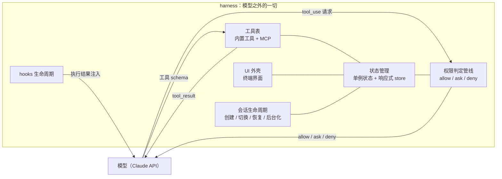
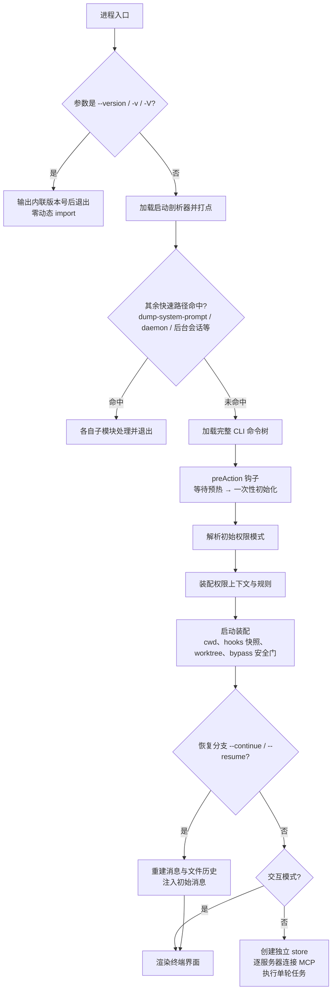
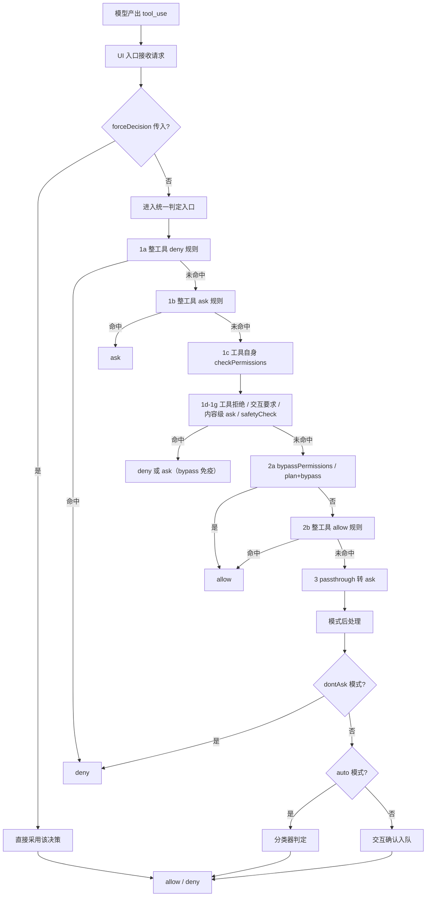
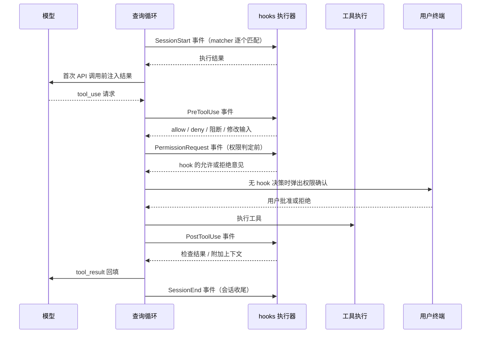

# Harness 模块：模型之外的一切

## 1 概述

harness 指运行时中围绕模型的一切设施：工具 schema、权限策略、状态管理、会话生命周期、hooks、UI 外壳。模型在这套设施中只承担一项工作：消费消息流，产出文本与 `tool_use` 请求。`tool_use` 本身没有任何副作用，真正执行命令、修改文件、读取目录的是 harness 中的工具实现。工具执行之前，harness 的权限管线先做出 allow/ask/deny 判定，`hasPermissionsToUseTool` 是唯一入口。hooks 同样由 harness 在生命周期点执行，模型只能看到执行结果以 system message 形式注入回上下文。



这张图说明 harness 的内部结构：状态容器被权限、工具表、UI、会话生命周期四类组件共用；模型与 harness 的交互只有四条通道——工具请求、判定结果、工具 schema 与执行结果注入。

## 2 核心组件与职责

### 2.1 进程入口：快速路径与默认路径

**组件职责**：入口函数是一张成本递增的路径表。`--version`/`-v`/`-V` 在第一个分支做纯字符串比较，输出构建期内联的版本号后立即退出，全程零模块加载。其余快速路径（`--dump-system-prompt`、chrome MCP、daemon worker、后台会话等）各自用动态 import 加载自己的模块，处理完立即退出。全部未命中时才加载完整 CLI：Commander 命令树、一次性初始化、REPL 与无界面两种模式分发。

**设计理由**：模块求值是真实成本——遥测模块约 400KB，完整 CLI 的 import 链需要百余毫秒。一条版本号命令只配一次字符串比较，完整 CLI 的成本只由真正需要它的调用者承担。

**协作**：剖析器在每个路径打点，逐级验证成本来源；提前输入捕获在完整 CLI 求值期间启动，用户提前敲入的按键不会丢失。

### 2.2 状态容器：单例状态与响应式 store 的分工

harness 有两套状态容器，各司其职：

**单例状态**：模块级 `STATE` 对象保存进程全局事实——`sessionId`、`cwd` 与 `projectRoot`、token 与费用计数、模型覆盖、权限模式相关标记。它只提供显式 getter/setter，没有订阅机制。读取方运行在 React 组件树之外：工具实现、hooks 执行器、遥测计数。源码用大写注释反复警告新增状态的代价。

**响应式 store**：`createStore` 提供 `getState`/`setState`/`subscribe` 三件套；`setState` 用 `Object.is` 短路无变化更新；`onChange` 把每次状态迁移的新旧快照转发给外部；`subscribe` 返回退订函数。UI 层经 `useSyncExternalStore` 按选择器订阅，只有被选中的切片变化才触发重渲染。

**分工依据**：读取方所处的运行环境。React 树内按字段订阅重渲染，读响应式 store；树外的任何模块随时读单例。容器本身没有 UI 框架依赖，无界面模式直接复用同一个 `createStore`。

**响应式 store 的最小实现**：

```ts
export function createStore<T>(
  initialState: T,
  onChange?: OnChange<T>,
): Store<T> {
  let state = initialState
  const listeners = new Set<Listener>()

  return {
    getState: () => state,

    setState: (updater: (prev: T) => T) => {
      const prev = state
      const next = updater(prev)
      if (Object.is(next, prev)) return
      state = next
      onChange?.({ newState: next, oldState: prev })
      for (const listener of listeners) listener()
    },

    subscribe: (listener: Listener) => {
      listeners.add(listener)
      return () => listeners.delete(listener)
    },
  }
}
```

`Object.is` 短路是核心：更新函数必须返回新引用才会触发通知，返回旧对象是零成本操作。`onChange` 把状态迁移转发给外部（持久化与调试记录），随后广播给订阅者。

### 2.3 权限判定管线

**模式集合**：`acceptEdits`、`bypassPermissions`、`default`、`dontAsk`、`plan`，内部另有 `auto`。会话初始模式按优先级求取：危险跳过参数 > 模式参数 > 配置文件的默认值 > `default`；`bypassPermissions` 被组织策略禁用时跳过。

**规则建模**：规则是三元组 `{ source, ruleBehavior, ruleValue }`，`ruleValue` 为 `{ toolName, ruleContent? }`。来源分两类：配置文件来源（user/project/local/flag/policy）与运行时来源（cliArg/command/session）。规则按来源归入 `alwaysAllowRules`/`alwaysDenyRules`/`alwaysAskRules` 三类集合。

**判定顺序与理由**（固定顺序，每一步命中即返回）：

1. **1a** 整工具 deny 规则命中，立即 deny；
2. **1b** 整工具 ask 规则命中，返回 ask（沙箱自允许例外）；
3. **1c** 解析输入后调用工具自身的 `checkPermissions`——Bash 的逐命令规则在这里产生；
4. **1d-1g** 工具自身拒绝、`requiresUserInteraction`、内容级 ask 规则、`safetyCheck` 依次返回；
5. **2a** `bypassPermissions` 模式（或 plan 模式且启动自 bypass）返回 allow；
6. **2b** 整工具 allow 规则返回 allow；
7. **3** `passthrough` 转为 ask。

deny 优先体现在位置：1a 在 2a 之前执行，deny 规则命中时 bypass 永远走不到；1d-1g 的拒绝与 safetyCheck 对 bypass 免疫。管线之后的模式后处理：`dontAsk` 把 ask 改写为 deny，`auto` 模式把 ask 交给分类器，allow 时重置连续拒绝计数。每条决策携带 `decisionReason`，依据（模式或规则）随结果一起返回。

**协作**：UI 入口接收 `forceDecision` 短路参数；ask 进入交互确认队列，deny 生成拒绝消息。MCP 工具按 `mcp__server__tool` 全名匹配规则，`mcp__server1` 或 `mcp__server1__*` 可覆盖整个服务器。

**管线末段的模式放行与允许规则**：

```ts
  // 2a. Check if mode allows the tool to run
  // IMPORTANT: Call getAppState() to get the latest value
  appState = context.getAppState()
  // Check if permissions should be bypassed:
  // - Direct bypassPermissions mode
  // - Plan mode when the user originally started with bypass mode (isBypassPermissionsModeAvailable)
  const shouldBypassPermissions =
    appState.toolPermissionContext.mode === 'bypassPermissions' ||
    (appState.toolPermissionContext.mode === 'plan' &&
      appState.toolPermissionContext.isBypassPermissionsModeAvailable)
  if (shouldBypassPermissions) {
    return {
      behavior: 'allow',
      updatedInput: getUpdatedInputOrFallback(toolPermissionResult, input),
      decisionReason: {
        type: 'mode',
        mode: appState.toolPermissionContext.mode,
      },
    }
  }

  // 2b. Entire tool is allowed
  const alwaysAllowedRule = toolAlwaysAllowedRule(
    appState.toolPermissionContext,
    tool,
  )
  if (alwaysAllowedRule) {
    return {
      behavior: 'allow',
      updatedInput: getUpdatedInputOrFallback(toolPermissionResult, input),
      decisionReason: {
        type: 'rule',
        rule: alwaysAllowedRule,
      },
    }
  }
```

两点值得注意：2a 判定前重新读取最新状态，因为管线前段可能因等待工具自检而耗时，模式在期间可能被用户切换；`updatedInput` 保证工具自检阶段改写的输入在放行时保留，两条 allow 路径共用同一回退函数。

### 2.4 hooks 事件模型：外部脚本进入生命周期

**事件白名单**：共 27 项，包括 `PreToolUse`、`PostToolUse`、`PermissionRequest`、`SessionStart`、`SessionEnd`、`PreCompact`、`FileChanged`、`CwdChanged` 等。

**配置形态**：以事件名为键，值是 matcher 数组；每个 matcher 携带匹配字符串与 hooks 数组。单个 hook 是四种类型之一——`command`、`prompt`、`http`、`agent`——用 discriminatedUnion 校验，并支持 `timeout`、`once`、`async` 与 `if` 条件（`if` 复用权限规则语法）。

**执行权在 harness**：每个事件有独立执行器，先按 matcher 过滤再逐个运行。模型无法自行触发或绕过 hooks——它只能产出 `tool_use`。`PreToolUse` 在工具执行前运行并可阻断执行；`PermissionRequest` 直接嵌入权限管线，在无界面自动拒绝之前给 hook 一次允许或拒绝的机会。

**注入通道**：hook 输出进入模型可见上下文的唯一通道是 harness 注入。`SessionStart` 的结果收集为 system message，作为初始消息传入，并在第一次 API 调用前等待完成。SDK 回调与插件 matcher 统一注册进单例的 `registeredHooks`。

### 2.5 MCP：工具表的可插拔提供方

接入路径分三段：

1. **配置解析**：`--mcp-config` 支持 JSON 字符串或文件路径；常规来源（`.mcp.json`、用户 settings、插件）读取后汇总成一份配置。
2. **连接**：连接函数用 memoize 包裹，同一服务器多次请求共享一个连接；按 transport 类型分支（sse、sse-ide、ws-ide），长连接与单次请求分开配置超时。交互模式在信任对话框之后预热资源，预热与 hooks 启动并行，不阻塞首轮渲染——慢服务器在第二轮才可见。
3. **汇入工具表**：连接结果 `{client, tools, commands}` 存入 `appState.mcp`（含 clients、tools、commands、resources 四个字段）。交互模式渲染时合并内置工具与 MCP 工具；无界面模式先把 MCP 工具放进独立 store 再执行单轮任务。MCP 工具与内置工具在同一工具表形态中流转。

### 2.6 会话生命周期：创建、切换、恢复、后台化

- **创建**：进程启动时用 `randomUUID()` 生成 `sessionId`；`--session-id` 参数经 `switchSession` 切换。
- **切换**：`switchSession` 把 `sessionId` 与 `sessionProjectDir` 整体替换，两个字段永远同步变化，不存在单独的 setter，随后发出会话切换信号；监听者自行注册订阅（例如 PID 文件里的 sessionId 同步）。`regenerateSessionId` 支持把当前会话记为父会话，供计划模式到实现会话的血缘追踪。
- **恢复**：`--continue` 取最近会话；`--resume` 支持 UUID、自定义标题精确匹配与交互选择器。恢复流程重建消息、文件历史快照与 agent 定义后进入 REPL。
- **后台化**：`--bg`/`--background` 走独立快速路径；`daemon` 子命令与 `ps`/`logs`/`attach`/`kill` 旧命令由 feature 门控制。会话记录文件按 `sessionProjectDir` 存放。

**会话的原子切换**：

```ts
export function switchSession(
  sessionId: SessionId,
  projectDir: string | null = null,
): void {
  // Drop the outgoing session's plan-slug entry so the Map stays bounded
  // across repeated /resume. Only the current session's slug is ever read
  // (plans.ts getPlanSlug defaults to getSessionId()).
  STATE.planSlugCache.delete(STATE.sessionId)
  STATE.sessionId = sessionId
  STATE.sessionProjectDir = projectDir
  sessionSwitched.emit(sessionId)
}
```

这段代码展示单例写路径的纪律：先清理离开会话的缓存项，再同步更新两个字段，最后发出信号。单例处于依赖图的叶子位置，监听者自行订阅，单例不反向依赖它们。

## 3 关键流程

### 3.1 启动流程：从进程入口到 REPL / 单轮执行



分步讲解：

1. **入口判定**：版本号参数在第一个分支完成，全程无动态 import。
2. **剖析器接入**：所有非版本路径先加载剖析器并打点，后续每个分支都有对应检查点。
3. **快速路径依次尝试**：每条路径独立加载自己的模块，处理完直接退出，互不加载对方代码。
4. **加载完整 CLI**：提前输入捕获在命令树求值前启动，用户按键不丢失；求值结束打点。
5. **Commander 装配与 preAction 钩子**：帮助输出不触发初始化；钩子里先等待模块求值期启动的预热（密钥环与配置预读），再执行一次性初始化。
6. **一次性初始化**：校验配置、只应用安全环境变量、注册优雅退出、惰性加载遥测、配置代理与 mTLS、预热 API 连接；配置错误走交互或非交互两种终止路径。
7. **权限装配**：先解析初始模式，再用命令行规则加磁盘规则装配 `toolPermissionContext`；内置工具表在同一上下文下生成。
8. **启动装配**：设置 cwd，捕获 hooks 配置快照并启动文件变更监视；worktree 路径切换目录并重设项目根；bypass 模式在 root 或非沙箱环境有强制确认或拒绝。
9. **恢复分支**：两条恢复入口统一经 REPL 注入初始消息与文件历史。
10. **模式分发**：无界面模式用独立 store、逐服务器连接 MCP、执行单轮任务；交互模式渲染终端界面。

### 3.2 一次工具调用的权限判定管线



分步讲解：

1. **入口与短路**：UI 入口先建权限上下文；`forceDecision` 存在时跳过全部判定，用于上层已确定结果的场景。
2. **规则前置判定**：1a deny、1b ask 只做整工具匹配（规则内容为空才命中），MCP 工具按服务器名匹配。
3. **工具自检**：输入解析通过后调用工具自身的权限逻辑，Bash 的逐命令规则、目录检查在此产生判定结果。
4. **bypass 免疫层**：1d-1g 的拒绝、内容级 ask 与 safetyCheck 直接返回，后续 2a 的 bypass 无法覆盖它们。
5. **模式与允许规则**：2a 检查 bypass 模式或 plan 加可用标记；2b 检查整工具 allow 规则；两条放行路径都携带 `updatedInput`。
6. **兜底转 ask**：工具返回 `passthrough` 时统一转为 ask 并附决策原因。
7. **模式后处理**：allow 时重置 auto 模式连续拒绝计数；`dontAsk` 把 ask 改写为 deny；auto 模式把 ask 交给分类器，PowerShell 另有显式许可要求。
8. **交互层**：allow 直接放行；deny 记录并构造拒绝消息；ask 调用交互处理器加入确认队列渲染。

### 3.3 hooks 事件与注入时序



分步讲解：

1. **会话启动**：SessionStart 事件在会话建立时运行，结果作为 system message 注入，首次 API 调用前等待完成。
2. **工具调用前**：模型产出 tool_use 后，PreToolUse 先于工具执行运行，可以允许、拒绝、阻断或修改输入。
3. **权限判定前**：PermissionRequest 直接嵌入权限管线，hook 的允许或拒绝意见先于无界面自动拒绝生效；hook 未决策时才弹出用户确认。
4. **工具调用后**：PostToolUse 检查执行结果、附加上下文，失败路径有独立执行器。
5. **会话收尾**：SessionEnd 在会话结束时运行。全部事件由 harness 执行，模型接触不到 hook 进程本身，只能看到注入回来的消息。

## 4 设计思想

**快速路径的启动优化**：入口把"这个进程需要什么"的判定压缩成顺序分支，每个分支只加载自己需要的模块，版本号分支连剖析器都不加载。配套手段是构建期常量内联与 feature flag 的无效代码消除。可迁移到任何 CLI 入口：把分发判定放进一个无依赖的文件，把重量级依赖改成动态加载，用打点验证每级成本的来源。

**单例与响应式状态的分层**：单例承担任何模块随时可读的进程事实，代价是显式 getter/setter 与新增状态的纪律；响应式 store 承担 UI 按切片订阅的会话状态，代价是每次更新必须产生新引用。两者共享边界对象（权限上下文同时出现在两类容器里）。可迁移思想：业务状态容器做成无 UI 依赖的普通对象，React 只是经 `useSyncExternalStore` 接入的消费者之一，无界面模式直接复用同一容器。

**权限判定集中化**：全部判定收敛到一个函数，顺序固定、deny 优先、工具自检参与管线、每条决策携带依据。规则持久化与内存上下文统一经更新接口（add/replace/remove 加目标来源），磁盘规则热更新先清后写，删除规则不残留旧状态。可迁移思想：安全敏感判定集中成一个可读的顺序化函数，判定依据随结果一起返回，任何放行路径都携带"为什么放行"。

**hooks 作为受控生命周期扩展点**：事件集合由 schema 白名单约束，hook 形态由 discriminatedUnion 校验，超时与 once/async 语义由执行器统一实现，执行结果只经 harness 注入回到模型。可迁移思想：agent 框架的扩展点设计成"受控生命周期回调加输出注入"，执行权留在框架内，扩展者只提交配置与脚本。

**渐进式工具表**：MCP 连接用 memoize 去重，用 pending→connected 两阶段状态机填充工具表，慢服务器推迟到后续轮次可见，首轮响应不被最慢的服务器拖住；无界面模式只有一轮，改为阻塞等待。可迁移思想：外部能力接入按"先占位后填充"推进，交互与一次性执行两种场景对等待策略的要求不同，应由调用方选择等待策略。
