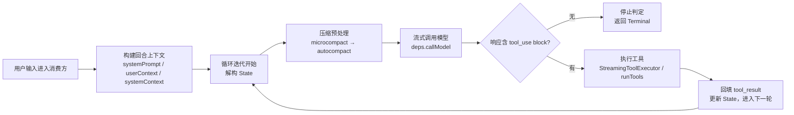
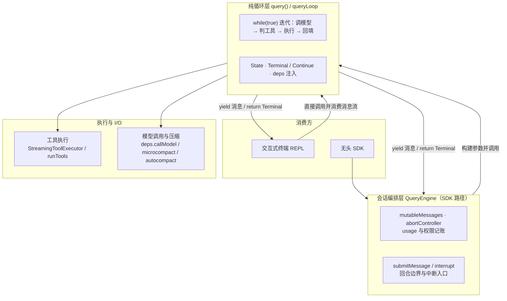
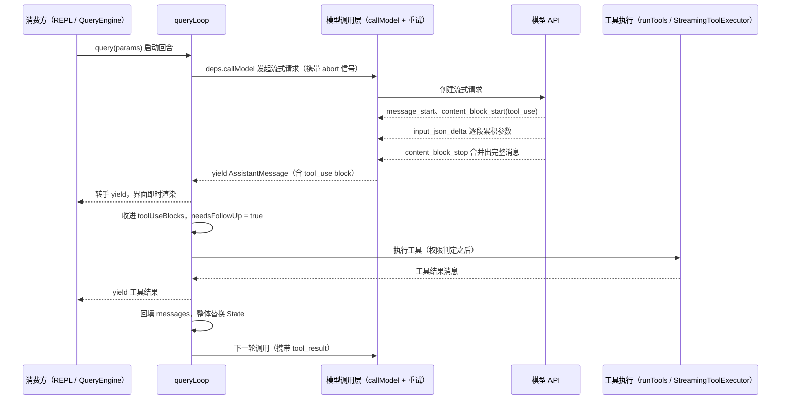
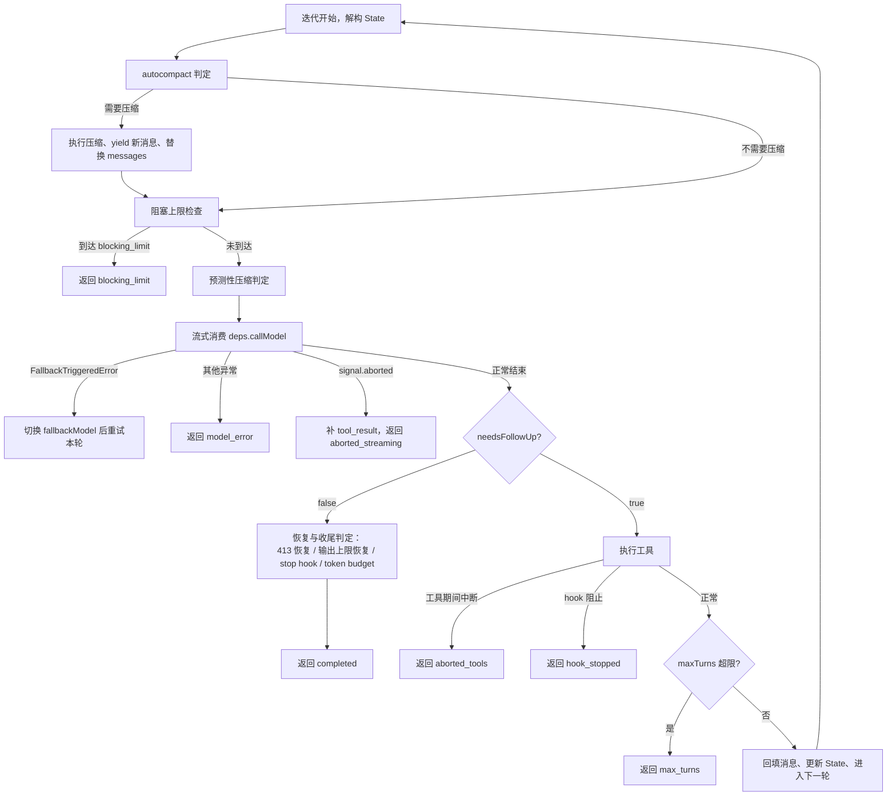

# Agent 主循环（Loop）模块

## 1 概述

Claude Code 的 agent 主循环是一条 `while (true)` 无限循环：反复执行「调用模型 → 流式消费事件 → 判定工具调用 → 执行工具 → 回填结果 → 继续下一轮」，直到命中某个停止条件并返回 `Terminal`。

循环对外暴露两条通道：`yield` 输出中间消息（供界面渲染与转录消费），`return` 输出结束原因（供上层映射为结构化结果）。交互式终端与无头 SDK 消费同一条循环；SDK 路径经会话编排器 `QueryEngine` 调用，每个用户回合对应一次循环运行，交互式终端则直接调用并消费消息流。

一个用户回合可能包含多轮循环迭代：模型每输出一次工具调用，harness 执行工具并把结果回填，就构成一次「工具调用回合」，回合结束后进入下一轮迭代；模型不再输出工具调用时，回合进入收尾判定并返回 `Terminal`。回合期间用户中断（Esc 或 Ctrl+C）、模型错误、上下文压缩都会以不同分支进入或结束循环。

「回合」与「迭代」是两个粒度：回合对应一次用户提交（外层由会话层发起），迭代对应循环体的一次完整走查（内层由 `queryLoop` 控制）。一个回合内可以发生零次或多次工具调用迭代，每一次迭代都以「调用模型并观察响应」为起点。

循环运行期间还有两类外部输入会注入当前回合：用户排队的新消息（命令队列）与文件系统变化产生的附件消息。它们在每轮工具执行结束后被收集并追加进本轮结果，随回填一起进入下一轮模型调用。



图中各环节对应的组件：上下文构建发生在会话层（`QueryEngine` 或终端界面）；迭代、压缩判定与停止判定发生在 `queryLoop` 内部；模型调用经依赖注入的 `deps.callModel` 发出；工具执行交给 `StreamingToolExecutor` 或 `runTools`；回填动作把本轮消息追加进 `State.messages` 并整体替换 `State`。

## 2 核心组件与职责

### 2.1 分层：会话编排层与纯循环层

`query()` 是纯 API 循环，形态是 `AsyncGenerator`。循环内部只关心消息数组、工具执行与停止判定，一切结果经 `yield` 输出，自身不依赖任何界面框架；所需的界面状态经 `toolUseContext.getAppState()` 回调按需读取。

`QueryEngine` 是会话编排器，每个会话一个实例。它持有 `mutableMessages`（跨回合消息历史）、`abortController`（中断信号）、usage 累计与权限拒绝记录；把循环产出的消息流翻译成 SDK 协议消息；提供回合边界（`submitMessage`）与中断入口（`interrupt`）。turn 记账、usage 累加、转录等会话级职责都在这一层。

数据与控制权的传递路径：上层构建参数 → `query()` 启动循环 → 循环 `yield` 中间消息 → 上层逐条消费并渲染 → 循环 `return` 一个 `Terminal` → 上层把结束原因映射为结构化结果。循环与消费方之间只有消息流与结束原因两个接口。

会话层向循环传递的核心对象是 `toolUseContext`：它携带工具列表、权限判定函数 `canUseTool`、abort 信号、`getAppState`/`setAppState` 回调、MCP 连接与代理定义。循环内部调用模型、执行工具、询问权限时都从这一个对象取值，上层切换状态无需改动循环代码。

两种消费方的差异只体现在消息流的下游：交互式终端把每条消息转成界面渲染与转录记录；`QueryEngine` 把消息映射成 SDK 协议消息（如把工具结果映射为 SDK 工具结果事件、把压缩边界映射为 SDK 压缩事件），并把 `Terminal` 映射为 SDK 的 result 消息。循环本身对这两种下游一无所知。



### 2.2 queryLoop 与 State：循环体与跨轮次状态

`queryLoop` 是无限循环体。每轮开头解构 `State`，让 `messages`、`turnCount` 等字段以裸名参与本轮计算；所有继续点统一写回 `state = { ... }` 完成整体替换，避免分散的独立赋值。

`State` 保存跨轮次可变数据，各字段职责：

- `messages`：消息历史，每轮回填后增长，压缩后替换为摘要版；
- `toolUseContext`：上文所述的会话上下文对象，工具执行可能改写它（如刷新工具表）；
- `turnCount`：轮次计数，配合 `maxTurns` 判定轮次上限；
- `autoCompactTracking`：自动压缩记账（是否已压缩、连续失败次数、轮次编号），驱动压缩熔断；
- `transition`：上一轮继续原因（`Continue` 联合类型），供测试与审计；
- `maxOutputTokensRecoveryCount`、`hasAttemptedReactiveCompact`：恢复类计数，在每轮工具回填点重置，语义是「单轮内有效」，新一轮工具回合重新获得恢复机会。

循环参数（`systemPrompt`、`canUseTool`、`maxTurns` 等）在循环内不再赋值，与 `State` 形成「不可变参数 + 可变状态」的分界：参数决定循环如何运行，状态记录循环运行到哪一步。

**State 容器：跨轮次可变状态的形状**

```ts
let state: State = {
  messages,
  toolUseContext,
  maxOutputTokensOverride,
  autoCompactTracking: undefined,
  stopHookActive: undefined,
  maxOutputTokensRecoveryCount: 0,
  hasAttemptedReactiveCompact: false,
  turnCount: 1,
  pendingToolUseSummary: undefined,
  transition: undefined,
}
```

### 2.3 deps：依赖注入边界

`deps` 收敛四个 I/O 依赖：`callModel`（模型调用）、`microcompact`（微压缩）、`autocompact`（自动压缩）、`uuid`（标识生成）。生产环境用 `productionDeps()` 填充真实实现；测试注入替代实现即可替换模型调用与压缩行为，循环其余代码保持不变。

把压缩函数也放进依赖对象有两层考虑：压缩本身需要发起模型调用（摘要生成），属于外部 I/O；测试需要在不真正调用模型的情况下验证压缩触发逻辑。依赖注入让「循环逻辑」与「外部 I/O」的分界清晰：循环只依赖接口，不依赖具体实现。

### 2.4 工具执行：StreamingToolExecutor 与 runTools

工具执行有两条路径，由运行期开关选择：

- `StreamingToolExecutor`（流式执行器）：`tool_use` block 随模型流到达立即入队调度，工具在模型继续输出期间就开始执行。入队时用输入 schema 校验结果与 `isConcurrencySafe(input)` 预先计算并发性：并发安全工具可并行执行，非并发安全工具独占执行并阻塞后续工具；结果按到达顺序产出，进度消息立即转发。流被中断时，执行器为排队中的工具产出合成的中断结果，保证每个 `tool_use` 都有对应的 `tool_result`。
- `runTools`（批量执行）：流结束后拿到完整 `toolUseBlocks` 列表再逐个执行，逻辑更直白，但没有流式提前执行的收益。

两条路径通过统一的更新协议回填结果，循环主体不感知差异。权限函数 `canUseTool` 从循环参数一路传入执行器，工具执行期间的权限询问与界面确认队列都经它触发；用户中断时界面直接终止确认队列中的等待项。

并发调度的语义细节：并发安全性由「输入」决定，同一个工具在不同输入下可能给出不同判定（例如只读命令并发安全、写命令独占）。调度器维护「正在执行」集合，只有全部在执行工具都并发安全时才放行新的并发安全工具；任何一个非并发安全工具在执行时，后续工具一律排队。这份规则把「模型并行调用多个工具」约束成可预测的执行顺序。

### 2.5 Terminal 与 Continue：结束与继续的联合类型

循环的所有退出路径统一收敛为 `Terminal` 可辨识联合类型；循环内部的重试路径统一收敛为 `Continue` 联合类型。两个类型把所有「为什么结束」「为什么继续」的原因变成可枚举、可测试、可审计的字段。

`QueryEngine` 消费 `Terminal` 后把它映射为结构化的 SDK 结果：例如 `max_turns` 映射为轮次上限错误，`aborted_*` 映射为中断结果，`completed` 映射为正常完成。`Continue` 主要供测试断言恢复路径是否触发，也供运行期日志记录上一轮为何继续。

**Terminal 与 Continue：结束原因与继续原因的联合类型**

```ts
export type Terminal =
  | { reason: 'completed' }
  | { reason: 'blocking_limit' }
  | { reason: 'image_error' }
  | { reason: 'model_error'; error?: unknown }
  | { reason: 'aborted_streaming' }
  | { reason: 'aborted_tools' }
  | { reason: 'prompt_too_long' }
  | { reason: 'stop_hook_prevented' }
  | { reason: 'hook_stopped' }
  | { reason: 'max_turns'; turnCount: number }

export type Continue =
  | { reason: 'collapse_drain_retry'; committed: number }
  | { reason: 'reactive_compact_retry' }
  | { reason: 'max_output_tokens_escalate' }
  | { reason: 'max_output_tokens_recovery'; attempt: number }
  | { reason: 'stop_hook_blocking' }
  | { reason: 'token_budget_continuation' }
  | { reason: 'next_turn' }
```

`Terminal` 各分支含义：

- `completed`：模型未输出工具调用，且全部收尾判定通过，正常结束。
- `blocking_limit`：上下文达到硬上限且自动压缩关闭，为手动压缩保留空间。
- `image_error`：图像尺寸或缩放错误。
- `model_error`：模型调用异常，携带原始错误对象。
- `aborted_streaming`：流式输出期间用户中断。
- `aborted_tools`：工具执行期间用户中断。
- `prompt_too_long`：请求超长（413），且恢复路径耗尽。
- `stop_hook_prevented`：Stop hook 判定阻止继续。
- `hook_stopped`：工具执行过程中 hook 要求终止。
- `max_turns`：轮次上限，携带最终轮数。

`Continue` 各分支含义：

- `collapse_drain_retry`：上下文塌缩排水后重试本轮。
- `reactive_compact_retry`：反应式压缩完成后重试本轮。
- `max_output_tokens_escalate`：输出上限升级后重试本轮。
- `max_output_tokens_recovery`：注入「从中断处继续」消息后重试。
- `stop_hook_blocking`：hook 阻塞错误注入消息历史后重试。
- `token_budget_continuation`：token 预算未达目标，注入提示消息后续跑。
- `next_turn`：工具结果回填后进入下一轮调用。

### 2.6 handleStopHooks 与 token budget：收尾判定

`handleStopHooks` 在模型未输出工具调用的回合结束时执行 Stop hooks。它返回两种结果：`preventContinuation`（阻止继续，循环直接终止）与 `blockingErrors`（阻塞错误，注入消息历史后重试）。阻塞重试路径会保留反应式压缩的已尝试标记，防止「压缩 → 仍超限 → 错误 → hook 阻塞 → 压缩」形成无限循环。

hook 与循环的分工：hook 是用户配置的外部脚本，harness 在生命周期点（Stop、SubagentStop 等）执行它们；循环只消费 hook 的返回值并决定终止或重试，hook 本身无法直接控制循环。模型产出错误消息（限流、超长、认证失败）的回合不运行 Stop hooks，避免「错误 → hook 阻塞 → 重试 → 错误」的循环。

token budget 组件在收尾阶段做「续跑还是终止」的判定：用户设定了 token 目标时，消耗低于目标 90% 就注入一条提示消息续跑；连续多轮输出增量过低时判定为递减收益，直接终止。该组件只对主会话生效，子代理不参与。

### 2.7 三层压缩：microcompact / autocompact / reactiveCompact

- `microcompact`（微压缩）：轻量压缩，清除白名单工具的历史结果内容，只按 `tool_use_id` 操作、不读内容；先于自动压缩执行，与工具结果预算的替换逻辑可以组合使用。
- `autocompact`（自动压缩）：主动压缩，token 估算达到阈值时触发。阈值计算分两级：有效上下文窗口 = 模型窗口减去为摘要输出保留的空间（约 20K token）；压缩阈值 = 有效窗口减去缓冲，缓冲按窗口大小分级（大窗口用 50K，中窗口用 30K，小窗口用 13K）。触发后让模型生成摘要并用摘要消息替换整段历史，产出压缩边界消息。连续失败达到 3 次时熔断跳过。
- `reactiveCompact`（反应式压缩）：被动压缩，API 返回 413 超长错误后触发，作为主动压缩的兜底。

主循环只负责「判定要不要压缩 → 调用压缩组件 → 替换 messages → 继续」，摘要提示词、会话记忆压缩与压缩后清理都隔离在压缩组件内部。压缩发生时循环先把新消息数组逐条 yield 给界面，再以压缩后的消息继续当前回合。预测性压缩是自动压缩的补充：请求前用「本轮预估增长量」判断本轮结束后是否会越界，越界则先压缩再调用模型，省下一次越界请求。

### 2.8 单轮累积：三个数组与一个布尔

每轮迭代重建四个局部变量，承载「本轮」数据；跨轮次数据在 `State.messages`。两者分界让每轮的职责一目了然。

**单轮累积容器：本轮数据与跨轮次数据的分界**

```ts
const assistantMessages: AssistantMessage[] = []
const toolResults: (UserMessage | AttachmentMessage)[] = []
const toolUseBlocks: ToolUseBlock[] = []
let needsFollowUp = false
```

- `assistantMessages` 收本轮模型产出的助手消息；
- `toolResults` 收工具结果与附件消息；
- `toolUseBlocks` 收流中出现过的工具调用 block；
- `needsFollowUp` 决定是否进入下一轮 API 调用。

循环继续的信号由 harness 自己维护：API 的 `stop_reason === 'tool_use'` 不可靠，因此把「流中出现过 tool_use block」作为唯一的循环继续信号，出现即置 `needsFollowUp = true`。

### 2.9 轮次间的消息注入：附件与命令队列

每轮工具执行结束后、进入下一轮之前，循环会把两类外部输入收集进本轮结果：

- **命令队列**：用户在执行期间提交的新消息、排队中的任务通知。循环按优先级取快照，把属于本会话的命令转换成附件消息；斜杠命令不进附件，留给回合结束后的命令处理器。
- **系统附件**：文件变更通知（工具编辑文件后产生）、记忆预取的命中附件、技能与工具发现的预取附件。这些附件随 `toolResults` 一起回填进 `messages`，模型在下一轮调用中看到它们。

注入流程统一为「取快照 → 过滤归属 → 转成附件消息 → 追加进 toolResults → 回填」。附件消息先 yield 给界面，再进入消息历史。命令队列是进程级共享结构，主会话与子代理各自只取属于自己的条目，避免互相消费。

## 3 关键流程

### 3.1 一次工具调用往返



分步讲解：

1. **进入循环**：消费方调用 `query(params)` 启动一个用户回合；`query()` 完成观测初始化后把控制权交给 `queryLoop`。
2. **发起流式请求**：每轮迭代经 `deps.callModel` 发起调用，abort 信号原样传入，界面中断可以直接传导到模型调用。
3. **重试层包裹**：模型调用层用重试组件包裹请求，网络错误按策略重试；流式事件逐个到达。
4. **事件累积**：`message_start` 建立消息骨架；`content_block_start` 为 `tool_use` 建立空 `input` 骨架；`input_json_delta` 逐段拼接参数；文本增量先收集进数组，块结束时一次性合并，避免逐段拼接的平方级开销。
5. **块完成即产出**：`content_block_stop` 把增量合并成完整 `AssistantMessage` 并立即 yield，循环转手 yield 给消费方，界面在整条响应结束前就逐块渲染。
6. **记录工具调用意图**：循环把 `tool_use` block 收进 `toolUseBlocks` 并置 `needsFollowUp = true`。
7. **执行工具**：流式执行器或 `runTools` 消费工具调用，逐条产出结果消息；循环先 yield 给界面，再收进 `toolResults`。权限判定发生在执行之前，deny 时产出拒绝结果。
8. **注入外部输入**：收集命令队列与系统附件（文件变更、记忆预取），追加进 `toolResults`，随回填一起进入下一轮。
9. **回填与继续**：`messages` 追加本轮 `assistantMessages` 与 `toolResults`，`turnCount` 加一，`State` 整体替换，回到迭代开头。
10. **回合终止**：模型未再输出工具调用时进入停止判定，最终返回 `completed`。

### 3.2 每轮迭代的压缩与停止判定



分步讲解：

1. **迭代开始**：`while (true)` 顶部解构 `State`，各字段以裸名参与本轮计算。
2. **自动压缩判定**：`deps.autocompact` 内部先查 token 估算值是否达到压缩阈值；达到即压缩。连续失败达到 3 次时熔断跳过。压缩成功后重置压缩记账，新消息数组替换当前消息集。
3. **阻塞上限检查**：仅当本轮未压缩、且自动压缩关闭时才检查硬上限；到达上限则产出错误消息并返回 `blocking_limit`，为手动压缩保留空间。
4. **预测性压缩**：用「本轮预估增长量」提前判断本轮结束后是否会越界，越界则先压缩再调用模型，省下一次越界请求。
5. **流式消费与异常分流**：`FallbackTriggeredError` 表示重试层要求换模型，循环切换备用模型、清空本轮累积后重试；其余异常统一产出错误消息并返回 `model_error`。
6. **中断优先**：流结束后最先检查 abort 信号；已中断时补足缺失的 `tool_result` 再返回 `aborted_streaming`。中断判定优先于一切错误与恢复逻辑。
7. **无工具调用的停止判定**：依次处理 413 超长恢复（塌缩排水 → 反应式压缩）、输出上限恢复（先升级上限重试一次，再注入「从中断处继续」消息，重试上限 3 次）、API 错误提前返回、Stop hook 的阻止与阻塞、token budget 的续跑或终止，最后返回 `completed`。每条恢复路径都有次数或条件上限，防止恢复逻辑自身形成无限循环。
8. **工具执行与回合推进**：执行工具期间中断返回 `aborted_tools`；hook 阻止继续返回 `hook_stopped`；maxTurns 超限返回 `max_turns`；否则回填消息并进入下一轮。

## 4 设计思想

**循环与 UI 解耦。** 主循环对外只暴露消息流（yield）与终止原因（return），界面状态经 `getAppState` 回调按需读取。同一循环被交互式终端与无头 SDK 共用，界面层的变化不侵入循环逻辑。迁移要点：把循环写成纯生成器，UI 只是消息流的消费者之一。

**依赖注入以测试为中心。** 四个 I/O 依赖（模型调用、两种压缩、uuid）集中在一个接口对象里，测试注入替代实现即可替换外部行为，免去逐模块打桩的样板。生产工厂用真实实现的类型推导保持签名自动同步。迁移要点：把一切「会发起网络或进程」的动作收敛成少数几个可注入的接口。

**状态转移显式化。** 跨轮次可变数据集中在一个 `State` 对象里，所有继续点统一整体替换；终止与继续各用可辨识联合类型表达，每个出口原因都可枚举、可测试、可审计。测试可以直接断言 `transition.reason` 验证恢复路径是否触发，无需翻查消息内容。迁移要点：循环体只允许两类出口——带着原因的终止、带着原因的继续。

**停止条件分层与熔断。** 判定顺序固定：中断优先于错误，错误优先于恢复，hook 与 token 预算收尾，最后才是 `completed`。压缩失败用连续失败计数熔断，输出上限恢复限制 3 次，每个恢复路径都有次数或条件上限，防止错误路径自身变成无限循环。迁移要点：每条恢复路径必须自带「最多重试几次」的上限。

**压缩与主循环的分界。** 主循环只做「判定 → 调用 → 替换 messages → 继续」，摘要提示词、会话记忆压缩与事后清理隔离在压缩组件内部。微压缩先于自动压缩执行、只按 `tool_use_id` 操作且不读内容，与工具结果预算的替换逻辑可以干净组合。迁移要点：上下文管理策略与主循环解耦，新增压缩手段时循环代码零改动。

**消息保真的防御性细节。** 剥离消息上的临时字段时做浅拷贝，避免与正在渲染的界面产生竞争；最终用量经对象属性原位回写，保持转录写队列的引用有效；模型回退时对孤儿消息产出 tombstone，防止带无效签名的内容混入后续请求。这三处细节都属于「消息对象被多方持有」场景下的防御性处理，任何流式 agent 项目都会遇到。

**外部输入经统一通道注入。** 用户排队消息、文件变更、记忆与工具预取附件都在固定的注入点转成附件消息，随工具结果一起回填。模型看到的「世界变化」全部来自消息历史，harness 的状态变化只经消息流传导给模型。迁移要点：给循环设计一个唯一的「世界状态 → 消息」转换点，外部事件一律从该点进入，循环其余部分不需要感知事件来源。
