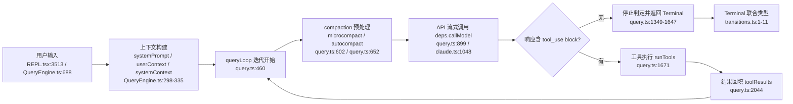
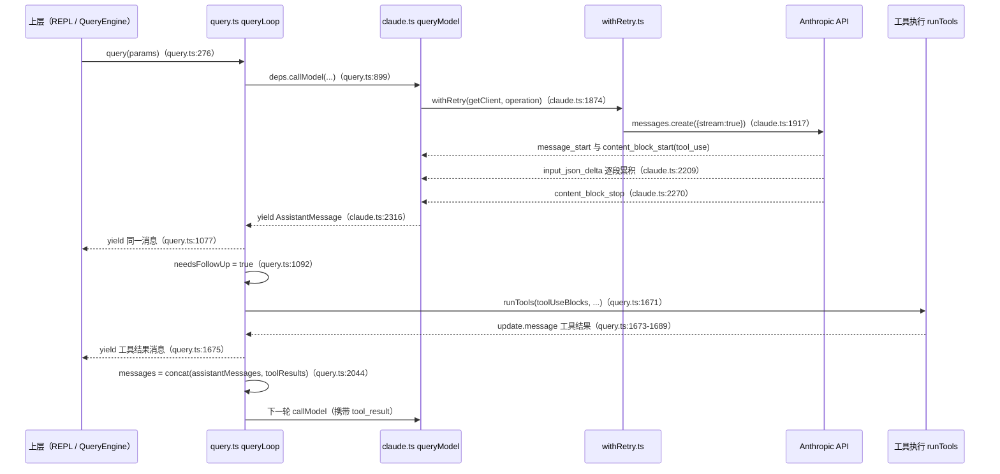
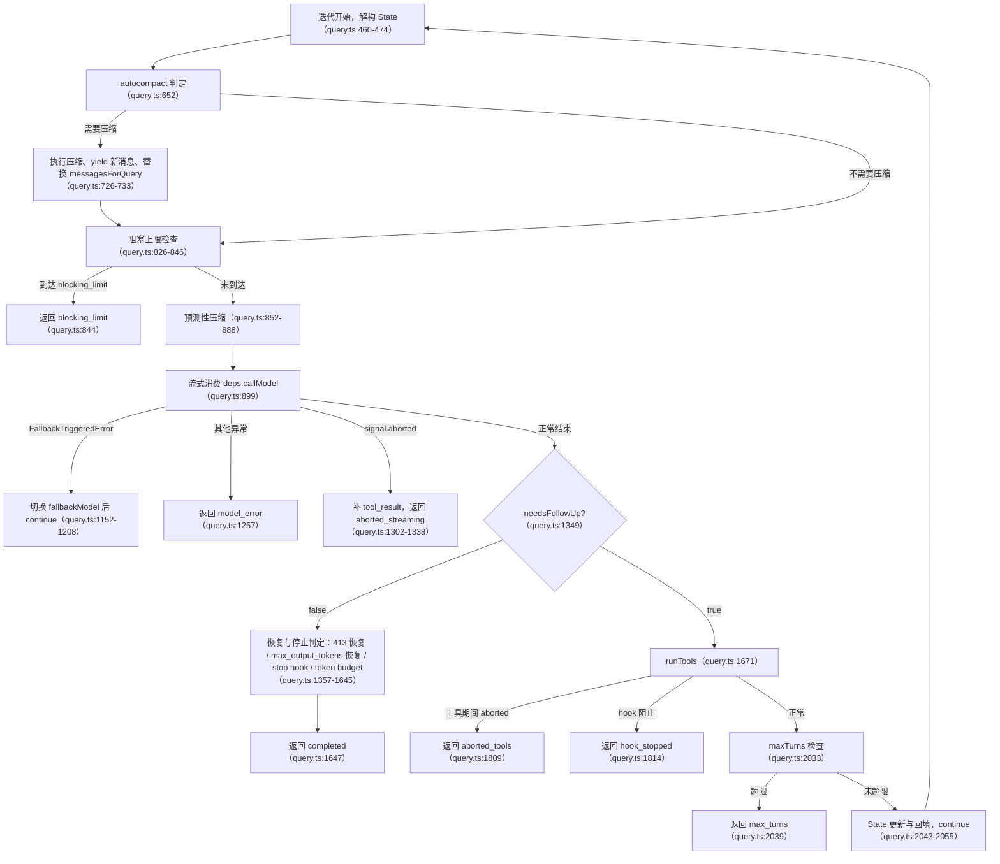

# Agent 主循环（Loop）模块

Claude Code 的 agent 主循环由 `query()`（`src/query.ts`）及其周边模块组成：一个 `while (true)` 无限循环反复执行「调用模型 → 流式消费事件 → 判定工具调用 → 执行工具 → 回填结果 → 继续下一轮」，直到命中某个停止条件并返回 `Terminal`。`QueryEngine` 在会话层为每个用户回合调用一次 `query()`，把循环 yield 出来的消息流翻译成 SDK 协议，同时负责 turn 记账、usage 累加、转录与中断。

## 1 模块概览

主循环在整体架构中的位置：



涉及文件清单：

| 文件路径 | 职责 | 关键导出 |
|---|---|---|
| `src/query.ts` | 主查询循环：流式消费、工具回合、停止判定、compaction 触发 | `query`、`queryLoop`、`State`、`QueryParams` |
| `src/QueryEngine.ts` | 会话编排：turn 记账、SDK 消息映射、usage 累加、转录、中断 | `QueryEngine`、`submitMessage`、`ask` |
| `src/query/config.ts` | 循环入口一次性快照的运行期开关 | `QueryConfig`、`buildQueryConfig` |
| `src/query/deps.ts` | 循环的 I/O 依赖注入（模型调用、压缩、uuid） | `QueryDeps`、`productionDeps` |
| `src/query/transitions.ts` | 循环终止原因与继续原因的类型定义 | `Terminal`、`Continue` |
| `src/query/stopHooks.ts` | Stop hook 执行、阻塞错误收集、中断处理 | `handleStopHooks`、`StopHookResult` |
| `src/query/tokenBudget.ts` | 单 turn token 预算判定与递减收益检测 | `createBudgetTracker`、`checkTokenBudget` |
| `src/services/api/claude.ts` | API 客户端：请求构建、`BetaRawMessageStreamEvent` 处理、非流式回退 | `queryModelWithStreaming`、`queryModelWithoutStreaming` |
| `src/services/api/withRetry.ts` | 重试循环、指数退避、模型回退信号 | `withRetry`、`FallbackTriggeredError`、`CannotRetryError` |
| `src/services/compact/autoCompact.ts` | 自动压缩阈值计算与触发、失败熔断 | `autoCompactIfNeeded`、`shouldAutoCompact`、`getAutoCompactThreshold` |
| `src/services/compact/microCompact.ts` | 工具结果级别的轻量压缩（内容清除） | `microcompactMessages` |
| `src/services/compact/prompt.ts` | 压缩提示词模板与摘要格式化 | `getCompactPrompt`、`getPartialCompactPrompt`、`formatCompactSummary` |
| `src/screens/REPL.tsx` | 终端交互层：Escape/Ctrl+C 取消、权限弹窗、事件消费 | （React/Ink 组件） |
| `src/hooks/useCancelRequest.ts` | 取消键位绑定与取消优先级 | `useCancelRequest` |

## 2 核心概念

### 2.1 单轮 loop 的流式增量处理

**概念定义**：模型输出以 `BetaRawMessageStreamEvent` 事件流到达。`claude.ts` 按事件类型把增量累积成完整 content block：`content_block_start` 建立骨架（`tool_use` 的 `input` 初始化为空字符串、`text` 初始化为空、`thinking` 同时初始化 `signature` 为空），`content_block_delta` 逐段拼接，`content_block_stop` 时合并出完整的 `AssistantMessage` 并立即 yield。`query.ts` 逐条转手 yield 给上层，UI 与转录随之更新。

**设计动机**：每个 block 完成即可让 UI 显示，无需等待整条响应结束；同时放弃 SDK 的 `BetaMessageStream`，改用原始 `Stream` 自行累积，避免 SDK 在每个 `input_json_delta` 上做 partial JSON 解析造成 O(n²) 开销。

**代码证据**：

- `claude.ts:1914-1917` 注释说明使用 raw stream 的原因：
  ```ts
  // Use raw stream instead of BetaMessageStream to avoid O(n²) partial JSON parsing
  // BetaMessageStream calls partialParse() on every input_json_delta, which we don't need
  // since we handle tool input accumulation ourselves
  ```
- `claude.ts:2091-2098`：`content_block_start` 遇到 `tool_use` 时写入 `{ ...part.content_block, input: '' }`，为后续 JSON 字符串累积做准备。
- `claude.ts:2209`：`input_json_delta` 分支执行 `contentBlock.input += delta.partial_json`。
- `claude.ts:2223`：`text_delta` 分支执行 `textDeltas.get(part.index)?.push(delta.text!)`，文本增量先入数组。
- `claude.ts:2291-2296`：`content_block_stop` 时用 `deltas.join('')` 一次性合并文本（O(n) join，替代 O(n²) 的逐段 +=）。
- `claude.ts:2335-2354`：`message_delta` 携带最终 `usage` 与 `stop_reason`，代码直接修改已 yield 消息的属性（`lastMsg.message.usage = usage`），因为转录写队列持有 `message.message` 的引用，对象替换会断开该引用。
- `query.ts:1076-1078`：循环把每条消息原样 `yield yieldMessage`；`query.ts:1083-1093` 同时把 `tool_use` block 收进 `toolUseBlocks` 并置 `needsFollowUp = true`。
- `QueryEngine.ts:813-848`：上层消费 `stream_event` 类型消息，在 `message_start`/`message_delta` 时更新 usage，在 `message_stop` 时把单条消息 usage 累加进 `totalUsage`。

### 2.2 工具调用回合

**概念定义**：当模型输出 `tool_use` content block 时，harness 通过 `canUseTool` 完成权限判定后执行工具；工具结果以 `tool_result` 形式放进 user 消息回填进 `messages`；状态对象更新后 `continue` 进入下一轮 API 调用。这一「模型停在 tool_use → 执行 → 回填 → 再调 API」的过程就是一个工具调用回合。

**设计动机**：官方文档提示 `stop_reason === 'tool_use'` 并不可靠。源码选择自己维护状态：流中出现任意 `tool_use` block 即置 `needsFollowUp = true`，流结束后该布尔是循环继续的唯一信号。

**代码证据**：

- `query.ts:749-756`：每轮迭代重建的局部累积数组与注释原文：
  ```ts
  const assistantMessages: AssistantMessage[] = []
  const toolResults: (UserMessage | AttachmentMessage)[] = []
  // @see https://docs.claude.com/en/docs/build-with-claude/tool-use
  // Note: stop_reason === 'tool_use' is unreliable -- it's not always set correctly.
  // Set during streaming whenever a tool_use block arrives — the sole
  // loop-exit signal. If false after streaming, we're done (modulo stop-hook retry).
  const toolUseBlocks: ToolUseBlock[] = []
  let needsFollowUp = false
  ```
- `query.ts:1083-1093`：`assistantMessages.push(...)` 之后过滤 `tool_use` block，`toolUseBlocks.push(...msgToolUseBlocks)` 并置 `needsFollowUp = true`。
- `query.ts:1669-1689`：流式工具执行开启时用 `streamingToolExecutor.getRemainingResults()`，否则用 `runTools(toolUseBlocks, assistantMessages, canUseTool, toolUseContext)`；`for await (const update of toolUpdates)` 中每条 `update.message` 先 yield 给 UI，再经 `normalizeMessagesForAPI` 过滤后收进 `toolResults`（只保留 `user` 类型）。
- `query.ts:2043-2054`：本轮结束时 `messages: messagesForQuery.concat(assistantMessages, toolResults)`，`turnCount` 加一后 `state = next`，回到 `while (true)` 迭代开头——回填动作发生在这里。
- `claude.ts:2093-2098` 与 `claude.ts:2209`：`tool_use` 的 `input` 从空字符串开始逐段累积 `partial_json`，直到 `content_block_stop` 时才作为完整 block 进入 `AssistantMessage`。
- `QueryEngine.ts:768-770`：编排层每遇到一条 user 消息（含 `tool_result` 回填消息）执行 `turnCount++`。

### 2.3 停止条件与中断

**概念定义**：循环的所有退出路径统一收敛为 `Terminal` 可辨识联合类型（`src/query/transitions.ts:1-11`），包括 `completed`、`blocking_limit`、`image_error`、`model_error`、`aborted_streaming`、`aborted_tools`、`prompt_too_long`、`stop_hook_prevented`、`hook_stopped`、`max_turns`。用户中断（Escape/Ctrl+C）由 REPL 层调用 `abortController.abort('user-cancel')`，信号沿 `deps.callModel` 原样传递给 API 客户端，SDK 抛出 `APIUserAbortError`，循环在流结束后检查 `signal.aborted` 走中断分支。

**设计动机**：把「为什么结束」建模为带原因的联合类型，上层（`QueryEngine`）能据此映射出结构化的 SDK `result` 消息（例如 `max_turns_reached` attachment 映射为 `error_max_turns`，见 `QueryEngine.ts:885-918`）。

**代码证据**：

- `src/query/transitions.ts:1-11`：`Terminal` 的完整定义（见第 4 节摘录）。
- `REPL.tsx:2626` 与 `REPL.tsx:2631`：取消路径执行 `abortController?.abort('user-cancel')`；权限弹窗打开时（`focusedInputDialog === 'tool-permission'`）调用 `toolUseConfirmQueue[0]?.onAbort()`（`REPL.tsx:2616-2619`）；提交式中断使用 `abort('interrupt')`（`REPL.tsx:5206`）。
- `useCancelRequest.ts:129`：`canCancelRunningTask = abortSignal !== undefined && !abortSignal.aborted`；`useCancelRequest.ts:164-167` 绑定 `chat:cancel`（Escape）键位，`useCancelRequest.ts:217-218` 绑定 `app:interrupt`（Ctrl+C）键位。
- `claude.ts:2553-2581`：捕获 `APIUserAbortError` 后先查 `signal.aborted`——为真表示用户按了 Escape，原样重新抛出；为假表示 SDK 内部超时，抛出更具体的 `APIConnectionTimeoutError`。
- `query.ts:1302-1339`：流结束后第一个判定就是 `toolUseContext.abortController.signal.aborted`；为真时用 `streamingToolExecutor.getRemainingResults()` 或 `yieldMissingToolResultBlocks` 补足缺失的 `tool_result`，随后返回 `{ reason: 'aborted_streaming' }`。`reason === 'interrupt'` 时跳过中断消息，因为排队中的新用户消息已提供上下文（`query.ts:1333-1337`）。
- `query.ts:1779-1810`：工具执行期间被中断时返回 `{ reason: 'aborted_tools' }`，并在返回前检查 maxTurns。
- `query.ts:2032-2040`：`maxTurns && nextTurnCount > maxTurns` 时 yield `max_turns_reached` attachment 并返回 `{ reason: 'max_turns', turnCount }`。
- `QueryEngine.ts:1217-1219`：SDK 路径的入口 `interrupt()` 只做一件事：`this.abortController.abort()`；`QueryEngine.ts:1223-1225` 的 `resetAbortController()` 为下一次 `submitMessage` 建立新的未中止信号。

### 2.4 compaction（上下文压缩）

**概念定义**：上下文接近窗口上限时的压缩机制，分三个层次：`microcompact`（`microcompactMessages`，清除 Read/Bash/Grep/Glob/WebSearch/WebFetch/Edit/Write 等工具的历史结果内容，占位文本常量见 `microCompact.ts:36`）、`autocompact`（`autoCompactIfNeeded`，让模型生成摘要，用摘要消息替换整段历史，产出 `compact_boundary` 消息）、`reactiveCompact`（API 返回 413 prompt-too-long 之后被动触发）。压缩完成后循环用 `buildPostCompactMessages` 生成的新消息数组继续。

**设计动机**：主循环只负责「判定要不要压缩」与「替换 messages 继续跑」，压缩的具体实现（提示词、会话记忆压缩、事后清理）全部隔离在 `services/compact/` 目录；微压缩与自动压缩按顺序组合（先微压缩、再自动压缩），且微压缩只按 `tool_use_id` 操作、不读内容，与工具结果预算的替换逻辑可以干净组合。

**代码证据**：

- `query.ts:602-606`：每轮 API 调用之前先执行 `deps.microcompact(messagesForQuery, toolUseContext, querySource)`。
- `query.ts:652-733`：`deps.autocompact(...)` 返回 `compactionResult` 后，执行 `buildPostCompactMessages(compactionResult)`，把新消息逐条 yield（`query.ts:728-730`），再执行 `messagesForQuery = postCompactMessages`（`query.ts:733`）继续当前查询。
- `autoCompact.ts:33-49`：`getEffectiveContextWindowSize` = 模型上下文窗口减去为摘要输出保留的 `MAX_OUTPUT_TOKENS_FOR_SUMMARY`（20000 token，见 `autoCompact.ts:28-30`）。
- `autoCompact.ts:62`：`AUTOCOMPACT_BUFFER_TOKENS = 13_000`；`autoCompact.ts:77-82` 按窗口大小分级：有效窗口 ≥ 800K 用 50K 缓冲、≥ 400K 用 30K、其余用 13K。
- `autoCompact.ts:101-120`：`getAutoCompactThreshold` = 有效窗口 - 缓冲；`shouldAutoCompact`（`autoCompact.ts:189-268`）用 `tokenCountWithEstimation(messages) - snipTokensFreed` 与该阈值比较。
- `autoCompact.ts:289-294`：连续失败熔断——`tracking.consecutiveFailures >= MAX_CONSECUTIVE_AUTOCOMPACT_FAILURES`（值为 3，见 `autoCompact.ts:99`）时直接跳过本轮压缩；失败计数在 `autoCompact.ts:363-379` 累加并在成功时重置（`autoCompact.ts:361`）。
- `microCompact.ts:41-50`：`COMPACTABLE_TOOLS` 白名单限定可压缩的工具。
- `prompt.ts:294-304`：`getCompactPrompt` 用 `NO_TOOLS_PREAMBLE` + `BASE_COMPACT_PROMPT` + `NO_TOOLS_TRAILER` 组成摘要请求，禁止模型在压缩回合调用工具；`formatCompactSummary`（`prompt.ts:312-336`）在摘要进入上下文前剥除 `<analysis>` 草稿区。
- `QueryEngine.ts:958-971`：编排层收到 `compact_boundary` 消息后，把边界之前的历史从 `mutableMessages` 中 `splice` 掉，只保留压缩边界及之后的消息，供下一回合使用。

### 2.5 QueryEngine 与 query() 的分层

**概念定义**：`query()` 是纯 API 循环——一个 `AsyncGenerator`，循环内部只关心消息数组、工具执行与停止判定，一切结果通过 yield 输出，自身不 import React、不触碰 UI。`QueryEngine` 是会话编排器——每个会话一个实例（`QueryEngine.ts:183-191` 注释），持有 `mutableMessages`、`abortController`、`totalUsage`、权限拒绝记录，把 `query()` 的消息流翻译成 SDK 协议消息，并做 turn 记账、转录与 usage 累加。

**设计动机**：把「纯 API 循环」与「会话编排」分成两层之后，同一条循环可以同时服务交互式 REPL 与无头 SDK 两种消费方——`REPL.tsx:3513-3523` 直接调用 `query()`，`QueryEngine.ts:688-699` 也调用同一个 `query()`。循环所需的 UI 状态通过 `toolUseContext.getAppState()` 回调按需读取（`query.ts:768`、`query.ts:906-909`），循环本身保持无 UI 依赖。

**代码证据**：

- `QueryEngine.ts:183-191` 注释：`One QueryEngine per conversation. Each submitMessage() call starts a new turn within the same conversation.` 状态（messages、file cache、usage）跨回合持久。
- `QueryEngine.ts:688-699`：`for await (const message of query({...}))` 消费循环产出。
- `QueryEngine.ts:253-281`：`wrappedCanUseTool` 包裹用户提供的 `canUseTool`，在权限拒绝时记录 `permissionDenials`（`QueryEngine.ts:271-278`）——编排层特有的记账，循环内部并不感知。
- `QueryEngine.ts:670-686`：turn 级局部变量（`currentMessageUsage`、`turnCount`、`lastStopReason`）在每次 `submitMessage` 重置。
- `query.ts:899-949`：`deps.callModel` 的 options 全部来自 `toolUseContext`（含 `getToolPermissionContext`、`abortController.signal` 原样传递），query.ts 自身没有 UI 类型依赖。
- `REPL.tsx:3513-3523`：交互式路径直接 `for await (const event of query({...}))`，说明循环与终端 UI 之间只隔一层事件流。

## 3 关键流程

### 3.1 一次工具调用往返



分步讲解：

1. **进入循环**：REPL（`REPL.tsx:3513-3523`）或 `QueryEngine.submitMessage`（`QueryEngine.ts:688-699`）调用 `query(params)`；`query()` 做 trace 初始化后把控制权交给 `queryLoop`（`query.ts:320-324`）。
2. **发起流式请求**：每轮迭代通过 `deps.callModel` 发起调用（`query.ts:899`），实际实现是 `queryModelWithStreaming`（`deps.ts:35`），`signal: toolUseContext.abortController.signal` 把中止信号原样传入（`query.ts:904`）。
3. **SDK 请求经重试层**：`claude.ts:1874-1941` 用 `withRetry` 包裹 `anthropic.beta.messages.create({...params, stream: true})`；`claude.ts:1944-1952` 逐个取出生成器值，非流对象直接 yield（作为 API 错误消息），最终拿到 `Stream<BetaRawMessageStreamEvent>`。
4. **事件累积**：`message_start` 记录 `partialMessage`、ttft 与初始 usage（`claude.ts:2076-2089`）；`content_block_start` 为 `tool_use` 建 `input: ''` 骨架（`claude.ts:2093-2098`）；`input_json_delta` 拼接 `delta.partial_json`（`claude.ts:2209`）。
5. **块完成即产出**：`content_block_stop` 合并文本增量并构造 `AssistantMessage`（`claude.ts:2297-2314`），`yield m` 立刻交给上层（`claude.ts:2316`）；`query.ts:1076-1078` 转手 yield。
6. **记录工具调用意图**：`query.ts:1083-1093` 过滤 `tool_use` block，收进 `toolUseBlocks` 并置 `needsFollowUp = true`。
7. **执行工具**：`query.ts:1669-1671` 选择执行路径（流式执行器或 `runTools`）；`query.ts:1673-1689` 消费更新，逐条 yield 并收进 `toolResults`。
8. **回填与继续**：`query.ts:2043-2054` 构造下一轮 `State`，`messages` 追加 `assistantMessages` 与 `toolResults`，`state = next` 后回到 `while (true)`（`query.ts:460`）的迭代开头。
9. **回合终止**：模型不再输出 `tool_use` 时进入停止判定（`query.ts:1349`），最终返回 `{ reason: 'completed' }`（`query.ts:1647`）。

### 3.2 每轮迭代中的压缩与停止判定



分步讲解：

1. **迭代开始**（`query.ts:460-474`）：`while (true)` 顶部解构 `state`，`messages`、`turnCount` 等以裸名参与本轮计算。
2. **自动压缩判定**（`query.ts:652-665`）：`deps.autocompact` 内部先查 `shouldAutoCompact`（`autoCompact.ts:297-306`）——token 估算值达到 `getAutoCompactThreshold` 即触发；连续失败达到 3 次时熔断跳过（`autoCompact.ts:289-294`）。压缩成功后 `tracking` 重置（`query.ts:719-724`），新消息数组替换 `messagesForQuery`（`query.ts:733`）。
3. **阻塞上限**（`query.ts:826-846`）：仅当本轮未压缩、querySource 允许、且自动压缩关闭时才检查 `isAtBlockingLimit`，到达上限则 yield 错误消息并返回 `blocking_limit`，为手动 `/compact` 保留空间。
4. **预测性压缩**（`query.ts:852-888`）：用 `estimateMaxTurnGrowth`（`autoCompact.ts:88-94`，等于 min(模型最大输出, 20000) 加 15000 token 的工具结果增长估计）预估本轮增长，`currentTokens > effectiveWindow - estimatedGrowth` 时提前压缩。
5. **流式消费与异常分流**（`query.ts:894-1258`）：`FallbackTriggeredError` 表示重试层要求换模型，循环切 `fallbackModel`、清空本轮累积、`continue` 重试（`query.ts:1152-1208`）；其余异常统一 yield 错误消息并返回 `model_error`（`query.ts:1213-1258`）。
6. **中断优先**（`query.ts:1302-1338`）：流结束后最先检查 `signal.aborted`，补足缺失的 `tool_result` 后返回 `aborted_streaming`。
7. **无工具调用的停止判定**（`query.ts:1349-1647`）：依次处理 413 prompt-too-long 恢复（collapse 排水 → reactive compact，`query.ts:1357-1470`）、`max_output_tokens` 恢复（先升级 64K 重试一次，再注入「从中断处继续」的 meta 消息，上限 3 次，`query.ts:1475-1543`）、API 错误提前返回（`query.ts:1549-1555`）、stop hook 的阻塞与阻止（`query.ts:1557-1596`）、token budget 继续或终止（`query.ts:1598-1645`），最后返回 `completed`（`query.ts:1647`）。
8. **工具执行与回合推进**（`query.ts:1653-2055`）：`runTools` 消费更新（`query.ts:1669-1698`）；工具期间中断返回 `aborted_tools`（`query.ts:1779-1810`）；hook 阻止继续返回 `hook_stopped`（`query.ts:1813-1815`）；maxTurns 超限返回 `max_turns`（`query.ts:2033-2040`）；否则回填 `toolResults` 并 `continue` 下一轮（`query.ts:2043-2055`）。

## 4 关键代码精读

### 4.1 queryLoop 的结构与状态初始化

`src/query.ts:393-433`：

```ts
async function* queryLoop(
  params: QueryParams,
  consumedCommandUuids: string[],
  consumedAutonomyCommands: QueuedCommand[],
): AsyncGenerator<
  | StreamEvent
  | RequestStartEvent
  | Message
  | TombstoneMessage
  | ToolUseSummaryMessage,
  Terminal
> {
  // Immutable params — never reassigned during the query loop.
  const {
    systemPrompt,
    userContext,
    systemContext,
    canUseTool,
    fallbackModel,
    querySource,
    maxTurns,
    skipCacheWrite,
  } = params
  const deps = params.deps ?? productionDeps()

  // Mutable cross-iteration state. The loop body destructures this at the top
  // of each iteration so reads stay bare-name (`messages`, `toolUseContext`).
  // Continue sites write `state = { ... }` instead of 9 separate assignments.
  let state: State = {
    messages: params.messages,
    toolUseContext: params.toolUseContext,
    maxOutputTokensOverride: params.maxOutputTokensOverride,
    autoCompactTracking: undefined,
    stopHookActive: undefined,
    maxOutputTokensRecoveryCount: 0,
    hasAttemptedReactiveCompact: false,
    turnCount: 1,
    pendingToolUseSummary: undefined,
    transition: undefined,
  }
  const budgetTracker = feature('TOKEN_BUDGET') ? createBudgetTracker() : null
```

讲解：

- **生成器的两种产出**：签名把 yield 类型（`StreamEvent | RequestStartEvent | Message | TombstoneMessage | ToolUseSummaryMessage`）与 return 类型（`Terminal`）分开声明（`query.ts:397-404`）。yield 是「给上层看的中间产物」，return 是「循环为什么结束」——两层语义用同一个生成器承载。
- **参数分两类**：解构出来的 `systemPrompt`、`canUseTool`、`maxTurns` 等在循环内永不再赋值（注释原文 `Immutable params — never reassigned`，`query.ts:405-407`）；会变化的字段全部收进 `State`（`query.ts:421-432`），每个 continue 站点写 `state = { ... }` 一次完成（`query.ts:418-420` 注释）。这消除了 9 个独立的赋值点。
- **依赖注入一行完成**：`params.deps ?? productionDeps()`（`query.ts:416`）——测试注入 `QueryDeps` 即替换 `callModel`、`microcompact`、`autocompact`、`uuid` 四个 I/O 依赖（`deps.ts:21-31`），循环其余代码完全不变。
- **跨轮次恢复状态的初值**：`maxOutputTokensRecoveryCount: 0`、`hasAttemptedReactiveCompact: false`、`turnCount: 1`、`transition: undefined` 说明恢复类状态是「一轮内有效」的，在回填站点会按需重置（对照 `query.ts:2048-2049`）。
- **feature 门控的位置约束**：`feature('TOKEN_BUDGET')` 直接出现在三元条件位置（`query.ts:433`），符合 Bun 编译器对 `feature()` 只能用于条件位置的限制，关闭时整个分支被消除。

### 4.2 单轮累积数组与 needsFollowUp

`src/query.ts:749-766`：

```ts
    const assistantMessages: AssistantMessage[] = []
    const toolResults: (UserMessage | AttachmentMessage)[] = []
    // @see https://docs.claude.com/en/docs/build-with-claude/tool-use
    // Note: stop_reason === 'tool_use' is unreliable -- it's not always set correctly.
    // Set during streaming whenever a tool_use block arrives — the sole
    // loop-exit signal. If false after streaming, we're done (modulo stop-hook retry).
    const toolUseBlocks: ToolUseBlock[] = []
    let needsFollowUp = false

    queryCheckpoint('query_setup_start')
    const useStreamingToolExecution = config.gates.streamingToolExecution
    let streamingToolExecutor = useStreamingToolExecution
      ? new StreamingToolExecutor(
          toolUseContext.options.tools,
          canUseTool,
          toolUseContext,
        )
      : null
```

讲解：

- **三个数组、一个布尔**：`assistantMessages` 收本轮 API 产出的助手消息，`toolResults` 收工具结果与附件消息，`toolUseBlocks` 收流中出现过的 `tool_use` block，`needsFollowUp` 决定是否进入下一轮 API 调用。跨轮次数据在 `state.messages`，本轮数据在这四个局部变量——职责边界一目了然。
- **harness 自己判定「模型是否要调用工具」**：注释直说 `stop_reason === 'tool_use'` 不可靠，于是把「流中出现过 tool_use block」作为唯一的循环继续信号（`query.ts:751-755`）。对应实现位于 `query.ts:1083-1093`：每次 `assistantMessages.push` 之后过滤 `tool_use` 并同步置 `needsFollowUp = true`。
- **执行路径的双实现**：`config.gates.streamingToolExecution` 是入口处快照的运行期开关（`query.ts:759`，来源 `config.ts:33-35` 的 Statsig gate）。开启时工具在模型流式输出过程中就开始执行（`StreamingToolExecutor.addTool`，`query.ts:1099-1101`），关闭时走 `runTools`（`query.ts:1671`）。两条路径都通过统一的 `update.message` 协议回填（`query.ts:1673-1689`），循环主体不感知差异。
- **工具执行器携带 canUseTool**（`query.ts:761-765`）：权限判定函数从循环参数一路传入执行器，权限弹窗（REPL 的 `toolUseConfirmQueue`）在执行工具期间由 `canUseTool` 触发；用户按 Escape 时 REPL 调用 `toolUseConfirmQueue[0]?.onAbort()`（`REPL.tsx:2616-2619`）。

### 4.3 content_block_stop：增量合并为完整消息

`src/services/api/claude.ts:2270-2318`：

```ts
          case 'content_block_stop': {
            const contentBlock = contentBlocks[part.index]
            if (!contentBlock) {
              logEvent('tengu_streaming_error', {
                error_type:
                  'content_block_not_found_stop' as AnalyticsMetadata_I_VERIFIED_THIS_IS_NOT_CODE_OR_FILEPATHS,
                part_type:
                  part.type as AnalyticsMetadata_I_VERIFIED_THIS_IS_NOT_CODE_OR_FILEPATHS,
                part_index: part.index,
              })
              throw new RangeError('Content block not found')
            }
            if (!partialMessage) {
              logEvent('tengu_streaming_error', {
                error_type:
                  'partial_message_not_found' as AnalyticsMetadata_I_VERIFIED_THIS_IS_NOT_CODE_OR_FILEPATHS,
                part_type:
                  part.type as AnalyticsMetadata_I_VERIFIED_THIS_IS_NOT_CODE_OR_FILEPATHS,
                part_index: part.index,
              })
              throw new Error('Message not found')
            }
            // Merge accumulated text deltas into the content block (O(n) join instead of O(n^2) +=)
            const deltas = textDeltas.get(part.index)
            if (deltas) {
              ;(contentBlock as { text: string }).text = deltas.join('')
              textDeltas.delete(part.index)
            }
            const m: AssistantMessage = {
              message: {
                ...partialMessage,
                usage: partialMessage.usage ?? { ...EMPTY_USAGE },
                content: normalizeContentFromAPI(
                  [contentBlock] as BetaContentBlock[],
                  tools,
                  options.agentId,
                ) as MessageContent,
              },
              requestId: streamRequestId ?? undefined,
              type: 'assistant',
              uuid: randomUUID(),
              timestamp: new Date().toISOString(),
              ...(process.env.USER_TYPE === 'ant' &&
                research !== undefined && { research }),
              ...(advisorModel && { advisorModel }),
            }
            newMessages.push(m)
            yield m
            break
          }
```

讲解：

- **增量累积的收口点**：`content_block_start` 建骨架（`claude.ts:2091-2149`）、`content_block_delta` 逐段累积（文本进 `textDeltas` 数组，`claude.ts:2223`；工具参数直接拼 `input += delta.partial_json`，`claude.ts:2209`），`content_block_stop` 在这里把二者合并成完整 block。
- **性能细节**：文本增量用数组收集、stop 时 `deltas.join('')` 一次合并（`claude.ts:2291-2296`），注释说明这是 O(n) join 替代 O(n²) 的逐段 `+=`。
- **一条 content block 一条 AssistantMessage**：内部消息模型的粒度是「消息」，API 流的粒度是「block」，转换发生在这里——每个 `content_block_stop` 都 `newMessages.push(m)` 并立即 `yield m`（`claude.ts:2314-2316`），所以上层（query.ts / QueryEngine）在 `message_stop` 之前就逐块收到 assistant 消息，UI 得以即时渲染。
- **格式归一化**：`normalizeContentFromAPI`（`claude.ts:2300-2305`）把 SDK 的 `BetaContentBlock` 转成内部 `MessageContent`，第三方 provider 的适配层把各自格式转成 Anthropic 格式后，下游与主循环完全一致。
- **先 yield 后补全**：此刻 `usage` 还是 `message_start` 时的初始值、`stop_reason` 还是 null；真实值随后的 `message_delta` 到达，代码直接修改已 yield 消息的属性（`claude.ts:2350-2354`）。直接修改属性、保持对象不变，原因是转录写队列持有 `message.message` 的引用并按 100ms 周期延迟序列化（`claude.ts:2342-2347` 注释）。

### 4.4 maxTurns 判定与回填 continue

`src/query.ts:2032-2056`：

```ts
    // Check if we've reached the max turns limit
    if (maxTurns && nextTurnCount > maxTurns) {
      yield createAttachmentMessage({
        type: 'max_turns_reached',
        maxTurns,
        turnCount: nextTurnCount,
      })
      return { reason: 'max_turns', turnCount: nextTurnCount }
    }

    queryCheckpoint('query_recursive_call')
    const next: State = {
      messages: messagesForQuery.concat(assistantMessages, toolResults),
      toolUseContext: toolUseContextWithQueryTracking,
      autoCompactTracking: tracking,
      turnCount: nextTurnCount,
      maxOutputTokensRecoveryCount: 0,
      hasAttemptedReactiveCompact: false,
      pendingToolUseSummary: nextPendingToolUseSummary,
      maxOutputTokensOverride: undefined,
      stopHookActive,
      transition: { reason: 'next_turn' },
    }
    state = next
  } // while (true)
```

讲解：

- **停止条件的位置**：maxTurns 检查放在工具执行与附件收集之后、continue 之前（`query.ts:2032-2040`）。返回前先 yield 一条 `max_turns_reached` attachment，让上层有机会映射为结构化结果——`QueryEngine.ts:885-918` 正是消费这条 attachment 并产出 `error_max_turns` result。
- **回填动作在此发生**：`messages: messagesForQuery.concat(assistantMessages, toolResults)`（`query.ts:2044`）把本轮模型输出与工具结果追加到消息历史尾部。下一轮迭代开头会再经 `getMessagesAfterCompactBoundary`（`query.ts:523`）截取压缩边界之后的片段。
- **恢复状态的单轮语义**：`maxOutputTokensRecoveryCount: 0` 与 `hasAttemptedReactiveCompact: false`（`query.ts:2048-2049`）说明「输出上限恢复」与「反应式压缩」只在产生它们的这一轮有效，新一轮工具回合重新获得恢复机会；对比 `query.ts:1582-1587` 的注释——stop hook 阻塞路径刻意保留 `hasAttemptedReactiveCompact`，因为重置它会造成 压缩→仍超限→错误→hook 阻塞→压缩 的无限循环。
- **transition 的审计价值**：`transition: { reason: 'next_turn' }`（`query.ts:2053`）记录上一轮为什么继续，`Continue` 联合类型（`transitions.ts:13-20`）覆盖 `collapse_drain_retry`、`reactive_compact_retry`、`max_output_tokens_escalate`、`max_output_tokens_recovery`、`stop_hook_blocking`、`token_budget_continuation`、`next_turn` 七种原因。测试可以直接断言 `transition.reason` 验证恢复路径是否触发，无需翻查消息内容（`query.ts:271-273` 注释）。
- **循环形式**：注释 `// while (true)`（`query.ts:2056`）对应 `query.ts:460` 的 `while (true)`。循环没有显式条件，所有出口都是 `return { reason: ... }`，配合 `Terminal` 类型保证每个出口的原因可枚举。

## 5 设计思想

以下设计取舍可以直接迁移到其他 agent 项目：

**循环与 UI 解耦**。主循环对外只暴露消息流（yield）与终止原因（return），UI 状态通过 `getAppState` 回调按需读取（`query.ts:768`、`query.ts:906-909`）。同一循环被交互式终端（`REPL.tsx:3513`）与无头 SDK（`QueryEngine.ts:688`）共用，UI 层的变化不会侵入循环逻辑。

**依赖注入以测试为中心**。`deps.ts:21-31` 只声明四个 I/O 依赖（`callModel`、`microcompact`、`autocompact`、`uuid`），测试直接注入 fake，免去逐模块 spyOn 的样板（`deps.ts:8-11` 注释）。生产工厂 `productionDeps()` 用 `typeof fn` 保持签名与真实实现自动同步（`deps.ts:33-39`）。

**状态转移显式化**。跨轮次可变数据集中在一个 `State` 对象里，所有 continue 站点统一 `state = { ... }`（`query.ts:418-432`）；终止与继续各用可辨识联合类型（`transitions.ts`）表达，每个出口原因都可枚举、可测试、可审计。

**停止条件分层与熔断**。判定顺序固定：中断优先于错误（`query.ts:1302`），错误优先于恢复（413 恢复、输出上限恢复），hook 与 token 预算收尾，最后才是 `completed`。压缩失败用 `consecutiveFailures` 熔断（`autoCompact.ts:289-294`），输出上限恢复限制 3 次（`query.ts:194`），每个恢复路径都有次数或条件上限，防止错误路径自身变成无限循环。

**token 预算的动态调整**。四个层面：压缩阈值随上下文窗口分级（50K/30K/13K 缓冲，`autoCompact.ts:77-82`）；请求前预测本轮增长并提前压缩（`query.ts:852-888`）；输出上限先原地升级到 64K 重试一次、再注入「从中断处继续」消息（`query.ts:1475-1543`）；token budget 在消耗低于 90% 时注入 nudge 消息续跑一轮、连续三轮增量低于 500 token 判定为递减收益而终止（`tokenBudget.ts:59-90`）。

**compaction 与主循环的分界**。主循环只做「判定 → 调用 → 替换 messages → 继续」（`query.ts:652-733`），摘要提示词（`prompt.ts`）、会话记忆压缩（`autoCompact.ts:317-339`）、事后清理（`runPostCompactCleanup`）都隔离在 `services/compact/`。微压缩先于自动压缩执行、只按 `tool_use_id` 操作且不读内容，与工具结果预算的替换逻辑可以干净组合（`query.ts:557-563` 注释）。

**消息保真的防御性细节**。三处值得复制：剥离 `toolUseResult` 时做浅拷贝（原地删除会与正在渲染的 UI 产生竞争，见 `query.ts:525-553`）；`message_delta` 用直接改属性回写 usage，保持转录写队列的引用有效（`claude.ts:2342-2354`）；模型回退时对孤儿消息 yield `tombstone`，防止带无效签名的 thinking block 混入后续请求（`query.ts:953-964`）。
