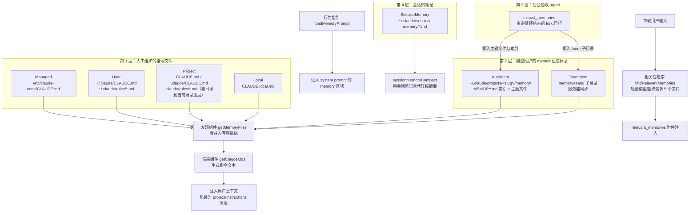
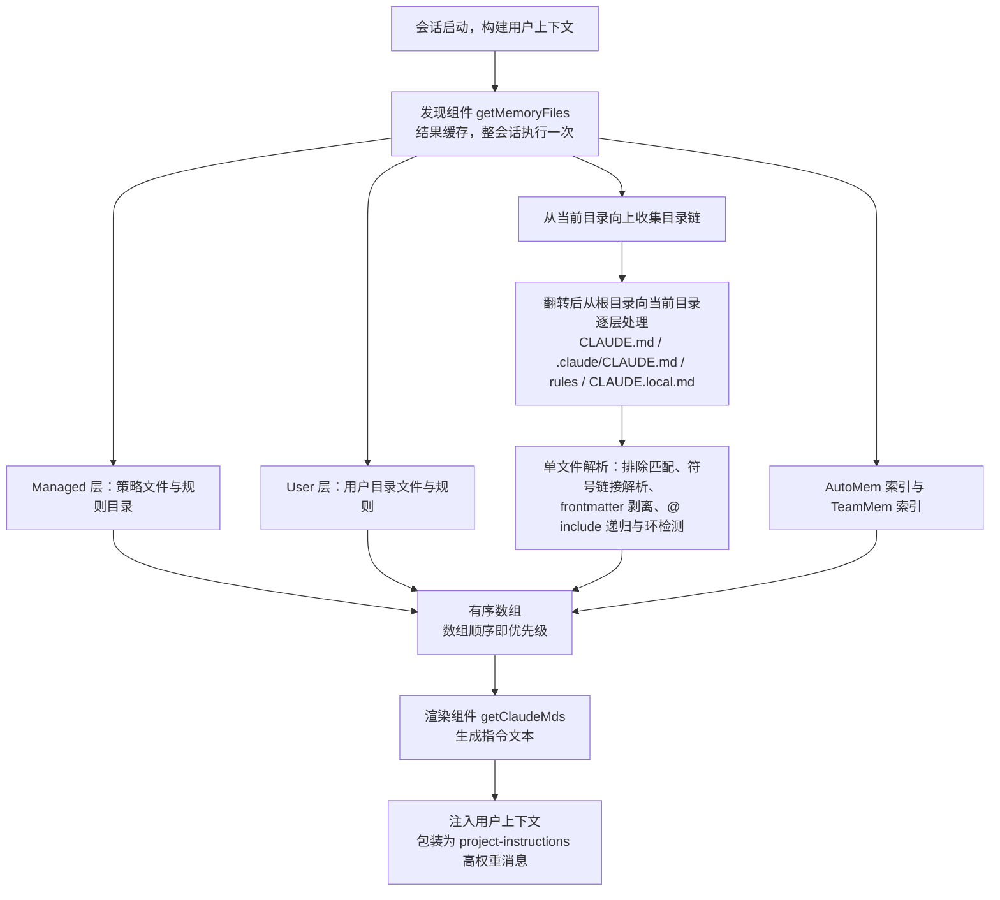
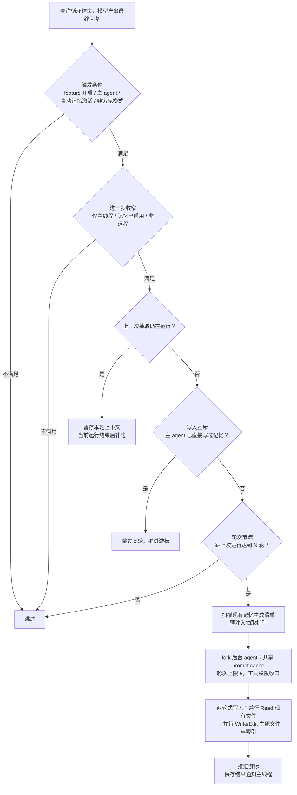
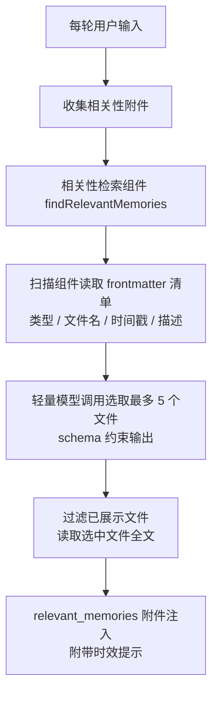

# Memory 模块：多层记忆体系

## 1 概述

Claude Code 的记忆体系由五层组成，按维护者分为两类：人工维护的指令文件（CLAUDE.md 系列）与模型维护的记忆目录（memdir）。会话启动时，指令文件与 MEMORY.md 索引经发现组件合并后进入用户上下文；记忆行为指引进入 system prompt 的 memory 区块；每轮输入时，相关性检索组件选取少量记忆以附件形式注入；查询循环结束后，后台抽取 agent 把新记忆写回记忆目录；团队记忆在会话开始时从服务器拉取，写入时增量上传。



各层的维护者、生命周期与职责边界：

| 层 | 维护者 | 生命周期 | 注入渠道 | 职责边界 |
| --- | --- | --- | --- | --- |
| CLAUDE.md 指令文件 | 人工（随代码提交或存于用户目录） | 会话启动时加载，会话内缓存 | 用户上下文（project-instructions 高权重消息） | 可评审的长期约定：编码规范、构建命令、行为准则 |
| memdir 记忆目录 | 模型（对话中写入） | 跨会话持久积累 | 会话启动注入索引；每轮注入相关主题文件 | 从当前项目状态无法推导的信息：用户喜好、反馈、项目背景 |
| extract_memories | 后台 fork agent | 每个查询循环结束运行 | 写入 memdir，经上述渠道再注入 | 兜底抽取：主 agent 没写时它写 |
| SessionMemory | 后台 fork agent | 当前会话内 | 压缩时替代传统摘要 | 会话内工作状态笔记 |
| 团队记忆 | 全体成员 + 服务器同步 | 会话开始时拉取，写入时增量上传 | 与 memdir 相同的注入渠道，额外带共享标签 | 组织内共享的项目约定与背景 |

三个注入渠道的分工：

- **用户上下文**：指令文件与 MEMORY.md 索引合并后进入每条请求前缀的高权重消息，模型把它当作必须遵守的指令。
- **system prompt 区块**：记忆行为指引（保存什么、如何保存、何时读取）以固定区块进入 system prompt，只在开关切换时变化。
- **每轮附件**：相关性检索组件每轮选取最多 5 个相关记忆文件，以附件形式注入当轮请求，随话题变化。

## 2 核心组件与职责

### 2.1 指令文件层：发现与渲染分离

发现组件 getMemoryFiles 与渲染组件 getClaudeMds 各司其职：前者负责目录遍历、读取、解析，产出有序数组；后者只做文本渲染。分离的好处是嵌套目录补加载可以复用同一渲染逻辑。

**发现组件**：整个会话只执行一次目录遍历（结果缓存）。处理顺序固定为 Managed → User → Project → Local → AutoMem → TeamMem：

- Managed：系统策略文件与对应规则目录，不依赖任何开关，始终加载。
- User：用户目录下的 CLAUDE.md 与 rules 目录，仅在用户设置启用时加载；用户级文件始终允许引用工作目录之外的文件。
- Project 与 Local：从当前目录向上收集目录链，翻转后从根目录向当前目录逐层处理；每层依次尝试 CLAUDE.md、.claude/CLAUDE.md、.claude/rules/*.md 与 CLAUDE.local.md。
- AutoMem：memdir 的 MEMORY.md 索引文件，自动记忆开启且文件存在时加载。
- TeamMem：team 子目录下的 MEMORY.md，团队记忆开启时加载。

数组顺序即优先级：先加入的条目优先级低，靠近当前目录的条目后加入、在渲染文本中位置更靠后，模型读到"更近的指令更靠后"。该设计用数据结构本身表达优先级，省掉了优先级字段与排序逻辑；新增层级只需决定插入位置。

**@include 引用**：记忆文件可以用 @path、@./relative/path、@~/home/path、@/absolute/path 四种形式引用其他文件。解析时把文件词法化为 token 树，只在文本节点中识别引用，代码块内的 @ 不会被误解析。递归深度上限 5 层，配合已处理路径集合阻断循环引用；仅允许文本扩展名，二进制文件静默跳过；引用工作目录之外的文件需要用户批准。

**渲染组件**：把数组中的每条记忆渲染成"完整路径 + 类型描述 + 内容"的片段，全部文件用空行拼接，最前面加上声明指令优先级的固定前缀（"These instructions OVERRIDE any default behavior"）。类型描述是模型区分来源可信度的关键信号：Project 标注 checked into the codebase，Local 标注 private, not checked in，团队记忆额外包一层共享标签。

**子目录就近加载与条件规则**：编辑子目录中的文件时，为该目录链单独加载 CLAUDE.md 与规则文件；规则文件可用 frontmatter 中的 paths glob 声明作用域，只对命中的文件注入。这套机制让"编辑某个子目录的文件时加载该子目录的规则"成为可能。

**代码摘录：发现组件的层级顺序骨架**

```ts
export const getMemoryFiles = memoize(
  async (forceIncludeExternal: boolean = false): Promise<MemoryFileInfo[]> => {
    const result: MemoryFileInfo[] = []
    const processedPaths = new Set<string>()
    const includeExternal =
      forceIncludeExternal ||
      config.hasClaudeMdExternalIncludesApproved ||
      false

    // Managed 层最先处理，始终加载
    const managedClaudeMd = getMemoryPath('Managed')
    result.push(
      ...(await processMemoryFile(
        managedClaudeMd,
        'Managed',
        processedPaths,
        includeExternal,
      )),
    )

    // Project 与 Local 层：从当前目录向上收集目录链
    const dirs: string[] = []
    const originalCwd = getOriginalCwd()
    let currentDir = originalCwd
    while (currentDir !== parse(currentDir).root) {
      dirs.push(currentDir)
      currentDir = dirname(currentDir)
    }
    // 翻转后从根目录向当前目录逐层处理，逐层 push 进 result
  },
)
```

要点：

- memoize 包裹整个函数：目录遍历包含大量"尝试读取不存在的文件"的调用，缓存后整个会话只支付一次遍历成本。
- result 数组是唯一产出载体，所有层级的文件都按"低优先级在前"的顺序 push；渲染组件直接按数组顺序输出，优先级由数据结构本身保证。
- processedPaths 集合贯穿所有单文件解析调用，同时承担 include 环检测与重复文件去重。
- 目录链先收集后翻转：上溯得到"近 → 远"顺序，翻转后从根目录开始加载，保证子目录文件位于父目录文件之后。

### 2.2 memdir 记忆目录

**目录结构**：模型维护的持久记忆目录，按仓库隔离（同一仓库的多个 worktree 共享一个目录，靠规范化的 git 根路径定位）。MEMORY.md 充当索引，每条一行指向主题文件；实际内容存放在以主题命名的 .md 文件中。目录解析顺序：环境变量全路径覆盖 → 设置中的目录配置（只信任 policy/local/user 三个来源，排除可被仓库控制的 projectSettings，防止恶意仓库把记忆目录指向敏感位置）→ 默认位置。

**四类记忆**：记忆限定为 user、feedback、project、reference 四类，以 frontmatter 的 type 字段声明。分类依据写在指引里：能从当前项目状态推导的内容（代码模式、架构、git 历史）不属于记忆。未知或缺失的 type 字段返回 undefined，旧文件继续可用，实现向后兼容降级。

**索引与主题文件的分工**：索引常驻上下文，必须简短——双重上限 200 行与 25KB，超限时截断并附加警告，提示把细节移到主题文件；主题文件按需读取。

**扫描组件**：列出目录中全部 .md 文件（排除索引本身），对每个文件只读前 30 行解析 frontmatter，按修改时间降序排序后截取前 200 个；随后渲染成一行一个文件的清单（类型、文件名、时间戳、描述）。该清单是相关性检索与抽取预注入的共同输入。

**相关性检索组件**：每轮输入时先用扫描组件得到头部清单，再用一次轻量模型调用从清单中选取最多 5 个"确定有用"的文件，输出走 schema 约束的字符串数组。已展示过的文件在本轮调用前就被过滤掉，让名额花在新的候选文件上。选取结果连同修改时间一起返回，供上层附加时效提示。

**年龄组件**：把原始时间戳换算成"今天 / 昨天 / N 天前"的自然语言。设计依据是模型不擅长日期运算，原始 ISO 时间戳不会触发陈旧性推理。超过一天的记忆附加警告，声明其内容只代表记录时刻的状态，引用前须对照当前代码验证。

**行为指引组件**：生成记忆行为指引文本——四类记忆的定义、不该保存什么、两段式保存步骤（先写主题文件、再在索引加一行指针）、何时读取、推荐前验证。该组件按功能组合分派：仅自动记忆时输出单目录指引；团队记忆开启时输出双目录（私有 + 团队）指引；长驻会话模式输出按日追加日志的指引。产物只含行为指引，不含记忆内容——索引内容走用户上下文注入，避免重复占位。

**代码摘录：记忆类型定义与 frontmatter 模板**

```ts
export const MEMORY_TYPES = [
  'user',
  'feedback',
  'project',
  'reference',
] as const

export type MemoryType = (typeof MEMORY_TYPES)[number]

// 解析 frontmatter 的 type 字段；未知或缺失返回 undefined，旧文件继续可用
export function parseMemoryType(raw: unknown): MemoryType | undefined {
  if (typeof raw !== 'string') return undefined
  return MEMORY_TYPES.find(t => t === raw)
}
```

```ts
// 写入 memory 文件时使用的 frontmatter 模板
export const MEMORY_FRONTMATTER_EXAMPLE: readonly string[] = [
  '```markdown',
  '---',
  'name: {{memory name}}',
  'description: {{one-line description — used to decide relevance in future conversations, so be specific}}',
  `type: {{${MEMORY_TYPES.join(', ')}}}`,
  '---',
  '',
  '{{memory content — for feedback/project types, structure as: rule/fact, then **Why:** and **How to apply:** lines}}',
  '```',
]
```

要点：

- 类型学是封闭集合：as const 加索引类型把 MemoryType 锁定为四个字符串字面量联合，任何扩展都要同时修改这个数组。
- description 字段的注释写明它的用途：未来对话中判定相关性。相关性检索只拿到文件名与描述，因此描述写得好坏直接决定检索质量。
- frontmatter 是机器扫描与模型写作之间的共用协议：扫描组件只读前 30 行解析它，模型按模板写它。协议以示例模板的形式出现在 system prompt 与抽取指引里，双方理解成本为零。
- 模板同时约束内容结构：feedback/project 类要求"规则或事实，随后附 Why 与 How to apply 行"，把"记录什么"与"怎么组织"一起教给模型。

### 2.3 自动抽取（extract_memories）

**定位**：主 agent 的指引里已有完整的保存规范，抽取组件负责兜底——主 agent 没写时它写。每个查询循环结束时，一个后台 fork agent 分析最新对话，把值得跨会话保留的信息写入记忆目录。

**触发条件链**：feature 开关开启、当前是主 agent、自动记忆模式激活、未启用穷鬼模式；进入执行后还有三层收窄：仅主线程、自动记忆已启用、非远程模式。

**节流与互斥**：闭包状态管理三项——轮次节流（每 N 个合格轮次运行一次，默认每轮）；写入互斥（检查游标之后的消息里是否已有写操作指向记忆目录，主 agent 已经写过记忆时本轮跳过并推进游标，保证主 agent 与后台 agent 每一轮互斥）；游标（只在成功运行后推进，出错时下一轮重新考虑同批消息）。

**权限收口**：抽取 agent 的工具权限被收窄到只读工具 + 记忆目录内的写入——Read/Grep/Glob 放行，Bash 只放行只读命令，Edit/Write 仅当目标位于记忆目录内。团队记忆目录是记忆目录的子目录，写入也在放行范围内。

**运行形态**：以完美 fork 方式运行——与主对话共享 system prompt 与消息前缀，命中同一份 prompt cache；轮次上限 5 轮（预期形态是两轮：一轮并行 Read、一轮并行 Write）；跳过转写，避免与主线程竞争。

**防污染三层防线**：抽取指引自带"不该保存什么"排除清单；抽取前把现有记忆清单预注入指引，agent 可以更新旧文件、无需先花一轮列目录；写入完成后把保存结果以系统消息追加给主线程。

**代码摘录：节流、清单预注入与游标推进**

```ts
// 节流：每 N 个合格轮次运行一次；补跑任务不受节流约束
if (!isTrailingRun) {
  turnsSinceLastExtraction++
  if (
    turnsSinceLastExtraction <
    (getFeatureValue_CACHED_MAY_BE_STALE('tengu_bramble_lintel', null) ?? 1)
  ) {
    return
  }
}
turnsSinceLastExtraction = 0
inProgress = true

// 清单预注入：把现有记忆清单放进抽取指引，agent 无需先花一轮列目录
const existingMemories = formatMemoryManifest(
  await scanMemoryFiles(memoryDir, createAbortController().signal),
)

// fork 运行：共享 prompt cache、轮次上限 5、跳过转写
const result = await runForkedAgent({
  promptMessages: [createUserMessage({ content: userPrompt })],
  cacheSafeParams,
  canUseTool,
  querySource: 'extract_memories',
  forkLabel: 'extract_memories',
  skipTranscript: true,
  maxTurns: 5,
})

// 游标：只在成功运行后推进，失败时下轮重新考虑同批消息
const lastMessage = messages.at(-1)
if (lastMessage?.uuid) {
  lastMemoryMessageUuid = lastMessage.uuid
}
```

要点：

- 节流计数放在一切昂贵操作之前（扫描、指引构建、fork 启动），不满足轮次条件时直接返回，零成本跳过；补跑任务是已承诺的工作，不受节流约束。
- 清单预注入复用扫描组件的产出，抽取 agent 第一轮 Read 的目标更精确，并依据清单更新旧文件。
- skipTranscript 与 maxTurns 对应两个失败模式：fork 写转写会与主线程产生竞争；硬上限防止 agent 陷入"验证某条记忆是否准确"的调查中，抽取指引本来就禁止它调查。
- 游标语义保证抽取进度不丢：只有 fork 成功完成后才推进，失败时同批消息留待下一轮。

### 2.4 团队记忆

memdir 的 team 子目录，内容按仓库共享给组织内成员。团队记忆依赖自动记忆开启，所有消费方保持一致。

**指引设计**：双目录组合指引同时给出私有与团队两个目录的路径与作用域说明；四类记忆各带作用域指引——user 恒为私有、feedback 默认私有、project 强烈倾向团队、reference 通常团队；团队侧有硬性规则：禁止在共享记忆中保存敏感数据。

**服务器同步**：按 git remote 的仓库作用域同步。会话开始时拉取（服务器内容按键覆盖本地）；写入时增量上传（只上传哈希与服务器校验和不同的条目，服务器按 upsert 合并）；文件删除不传播。单文件与单批请求体都有字节上限，超过时分成多个顺序上传。

**目录监听**：启动时先拉取一次，随后监听团队目录变化，2 秒防抖后推送。永久性失败（无认证、无仓库、客户端错误）会抑制重试，防止无限推送循环。

**路径安全校验**：拒绝空字节、URL 编码穿越、Unicode 归一化攻击（全角字符在归一化后变成 ../）、反斜杠与绝对路径；写入前做双层包含性校验——先做字符串级路径解析检查，再解析最深已存在祖先的符号链接后与真实团队目录对照，封住符号链接逃逸。校验集中在路径解析层，业务代码拿到的是已验证的路径。

### 2.5 SessionMemory 与压缩边界

**会话内笔记**：模板划分 Current State、Task specification、Files and Functions、Workflow、Errors & Corrections、Learnings、Key results、Worklog 等区块，由后台 fork agent 按阈值维护——上下文达到 10 000 tokens 才初始化，之后每增长 5 000 tokens 或每 3 次工具调用考虑更新。

**与 memdir 的分工**：memdir 面向未来对话（跨会话），SessionMemory 面向当前会话的压缩连续性；指引中明确写给模型：计划、任务、记忆各有用途，只对当前会话有用的信息不应进记忆。

**压缩替代路径**：上下文需要压缩时，可以用会话笔记替代传统压缩摘要——等待进行中的笔记更新完成，读取笔记内容；笔记仍是空模板时回退到传统压缩；否则从上次摘要点之后保留消息（下限 10 000 tokens 或 5 条文本消息，上限 40 000 tokens），把截断后的笔记当作压缩摘要。

## 3 关键流程

### 3.1 CLAUDE.md 发现与合并



分步讲解：

1. **入口**：构建用户上下文时调用发现组件，结果被缓存，整个会话只完整执行一次目录遍历；手动编辑记忆后可主动失效缓存。
2. **Managed 层**：系统策略文件与对应规则目录，不依赖任何开关。
3. **User 层**：用户设置启用时加载，始终允许引用工作目录之外的文件。
4. **目录链构建**：从当前目录逐级上溯到根，翻转后得到"根 → 当前目录"顺序。
5. **逐层加载**：每层依次尝试四种文件形态，靠近当前目录的文件后入数组，优先级更高。
6. **单文件解析**：排除匹配、符号链接解析、读取、frontmatter 剥离、HTML 注释剥离、include 递归与环检测。
7. **记忆目录入口**：MEMORY.md 索引与团队索引作为最后两类条目追加。
8. **渲染**：每条内容拼成"路径 + 类型描述 + 内容"片段，整体加指令优先级前缀。
9. **注入**：合并文本包装成高权重用户消息，与带"可能不相关"声明的背景信息分开，保持指令权重。

### 3.2 自动抽取



分步讲解：

1. **触发**：查询循环收尾阶段检查开关链，满足后异步启动，不阻塞主线程；管道模式在退出前等待排空。
2. **收窄**：排除子代理、记忆关闭、远程模式三种情况。
3. **并发控制**：运行期间的新请求暂存为补跑任务；轮次节流控制运行频率。
4. **互斥判定**：检查主 agent 是否已直接写过记忆文件，写过则跳过，保证每一轮只有一个写入方。
5. **清单预注入**：复用扫描组件把现有记忆清单放进抽取指引，agent 依据它决定更新哪个旧文件，省去先列目录的一轮。
6. **fork 运行**：与主对话共享 prompt cache，工具权限收口到只读 + 记忆目录内写入。
7. **保存**：写主题文件与索引（每个主题一个文件，索引每行一条指针）。
8. **反馈**：把保存的文件列表以系统消息追加给主线程。
9. **游标推进**：仅成功运行后推进，失败时下轮重新考虑同批消息。

### 3.3 每轮读取注入



分步讲解：

1. **触发**：每轮用户输入进入查询循环前，触发相关性附件收集。
2. **紧凑清单**：相关性检索组件先扫描得到"文件名 + 描述"的清单，输入成本远低于全文。
3. **选取**：用一次轻量模型调用从清单中选取最多 5 个"确定有用"的文件，输出受 schema 约束；不确定的文件不选取。
4. **去重**：已展示文件在调用前过滤，同一文件不跨轮重复注入。
5. **注入**：读取选中文件全文，连同修改时间换算的时效提示一起以附件形式注入当轮请求。

## 4 设计思想

### 4.1 人工维护与自动抽取的分工

CLAUDE.md 由人维护、随代码提交、可评审；memdir 由模型维护、跨会话积累。两者的边界由"不该保存什么"排除清单明文划定：能从代码推导的、git 历史能查的、CLAUDE.md 已写的、当前会话临时的内容都不进 memdir。自动抽取的时机控制也体现同一思路：只在查询循环结束时运行、每轮节流、主 agent 已写则跳过、fork 轮次硬上限 5 轮，把自动行为的成本与失控面都压到最低。可迁移思想：给自动持久化配齐"白名单类型 + 黑名单内容 + 时机节流"三重约束。

### 4.2 就近加载的层级设计

发现组件用数组顺序表达优先级：根目录文件先入数组，当前目录文件后入数组，渲染组件按序输出，模型读到"更近的指令更靠后"。该设计省掉了显式的优先级字段与排序逻辑，任何新增层级只需决定自己在数组中的插入位置。子目录级加载则把"就近"推到文件粒度：编辑某个子目录的文件时，只注入该子目录链上匹配 glob 的规则。可迁移思想：上下文分层系统可以用"有序数组 + 约定插入位置"表达优先级，用 glob 条件注入表达作用域，避免维护复杂的优先级配置。

### 4.3 用文件系统当数据库

memdir 没有数据库、没有索引服务：MEMORY.md 是索引（每行一条指向主题文件的指针），主题文件是记录，frontmatter 是 schema（name/description/type），扫描组件只读前 30 行完成检索前置扫描，相关性检索用一次轻量模型调用完成相关性排序。用户可以用编辑器直接查看与修改记忆，团队记忆直接监听目录变化推送。索引的治理靠硬上限：200 行、25KB、每行约 150 字符，超限截断并提示把细节移到主题文件。可迁移思想：当记录规模在数百以内、读写频率低时，Markdown 文件 + frontmatter + 单文件索引更透明、更易调试，把"模型可读、用户可读、工具可扫描"统一到同一种格式上。

### 4.4 相关性子集检索控制 token

记忆总量不可控，注入量必须可控，为此有三层裁剪：索引本身被行数与字节上限截断；相关性检索只注入最多 5 个文件，选取基于"文件名 + 描述"的紧凑清单，输入成本远低于全文；已展示集合保证同一文件不跨轮重复注入。选取器对"确定有用"的严格要求说明宁缺毋滥。年龄信息随修改时间传递，消费端给陈旧记忆附加"时间点观察"提示，声明其内容只代表记录时刻的状态。可迁移思想：长尾记忆系统的注入策略可以概括为"索引常驻 + 子集按需 + 去重 + 时效标注"，检索用一次廉价模型调用完成，全文读取只发生在被选中的少数文件上。

### 4.5 fork agent 共享 prompt cache 的时机控制

自动抽取与会话笔记都使用 fork agent：完整 fork 主对话、共享 system prompt 与消息前缀，从而命中同一份 prompt cache。这份共享带来一组配套约束：fork 的工具列表必须与主对话一致，安全靠权限函数在运行时收口；抽取只处理"最近 N 条消息"的增量（游标机制），fork 的内容面始终有界；跳过转写与退出排空处理生命周期边界。可迁移思想：后台子任务复用主任务上下文缓存能显著降低成本，但需要配齐"增量游标 + 权限收口 + 轮次上限 + 退出排空"四件套。

### 4.6 安全护栏内置于路径层

记忆目录涉及自动写入，路径校验是安全边界：路径解析阶段拒绝相对路径、根目录、Windows 盘符根、UNC 路径与空字节；目录设置只信任 policy/local/user 三个来源，排除可被仓库控制的 projectSettings；团队记忆拒绝 URL 编码、Unicode 归一化与符号链接逃逸；CLAUDE.md 的外部 include 默认关闭、需用户批准。这些校验全部集中在路径解析层，业务代码拿到的是已验证的路径。可迁移思想：对"agent 可写目录"的自动持久化系统，把路径校验前置为独立模块（解析 → 白名单匹配 → 真实路径对照），业务层只消费校验结果，安全成本与业务逻辑解耦。
