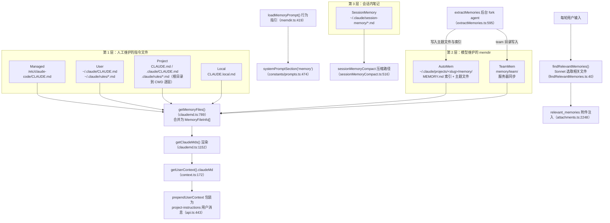
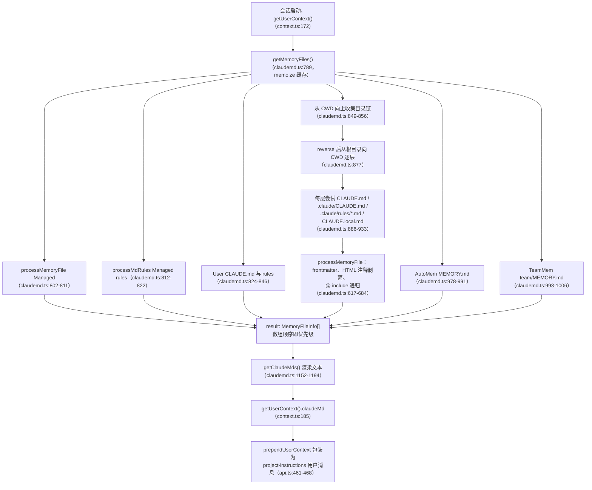
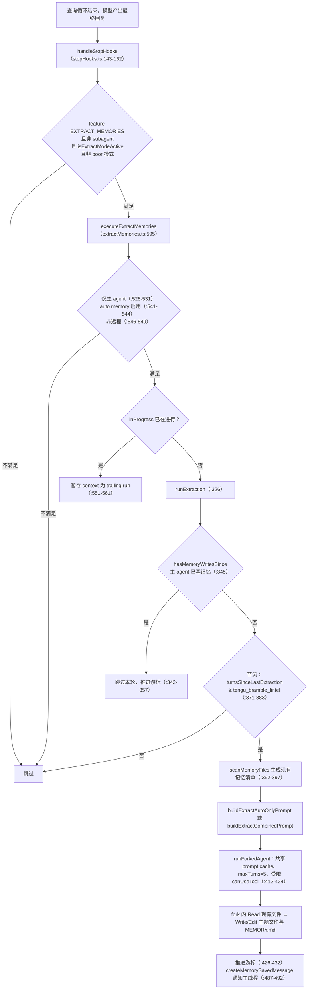
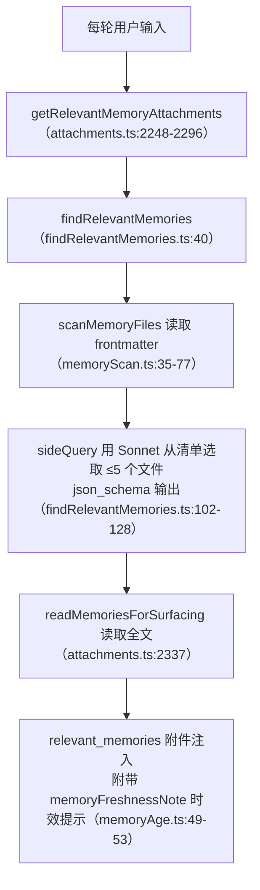

# Memory 模块：多层记忆体系

## 1 模块概览

Claude Code 的记忆体系由人工维护的指令文件（CLAUDE.md 系列）、模型维护的会话记忆目录（memdir）、每轮后台运行的自动记忆抽取（extract_memories）、会话内笔记（SessionMemory）以及服务器同步的团队记忆（Team Memory）五层组成：指令文件与 MEMORY.md 索引在会话启动时经 `getMemoryFiles()` 合并进 user context，memdir 行为指引经 `loadMemoryPrompt()` 进入 system prompt 的 `memory` 区块，相关性记忆经 `findRelevantMemories()` 以附件形式每轮注入，抽取 agent 在每个查询循环结束后把新记忆写回 memdir。



### 涉及文件清单

| 文件路径 | 职责 | 关键导出 |
| --- | --- | --- |
| `src/utils/claudemd.ts` | CLAUDE.md 多层发现、`@` include 解析、合并与渲染 | `getMemoryFiles`、`getClaudeMds`、`processMemoryFile`、`processMdRules`、`getMemoryFilesForNestedDirectory`、`processConditionedMdRules` |
| `src/context.ts` | 构建 user context，产出 `claudeMd` 字段 | `getUserContext`、`getSystemContext` |
| `src/utils/api.ts` | 把 `claudeMd` 包装为高权重 `<project-instructions>` 用户消息 | `prependUserContext` |
| `src/utils/memoryFileDetection.ts` | 路径级记忆文件识别（memdir、agent memory、session memory、shell 命令意图） | `isAutoManagedMemoryFile`、`isMemoryDirectory`、`memoryScopeForPath`、`detectSessionFileType`、`isShellCommandTargetingMemory` |
| `src/memdir/memdir.ts` | 记忆行为指引 prompt 构建与 MEMORY.md 截断 | `buildMemoryLines`、`buildMemoryPrompt`、`loadMemoryPrompt`、`truncateEntrypointContent`、`ENTRYPOINT_NAME` |
| `src/memdir/memoryTypes.ts` | 四类记忆分类（user/feedback/project/reference）与共享 prompt 区块 | `MEMORY_TYPES`、`parseMemoryType`、`TYPES_SECTION_*`、`WHAT_NOT_TO_SAVE_SECTION`、`MEMORY_FRONTMATTER_EXAMPLE` |
| `src/memdir/paths.ts` | 记忆目录路径解析与功能开关 | `getAutoMemPath`、`getAutoMemEntrypoint`、`isAutoMemoryEnabled`、`isExtractModeActive`、`isAutoMemPath` |
| `src/memdir/memoryScan.ts` | 记忆目录扫描与 frontmatter 清单 | `scanMemoryFiles`、`formatMemoryManifest`、`MemoryHeader` |
| `src/memdir/memoryAge.ts` | 记忆年龄计算与陈旧提示 | `memoryAge`、`memoryAgeDays`、`memoryFreshnessText`、`memoryFreshnessNote` |
| `src/memdir/findRelevantMemories.ts` | 用 Sonnet 选取相关记忆文件（最多 5 个） | `findRelevantMemories`、`RelevantMemory` |
| `src/memdir/teamMemPaths.ts` | 团队记忆路径与防穿越校验 | `getTeamMemPath`、`getTeamMemEntrypoint`、`isTeamMemoryEnabled`、`validateTeamMemWritePath`、`validateTeamMemKey` |
| `src/memdir/teamMemPrompts.ts` | 双目录（private + team）组合 prompt | `buildCombinedMemoryPrompt` |
| `src/services/extractMemories/extractMemories.ts` | 查询循环结束后的后台记忆抽取 | `initExtractMemories`、`executeExtractMemories`、`createAutoMemCanUseTool`、`drainPendingExtraction` |
| `src/services/extractMemories/prompts.ts` | 抽取 agent 的 prompt 模板 | `buildExtractAutoOnlyPrompt`、`buildExtractCombinedPrompt` |
| `src/services/SessionMemory/sessionMemory.ts` | 会话笔记后台维护与触发判定 | `initSessionMemory`、`shouldExtractMemory`、`manuallyExtractSessionMemory`、`createMemoryFileCanUseTool` |
| `src/services/SessionMemory/prompts.ts` | 会话笔记模板与更新 prompt | `DEFAULT_SESSION_MEMORY_TEMPLATE`、`loadSessionMemoryTemplate`、`buildSessionMemoryUpdatePrompt` |
| `src/services/SessionMemory/sessionMemoryUtils.ts` | 会话记忆阈值配置与状态 | `SessionMemoryConfig`、`hasMetInitializationThreshold`、`hasMetUpdateThreshold`、`waitForSessionMemoryExtraction` |
| `src/services/compact/sessionMemoryCompact.ts` | 用会话笔记替代传统压缩的路径 | `trySessionMemoryCompaction`、`shouldUseSessionMemoryCompaction`、`calculateMessagesToKeepIndex` |
| `src/utils/teamMemoryOps.ts` | 团队记忆工具调用归类与状态文案 | `isTeamMemoryWriteOrEdit`、`isTeamMemorySearch`、`appendTeamMemorySummaryParts` |
| `src/services/teamMemorySync/index.ts` | 团队记忆服务器同步（GET 拉取 / PUT 增量上传） | `pullTeamMemory`、`pushTeamMemory`、`SyncState` |
| `src/services/teamMemorySync/watcher.ts` | 团队记忆目录监听与防抖推送 | `startTeamMemorySync`、`startFileWatcher` |
| `src/commands/memory/memory.tsx` | `/memory` 命令入口（记忆文件选择与编辑） | `call` |

## 2 核心概念

### 2.1 CLAUDE.md 文件记忆

**概念定义**：人工维护的 Markdown 指令文件，按 `Managed`、`User`、`Project`、`Local` 四类分层，在会话启动时被发现、解析、合并为一个有序数组，最终渲染成 user context 中的指令文本。

**设计动机**：代码仓库里的约定必须可评审、可随代码提交（checked into the codebase）、跨会话恒定。`claudemd.ts` 头部注释（`src/utils/claudemd.ts:1-26`）写明加载顺序与优先级语义："Files are loaded in reverse order of priority, i.e. the latest files are highest priority"，以及 "Files closer to the current directory have higher priority (loaded later)"。

**层级发现**：`getMemoryFiles()`（`src/utils/claudemd.ts:789-1074`）按固定顺序处理：

1. `Managed`（`src/utils/claudemd.ts:802-822`）：`getMemoryPath('Managed')` 指向系统级文件，始终加载。
2. `User`（`src/utils/claudemd.ts:824-846`）：`getMemoryPath('User')` 指向 `~/.claude/CLAUDE.md`，仅在 `userSettings` 启用时加载；`includeExternal` 恒为 `true`（`:832`），用户级文件可以自由 include 外部文件。
3. `Project` 与 `Local`（`src/utils/claudemd.ts:848-933`）：从 CWD 向上收集目录链（`:849-856`），`reverse()` 后从根目录向 CWD 逐层处理（`:877`），每层依次尝试 `CLAUDE.md`、`.claude/CLAUDE.md`、`.claude/rules/*.md`（`:886-919`）以及 `CLAUDE.local.md`（`:921-932`）。
4. `AutoMem`（`src/utils/claudemd.ts:978-991`）：memdir 的 `MEMORY.md` 入口文件，`isAutoMemoryEnabled()` 打开且文件存在时加载。
5. `TeamMem`（`src/utils/claudemd.ts:993-1006`）：`team/MEMORY.md`，`feature('TEAMMEM')` 打开且团队记忆启用时加载。

**子目录就近加载**：`getMemoryFilesForNestedDirectory()`（`src/utils/claudemd.ts:1248-1317`）为 CWD 与目标文件之间的某个目录单独加载 `CLAUDE.md`、`.claude/CLAUDE.md`、无条件 rules 与条件 rules；条件 rules 通过 frontmatter 的 `paths` glob 与目标文件匹配（`processConditionedMdRules`，`src/utils/claudemd.ts:1353-1396`），不匹配的文件不注入。这套机制让"编辑 `src/a/b.ts` 时加载 `src/a/.claude/rules/` 下的规则"成为可能。

**import 语法**：头部注释（`src/utils/claudemd.ts:18-25`）定义了 `@path`、`@./relative/path`、`@~/home/path`、`@/absolute/path` 四种形式。实现位于 `extractIncludePathsFromTokens()`（`src/utils/claudemd.ts:450-534`）：

- 用 `marked` 的 `Lexer` 把文件词法化为 token 树，只处理 `text` 节点（`:516-518`），跳过 `code` 与 `codespan`（`:495-497`），保证代码块里的 `@` 引用不会被误解析；
- 递归深度上限 `MAX_INCLUDE_DEPTH = 5`（`src/utils/claudemd.ts:536`），`processMemoryFile` 同时用 `processedPaths` 集合防循环引用（`:628-631`）；
- 仅允许文本扩展名（`TEXT_FILE_EXTENSIONS`，`src/utils/claudemd.ts:95-226`），二进制文件被静默跳过（`:348-353`）；
- 工作目录之外的 include 需要用户在配置中批准：`includeExternal = forceIncludeExternal || config.hasClaudeMdExternalIncludesApproved`（`:797-800`），未批准时 `processMemoryFile` 跳过外部文件（`:665-669`）。

**优先级**：`result` 数组的顺序就是优先级顺序——后加入的条目更靠近 CWD、在 `getClaudeMds()` 输出中位置更靠后。`getClaudeMds()`（`src/utils/claudemd.ts:1152-1194`）按类型附加不同的括号描述，例如 Project 是 "(project instructions, checked into the codebase)"、Local 是 "(user's private project instructions, not checked in)"（`:1167-1176`）。

**上限与例外**：单个文件超过 `MAX_MEMORY_CHARACTER_COUNT = 40000` 字符会进入 `getLargeMemoryFiles()` 的告警路径（`src/utils/claudemd.ts:91`、`:1131-1133`）；`claudeMdExcludes` 设置可用 picomatch 排除 User/Project/Local 文件（`:546-572`）。

### 2.2 memdir 会话记忆目录

**概念定义**：模型自己维护的持久记忆目录 `~/.claude/projects/<sanitized-git-root>/memory/`，`MEMORY.md` 充当索引，实际内容存放在以主题命名的 `.md` 文件中。与 CLAUDE.md 的区别在于维护者：CLAUDE.md 由人写，memdir 由模型在对话中写。

**路径结构**：`getAutoMemPath()`（`src/memdir/paths.ts:223-235`）的解析顺序是：

1. `CLAUDE_COWORK_MEMORY_PATH_OVERRIDE` 环境变量（Cowork/SDK 的全路径覆盖）；
2. `settings.json` 的 `autoMemoryDirectory`（仅 policy/local/user 三个可信来源，排除 projectSettings，防止恶意仓库把记忆目录指向 `~/.ssh`，见 `getAutoMemPathSetting` 注释 `src/memdir/paths.ts:172-186`）；
3. 默认 `<memoryBase>/projects/<sanitized-git-root>/memory/`，其中 `getAutoMemBase()` 使用 canonical git root，让同一仓库的多个 worktree 共享一个记忆目录（`src/memdir/paths.ts:203-205`）。

`isAutoMemoryEnabled()`（`src/memdir/paths.ts:30-55`）的判定链：`CLAUDE_CODE_DISABLE_AUTO_MEMORY` 环境变量 → `--bare` 模式 → 远程模式无记忆目录 → `settings.json` 的 `autoMemoryEnabled` → 默认开启。

**条目类型**：`MEMORY_TYPES`（`src/memdir/memoryTypes.ts:14-21`）把记忆限定为 `user`、`feedback`、`project`、`reference` 四类，文件头部注释（`:1-12`）给出分类依据：能从当前项目状态推导的内容（代码模式、架构、git 历史）不属于记忆。`parseMemoryType()`（`:28-31`）对未知或缺失的 `type:` 字段返回 `undefined`，旧文件继续可用。

**扫描**：`scanMemoryFiles()`（`src/memdir/memoryScan.ts:35-77`）用 `readdir(recursive)` 列出全部 `.md` 文件（排除 `MEMORY.md` 本身），对每个文件只读前 `FRONTMATTER_MAX_LINES = 30` 行解析 frontmatter（`:22`、`:48-55`），按 mtime 降序排序后截取前 `MAX_MEMORY_FILES = 200` 个（`:21`、`:72-73`）。`formatMemoryManifest()`（`:84-94`）把头部列表渲染成一行一个文件的清单：`- [type] filename (timestamp): description`。

**相关性检索**：`findRelevantMemories()`（`src/memdir/findRelevantMemories.ts:40-78`）先扫描得到头部清单，再调用 `selectRelevantMemories()`（`:80-147`）用 `sideQuery` 请求 Sonnet 从清单中选取最多 5 个"确定有用"的文件（选取 prompt 见 `:19-25`），输出走 `json_schema` 约束的 `selected_memories` 数组（`:113-123`）。`alreadySurfaced` 集合在调用前过滤掉前几轮已经展示过的文件（`:48-50`），让 5 个名额花在新的候选文件上。选取结果连同 mtime 一起返回（`:77`），供上层附加时效提示。

**年龄处理**：`memoryAge.ts` 的核心判断是"模型不擅长日期运算"——原始 ISO 时间戳不会触发陈旧性推理，"47 days ago" 才会（`src/memdir/memoryAge.ts:10-14`）。`memoryAge()`（`:15-20`）输出 `today` / `yesterday` / `N days ago`；`memoryFreshnessText()`（`:33-42`）对超过 1 天的记忆附加警告："Memories are point-in-time observations, not live state — claims about code behavior or file:line citations may be outdated. Verify against current code before asserting as fact."；`memoryFreshnessNote()`（`:49-53`）把它包进 `<system-reminder>` 供无包装的调用方（如 FileReadTool 输出）使用。

**MEMORY.md 截断**：`truncateEntrypointContent()`（`src/memdir/memdir.ts:57-103`）执行双重上限：先按 `MAX_ENTRYPOINT_LINES = 200` 行截断（`:34`），再按 `MAX_ENTRYPOINT_BYTES = 25_000` 字节在最近换行处截断（`:38`、`:82-85`），并附加一段说明哪个上限触发的警告文本（`:94-97`）。

### 2.3 自动记忆抽取（extract_memories）

**概念定义**：每个查询循环结束时，一个 fork 出来的后台 agent 分析最新对话内容，把值得跨会话保留的信息写入 memdir。主 agent 的 system prompt 里本来就有完整的保存指引，抽取 agent 负责兜底——主 agent 没写时它写。

**触发时机**：`src/services/extractMemories/extractMemories.ts` 头部注释（`:1-14`）写明：在模型产出无工具调用的最终回复时，经 `handleStopHooks` 触发。实际触发代码在 `src/query/stopHooks.ts:143-162`，条件链为：

- `feature('EXTRACT_MEMORIES')` 打开；
- 非 subagent（`!toolUseContext.agentId`）；
- `isExtractModeActive()`（`src/memdir/paths.ts:69-77`）通过 GrowthBook gate 判定；
- 未启用穷鬼模式（`!poorMode`）。

进入 `executeExtractMemories()`（`src/services/extractMemories/extractMemories.ts:595-600`）后还有三层收窄：仅主 agent（`:528-531`）、`isAutoMemoryEnabled()`（`:541-544`）、非远程模式（`:546-549`）。若上一次抽取仍在运行，本次 context 被暂存为 trailing run，等当前运行结束后补跑一次（`:551-561`）。

**节流与互斥**：`runExtraction()` 内部用闭包状态管理：

- `turnsSinceLastExtraction` 计数，每 `tengu_bramble_lintel`（默认 1）个合格轮次才运行一次（`:371-383`）；
- `hasMemoryWritesSince()`（`:120-147`）检查游标之后的消息里是否已有 Write/Edit 指向记忆目录——主 agent 已经写过记忆时，本轮直接跳过并推进游标，主 agent 与后台 agent 在每一轮互斥（`:342-357`）；
- 游标 `lastMemoryMessageUuid` 只在成功运行后推进（`:426-432`），出错时下一轮重新考虑这些消息。

**prompt 设计**：`prompts.ts` 的 `opener()`（`src/services/extractMemories/prompts.ts:29-44`）给抽取 agent 设定边界：

- 工具白名单：`Read`、`Grep`、`Glob`、只读 `Bash`、以及记忆目录内的 `Edit`/`Write`，其余一律拒绝；
- 轮次策略：第一轮并行发出所有 `Read`，第二轮并行发出所有 `Write`/`Edit`，不允许读写交错（`Edit` 要求先 `Read` 同一文件）；
- 内容边界："You MUST only use content from the last ~N messages"，禁止 grep 源码、禁止读代码验证模式、禁止 git 命令（`:41`）。

**写入位置与权限**：`createAutoMemCanUseTool()`（`src/services/extractMemories/extractMemories.ts:170-221`）实现工具级收口：`Read`/`Grep`/`Glob` 放行，`Bash` 只放行 `isReadOnly` 命令，`Edit`/`Write` 仅当 `file_path` 位于 `isAutoMemPath()` 内。`TEAMMEM` 打开时 team 目录是 auto 目录的子目录，因此团队记忆写入也在此放行范围内。

**运行机制**：`runForkedAgent`（`:412-424`）以完美 fork 的方式运行——与主对话共享 system prompt 与消息前缀，命中同一份 prompt cache（头部注释 `:8-9`）；`maxTurns: 5` 限制轮次上限防止验证黑洞，`skipTranscript: true` 避免与主线程竞争转写。

**如何避免污染**：三层防线——抽取 prompt 自带 `WHAT_NOT_TO_SAVE_SECTION` 排除清单（可推导内容、git 历史、调试配方、临时状态）；抽取前预注入现有记忆清单 `formatMemoryManifest(await scanMemoryFiles(...))`，避免 agent 先花一轮 `ls` 且能更新旧文件而避免重复创建（`:392-397`）；写入完成后用 `createMemorySavedMessage()` 把保存结果作为 system 消息追加给主线程（`:487-492`）。

### 2.4 记忆与提示词的关系

**文件记忆进入 user context**：`getUserContext()`（`src/context.ts:155-189`）在 `:172` 调用 `getClaudeMds(filterInjectedMemoryFiles(await getMemoryFiles()))`，结果作为 `claudeMd` 字段返回。`filterInjectedMemoryFiles()`（`src/utils/claudemd.ts:1141-1150`）在 `tengu_moth_copse` gate 打开时把 `AutoMem`/`TeamMem` 从注入中过滤掉——此时相关性记忆改由 `findRelevantMemories` 附件提供，MEMORY.md 索引不再重复占位。

**包装为高权重消息**：`prependUserContext()`（`src/utils/api.ts:443-485`）把 `claudeMd` 从通用 context 中分离出来，单独包装成 `<project-instructions>` 用户消息（`:461-468`）；注释（`:455-457`）说明原因：指令如果埋在 `<system-reminder>` 里会带上 "may or may not be relevant" 的声明，削弱指令权重。其余 context（git status 等）才进 `<system-reminder>`（`:470-482`）。

**memdir 行为指引进入 system prompt**：`src/constants/prompts.ts:474` 注册 `systemPromptSection('memory', () => loadMemoryPrompt())`。`loadMemoryPrompt()`（`src/memdir/memdir.ts:419-507`）按功能组合分派：

- KAIROS 日志模式（`:432-438`）：返回 `buildAssistantDailyLogPrompt()`（`:327-370`），新记忆追加到 `logs/YYYY/MM/YYYY-MM-DD.md`，MEMORY.md 由夜间 `/dream` 进程维护；
- 团队记忆启用（`:448-473`）：先 `ensureMemoryDirExists(teamDir)`（team 目录是 auto 目录的子目录，递归 mkdir 同时创建了 auto 目录），再返回 `buildCombinedMemoryPrompt()`；
- 仅 auto（`:475-490`）：`buildMemoryLines('auto memory', autoDir, ...)`；
- 全部关闭（`:492-506`）：记录 `tengu_memdir_disabled` 遥测并返回 `null`。

注意 `loadMemoryPrompt` 的产物只含行为指引，不含 MEMORY.md 内容——`buildMemoryLines` 的注释（`src/memdir/memdir.ts:196-197`）写明 "content injected via user context instead"，MEMORY.md 内容经 `getMemoryFiles()` 走 user context 注入；`buildMemoryPrompt()`（`:272-316`）才是"含内容"的版本，供没有 `getClaudeMds()` 等价物的 agent memory 使用。

**SDK 自定义 prompt 的补偿**：`QueryEngine.ts:320-335` 中，当调用方提供了自定义 system prompt 且设置了 `CLAUDE_COWORK_MEMORY_PATH_OVERRIDE` 时，显式调用 `loadMemoryPrompt()` 注入记忆机制指引（`memoryMechanicsPrompt`），保证自定义 prompt 场景下模型仍然知道如何读写记忆目录。

**相关性记忆进入附件**：`getRelevantMemoryAttachments()`（`src/utils/attachments.ts:2248-2296`）在每轮输入时调用 `findRelevantMemories()`，最多取 5 个文件（`:2288`），经 `readMemoriesForSurfacing()` 读取全文（`:2337`）后作为 `relevant_memories` 类型附件注入（`:2295`）；`collectSurfacedMemories()`（`:2305-2324`）扫描历史附件得到已展示路径集合，用于跨轮去重。

### 2.5 团队记忆

**概念定义**：memdir 的 `team/` 子目录，内容按仓库共享给组织内所有成员，会话开始时从服务器同步，写入时增量上传。

**路径与开关**：`getTeamMemPath()`（`src/memdir/teamMemPaths.ts:84-86`）定义为 `join(getAutoMemPath(), 'team')`；`isTeamMemoryEnabled()`（`:73-78`）先要求 `isAutoMemoryEnabled()`，再查 GrowthBook gate `tengu_herring_clock`——团队记忆依赖 auto 记忆，因此所有团队记忆消费方（prompt、内容注入、同步 watcher、文件检测）保持一致。

**prompt 设计**：`buildCombinedMemoryPrompt()`（`src/memdir/teamMemPrompts.ts:22-100`）同时给出两个目录的路径与 `## Memory scope` 说明（`:69-78`）：private 记忆只对当前用户，team 记忆"synced at the beginning of every session"。四类记忆各带 `<scope>` 指引（`TYPES_SECTION_COMBINED`，`src/memdir/memoryTypes.ts:37-65`）：user 恒为 private、feedback 默认 private、project 强烈倾向 team、reference 通常 team。团队侧追加一条硬性规则："You MUST avoid saving sensitive data within shared team memories"（`src/memdir/teamMemPrompts.ts:78`）。

**上下文注入**：`getClaudeMds()` 对 `TeamMem` 类型使用专用包装 `<team-memory-content source="shared">`（`src/utils/claudemd.ts:1179-1182`），与普通指令文本区分。

**服务器同步**：`src/services/teamMemorySync/index.ts` 头部注释（`:1-25`）定义 API 语义：按 git remote 的 repo 作用域，`GET` 拉取（服务器内容按 key 覆盖本地）、`PUT` 增量上传（只上传 sha256 哈希与服务器校验和不同的条目，服务器 upsert 合并）、文件删除不传播。单文件上限 `MAX_FILE_SIZE_BYTES = 250_000`（`:75`），单批请求体上限 `MAX_PUT_BODY_BYTES = 200_000`（`:89`）——超过时分成多个顺序 PUT，依赖服务器 upsert 语义保证安全。

**文件监听**：`src/services/teamMemorySync/watcher.ts` 在启动时先 `pullTeamMemory()`，然后 `fs.watch(recursive)` 监听 team 目录，2 秒防抖后推送（`DEBOUNCE_MS = 2000`，`:35`；`:167-229`）。选择 `fs.watch` 而弃用 chokidar 的原因写在注释里（`:150-166`）：chokidar 4+ 弃用 fsevents，Bun 的 kqueue 回退需要每个文件一个 fd。永久性失败（无 OAuth、无 repo、4xx）会抑制重试，防止无限推送循环（`:53-73`）。

**安全校验**：`sanitizePathKey()`（`src/memdir/teamMemPaths.ts:22-64`）拒绝 null byte、URL 编码穿越（`%2e%2e%2f`）、Unicode 归一化攻击（全角 `．．／` 在 NFKC 下变成 `../`）、反斜杠与绝对路径；`validateTeamMemWritePath()`（`:228-256`）与 `validateTeamMemKey()`（`:265-284`）做双层包含性校验——先 `path.resolve()` 做字符串级检查，再 `realpathDeepestExisting()`（`:109-171`）解析最深已存在祖先的符号链接，对照真实 team 目录判定，封住 symlink 逃逸。

### 2.6 记忆与 compaction 的边界

**SessionMemory 是会话内笔记**：模板 `DEFAULT_SESSION_MEMORY_TEMPLATE`（`src/services/SessionMemory/prompts.ts:13-43`）划分 `Current State`、`Task specification`、`Files and Functions`、`Workflow`、`Errors & Corrections`、`Learnings`、`Key results`、`Worklog` 等区块，文件位于 `~/.claude/session-memory/`。维护方式是后台 fork agent 更新笔记（`extractSessionMemory`，`src/services/SessionMemory/sessionMemory.ts:273-357`），阈值由 `DEFAULT_SESSION_MEMORY_CONFIG`（`src/services/SessionMemory/sessionMemoryUtils.ts:32-36`）控制：上下文达到 10 000 tokens 才初始化、之后每增长 5 000 tokens 或每 3 次工具调用考虑更新。`shouldExtractMemory()`（`src/services/SessionMemory/sessionMemory.ts:135-182`）要求 token 阈值必须满足，工具调用阈值或"上一轮无工具调用"二者满足其一。

**与 memdir 的分工**：memdir 的 `MEMORY.md` 面向未来对话（跨会话），SessionMemory 面向当前会话的压缩连续性；`buildMemoryLines` 里的 "Memory and other forms of persistence" 区块（`src/memdir/memdir.ts:254-257`）直接写给模型：计划（plan）、任务（tasks）、记忆（memory）各有用途，只对当前会话有用的信息不应进记忆。

**sessionMemoryCompact 路径**：`shouldUseSessionMemoryCompaction()`（`src/services/compact/sessionMemoryCompact.ts:405-434`）要求 `tengu_session_memory` 与 `tengu_sm_compact` 两个 gate 同时打开（可用环境变量覆盖）。`trySessionMemoryCompaction()`（`:516-632`）在需要压缩时用会话笔记替代传统压缩摘要：等待进行中的抽取完成（`:529`），读取笔记内容，若笔记仍是空模板则回退到传统压缩（`:540-545`），否则从 `lastSummarizedMessageId` 之后保留消息（`calculateMessagesToKeepIndex`，`:326-399`，下限 10 000 tokens / 5 条文本消息，上限 40 000 tokens，见 `:57-61`），把截断后的笔记当作压缩摘要（`:461-476`）。

## 3 关键流程

### 3.1 CLAUDE.md 发现与合并流程



分步讲解：

1. **入口**：`getUserContext()` 在 `src/context.ts:172` 调用 `getClaudeMds(filterInjectedMemoryFiles(await getMemoryFiles()))`。`getMemoryFiles` 被 `memoize` 包裹，整个会话只完整执行一次目录遍历；`clearMemoryFileCaches()`（`src/utils/claudemd.ts:1118-1121`）供 `/memory` 对话框等工作流变更场景手动失效。
2. **Managed 层**：`src/utils/claudemd.ts:802-822` 处理系统策略文件与对应 rules 目录，不依赖任何开关。
3. **User 层**：`src/utils/claudemd.ts:824-846`，`isSettingSourceEnabled('userSettings')` 控制；此处 `includeExternal: true`，用户级文件可以 include 工作目录以外的文件。
4. **目录链构建**：`src/utils/claudemd.ts:849-856` 用 `dirname()` 从 CWD 逐级上溯到根，随后 `reverse()` 得到"根 → CWD"顺序（`:877`）。
5. **逐层加载**：每层一个目录处理 `CLAUDE.md`、`.claude/CLAUDE.md`、`.claude/rules/*.md` 与 `CLAUDE.local.md`（`:886-933`），靠近 CWD 的文件后入数组，优先级更高。
6. **单文件解析**：`processMemoryFile`（`:617-684`）内完成排除匹配、符号链接解析、读取、frontmatter 剥离、HTML 注释剥离、`@` include 递归与环检测。
7. **memdir 入口**：`:978-1006` 把 `MEMORY.md`（AutoMem）与 `team/MEMORY.md`（TeamMem）作为最后两类条目追加。
8. **渲染**：`getClaudeMds()`（`:1152-1194`）把每条内容拼成 `Contents of <path><type 描述>:\n\n<content>`，整体前缀 `MEMORY_INSTRUCTION_PROMPT`（`:88-89`）："These instructions OVERRIDE any default behavior"。
9. **注入**：`prependUserContext()`（`src/utils/api.ts:461-468`）把合并文本包进 `<project-instructions>` 独立用户消息。

### 3.2 记忆抽取与注入流程



读取侧的每轮注入：



分步讲解：

1. **触发**：`src/query/stopHooks.ts:143-162` 在查询循环收尾阶段检查 `feature('EXTRACT_MEMORIES')`、`!toolUseContext.agentId`、`isExtractModeActive()`、`!poorMode`，满足后 fire-and-forget 调用 `executeExtractMemories()`；`-p`/SDK 场景由 `drainPendingExtraction()`（`src/services/extractMemories/extractMemories.ts:608-612`）在退出前排空。
2. **收窄**：`:528-549` 排除 subagent、记忆关闭、远程模式三种情况。
3. **并发控制**：`:551-561` 把运行期间的调用暂存成 trailing run；`:371-383` 节流每 N 轮运行一次。
4. **互斥判定**：`:345` 检查主 agent 是否已经直接写过记忆文件，写过则跳过。
5. **清单预注入**：`:392-397` 复用 `scanMemoryFiles`，把现有记忆的 `[type] filename (timestamp): description` 清单放进抽取 prompt，agent 依据它决定更新哪个旧文件。
6. **fork 运行**：`:412-424` 用 `runForkedAgent` 启动与主对话共享 prompt cache 的后台 agent，工具权限由 `createAutoMemCanUseTool`（`:170-221`）收口到"只读 + 记忆目录内写入"。
7. **保存**：抽取 agent 写主题文件与 `MEMORY.md` 索引（索引格式见 prompt 的 Step 2，`src/services/extractMemories/prompts.ts:76`）。
8. **反馈**：`:487-492` 把保存的文件列表以 system 消息追加给主线程。
9. **每轮读取**：`attachments.ts:2248-2296` 每轮用 Sonnet 选取相关记忆作为附件注入；`collectSurfacedMemories`（`:2305-2324`）保证同一文件不重复注入。

## 4 关键代码精读

### 4.1 `getMemoryFiles()`：数组顺序即优先级的合并函数

以下片段来自 `src/utils/claudemd.ts:789-811`：

```ts
export const getMemoryFiles = memoize(
  async (forceIncludeExternal: boolean = false): Promise<MemoryFileInfo[]> => {
    const startTime = Date.now()
    logForDiagnosticsNoPII('info', 'memory_files_started')

    const result: MemoryFileInfo[] = []
    const processedPaths = new Set<string>()
    const config = getCurrentProjectConfig()
    const includeExternal =
      forceIncludeExternal ||
      config.hasClaudeMdExternalIncludesApproved ||
      false

    // Process Managed file first (always loaded - policy settings)
    const managedClaudeMd = getMemoryPath('Managed')
    result.push(
      ...(await processMemoryFile(
        managedClaudeMd,
        'Managed',
        processedPaths,
        includeExternal,
      )),
    )
```

以及目录链构建部分，`src/utils/claudemd.ts:848-856`：

```ts
    // Then process Project and Local files
    const dirs: string[] = []
    const originalCwd = getOriginalCwd()
    let currentDir = originalCwd

    while (currentDir !== parse(currentDir).root) {
      dirs.push(currentDir)
      currentDir = dirname(currentDir)
    }
```

讲解：

- `memoize` 包裹整个函数：目录遍历包含大量"尝试读一个不存在的文件"的 `readFile` 调用（`safelyReadMemoryFileAsync` 把 ENOENT 当正常情况，见 `src/utils/claudemd.ts:401-415`），缓存后整个会话只支付一次遍历成本。
- `result` 数组是全函数的唯一产出载体，所有层级的文件都按"低优先级在前"的顺序 `push`。Managed 最靠前，Project/Local 随后（根 → CWD），AutoMem/TeamMem 最后。`getClaudeMds()` 直接按数组顺序渲染，因此"后加入 = 更靠近 CWD = 优先级更高"由数据结构本身保证，不需要额外的排序字段。
- `processedPaths` 贯穿所有 `processMemoryFile` 调用：它同时承担 `@` include 的环检测（`src/utils/claudemd.ts:628-631`）与重复文件去重（memdir 入口在 `:985-989` 检查同一集合）。
- `includeExternal` 由 `forceIncludeExternal`（审批检查用）或用户配置批准决定；User 层调用时直接传 `true`（`:832`），Project 层受此开关约束。
- 目录链先收集后 `reverse()`（`:877`）：CWD 上溯得到"近 → 远"顺序，反转后从根目录开始加载，保证子目录文件在数组中位于父目录文件之后。

### 4.2 `getClaudeMds()`：从数组到指令文本

完整函数，`src/utils/claudemd.ts:1152-1194`：

```ts
export const getClaudeMds = (
  memoryFiles: MemoryFileInfo[],
  filter?: (type: MemoryType) => boolean,
): string => {
  const memories: string[] = []
  const skipProjectLevel = getFeatureValue_CACHED_MAY_BE_STALE(
    'tengu_paper_halyard',
    false,
  )

  for (const file of memoryFiles) {
    if (filter && !filter(file.type)) continue
    if (skipProjectLevel && (file.type === 'Project' || file.type === 'Local'))
      continue
    if (file.content) {
      const description =
        file.type === 'Project'
          ? ' (project instructions, checked into the codebase)'
          : file.type === 'Local'
            ? " (user's private project instructions, not checked in)"
            : feature('TEAMMEM') && file.type === 'TeamMem'
              ? ' (shared team memory, synced across the organization)'
              : file.type === 'AutoMem'
                ? " (user's auto-memory, persists across conversations)"
                : " (user's private global instructions for all projects)"

      const content = file.content.trim()
      if (feature('TEAMMEM') && file.type === 'TeamMem') {
        memories.push(
          `Contents of ${file.path}${description}:\n\n<team-memory-content source="shared">\n${content}\n</team-memory-content>`,
        )
      } else {
        memories.push(`Contents of ${file.path}${description}:\n\n${content}`)
      }
    }
  }

  if (memories.length === 0) {
    return ''
  }

  return `${MEMORY_INSTRUCTION_PROMPT}\n\n${memories.join('\n\n')}`
}
```

讲解：

- 每条记忆渲染为 `Contents of <完整路径><类型描述>:\n\n<内容>`。路径完整给出，让模型知道指令来自哪个文件，编辑文件时可以直接定位。
- 类型描述是模型区分指令来源的关键信号："checked into the codebase" 与 "private, not checked in" 让模型明白 Project 与 Local 的可信边界不同；TeamMem 额外包一层 `<team-memory-content source="shared">` XML 标签，把"共享组织内容"与"本机私有内容"在结构上分开。
- `MEMORY_INSTRUCTION_PROMPT`（`src/utils/claudemd.ts:88-89`）是前缀："Codebase and user instructions are shown below. Be sure to adhere to these instructions. IMPORTANT: These instructions OVERRIDE any default behavior..."——整个合并文本靠这一句获得"覆盖默认行为"的权重，之后在 `prependUserContext` 里又以 `<project-instructions>` 独立用户消息的形式强化。
- `filter` 参数与 `skipProjectLevel` gate 提供两个收窄口：调用方可以按类型过滤（例如只要 User 层），或通过远端 gate 把 Project/Local 整层关掉。

### 4.3 `runExtraction()`：节流与 fork 的核心

片段一，节流与清单预注入，`src/services/extractMemories/extractMemories.ts:371-397`：

```ts
    // Only run extraction every N eligible turns (tengu_bramble_lintel, default 1).
    // Trailing extractions (from stashed contexts) skip this check since they
    // process already-committed work that should not be throttled.
    if (!isTrailingRun) {
      turnsSinceLastExtraction++
      if (
        turnsSinceLastExtraction <
        (getFeatureValue_CACHED_MAY_BE_STALE('tengu_bramble_lintel', null) ?? 1)
      ) {
        return
      }
    }
    turnsSinceLastExtraction = 0

    inProgress = true
    const startTime = Date.now()
    try {
      logForDebugging(
        `[extractMemories] starting — ${newMessageCount} new messages, memoryDir=${memoryDir}`,
      )

      // Pre-inject the memory directory manifest so the agent doesn't spend
      // a turn on `ls`. Reuses findRelevantMemories' frontmatter scan.
      // Placed after the throttle gate so skipped turns don't pay the scan cost.
      const existingMemories = formatMemoryManifest(
        await scanMemoryFiles(memoryDir, createAbortController().signal),
      )
```

片段二，fork 运行与游标推进，`src/services/extractMemories/extractMemories.ts:412-432`：

```ts
      const result = await runForkedAgent({
        promptMessages: [createUserMessage({ content: userPrompt })],
        cacheSafeParams,
        canUseTool,
        querySource: 'extract_memories',
        forkLabel: 'extract_memories',
        // The extractMemories subagent does not need to record to transcript.
        // Doing so can create race conditions with the main thread.
        skipTranscript: true,
        // Well-behaved extractions complete in 2-4 turns (read → write).
        // A hard cap prevents verification rabbit-holes from burning turns.
        maxTurns: 5,
      })

      // Advance the cursor only after a successful run. If the agent errors
      // out (caught below), the cursor stays put so those messages are
      // reconsidered on the next extraction.
      const lastMessage = messages.at(-1)
      if (lastMessage?.uuid) {
        lastMemoryMessageUuid = lastMessage.uuid
      }
```

讲解：

- 节流计数放在一切昂贵操作之前（扫描、prompt 构建、fork 启动），不满足轮次条件时直接 `return`，零成本跳过；trailing run 是已承诺的工作，不受节流约束。
- `formatMemoryManifest(await scanMemoryFiles(...))` 复用 `findRelevantMemories` 的扫描原语（`memoryScan.ts` 头部注释说明该模块就是为了让 `extractMemories` 引用扫描而分离出来的，`src/memdir/memoryScan.ts:1-5`）。清单进 prompt 之后，抽取 agent 第一轮 Read 的目标更精确，并依据清单更新旧文件。
- `skipTranscript: true` 与 `maxTurns: 5` 对应注释里的两个失败模式：fork 写转写会与主线程产生竞争；抽取的预期形态是 2-4 轮（一轮并行 Read、一轮并行 Write），硬上限防止 agent 陷入"验证某条记忆是否准确"的调查中——抽取 prompt 本来就禁止它调查（`src/services/extractMemories/prompts.ts:41`）。
- 游标语义：只有 fork 成功完成后才推进 `lastMemoryMessageUuid`；失败时游标不动，下轮重新考虑同批消息，抽取进度不会丢。

### 4.4 memdir 的类型定义与 frontmatter 模板

类型定义，`src/memdir/memoryTypes.ts:14-31`：

```ts
export const MEMORY_TYPES = [
  'user',
  'feedback',
  'project',
  'reference',
] as const

export type MemoryType = (typeof MEMORY_TYPES)[number]

/**
 * Parse a raw frontmatter value into a MemoryType.
 * Invalid or missing values return undefined — legacy files without a
 * `type:` field keep working, files with unknown types degrade gracefully.
 */
export function parseMemoryType(raw: unknown): MemoryType | undefined {
  if (typeof raw !== 'string') return undefined
  return MEMORY_TYPES.find(t => t === raw)
}
```

frontmatter 模板，`src/memdir/memoryTypes.ts:176-186`：

```ts
export const MEMORY_FRONTMATTER_EXAMPLE: readonly string[] = [
  '```markdown',
  '---',
  'name: {{memory name}}',
  'description: {{one-line description — used to decide relevance in future conversations, so be specific}}',
  `type: {{${MEMORY_TYPES.join(', ')}}}`,
  '---',
  '',
  '{{memory content — for feedback/project types, structure as: rule/fact, then **Why:** and **How to apply:** lines}}',
  '```',
]
```

讲解：

- 类型学是封闭集合：`as const` + 索引类型把 `MemoryType` 锁定为四个字符串字面量联合，任何扩展都要同时改这个数组；`parseMemoryType` 用 `MEMORY_TYPES.find` 做白名单匹配，未知类型返回 `undefined` 继续工作，实现向后兼容的降级。
- `description` 字段的注释直接写明它的用途："used to decide relevance in future conversations"——`findRelevantMemories` 的选取 prompt 只拿到文件名与 description（`formatMemoryManifest` 的输出），因此 description 写得好坏决定检索质量。
- frontmatter 是机器扫描与模型写作之间的共用协议：`scanMemoryFiles` 只读前 30 行解析它（`src/memdir/memoryScan.ts:22`），模型按模板写它。协议以"示例模板"的形式出现在 system prompt 与抽取 prompt 里，双方理解成本为零。
- 模板同时约束内容结构：feedback/project 类要求 "rule/fact, then **Why:** and **How to apply:** lines"，把"记录什么"与"怎么组织"一起教给模型，减少抽取产出的格式噪声。

## 5 设计思想

### 5.1 人工维护与自动抽取的分工

CLAUDE.md 由人维护、随代码提交、可评审；memdir 由模型维护、跨会话积累。两者的边界由 `WHAT_NOT_TO_SAVE_SECTION`（`src/memdir/memoryTypes.ts:98-110`）明文划定：能从代码推导的、git 历史能查的、CLAUDE.md 已写的、当前会话临时的内容都不进 memdir。自动抽取的时机控制也体现同一思路：只在查询循环结束时运行（`stopHooks.ts:143-162`），每轮节流（`extractMemories.ts:371-383`），主 agent 已写则跳过（`:345`），fork 轮次硬上限 5 轮（`:423`）——把自动行为的成本与失控面都压到最低。可迁移思想：给自动持久化一个"白名单类型 + 黑名单内容 + 时机节流"的三重约束，比"随便记"可靠得多。

### 5.2 就近加载的层级设计

`getMemoryFiles` 用数组顺序表达优先级：根目录文件先入数组，CWD 文件后入数组，`getClaudeMds` 按序渲染，模型读到"更近的指令更靠后"。这个设计省掉了显式的优先级字段与排序逻辑，任何新增层级（Managed、AutoMem、TeamMem）只需决定自己在数组中的插入位置。子目录级加载（`getMemoryFilesForNestedDirectory`、`processConditionedMdRules`）则把"就近"推到文件粒度：编辑某个子目录的文件时，只注入该子目录链上匹配 glob 的规则。可迁移思想：上下文分层系统可以用"有序数组 + 约定插入位置"表达优先级，用 glob 条件注入表达作用域，避免维护复杂的优先级配置。

### 5.3 用文件系统当数据库

memdir 没有数据库、没有索引服务：`MEMORY.md` 是索引（每行一条 `- [Title](file.md) — hook`），主题文件是记录，frontmatter 是 schema（name/description/type），`scanMemoryFiles` 只读前 30 行完成检索前置扫描，`findRelevantMemories` 用一次 Sonnet 调用完成相关性排序。用户可以用编辑器直接查看修改记忆，团队记忆直接用 `fs.watch` 监听目录变化推送（`watcher.ts:167-229`）。索引的治理靠硬上限：200 行、25KB、每行约 150 字符（`memdir.ts:34-38`、`memdir.ts:227`），超限截断并提示把细节移到主题文件。可迁移思想：当记录规模在数百以内、读写频率低时，Markdown 文件 + frontmatter + 单文件索引比数据库更透明、更易调试，把"模型可读、用户可读、工具可扫描"统一到同一种格式上。

### 5.4 相关性子集检索控制 token

记忆总量不可控，注入量必须可控，为此有三层裁剪：MEMORY.md 索引本身被行数/字节上限截断（`truncateEntrypointContent`）；`findRelevantMemories` 只注入最多 5 个文件（`findRelevantMemories.ts:21`），选取基于"filename + description"的紧凑清单，输入成本远低于全文；`alreadySurfaced` 与 `collectSurfacedMemories`（`attachments.ts:2305-2324`）保证同一文件不跨轮重复注入。选取器对"确定有用"的严格要求（"If you are unsure... do not include it"，`:22`）说明宁缺毋滥。年龄信息随 mtime 免费传递（`findRelevantMemories.ts:77`），消费端用 `memoryFreshnessNote` 把陈旧记忆标成"时间点观察"而非事实。可迁移思想：长尾记忆系统的注入策略可以概括为"索引常驻 + 子集按需 + 去重 + 时效标注"，检索用一次廉价模型调用完成，全文读取只发生在被选中的少数文件上。

### 5.5 fork agent 共享 prompt cache 的时机控制

`extractMemories` 与 `SessionMemory` 都使用 `runForkedAgent`：完美 fork 主对话、共享 system prompt 与消息前缀，从而命中同一份 prompt cache（`extractMemories.ts:1-14` 头部注释）。这份共享带来一组配套约束：fork 的工具列表必须与主对话一致（`createAutoMemCanUseTool` 的 REPL 分支注释，`extractMemories.ts:173-181`），安全靠 `canUseTool` 权限函数在运行时收口；抽取只处理"最近 N 条消息"的增量（游标机制），fork 的内容面始终有界；`skipTranscript` 与 `drainPendingExtraction`（`:608-612`）处理生命周期边界。可迁移思想：后台子任务复用主任务上下文缓存能显著降成本，但需要配齐"增量游标 + 权限收口 + 轮次上限 + 退出排空"四件套，否则缓存收益会被失控的运行成本抵消。

### 5.6 安全护栏内置于路径层

记忆目录涉及自动写入，路径校验是安全边界：`validateMemoryPath`（`paths.ts:109-150`）在路径解析阶段拒绝相对路径、根目录、Windows 盘符根、UNC 路径与 null byte；`getAutoMemPathSetting` 只信任 policy/local/user 三个设置来源，排除可被仓库控制的 projectSettings（`paths.ts:172-186`）；团队记忆的 `sanitizePathKey` 与双段包含性校验（`teamMemPaths.ts:22-64`、`:228-284`）防御 URL 编码、Unicode 归一化与符号链接逃逸；CLAUDE.md 的外部 include 默认关闭、需用户批准（`claudemd.ts:797-800`）。这些校验全部集中在路径解析层，业务代码拿到的是已验证的路径。可迁移思想：对"agent 可写目录"的自动持久化系统，把路径校验前置为独立模块（resolve → 白名单匹配 → realpath 对照），业务层只消费校验结果，安全成本与业务逻辑解耦。
