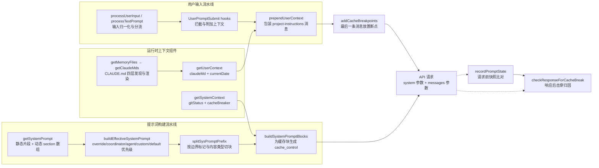
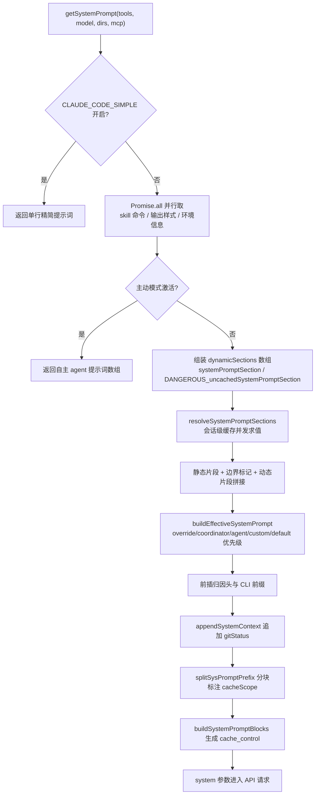
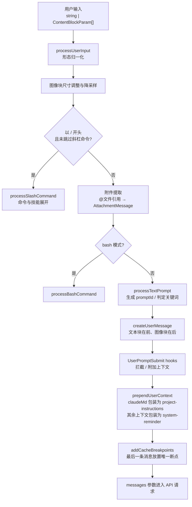
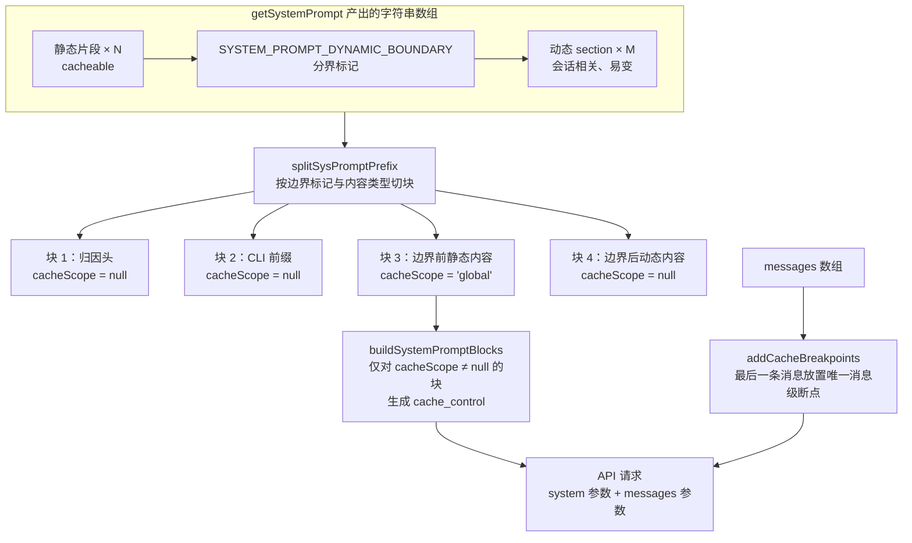
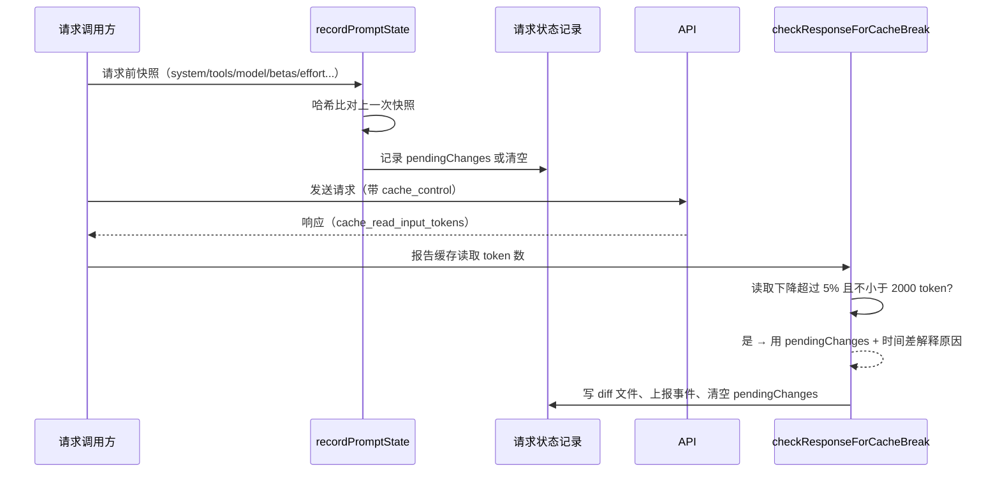

# Prompt 模块：系统提示词的组件与协作

## 1 概述

Prompt 模块的职责是把静态指令、运行时环境信息、CLAUDE.md 指令文件、git 状态与工具列表装配成发往 Claude API 的 `system` 参数与 user message 前缀，并在装配与请求两个层面管理 prompt cache：断点（`cache_control`）的放置、缓存失效检测与归因。

整个模块由一组职责单一的组件串成两条流水线：

- 提示词构建流水线：从 `getSystemPrompt` 产出静态片段与动态 section 数组，经 `buildEffectiveSystemPrompt` 做多来源优先级总装，最后经 `splitSysPromptPrefix` 与 `buildSystemPromptBlocks` 完成缓存分块与 `cache_control` 打标；
- 用户输入流水线：从 `processUserInput` 与 `processTextPrompt` 把输入转换成 user message，经 `UserPromptSubmit` hooks 拦截后，由 `prependUserContext` 注入 CLAUDE.md 与日期等上下文。

两条流水线在 API 请求构造处汇合，`addCacheBreakpoints` 为消息数组放置断点；响应返回后，`recordPromptState` 与 `checkResponseForCacheBreak` 组成两阶段检测闭环，把缓存命中率的变化归因到具体组件。

本文按组件视角组织：先给出每个组件的职责与协作关系，再以流程图串起四条关键流程，最后给出可迁移的设计思想。



组件清单：

| 组件 | 职责 |
|---|---|
| `getSystemPrompt` | 总装静态片段、边界标记与动态 section，产出 system prompt 字符串数组 |
| `SYSTEM_PROMPT_DYNAMIC_BOUNDARY` | 静态内容与动态内容的分界标记字符串 |
| `systemPromptSection` | 创建会话内缓存一次的普通 section |
| `DANGEROUS_uncachedSystemPromptSection` | 创建每轮重算的易变 section，强制写明重算理由 |
| `resolveSystemPromptSections` | 并发求值全部 section，命中缓存则直接返回 |
| `buildEffectiveSystemPrompt` | 按 override → coordinator → agent/custom/default 优先级选出主提示词，恒追加 appendSystemPrompt |
| `getUserContext` | 产出日期与 CLAUDE.md 合并文本，注入 user message 前缀 |
| `getSystemContext` | 产出 git 状态快照与缓存击穿标记，注入 system prompt 尾部 |
| `getMemoryFiles` / `getClaudeMds` | CLAUDE.md 四层发现（含 @include 递归）与文本渲染 |
| `prependUserContext` / `appendSystemContext` | 把两类上下文分别包装成高权重指令消息与背景提醒 |
| `splitSysPromptPrefix` | 按边界标记把 system prompt 切成带 cacheScope 标注的块 |
| `buildSystemPromptBlocks` | 为 cacheScope 非空的块生成 `cache_control` |
| `addCacheBreakpoints` | 保证每条请求恰好一个消息级断点，放在最后一条消息 |
| `recordPromptState` | 请求前对全部缓存键因子取哈希并与上次快照比对 |
| `checkResponseForCacheBreak` | 响应后比较缓存读取量，判定击穿并归因 |
| `processUserInput` / `processTextPrompt` | 用户输入归一化、斜杠命令与 bash 分流、生成 user message |

## 2 核心组件与职责

### 2.1 总装组件：getSystemPrompt 与边界标记

`getSystemPrompt` 是整个模块的入口组件，接收工具列表、模型名、附加目录与 MCP 连接，返回一个字符串数组，数组的每一项对应下游切分组件的一个可切分单元。

它内部先处理两条分叉：极简模式（`CLAUDE_CODE_SIMPLE` 开启）下整段提示词压缩为一行（含 CWD 与会话起始日期）；主动模式（feature 开关且主动模式激活）下直接返回一套自主 agent 提示词数组，走独立装配路径。默认路径按"静态片段在前、动态 section 在后"的固定顺序拼接，中间夹入边界标记。两条分叉证明总装组件支持整段替换式裁剪，条件不满足才走默认装配。

`SYSTEM_PROMPT_DYNAMIC_BOUNDARY` 是一个普通字符串常量。它的存在意义由注释规定：标记之前的数组元素可以打 `scope: 'global'` 缓存，之后的元素包含用户或会话相关内容，不参与 global 缓存；移动该标记需要同步修改依赖它的切分组件与打标组件。它只在 global 缓存开关（`shouldUseGlobalCacheScope`，仅对 firstParty 提供方生效）打开时插入数组。

协作关系：静态片段函数（`getSimpleIntroSection`、`getSimpleSystemSection`、`getSimpleDoingTasksSection`、`getActionsSection`、`getUsingYourToolsSection`、`getOutputEfficiencySection`）只消费两类会话内稳定的输入——输出样式配置与启用工具集合；动态 section 由 section 计算器三件套管理。运行时信息（日期、git 状态、CLAUDE.md 内容）不进入本组件，由上下文组件另行注入。六个静态片段各管一个主题：身份与介绍、系统约束、任务执行方式、行为准则、工具使用规范、输出效率要求，片段之间无依赖，可以独立调整措辞。

### 2.2 section 计算器三件套

动态内容按 section 组织。每个 section 是 `{ name, compute, cacheBreak }` 三元组：`compute` 返回 `string | null | Promise<string | null>`，返回 `null` 的 section 在总装时被过滤掉。

两个工厂函数只差 `cacheBreak` 字段：

- `systemPromptSection(name, compute)` 创建普通 section，计算一次后缓存到会话结束（`/clear` 与 `/compact` 时清空）；
- `DANGEROUS_uncachedSystemPromptSection(name, compute, reason)` 创建易变 section，每轮重算。函数名里的 DANGEROUS 与强制要求的 `reason` 参数提高误用成本：调用者必须写明白这个 section 为什么每轮变化、为什么会击穿缓存。典型用例是 `mcp_instructions`，理由是 MCP 服务器会在轮次之间连接与断开。

`resolveSystemPromptSections` 负责求值：用 `Promise.all` 并发执行全部 `compute`；普通 section 命中会话级缓存（按名字查找的 Map）时直接返回缓存值；易变 section 每次重新计算并更新缓存。求值结果按数组字面量顺序回填。

section 的**顺序**由 `getSystemPrompt` 中的 `dynamicSections` 数组字面量决定，顺序固定为：`mode_persona` → `session_guidance` → `memory` → `ant_model_override` → `env_info_simple` → `language` → `output_style` → `mcp_instructions` → `scratchpad` → `summarize_tool_results` → 条件追加的 `token_budget` 与 `brief`。会话相关的条件片段被强制排在边界之后，保证它们永不出现在 global 缓存前缀里。求值并发执行、顺序由数组字面量固定，二者分离：并发缩短装配耗时，字面量顺序保证输出的确定性。

### 2.3 多来源优先级总装：buildEffectiveSystemPrompt

`buildEffectiveSystemPrompt` 接收 `mainThreadAgentDefinition`、`toolUseContext`、`customSystemPrompt`、`defaultSystemPrompt`、`appendSystemPrompt`、`overrideSystemPrompt` 六个输入，按固定优先级选出主提示词：

1. `overrideSystemPrompt` 一旦设置（例如 loop mode），整段替换所有其他提示词，连 `appendSystemPrompt` 都不追加；
2. coordinator 模式（feature 开启、环境变量确认、且主线程无 agent 定义）使用协调者专用提示词；
3. 主线程 agent 定义存在时使用 agent 的系统提示词，内置 agent 与自定义 agent 的取值签名不同；
4. 主动模式下 agent 提示词改为**追加**到默认提示词之后（默认提示词本身是精简的自主 agent 身份，agent 在其上追加领域行为），普通路径则维持替换语义；
5. 兜底三元链：agent 提示词 → `customSystemPrompt`（命令行传入）→ `defaultSystemPrompt`（即 `getSystemPrompt` 的产物）；
6. `appendSystemPrompt` 在所有非 override 分支中恒追加在末尾。

该组件是提示词构建流水线的收口：它消费 `getSystemPrompt` 的产物作为 `defaultSystemPrompt`，输出最终交给切分与打标组件。它的输入全部来自外部调用方，自身无 I/O，属于纯优先级判定函数，便于单元测试。

### 2.4 运行时上下文组件：getUserContext / getSystemContext

这两个组件负责收集会随会话与项目变化的运行时信息，二者都不进入 system prompt 主体，而是走消息层注入，各自的内容与缓存语义独立：

- `getUserContext` 产出两个字段：`currentDate`（今日日期）与 `claudeMd`（经 `getMemoryFiles` + `getClaudeMds` 合并后的指令文本）。产物由 `prependUserContext` 注入 user message 前缀；
- `getSystemContext` 产出 `gitStatus`（会话起始时刻的 git 状态快照：当前分支、主分支、status 短输出、最近提交与用户名，超长截断，并提示模型需要更多信息时自行运行 git 命令）与可选的 `cacheBreaker`。产物由 `appendSystemContext` 追加到 system prompt 尾部。

协作关系：`getUserContext` 依赖指令文件发现组件；两个组件都被 memoize 包裹，会话内只计算一次；git 状态在远程模式或用户关闭 git 指令时直接跳过。

### 2.5 指令文件发现与渲染：getMemoryFiles / getClaudeMds

CLAUDE.md 体系分四个层级，加载顺序与优先级方向相反：

1. Managed 层：系统级全局指令文件与规则目录，始终加载；
2. User 层：用户级全局指令文件与规则目录，受用户设置开关控制，且永远允许引用工作目录之外的文件；
3. Project 层：从当前目录向上到根目录逐层收集，反转后从根向当前目录依次加载项目指令文件与规则目录，越靠近当前目录优先级越高；嵌套 git worktree 有专门跳过逻辑避免重复加载；附加目录（--add-dir）在对应开关开启时参与加载；
4. Local 层：用户私有的项目级指令文件。

`@include` 语法允许指令文件引用其他文件（相对路径、家目录路径、绝对路径三种前缀形式），只对文本节点生效（代码块内不解析）；被引用文件排在引用文件之前；循环引用由已处理路径集合阻断；深度上限 5；不存在的文件静默忽略；引用仅允许文本类扩展名，二进制文件被静默跳过；引用工作目录之外的文件需要用户批准。规则目录支持 frontmatter 里的 `paths` glob 做条件匹配，命中目标文件时才注入当轮上下文。

`getMemoryFiles` 负责发现（用 memoize 包裹，一次会话只遍历一遍目录），产出按"低优先级在前"排序的文件信息数组；`getClaudeMds` 负责渲染，把每条内容拼成"文件路径 + 类型说明 + 内容"的片段，全部拼接后在开头加 `MEMORY_INSTRUCTION_PROMPT` 前缀，声明这些指令 OVERRIDE 默认行为。发现与渲染分离，嵌套目录的按需补加载可以复用同一渲染逻辑。

嵌套目录的按需加载：当模型编辑某个子目录的文件时，与该目录相关的指令文件与规则会被单独补加载，条件规则按目标文件路径做 glob 匹配，命中才注入当轮上下文。这套机制让"编辑某个目录的文件时自动带上该目录的规则"成为可能，作用域细化到文件粒度。

### 2.6 注入与分块组件：prependUserContext / appendSystemContext / splitSysPromptPrefix / buildSystemPromptBlocks

**注入组件**把上下文组件产出的内容放进消息层，并区分权重：

- `prependUserContext` 把 `claudeMd` 单独包装成 `<project-instructions>` 的 `isMeta` user message（模型可见、界面不显示），让它保持指令权重，避免埋进带"可能不相关"免责声明的通用提醒里；其余上下文（日期等）包装成 `<system-reminder>`；两类包装共用 `isMeta` 标记，上下文文本不占用终端界面；
- `appendSystemContext` 把 git 状态快照追加到 system prompt 尾部。

**切分组件** `splitSysPromptPrefix` 在 global 缓存模式启用时，用单次查找定位边界标记，把 system prompt 数组切成最多四块并标注 `cacheScope`：

- 归因头（`cacheScope = null`）；
- CLI 前缀（`cacheScope = null`）；
- 边界前的静态内容合并块（`cacheScope = 'global'`）；
- 边界后的动态内容合并块（`cacheScope = null`）。

找不到边界标记时走默认缓存路径，并上报"标记缺失"事件——边界标记缺失属于会被监控到的异常状态。块内用空行连接，切分粒度是整块，块内任何字符变化都会使整块缓存失效，这解释了"会话级内容必须放在边界之后"的强制性。

**打标组件** `buildSystemPromptBlocks` 消费切分结果，只对 `cacheScope` 非空的块调用 `getCacheControl({ scope })` 生成 `cache_control`（形态为 `{ type: 'ephemeral', ttl?: '1h', scope? }`）；`ttl: '1h'` 由额度与用户组判定，且会话内 latch 住，防止额度状态中途翻转改变 TTL 击穿缓存。

此外还有手动击穿通道：`/break-cache` 命令在 system prompt 末尾追加一段带随机数的注释（`cache-break nonce`），使前缀哈希强制变化，供调试与排查缓存问题使用。

### 2.7 断点与失效检测组件：addCacheBreakpoints / recordPromptState / checkResponseForCacheBreak

**消息级断点** `addCacheBreakpoints` 规定每条请求恰好一个消息级 `cache_control` 标记，放在最后一条消息上（与推理引擎的 KV 页回收机制配合）；`skipCacheWrite` 的 fork 请求把标记移到倒数第二条，避免留下自己的缓存尾部。

**两阶段检测**回答"缓存为什么没命中"：

- 阶段一 `recordPromptState` 在请求前对全部缓存键因子取哈希：去掉 `cache_control` 前后的 system 两份哈希、tools 聚合与逐工具 schema、model、betas、fastMode、effort 等，与按来源记录的上一份快照比对，把差异记录到 `pendingChanges`；
- 阶段二 `checkResponseForCacheBreak` 在响应后比较 `cacheReadTokens`：缓存读取下降超过 5% 且绝对下降不低于 2000 token 才判定击穿；解释来源依次为客户端可见变更（阶段一的变更列表）、5 分钟或 1 小时 TTL 过期（结合最后 assistant 消息时间差）、服务端路由；判定结果写入 diff 文件并上报 `tengu_prompt_cache_break` 事件。

压缩与缓存删除属于合法降读场景，由 `notifyCompaction` 与 `notifyCacheDeletion` 重置基线，避免误报。

### 2.8 用户输入组件：processUserInput / processTextPrompt / UserPromptSubmit hooks

`processUserInput` 是用户输入流水线的入口，接收字符串或 content block 数组两种形态：

- 数组形态先对每个图像块做尺寸调整与降采样，并提取最后一块文本作为主文本；粘贴内容中的图像存到磁盘（让模型后续能用工具按路径引用）并生成图像块；
- 以 `/` 开头且未跳过斜杠命令时进入 `processSlashCommand`（命令与技能展开）；bash 模式进入 `processBashCommand`；普通文本进入 `processTextPrompt`；
- 附件提取组件从文本中识别 `@文件` 引用（支持行范围语法与带引号路径），读取文件内容生成 `AttachmentMessage` 跟在 user message 之后；
- `processTextPrompt` 生成 promptId、记录遥测事件、判定否定与继续关键词，再调用 `createUserMessage`；有图像时文本块在前、图像块在后。

`UserPromptSubmit` hooks 在 user message 生成后、查询前执行：支持阻断（返回 system 警告消息）、阻止继续与附加上下文注入。hooks 由运行时执行，模型只能看到执行结果注入回来的消息。

## 3 关键流程

### 3.1 system prompt 构建流程



分步讲解：

1. **入口与极简分支**：`getSystemPrompt` 先检查极简模式开关，开启时整段提示词压缩成一行（含 CWD 与会话起始日期），用于低成本场景。
2. **并行预取**：用 `Promise.all` 同时取技能命令列表、输出样式配置与环境信息，三者相互独立。
3. **主动模式分叉**：feature 开关且主动模式激活时直接返回自主 agent 提示词数组，路径与默认装配完全分叉。
4. **动态 section 装配**：按字面量顺序构造 section 数组；普通 section 会话内缓存，`mcp_instructions` 每轮重算。
5. **边界拼接**：静态片段、边界标记（仅 global 缓存模式插入）、动态片段拼成字符串数组。
6. **优先级总装**：`buildEffectiveSystemPrompt` 按 override → coordinator → agent/custom/default 的优先级选出主提示词，`appendSystemPrompt` 恒追加。
7. **API 层收尾**：前插归因头与 CLI 前缀（恒在数组最前，保证任何 provider 都能正确计费与识别客户端）；`appendSystemContext` 追加 git 状态产物。
8. **缓存打标**：`splitSysPromptPrefix` 分块、`buildSystemPromptBlocks` 生成带 `cache_control` 的 system 参数数组。

### 3.2 用户输入到 user message 的转换流程



分步讲解：

1. **形态归一化**：处理字符串与 content block 数组两种形态；数组形态先对每个图像块做尺寸调整，并提取最后一块文本作为主文本。
2. **粘贴图像处理**：粘贴内容中的图像存到磁盘并并行降采样，生成图像内容块。
3. **命令分流**：斜杠命令与 bash 模式分别进入各自处理器，普通文本继续向下。
4. **附件提取**：识别 `@文件` 引用（含行范围语法与带引号路径），读取内容生成附件消息跟在 user message 之后。
5. **生成 user message**：生成 promptId、记录遥测事件、判定否定与继续关键词，再构造 user message；有图像时文本块在前、图像块在后。
6. **hooks 拦截**：`UserPromptSubmit` hooks 支持阻断（返回 system 警告消息）、阻止继续与附加上下文注入。
7. **查询前注入**：`prependUserContext` 把 CLAUDE.md 包装为 `<project-instructions>`，日期等其余内容包装为 `<system-reminder>`，均以 `isMeta` 标记（模型可见、界面不显示）。
8. **缓存打标**：`addCacheBreakpoints` 在最后一条消息上放置唯一的消息级断点；断点随消息数组增长逐轮移动，历史前缀保持稳定。

### 3.3 静态与动态内容的分界与缓存断点放置



这张图集中体现了缓存设计的核心规则：**稳定内容靠前、易变内容靠后、断点显式放置**。

- 边界标记把提示词数组分成"可全局缓存"与"不可全局缓存"两段，切分组件据此推导每块的 `cacheScope`，缓存策略由分界点自动确定；
- 归因头与 CLI 前缀用前缀匹配单独摘出，恒在数组最前且不参与 global 缓存；
- 打标组件只给 `cacheScope = 'global'` 的静态块生成断点，动态块不生成；
- 消息级断点与 system 级断点相互独立：system 断点让静态前缀跨请求复用，消息级断点让递增的历史消息持续命中缓存；
- 会话级条件片段强制放在边界之后：任何会话级分支若出现在 global 前缀里，会让前缀哈希按组合数碎片化，多一个分支就多一倍的缓存键；
- 新增提示词内容时只需要决定放边界前还是边界后，缓存行为随之确定。

### 3.4 缓存失效检测的两阶段流程



- 阶段一在请求前记账：对所有缓存键因子取哈希，与上一份快照比对，把差异记录为待解释的变更集合；system 哈希取两份（含与不含 `cache_control`），因为断点标记本身会变化；按查询来源前缀过滤参与对象，仅主线程与特定 agent 参与追踪；
- 阶段二在响应后归因：缓存读取下降超过 5% 且绝对量不低于 2000 token 才判定击穿，用阶段一的变更列表解释原因，结合时间差区分 TTL 过期与服务端路由，最终写 diff 文件并上报事件；
- 压缩与缓存删除属于合法降读场景，检测组件通过基线重置避免误报；追踪键按查询来源前缀过滤，仅主线程与特定 agent 参与，避免子代理数据互相污染；
- 两个阶段分离的意义：预测变更与证实击穿各自独立，先记账后归因，配合 token 阈值与时间差抑制误报。

## 4 关键代码

### 4.1 section 三元组与缓存求值

```ts
type SystemPromptSection = {
  name: string
  compute: ComputeFn
  cacheBreak: boolean
}

export function systemPromptSection(
  name: string,
  compute: ComputeFn,
): SystemPromptSection {
  return { name, compute, cacheBreak: false }
}

export function DANGEROUS_uncachedSystemPromptSection(
  name: string,
  compute: ComputeFn,
  _reason: string,
): SystemPromptSection {
  return { name, compute, cacheBreak: true }
}

export async function resolveSystemPromptSections(
  sections: SystemPromptSection[],
): Promise<(string | null)[]> {
  const cache = getSystemPromptSectionCache()

  return Promise.all(
    sections.map(async s => {
      if (!s.cacheBreak && cache.has(s.name)) {
        return cache.get(s.name) ?? null
      }
      const value = await s.compute()
      setSystemPromptSectionCacheEntry(s.name, value)
      return value
    }),
  )
}
```

三元组把"内容是什么"（`compute`）与"内容如何缓存"（`cacheBreak`）绑定在同一处；两个工厂只差一个字段，易变工厂用函数名与强制理由参数提高误用成本；求值用 `Promise.all` 并发，普通 section 命中按名字查找的会话级缓存时直接返回。易变 section 每轮重算并覆盖缓存条目，`/clear` 与 `/compact` 时整张缓存清空，保证新会话从干净状态开始。

### 4.2 优先级总装链

```ts
if (overrideSystemPrompt) {
  return asSystemPrompt([overrideSystemPrompt])
}

// Coordinator mode: use coordinator prompt instead of default
if (
  feature('COORDINATOR_MODE') &&
  isEnvTruthy(process.env.CLAUDE_CODE_COORDINATOR_MODE) &&
  !mainThreadAgentDefinition
) {
  return asSystemPrompt([
    getCoordinatorSystemPrompt(),
    ...(appendSystemPrompt ? [appendSystemPrompt] : []),
  ])
}

const agentSystemPrompt = mainThreadAgentDefinition
  ? isBuiltInAgent(mainThreadAgentDefinition)
    ? mainThreadAgentDefinition.getSystemPrompt({
        toolUseContext: { options: toolUseContext.options },
      })
    : mainThreadAgentDefinition.getSystemPrompt()
  : undefined

// In proactive mode, agent instructions are appended to the default prompt
if (
  agentSystemPrompt &&
  (feature('PROACTIVE') || feature('KAIROS')) &&
  isProactiveActive_SAFE_TO_CALL_ANYWHERE()
) {
  return asSystemPrompt([
    ...defaultSystemPrompt,
    `\n# Custom Agent Instructions\n${agentSystemPrompt}`,
    ...(appendSystemPrompt ? [appendSystemPrompt] : []),
  ])
}

return asSystemPrompt([
  ...(agentSystemPrompt
    ? [agentSystemPrompt]
    : customSystemPrompt
      ? [customSystemPrompt]
      : defaultSystemPrompt),
  ...(appendSystemPrompt ? [appendSystemPrompt] : []),
])
```

优先级链条自上而下：override 整段替换且不追加任何内容；coordinator 模式使用专用提示词；普通路径先求 agent 提示词（内置与自定义取值签名不同）；主动模式下 agent 提示词追加到默认提示词之后；兜底是 agent → custom → default 的三元链；`appendSystemPrompt` 在所有非 override 分支中恒追加。每个分支都返回完整数组，消费方拿到的始终是最终形态，无需再拼接。

### 4.3 边界标记与总装拼接

```ts
  return [
    // --- Static content (cacheable) ---
    getSimpleIntroSection(outputStyleConfig),
    getSimpleSystemSection(),
    outputStyleConfig === null ||
    outputStyleConfig.keepCodingInstructions === true
      ? getSimpleDoingTasksSection()
      : null,
    getActionsSection(),
    getUsingYourToolsSection(enabledTools),
    getOutputEfficiencySection(),
    // === BOUNDARY MARKER - DO NOT MOVE OR REMOVE ===
    ...(shouldUseGlobalCacheScope() ? [SYSTEM_PROMPT_DYNAMIC_BOUNDARY] : []),
    // --- Dynamic content (registry-managed) ---
    ...resolvedDynamicSections,
  ].filter(s => s !== null)
```

前六项是静态片段函数，参数只有输出样式配置与启用工具集合两类会话内稳定的输入；边界标记用展开运算条件插入（仅 global 缓存模式开启时）；动态 section 已经过缓存求值，`null` 值（如未配置语言、无 MCP 指令）由末尾的 filter 统一剔除；返回值是字符串数组，每项对应切分组件的一个可切分单元。静态片段函数的输入在会话内保持稳定，因此前缀跨请求可复用；任何会话级条件分支若混入静态区，会让前缀哈希按组合数碎片化。

## 5 设计思想

### 5.1 静态与动态分离，边界显式化

把提示词文本按稳定性分界，并用一个字符串标记标出分界点，缓存策略由分界点自动推导。新增内容时只需要决定放边界前还是边界后，缓存行为随之确定。迁移要点：给 prompt 数组约定一个 DYNAMIC_BOUNDARY 标记，序列化层按标记切块打缓存断点。

### 5.2 section 计算器抽象

`{ name, compute, cacheBreak }` 三元组把内容与缓存策略绑定在同一处：普通 section 缓存到 /clear，易变 section 每轮重算且必须写清理由。会话级 Map 加按名字查找的缓存结构简单直接，缓存键只有名字一个维度，新增 section 不影响已有 section 的缓存命中。迁移要点：新增一种动态上下文时先判定它属于缓存型还是易变型，再选择对应工厂。

### 5.3 占位符插值

提示词文本里的工具名、命令名从各自的定义模块导入常量再插值，保证提示词文本与工具注册表永远一致；配合构建期条件导入还能把未启用分支的文本从产物中消除。构建期宏（MACRO 系列）是另一类占位符，构建时替换为版本号、反馈渠道等常量。迁移要点：提示词里的任何系统级名称（工具名、命令名、agent 类型名）都应走常量引用，让编译器与构建器替你做一致性检查。

### 5.4 缓存断点的工程纪律

- 每条请求恰好一个消息级断点，放在最后一条消息；
- 动态 beta header 与 TTL 判定做 sticky-on latch，会话中途状态翻转不改缓存键；
- 易变 section 单独建类型，用函数名与理由参数提高误用成本；
- 两阶段失效检测把预测变更与证实击穿分离，先记账后归因，再配合 token 阈值与 TTL 时间差抑制误报；
- 手动击穿通道 `/break-cache` 追加 nonce 注释，供调试时强制刷新缓存前缀。

这些规则各自很小，组合起来才能把缓存命中率维持在稳定水平。迁移时值得照搬的是"latch 会话级状态"与"检测先行、归因后置"两条。

### 5.5 条件裁剪

feature 开关只出现在条件位置，配合条件加载与构建期无效代码消除，同一份源码可以产出不同体积与不同内容组合的提示词。片段级开关（如验证义务片段的多条件 bullet）证明裁剪粒度可以缩小到单条指令，门控条件可以混合 feature、远程配置与用户设置。

### 5.6 指令文件的层级组合

Managed → User → Project → Local 的加载顺序与反向优先级、`@include` 递归（带深度上限与环检测）、按 glob 匹配的条件规则，共同构成一套可组合的指令系统。把发现（`getMemoryFiles`）与渲染（`getClaudeMds`）分成两个函数，嵌套目录的按需补加载可以复用同一渲染逻辑。条件规则让同一套规则文件可以按目标路径选择性生效，全局规则与局部规则共用同一加载机制。这套分层结构对任何需要"全局规则 + 项目规则 + 个人规则"的 agent 项目都是现成范本。

### 5.7 指令与背景资料的职责切分

日期、CLAUDE.md、git 状态通过 `prependUserContext` 与 `appendSystemContext` 注入消息层，system prompt 只保留指令本身。CLAUDE.md 单独包装成 `<project-instructions>` 高权重消息，其余背景信息包装成带"可能不相关"声明的 `<system-reminder>`。这个切分让指令与背景资料在模型眼中权重不同，且各自的缓存行为可以独立控制。git 状态快照明确声明是会话起始时刻的静态快照，会话中不更新，模型需要最新状态时应当自行运行 git 命令。
