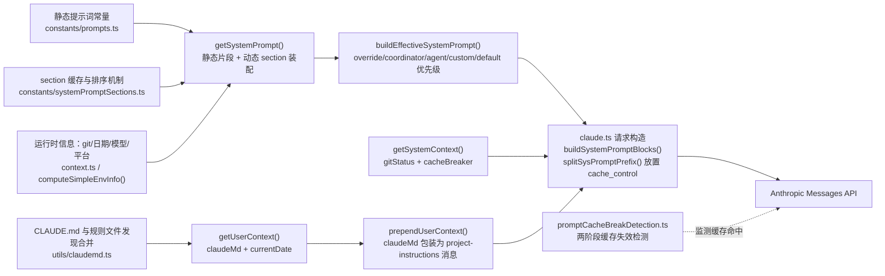
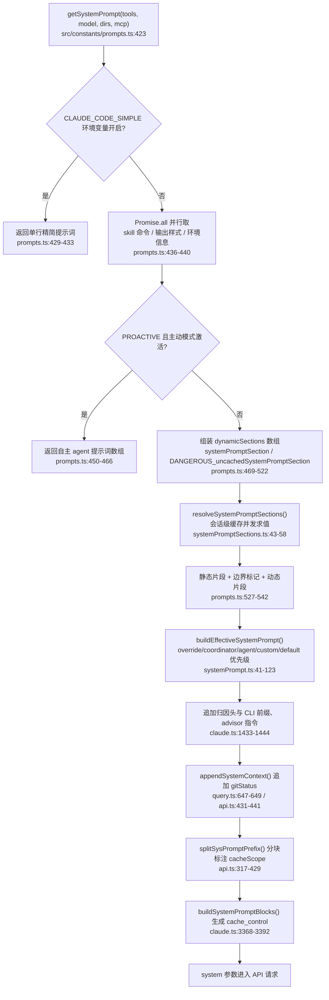
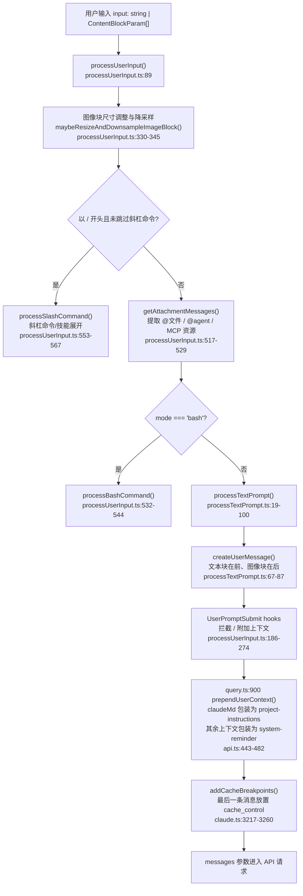
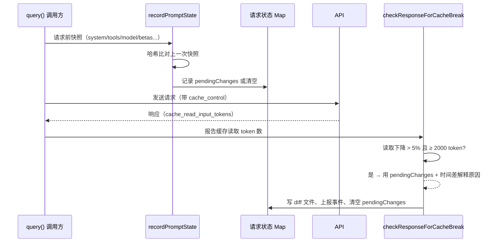

# Prompt 模块：系统提示词与上下文构建

## 1 模块概览

Prompt 模块承担系统提示词（system prompt）与用户消息前缀的构建：把静态指令常量、运行时环境信息、CLAUDE.md 记忆文件、git 状态与工具列表装配为发往 Claude API 的 `system` 参数与 user message 前缀，并负责 prompt cache 断点（`cache_control`）的放置与缓存失效检测。



涉及文件清单：

| 文件路径 | 职责 | 关键导出 |
|---------|------|---------|
| `src/constants/prompts.ts` | 静态提示词常量与 system prompt 总装 | `getSystemPrompt`、`computeEnvInfo`、`computeSimpleEnvInfo`、`SYSTEM_PROMPT_DYNAMIC_BOUNDARY`、`DEFAULT_AGENT_PROMPT`、`enhanceSystemPromptWithEnvDetails` |
| `src/constants/systemPromptSections.ts` | section 类型、缓存与求值机制 | `systemPromptSection`、`DANGEROUS_uncachedSystemPromptSection`、`resolveSystemPromptSections`、`clearSystemPromptSections` |
| `src/utils/systemPrompt.ts` | 多来源 system prompt 的优先级总装 | `buildEffectiveSystemPrompt` |
| `src/utils/systemPromptType.ts` | 类型再导出层 | `SystemPrompt`、`asSystemPrompt`（来自 `@ant/model-provider`） |
| `src/context.ts` | git 状态与用户上下文 | `getGitStatus`、`getSystemContext`、`getUserContext`、`getSystemPromptInjection` |
| `src/utils/claudemd.ts` | CLAUDE.md 发现、`@include`、合并与条件规则 | `getMemoryFiles`、`getClaudeMds`、`processMemoryFile`、`processMdRules`、`getMemoryFilesForNestedDirectory` |
| `src/utils/api.ts` | system prompt 分块与上下文注入 | `splitSysPromptPrefix`、`appendSystemContext`、`prependUserContext`、`logAPIPrefix` |
| `src/services/api/claude.ts` | API 请求构造与缓存打标 | `buildSystemPromptBlocks`、`addCacheBreakpoints`、`getCacheControl`、`userMessageToMessageParam` |
| `src/services/api/promptCacheBreakDetection.ts` | 缓存失效两阶段检测 | `recordPromptState`、`checkResponseForCacheBreak`、`notifyCacheDeletion`、`notifyCompaction` |
| `src/utils/queryContext.ts` | 缓存键前缀三件套的组装 | `fetchSystemPromptParts`、`buildSideQuestionFallbackParams` |
| `src/utils/processUserInput/processUserInput.ts` | 用户输入分发 | `processUserInput` |
| `src/utils/processUserInput/processTextPrompt.ts` | 文本输入转 user message | `processTextPrompt` |
| `src/utils/attachments.ts` | `@` 引用的提取与附件消息生成 | `extractAtMentionedFiles`、`getAttachmentMessages` |
| `src/services/PromptSuggestion/promptSuggestion.ts` | 提示建议服务 | `tryGenerateSuggestion`、`generateSuggestion`、`shouldEnablePromptSuggestion` |
| `src/utils/betas.ts` | global 缓存开关判定 | `shouldUseGlobalCacheScope` |
| `src/bootstrap/state.ts` | section 缓存的模块级存储 | `getSystemPromptSectionCache`、`setSystemPromptSectionCacheEntry`、`clearSystemPromptSectionState` |
| `src/constants/common.ts` | 会话起始日期 | `getSessionStartDate`、`getLocalISODate` |

## 2 核心概念

### 2.1 静态提示词与动态上下文的分界

**概念**：`constants/prompts.ts` 存放跨会话、跨用户稳定的指令文本（身份描述、行为准则、工具使用规范）；日期、git 状态、模型信息、CLAUDE.md 内容等运行时信息由 `context.ts` 与 section 计算函数在运行时注入。

**设计动机**：Anthropic 的 prompt cache 按前缀匹配计费。把稳定文本放在前面、易变内容放在后面，能让稳定前缀持续命中缓存；把两者混写会让任意运行时变化（例如日期改变）击穿整段缓存。

**代码证据**：边界标记常量在 `src/constants/prompts.ts:105-115`：

```ts
export const SYSTEM_PROMPT_DYNAMIC_BOUNDARY =
  '__SYSTEM_PROMPT_DYNAMIC_BOUNDARY__'
```

注释明确说明：标记之前的数组元素可以打 `scope: 'global'` 缓存，之后的元素包含用户/会话相关的内容，不应缓存；同时警告不要移动该标记，否则要同步修改 `src/utils/api.ts` 的 `splitSysPromptPrefix` 与 `src/services/api/claude.ts` 的 `buildSystemPromptBlocks`。

`getSystemPrompt` 的返回组装在 `src/constants/prompts.ts:527-542`，静态片段（`getSimpleIntroSection`、`getSimpleSystemSection` 等）在前，动态 section 在后，边界标记夹在中间且仅在 `shouldUseGlobalCacheScope()` 时插入。运行时信息真正的注入点有两处：

- 日期、CLAUDE.md 内容进 user context：`getUserContext` 在 `src/context.ts:155-188` 返回 `{ claudeMd, currentDate }`；
- git 状态进 system context：`getSystemContext` 在 `src/context.ts:116-150` 返回 `{ gitStatus }`（以及 feature-gated 的 `cacheBreaker`）。

这两个对象最终由 `prependUserContext` 与 `appendSystemContext`（`src/utils/api.ts:431-482`）分别注入 user message 前缀与 system prompt 尾部。

### 2.2 section 化组织

**概念**：动态内容按 section 组织。每个 section 是 `{ name, compute, cacheBreak }` 三元组，其中 `compute` 返回 `string | null | Promise<string | null>`，返回 `null` 的 section 会被过滤掉。

**代码证据**：类型定义与工厂函数在 `src/constants/systemPromptSections.ts:10-38`：

```ts
type SystemPromptSection = {
  name: string
  compute: ComputeFn
  cacheBreak: boolean
}

export function systemPromptSection(
  name: string,
  compute: ComputeFn,
): SystemPromptSection {
  return { name, compute, cacheBreak: false }
}

export function DANGEROUS_uncachedSystemPromptSection(
  name: string,
  compute: ComputeFn,
  _reason: string,
): SystemPromptSection {
  return { name, compute, cacheBreak: true }
}
```

两个工厂的差异是 `cacheBreak` 字段：普通 section 计算一次后缓存到会话结束，volatile section 每轮重算。`DANGEROUS_uncachedSystemPromptSection` 的函数名与 `_reason` 参数强制调用者写明白为什么这个 section 需要每轮变化、为什么会击穿缓存。

**顺序如何决定**：`systemPromptSections.ts` 本身不含顺序信息。真正的顺序由 `getSystemPrompt` 里的两处字面量决定（`src/constants/prompts.ts:469-542`）：先按固定顺序调用静态片段函数（529-537 行），再按 `dynamicSections` 数组的字面量顺序求值（469-522 行）。动态顺序为：`mode_persona` → `session_guidance` → `memory` → `ant_model_override` → `env_info_simple` → `language` → `output_style` → `mcp_instructions` → `scratchpad` → `summarize_tool_results` → `token_budget`（feature-gated）→ `brief`（feature-gated）。

求值与缓存逻辑在 `src/constants/systemPromptSections.ts:43-58`：

```ts
export async function resolveSystemPromptSections(
  sections: SystemPromptSection[],
): Promise<(string | null)[]> {
  const cache = getSystemPromptSectionCache()

  return Promise.all(
    sections.map(async s => {
      if (!s.cacheBreak && cache.has(s.name)) {
        return cache.get(s.name) ?? null
      }
      const value = await s.compute()
      setSystemPromptSectionCacheEntry(s.name, value)
      return value
    }),
  )
}
```

`Promise.all` 并发求值全部 section；普通 section 命中会话级缓存时直接返回。缓存存储在 `src/bootstrap/state.ts:1621-1638` 的模块级 `Map` 中，由 `clearSystemPromptSections`（`systemPromptSections.ts:65-68`）在 `/clear` 与 `/compact` 时清空。

### 2.3 模板与占位符

**概念**：提示词文本里的工具名以常量引用的方式写入，从各工具模块导入名称常量后用模板字符串插值。例如 `${FILE_READ_TOOL_NAME}`、`${POWERSHELL_TOOL_NAME}`。

**代码证据**：导入在 `src/constants/prompts.ts:11-19（节选）`：

```ts
import { FILE_WRITE_TOOL_NAME } from '@claude-code-best/builtin-tools/tools/FileWriteTool/prompt.js'
import { FILE_READ_TOOL_NAME } from '@claude-code-best/builtin-tools/tools/FileReadTool/prompt.js'
import { FILE_EDIT_TOOL_NAME } from '@claude-code-best/builtin-tools/tools/FileEditTool/constants.js'
import { TODO_WRITE_TOOL_NAME } from '@claude-code-best/builtin-tools/tools/TodoWriteTool/constants.js'
```

插值使用在 `getUsingYourToolsSection`（`src/constants/prompts.ts:277-283`）：

```ts
  const hasPowerShell = enabledTools.has(POWERSHELL_TOOL_NAME)
  const hasBash = enabledTools.has(BASH_TOOL_NAME)
  const shellToolGuidance = hasPowerShell
    ? hasBash
      ? `On Windows, prefer the ${POWERSHELL_TOOL_NAME} tool for terminal operations (git, npm, docker, builds, tests, system commands). Use ${BASH_TOOL_NAME} only when the user asks for bash/Git Bash or a command is clearly bash-only. Prefer dedicated tools over shell equivalents (e.g., ${FILE_READ_TOOL_NAME} over Get-Content/cat, ${FILE_EDIT_TOOL_NAME} over sed, ${GLOB_TOOL_NAME} over find, ${GREP_TOOL_NAME} over grep/Select-String).`
      : `Prefer dedicated tools over ${POWERSHELL_TOOL_NAME} equivalents (e.g., ${FILE_READ_TOOL_NAME} over Get-Content, ${FILE_EDIT_TOOL_NAME} over (Get-Content) -replace, ${GLOB_TOOL_NAME} over Get-ChildItem -Recurse, ${GREP_TOOL_NAME} over Select-String). Reserve ${POWERSHELL_TOOL_NAME} for shell operations: package installs, test runners, build commands, git operations.`
    : `Prefer dedicated tools over ${BASH_TOOL_NAME} equivalents (e.g., ${FILE_READ_TOOL_NAME} over cat, ${FILE_EDIT_TOOL_NAME} over sed, ${GLOB_TOOL_NAME} over find, ${GREP_TOOL_NAME} over grep). Reserve ${BASH_TOOL_NAME} for shell operations: package installs, test runners, build commands, git operations.`
```

**设计动机**：

1. **单一事实来源**：工具名只存在于各工具模块的常量文件里。重命名工具时只改一处，提示词文本自动同步，杜绝"提示词里还写着旧名字"这类漂移。
2. **支持按环境分支**：同一段模板在 Windows（有 `POWERSHELL_TOOL_NAME`）与 POSIX 环境渲染出不同的建议文本，模板复用而内容适配。
3. **配合 dead code elimination**：`prompts.ts:69-98` 对 feature-gated 模块使用条件 `require`，构建器可以把未启用分支连同对应的插值文本一起从产物中消除。

另一个占位符形态是构建期宏：`getSimpleDoingTasksSection` 中的 `${MACRO.ISSUES_EXPLAINER}`（`src/constants/prompts.ts:216`）在构建时由 `scripts/defines.ts` 注入的值替换。

### 2.4 CLAUDE.md 的多层发现与合并

**概念**：CLAUDE.md 体系有四个层级，加载顺序与优先级方向相反。文件头注释（`src/utils/claudemd.ts:1-26`）给出完整规则：

```text
Files are loaded in the following order:
1. Managed memory (eg. /etc/claude-code/CLAUDE.md) - Global instructions for all users
2. User memory (~/.claude/CLAUDE.md) - Private global instructions for all projects
3. Project memory (CLAUDE.md, .claude/CLAUDE.md, and .claude/rules/*.md in project roots)
4. Local memory (CLAUDE.local.md in project roots) - Private project-specific instructions

Files are loaded in reverse order of priority, i.e. the latest files are highest priority
```

项目级文件沿"当前目录向上到根目录"逐层发现，越靠近当前目录优先级越高（后加载）。`@include` 语法支持 `@path`、`@./relative/path`、`@~/home/path`、`@/absolute/path`；无前缀的 `@path` 按相对路径处理；包含仅对叶子文本节点生效（代码块内不解析）；被包含文件排在包含文件之前；循环引用由 `processedPaths` 集合阻断；不存在的文件静默忽略。

**核心发现逻辑**：`getMemoryFiles`（`src/utils/claudemd.ts:789-1074`）用 `memoize` 包裹，一次会话只执行一遍：

- 先加载 Managed 文件与 Managed 规则目录（803-822 行），不受排除设置影响；
- 再加载 User 文件与 `~/.claude/rules/`（825-846 行），且 User 记忆永远允许外部 include（`includeExternal: true`）；
- 然后从 `getOriginalCwd()` 向上收集目录列表并 `reverse()`（849-877 行），从根到当前目录依次加载 Project 的 `CLAUDE.md`、`.claude/CLAUDE.md`、`.claude/rules/*.md` 与 Local 的 `CLAUDE.local.md`（877-933 行），当前目录的文件最后加载、优先级最高；
- 嵌套 git worktree 场景有专门跳过逻辑，避免主仓库文件重复加载（858-883 行）；
- `--add-dir` 附加目录在环境变量 `CLAUDE_CODE_ADDITIONAL_DIRECTORIES_CLAUDE_MD` 开启时加载（939-976 行）；
- 最后按 feature flag 附加 AutoMem 与 TeamMem 入口文件（978-1006 行）。

**include 递归**：`processMemoryFile`（`src/utils/claudemd.ts:617-684`）维护 `processedPaths` 集合与深度上限 `MAX_INCLUDE_DEPTH = 5`（536 行），主文件先入结果、被包含文件随后追加，并记录 `parent` 字段供 hooks 上报加载来源。

**条件规则**：`.claude/rules/*.md` 支持 frontmatter 里的 `paths` glob。`processMdRules` 按 `conditionalRule` 参数过滤（772 行）；`processConditionedMdRules`（`src/utils/claudemd.ts:1353-1396`）用 `ignore().add(file.globs).ignores(relativePath)` 判定目标文件是否命中，命中才把规则注入当轮上下文。嵌套目录记忆由 `getMemoryFilesForNestedDirectory`（1248-1317 行）与 `getConditionalRulesForCwdLevelDirectory`（1328-1341 行）按需补加载。

**合并成文本**：`getClaudeMds`（`src/utils/claudemd.ts:1152-1194`）把每个文件渲染为 `Contents of <路径>（说明）:` 片段，全部文件用空行拼接，最前面加 `MEMORY_INSTRUCTION_PROMPT`（88-89 行：声明这些指令 OVERRIDE 默认行为）。

**注入位置**：`prependUserContext`（`src/utils/api.ts:455-468`）把 `claudeMd` 单独包装成 `<project-instructions>` 的高权重 `isMeta` user message，注释说明这是为了让它不被埋进带"可能不相关"免责声明的通用 `<system-reminder>` 里，保持指令权重。

### 2.5 prompt cache 友好性

**概念**：Anthropic 的 prompt cache 按前缀匹配，前缀稳定的请求能复用之前的缓存写入。system prompt 设计围绕一条原则：**稳定内容靠前、易变内容靠后、断点显式放置**。

**代码证据链**：

1. **global 缓存分块**。`splitSysPromptPrefix`（`src/utils/api.ts:317-429`）把 system prompt 数组按内容类型切成块并标注 `cacheScope`。global 模式且找到边界标记时产出最多四块：归因头（`cacheScope=null`）→ CLI 前缀（`cacheScope=null`）→ 边界前的静态内容（`cacheScope='global'`）→ 边界后的动态内容（`cacheScope=null`）。`shouldUseGlobalCacheScope`（`src/utils/betas.ts:195-200`）限定 `firstParty` 提供方。
2. **cache_control 生成**。`buildSystemPromptBlocks`（`src/services/api/claude.ts:3368-3392`）为每个块调用 `getCacheControl({ scope })`；`getCacheControl`（352-368 行）返回 `{ type: 'ephemeral', ttl?: '1h', scope? }`，`ttl: '1h'` 由 `should1hCacheTTL` 判定且会话内 latch 住（387-406 行），防止额度状态翻转中途改变 TTL 击穿约 20K token 的缓存。
3. **消息级断点唯一化**。`addCacheBreakpoints`（`src/services/api/claude.ts:3217-3260`）规定每条请求恰好一个消息级 `cache_control` 标记，放在最后一条消息上（3232-3243 行注释解释了与推理引擎 KV 页回收的配合）；`skipCacheWrite` 的 fork 请求把标记移到倒数第二条，避免留下自己的缓存尾部。
4. **易变 section 显式标记**。`mcp_instructions` 是 `DANGEROUS_uncachedSystemPromptSection`（`src/constants/prompts.ts:492-499`），理由写明 "MCP servers connect/disconnect between turns"。会话相关的条件片段被强制放在边界之后（`getSessionSpecificGuidanceSection` 的注释，`src/constants/prompts.ts:327-335`），因为任何会话级分支若出现在 global 前缀里，会让前缀哈希按 2^N 组合碎片化。
5. **beta header 与状态 latch**。`src/services/api/claude.ts:1505-1509` 对动态 beta header 做 sticky-on latch，中途开关不再改变服务端缓存键；`/clear` 与 `/compact` 时由 `clearBetaHeaderLatches` 重置。
6. **手动击穿**。`/break-cache` 集成在 `claude.ts:1446-1469`：在 system prompt 末尾追加 `<!-- cache-break nonce: <uuid> -->` 使前缀哈希变化。

**缓存失效检测**：`promptCacheBreakDetection.ts` 用两阶段模式。阶段一 `recordPromptState`（247-428 行）在请求前对 system（含/不含 `cache_control` 两份哈希）、tools 聚合与逐工具 schema、model、betas、fastMode、effort 等全部缓存键因子取哈希，与上一次快照比对并记录 `pendingChanges`；阶段二 `checkResponseForCacheBreak`（435-665 行）在响应后比较 `cacheReadTokens`，当缓存读取下降超过 5% 且绝对下降 ≥ `MIN_CACHE_MISS_TOKENS = 2000`（120 行）时判定发生缓存击穿，用阶段一的变更列表解释原因，结合最后 assistant 消息时间差区分 5 分钟/1 小时 TTL 过期与服务端路由原因，写入 diff 文件并上报 `tengu_prompt_cache_break` 事件。压缩与缓存删除是合法降读场景，由 `notifyCompaction`（688-697 行）与 `notifyCacheDeletion`（672-681 行）重置基线避免误报。

### 2.6 feature flag 对提示词的裁剪

`feature()` 来自 `bun:bundle`，只能在 `if` 条件或三元表达式条件位置调用。提示词常量用它做三层裁剪：

1. **整段替换**：`getSystemPrompt` 开头（`src/constants/prompts.ts:445-467`）在 `PROACTIVE`/`KAIROS` 且主动模式激活时直接返回一套自主 agent 提示词数组，包含 `loadMemoryPrompt()` 与 `envInfo`，路径与默认装配完全分叉。
2. **条件片段追加**：`TOKEN_BUDGET` 开启时向 `dynamicSections` 追加 `token_budget` section（505-518 行）；`KAIROS`/`KAIROS_BRIEF` 追加 `brief` section（519-521 行）。
3. **片段内部条件条目**：`VERIFICATION_AGENT` 片段（`src/constants/prompts.ts:374-381`）是 `getSessionSpecificGuidanceSection` 里的一条 bullet，需同时满足 `hasAgentTool`、`feature('VERIFICATION_AGENT')`、GrowthBook 配置 `tengu_hive_evidence` 与穷鬼模式关闭四个条件才注入。
4. **构建期消除**：feature-gated 模块用条件 `require` 导入（`prompts.ts:69-98`、`systemPrompt.ts:14-26`），构建器对未启用分支做 dead code elimination，外部构建不包含内部专用文本（见 `prompts.ts:314-316`、`583-585` 的注释说明）。

## 3 关键流程

### 3.1 system prompt 构建流程



分步讲解：

1. **入口与极简分支**：`getSystemPrompt`（`prompts.ts:423-433`）先检查 `CLAUDE_CODE_SIMPLE`，开启时整段提示词压缩成一行（含 `CWD` 与会话起始日期），用于低成本场景。
2. **并行预取**：436-440 行用 `Promise.all` 同时取 `getSkillToolCommands`、`getOutputStyleConfig`、`computeSimpleEnvInfo`。
3. **主动模式分叉**：445-467 行按 feature flag 走独立装配路径。
4. **动态 section 装配**：469-522 行按字面量顺序构造 section 数组；普通 section 会话内缓存，`mcp_instructions` 每轮重算。
5. **边界拼接**：527-542 行把静态片段、`SYSTEM_PROMPT_DYNAMIC_BOUNDARY`（仅 global 缓存模式插入）、动态片段拼成 `string[]`。
6. **优先级总装**：`buildEffectiveSystemPrompt`（`systemPrompt.ts:41-123`）按 override → coordinator → agent/custom/default 的优先级选出主提示词，`appendSystemPrompt` 恒追加。
7. **API 层收尾**：`claude.ts:1433-1444` 前插归因头与 CLI 前缀；`query.ts:647-649` 追加 `appendSystemContext` 产物。
8. **缓存打标**：`splitSysPromptPrefix` 分块、`buildSystemPromptBlocks` 生成带 `cache_control` 的 `system` 数组。

### 3.2 一次用户输入到 user message 的转换流程



分步讲解：

1. **归一化输入**：`processUserInputBase`（`processUserInput.ts:291-356`）处理字符串与 content block 数组两种形态；数组形态会先对每个 `image` 块做尺寸调整（330-345 行），并提取最后一块文本作为 `inputString`。
2. **粘贴图像**：364-431 行把粘贴内容中的图像存到磁盘（`storeImages`，让模型后续能用 CLI 工具引用路径）、并行降采样，生成 `imageContentBlocks`。
3. **斜杠命令与 bash 分流**：548-567 行与 532-544 行分别进入命令处理器；普通文本继续向下。
4. **附件提取**：517-529 行调用 `getAttachmentMessages`（`attachments.ts:3019-3052`），`@文件` 引用由 `extractAtMentionedFiles`（`attachments.ts:2839-2872`）用两条正则识别（含 `@file.txt#L10-20` 行范围语法与带引号路径），读到的文件内容以 `AttachmentMessage` 形式跟在 user message 之后。
5. **生成 user message**：`processTextPrompt`（`processTextPrompt.ts:19-100`）生成 `promptId`、记录 OTEL 事件、判定否定/继续关键词，然后 `createUserMessage`；有图像时文本块在前、图像块在后（67-87 行）。
6. **hooks 拦截**：`processUserInput`（186-274 行）执行 `UserPromptSubmit` hooks，支持阻断（返回 system 警告消息）、阻止继续与附加上下文注入。
7. **查询前注入**：`query.ts:900` 调用 `prependUserContext`，`claudeMd` 包装为 `<project-instructions>`，日期等其余内容包装为 `<system-reminder>`，均以 `isMeta: true` 标记（模型可见、界面不显示）。
8. **缓存打标**：`addCacheBreakpoints` 在最后一条消息上放置唯一的 `cache_control`。

### 3.3 prompt cache 失效检测的两阶段流程



- 阶段一 `recordPromptState`（`promptCacheBreakDetection.ts:247-428`）：对 `stripCacheControl` 前后的 system、tools、逐工具 schema、model、betas、effort 等计算哈希，与 `previousStateBySource` 中的上次快照比对，把差异记录到 `pendingChanges`；追踪键按 `querySource` 前缀过滤（149-158 行），仅主线程与特定 agent 参与。
- 阶段二 `checkResponseForCacheBreak`（435-665 行）：只有缓存读取下降超过 5% 且绝对量 ≥ 2000 token 才判定击穿（484-491 行）；解释来源依次为客户端可见变更、5 分钟/1 小时 TTL 过期、服务端路由（576-587 行）；最终写入临时 diff 文件（707-726 行）并上报事件。

## 4 关键代码精读

### 4.1 `getSystemPrompt` 的拼接尾部

`src/constants/prompts.ts:527-542`

```ts
  return [
    // --- Static content (cacheable) ---
    getSimpleIntroSection(outputStyleConfig),
    getSimpleSystemSection(),
    outputStyleConfig === null ||
    outputStyleConfig.keepCodingInstructions === true
      ? getSimpleDoingTasksSection()
      : null,
    getActionsSection(),
    getUsingYourToolsSection(enabledTools),
    getOutputEfficiencySection(),
    // === BOUNDARY MARKER - DO NOT MOVE OR REMOVE ===
    ...(shouldUseGlobalCacheScope() ? [SYSTEM_PROMPT_DYNAMIC_BOUNDARY] : []),
    // --- Dynamic content (registry-managed) ---
    ...resolvedDynamicSections,
  ].filter(s => s !== null)
```

逐段讲解：

- 前六项是静态片段函数，参数只有 `outputStyleConfig` 与 `enabledTools` 两类会话内稳定的输入。输出样式影响的是文案措辞，工具集合决定 `getUsingYourToolsSection` 的模板分支。
- 边界标记用展开运算条件插入：`shouldUseGlobalCacheScope()` 为真（仅 `firstParty`）时插入标记字符串。`splitSysPromptPrefix` 依赖这个标记确定 `scope: 'global'` 块的截止位置；provider 不支持 global 缓存时不插入，整段走 org 级缓存路径。
- `resolvedDynamicSections` 来自上一节的 `resolveSystemPromptSections`，已在 `dynamicSections` 数组中排序并逐个求值；`null` 值（如未配置语言、无 MCP instructions）由最后的 `filter(s => s !== null)` 统一剔除。
- 返回值是 `string[]`，每项对应后续 `splitSysPromptPrefix` 的一个可切分单元。

### 4.2 `buildEffectiveSystemPrompt` 的优先级总装

`src/utils/systemPrompt.ts:56-122`

```ts
  if (overrideSystemPrompt) {
    return asSystemPrompt([overrideSystemPrompt])
  }
  // Coordinator mode: use coordinator prompt instead of default
  // Use inline env check instead of coordinatorModule to avoid circular
  // dependency issues during test module loading.
  if (
    feature('COORDINATOR_MODE') &&
    isEnvTruthy(process.env.CLAUDE_CODE_COORDINATOR_MODE) &&
    !mainThreadAgentDefinition
  ) {
    // Lazy require to avoid circular dependency at module load time
    const { getCoordinatorSystemPrompt } =
      // eslint-disable-next-line @typescript-eslint/no-require-imports
      require('../coordinator/coordinatorMode.js') as typeof import('../coordinator/coordinatorMode.js')
    return asSystemPrompt([
      getCoordinatorSystemPrompt(),
      ...(appendSystemPrompt ? [appendSystemPrompt] : []),
    ])
  }

  const agentSystemPrompt = mainThreadAgentDefinition
    ? isBuiltInAgent(mainThreadAgentDefinition)
      ? mainThreadAgentDefinition.getSystemPrompt({
          toolUseContext: { options: toolUseContext.options },
        })
      : mainThreadAgentDefinition.getSystemPrompt()
    : undefined

  // Log agent memory loaded event for main loop agents
  if (mainThreadAgentDefinition?.memory) {
    logEvent('tengu_agent_memory_loaded', {
      ...(process.env.USER_TYPE === 'ant' && {
        agent_type:
          mainThreadAgentDefinition.agentType as AnalyticsMetadata_I_VERIFIED_THIS_IS_NOT_CODE_OR_FILEPATHS,
      }),
      scope:
        mainThreadAgentDefinition.memory as AnalyticsMetadata_I_VERIFIED_THIS_IS_NOT_CODE_OR_FILEPATHS,
      source:
        'main-thread' as AnalyticsMetadata_I_VERIFIED_THIS_IS_NOT_CODE_OR_FILEPATHS,
    })
  }

  // In proactive mode, agent instructions are appended to the default prompt
  // rather than replacing it. The proactive default prompt is already lean
  // (autonomous agent identity + memory + env + proactive section), and agents
  // add domain-specific behavior on top — same pattern as teammates.
  if (
    agentSystemPrompt &&
    (feature('PROACTIVE') || feature('KAIROS')) &&
    isProactiveActive_SAFE_TO_CALL_ANYWHERE()
  ) {
    return asSystemPrompt([
      ...defaultSystemPrompt,
      `\n# Custom Agent Instructions\n${agentSystemPrompt}`,
      ...(appendSystemPrompt ? [appendSystemPrompt] : []),
    ])
  }

  return asSystemPrompt([
    ...(agentSystemPrompt
      ? [agentSystemPrompt]
      : customSystemPrompt
        ? [customSystemPrompt]
        : defaultSystemPrompt),
    ...(appendSystemPrompt ? [appendSystemPrompt] : []),
  ])
```

逐段讲解：

- 第一优先级是 `overrideSystemPrompt`：一旦设置（例如 loop mode），整段替换所有其他提示词，且连 `appendSystemPrompt` 都不追加。
- 第二优先级是 coordinator 模式：feature 开启、环境变量确认、且主线程没有 agent 定义时，惰性 `require` coordinator 模块取专用提示词。用惰性 require 是为了规避模块加载期的循环依赖（注释在 60-70 行）。
- 普通路径先求 `agentSystemPrompt`：内置 agent 与自定义 agent 调用 `getSystemPrompt` 的签名不同，内置 agent 需要传入 `toolUseContext.options`。
- 主动模式下 agent 提示词改为**追加**到 `defaultSystemPrompt` 之后（108-113 行），理由写在 99-102 行注释：主动模式的默认提示词本身是精简的自主 agent 身份，agent 只在其上追加领域行为。非主动模式则沿用替换语义。
- 最终兜底是三元链：agent 提示词优先于 `customSystemPrompt`（`--system-prompt` 传入），再兜底到 `defaultSystemPrompt`（即 `getSystemPrompt` 的产物）。`appendSystemPrompt` 在所有非 override 分支中恒追加。

### 4.3 `getClaudeMds` 的合并逻辑

`src/utils/claudemd.ts:1152-1194`

```ts
export const getClaudeMds = (
  memoryFiles: MemoryFileInfo[],
  filter?: (type: MemoryType) => boolean,
): string => {
  const memories: string[] = []
  const skipProjectLevel = getFeatureValue_CACHED_MAY_BE_STALE(
    'tengu_paper_halyard',
    false,
  )

  for (const file of memoryFiles) {
    if (filter && !filter(file.type)) continue
    if (skipProjectLevel && (file.type === 'Project' || file.type === 'Local'))
      continue
    if (file.content) {
      const description =
        file.type === 'Project'
          ? ' (project instructions, checked into the codebase)'
          : file.type === 'Local'
            ? " (user's private project instructions, not checked in)"
            : feature('TEAMMEM') && file.type === 'TeamMem'
              ? ' (shared team memory, synced across the organization)'
              : file.type === 'AutoMem'
                ? " (user's auto-memory, persists across conversations)"
                : " (user's private global instructions for all projects)"

      const content = file.content.trim()
      if (feature('TEAMMEM') && file.type === 'TeamMem') {
        memories.push(
          `Contents of ${file.path}${description}:\n\n<team-memory-content source="shared">\n${content}\n</team-memory-content>`,
        )
      } else {
        memories.push(`Contents of ${file.path}${description}:\n\n${content}`)
      }
    }
  }

  if (memories.length === 0) {
    return ''
  }

  return `${MEMORY_INSTRUCTION_PROMPT}\n\n${memories.join('\n\n')}`
}
```

逐段讲解：

- 输入是 `getMemoryFiles` 已经按"Managed → User → 根到 cwd 的 Project → Local"排好序的 `MemoryFileInfo[]`，本函数只做渲染，发现逻辑与渲染逻辑分离。
- 每个文件根据 `type` 追加一段人读的说明（如 Project 文件标注 "checked into the codebase"），让模型知道指令来源的可信度与可见性。
- TeamMem 特殊处理：包一层 `<team-memory-content source="shared">` 标签与其他来源区分。
- 结尾统一加 `MEMORY_INSTRUCTION_PROMPT` 前缀，声明这些指令 OVERRIDE 默认行为——这是层级指令体系里优先级语义的文本化表达。
- 全部为空时返回空字符串，`getUserContext`（`context.ts:184-187`）据此决定是否在返回对象里携带 `claudeMd` 键，从而不产生空的前缀消息。

### 4.4 `splitSysPromptPrefix` 的 global 缓存分块

`src/utils/api.ts:358-404`

```ts
  if (useGlobalCacheFeature) {
    const boundaryIndex = systemPrompt.indexOf(SYSTEM_PROMPT_DYNAMIC_BOUNDARY)
    if (boundaryIndex !== -1) {
      let attributionHeader: string | undefined
      let systemPromptPrefix: string | undefined
      const staticBlocks: string[] = []
      const dynamicBlocks: string[] = []

      for (let i = 0; i < systemPrompt.length; i++) {
        const block = systemPrompt[i]
        if (!block || block === SYSTEM_PROMPT_DYNAMIC_BOUNDARY) continue

        if (block.startsWith('x-anthropic-billing-header')) {
          attributionHeader = block
        } else if (CLI_SYSPROMPT_PREFIXES.has(block)) {
          systemPromptPrefix = block
        } else if (i < boundaryIndex) {
          staticBlocks.push(block)
        } else {
          dynamicBlocks.push(block)
        }
      }

      const result: SystemPromptBlock[] = []
      if (attributionHeader)
        result.push({ text: attributionHeader, cacheScope: null })
      if (systemPromptPrefix)
        result.push({ text: systemPromptPrefix, cacheScope: null })
      const staticJoined = staticBlocks.join('\n\n')
      if (staticJoined)
        result.push({ text: staticJoined, cacheScope: 'global' })
      const dynamicJoined = dynamicBlocks.join('\n\n')
      if (dynamicJoined) result.push({ text: dynamicJoined, cacheScope: null })

      logEvent('tengu_sysprompt_boundary_found', {
        blockCount: result.length,
        staticBlockLength: staticJoined.length,
        dynamicBlockLength: dynamicJoined.length,
      })

      return result
    } else {
      logEvent('tengu_sysprompt_missing_boundary_marker', {
        promptBlockCount: systemPrompt.length,
      })
    }
  }
```

逐段讲解：

- 单次 `indexOf` 找到边界标记下标，标记之前的元素全部归入 `staticBlocks`、之后的归入 `dynamicBlocks`。归因头与 CLI 前缀用前缀匹配单独摘出，保证它们恒在数组最前且不参与 global 缓存。
- 静态块合并后标注 `cacheScope: 'global'`，动态块合并后标注 `null`（不缓存）。下游 `buildSystemPromptBlocks` 只给 `cacheScope !== null` 的块生成 `cache_control`（`claude.ts:3383-3389`）。
- 找不到边界标记时进入默认路径（org 级缓存），并上报 `tengu_sysprompt_missing_boundary_marker` 事件——边界标记缺失是会被监控到的异常状态。
- 块内用 `\n\n` 连接，意味着切分粒度是"整块"，块内任何字符变化都会使整块失效；这解释了 2.5 节里"会话级内容必须放在边界之后"的强制性。

## 5 设计思想

### 5.1 静态/动态分离，边界显式化

把提示词文本按"稳定性"分界并用一个字符串标记标出分界点，缓存策略由分界点自动推导。新增内容时只需要决定放边界前还是边界后，缓存行为随之确定。这个模式可以直接迁移到任何需要前缀缓存的 agent 项目：给 prompt 数组约定一个 `DYNAMIC_BOUNDARY` 标记，序列化层按标记切块打缓存断点。

### 5.2 section 计算器抽象

`{ name, compute, cacheBreak }` 三元组把"内容是什么"与"内容如何缓存"绑定在同一处。普通 section 缓存到 `/clear`、volatile section 每轮重算且必须写清理由（`_reason` 参数）。会话级 `Map` + 按名字查找的缓存结构简单直接，任何 agent 项目的动态上下文装配都可以复用这个形状：新增一种上下文时先判定它属于缓存型还是易变型。

### 5.3 占位符插值替代直接内嵌字符串

工具名、命令名从各自的定义模块导入常量再插值，保证提示词文本与工具注册表永远一致；配合构建期条件导入还能把未启用分支的文本从产物中消除。迁移要点：提示词里的任何系统级名称（工具名、命令名、agent 类型名）都应走常量引用，让编译器与构建器替你做一致性检查。

### 5.4 缓存断点的工程纪律

- 每条请求恰好一个消息级断点，放在最后一条消息；
- 动态 beta header 与 TTL 判定做 sticky-on latch，会话中途状态翻转不改缓存键；
- 易变 section 单独建类型，用函数名与理由参数提高误用成本；
- 两阶段失效检测把"预测变更"与"证实击穿"分离，先记账后归因，再配合 token 阈值与 TTL 时间差抑制误报。

这些规则各自很小，组合起来才能把缓存命中率维持在稳定水平。迁移时值得照搬的是"latch 会话级状态"与"检测先行、归因后置"这两条。

### 5.5 条件片段裁剪

feature flag 只出现在条件位置，配合条件 `require` 与构建器 dead code elimination，同一份源码可以产出不同体积与不同内容组合的提示词。片段级开关（如 `VERIFICATION_AGENT` 的多条件 bullet）证明裁剪粒度可以缩小到单条指令，且门控条件可以混合 feature、远程配置（GrowthBook）与用户设置（穷鬼模式）。

### 5.6 记忆文件的层级与组合

Managed → User → Project → Local 的加载顺序与反向优先级、`@include` 递归（带深度上限与环检测）、按 glob 匹配的条件规则，共同构成一套可组合的指令系统。把"发现"（`getMemoryFiles`）与"渲染"（`getClaudeMds`）分成两个函数，嵌套目录补加载（`getMemoryFilesForNestedDirectory`）可以复用同一渲染逻辑。这套分层结构对任何需要"全局规则 + 项目规则 + 个人规则"的 agent 项目都是现成范本。

### 5.7 用户上下文与 system prompt 的职责切分

日期、CLAUDE.md、git 状态通过 `prependUserContext`/`appendSystemContext` 注入消息层，system prompt 只保留指令本身。CLAUDE.md 单独包成 `<project-instructions>` 高权重消息，其余背景信息包成带"可能不相关"声明的 `<system-reminder>`。这个切分让"指令"与"背景资料"在模型眼中权重不同，且各自的缓存行为可以独立控制。
