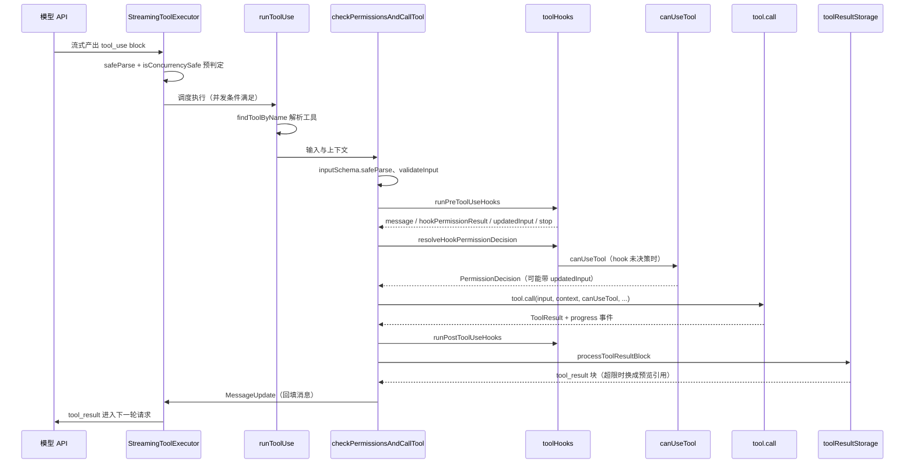
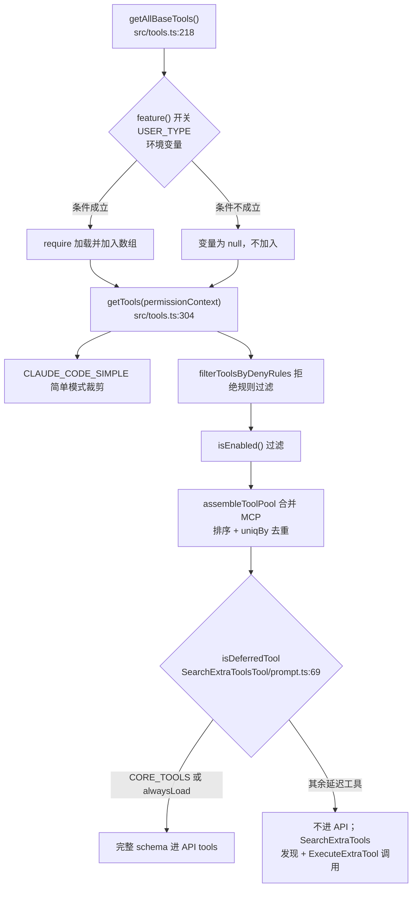

# Tool 模块：工具接口、注册与执行管道

## 1 模块概览

Tool 模块把「模型可调用的能力」统一建模为 `Tool` 对象：一份 zod schema 描述输入，一个 `call` 方法执行动作，一组钩子方法参与权限、并发、渲染与结果截断。模型产出 `tool_use` 之后，经过注册表解析、参数校验、PreToolUse hooks、权限判定、`call` 执行、PostToolUse hooks、结果截断与存储，最后以 `tool_result` 消息回填进对话。


涉及文件清单：

| 文件路径 | 职责 | 关键导出 |
|---|---|---|
| src/Tool.ts | Tool 类型定义、ToolUseContext、buildTool、名称查找 | Tool、Tools、ToolDef、buildTool、findToolByName、toolMatchesName |
| src/tools.ts | 工具注册表组装与过滤 | getAllBaseTools、getTools、assembleToolPool、getMergedTools、filterToolsByDenyRules |
| src/constants/tools.ts | CORE_TOOLS 白名单、子代理工具集合 | CORE_TOOLS、ALL_AGENT_DISALLOWED_TOOLS、ASYNC_AGENT_ALLOWED_TOOLS |
| packages/builtin-tools/src/index.ts | 内置工具包桶文件 | 各 Tool 对象的 re-export |
| packages/builtin-tools/src/tools/ | 具体工具实现（60 个工具目录） | FileEditTool、BashTool、AgentTool、ExitPlanModeV2Tool、SkillTool、MCPTool 等 |
| src/services/tools/toolExecution.ts | 单次工具调用的完整管道 | runToolUse、checkPermissionsAndCallTool |
| src/services/tools/StreamingToolExecutor.ts | 流式工具调度的并发控制 | StreamingToolExecutor |
| src/services/tools/toolHooks.ts | PreToolUse/PostToolUse hooks 执行 | runPreToolUseHooks、runPostToolUseHooks、resolveHookPermissionDecision |
| src/utils/toolResultStorage.ts | 结果持久化、预览与聚合预算 | processToolResultBlock、persistToolResult、getPersistenceThreshold、createContentReplacementState |
| src/services/mcp/client.ts | MCP 连接管理与工具获取 | fetchToolsForClient |
| src/hooks/useCanUseTool.tsx | 权限询问与决策 | CanUseToolFn、useCanUseTool |
| src/services/searchExtraTools/toolIndex.ts | 延迟工具 TF-IDF 索引与搜索 | buildToolIndex、searchTools、getToolIndex |
| src/utils/api.ts | Tool 到 API schema 的转换 | toolToAPISchema |
| src/constants/toolLimits.ts | 结果大小限制常量 | DEFAULT_MAX_RESULT_SIZE_CHARS、MAX_TOOL_RESULTS_PER_MESSAGE_CHARS |

## 2 核心概念

### 2.1 Tool 接口的字段设计

`Tool` 类型定义在 src/Tool.ts:373-706。字段按职责分成几组：

- 执行入口。`call(args, context, canUseTool, parentMessage, onProgress)` 是执行方法（src/Tool.ts:390-396）。`context: ToolUseContext` 携带 abortController、消息列表、setAppState、MCP 连接等会话环境（src/Tool.ts:149-310）；`canUseTool` 允许工具在执行过程中嵌套发起权限询问，子代理内部的工具调用复用同一权限函数。
- schema 字段。`inputSchema` 是 zod 类型（src/Tool.ts:405），`outputSchema` 可选（411），`inputJSONSchema` 供 MCP 工具直接提供 JSON Schema（406-408）。`inputsEquivalent(a, b)` 判定两次输入是否等价（412），供权限系统判断「同一命令再次询问」场景。
- 权限与安全。`checkPermissions(input, context)` 承载工具特有权限逻辑（src/Tool.ts:511-514）；`validateInput` 先于权限检查执行，返回带 errorCode 的业务校验结果（500-503）；`isReadOnly`（415）、`isDestructive`（417）、`isOpenWorld`（445）、`requiresUserInteraction`（446）为通用权限系统提供元数据。`isConcurrencySafe(input)`（413）决定并发调度，BashTool 直接委托给只读判定（packages/builtin-tools/src/tools/BashTool/BashTool.tsx:570-577）。
- 描述与展示。`description(input, options)` 按具体输入动态生成权限弹窗文案，`useCanUseTool` 在需要询问时调用它（src/hooks/useCanUseTool.tsx:107-111）。`prompt(options)` 生成进请求 tools 数组的说明文本（src/Tool.ts:529-534）；`toolToAPISchema` 用 `await tool.prompt(...)` 的输出填充 API tool 的 `description` 字段（src/utils/api.ts:169-178）。`userFacingName(input)` 生成界面上显示的工具名（535）。
- 生命周期与调度。`isEnabled()`（414）在注册表过滤阶段关闭工具；`interruptBehavior()` 返回 `'cancel' | 'block'`，决定用户中途发新消息时工具被取消还是继续执行（421-427）；`isSearchOrReadCommand` 供 UI 折叠搜索类输出（440-444）。
- 结果与存储。`mapToolResultToToolResultBlockParam(content, toolUseID)` 把 `call` 返回的数据映射成 API 的 `tool_result` 块（568-571）；`maxResultSizeChars` 声明本工具的结果持久化阈值（469-477）；`renderToolResultMessage`、`renderToolUseMessage` 等一组 render 方法负责终端展示。
- 扩展字段。`aliases` 支持工具改名后的旧名兼容（382），`runToolUse` 对别名做回退查找（src/services/tools/toolExecution.ts:379-385）；`searchHint` 是给延迟工具搜索的能力短语（389）；`mcpInfo` 记录 MCP 服务器与工具原名（466）；`shouldDefer`、`alwaysLoad` 参与延迟加载判定（453-460）。

`buildTool` 给七个方法提供保守默认值（src/Tool.ts:768-802）：`isConcurrencySafe` 默认 false（假定不安全）、`isReadOnly` 默认 false（假定会写入）、`checkPermissions` 默认放行交由通用权限系统处理。工具定义只需覆盖自己关心的部分，`ToolDef` 类型（732-737）让未覆盖字段保持可选。

### 2.2 inputSchema 用 zod 定义

FileEditTool 的输入 schema 定义在 packages/builtin-tools/src/tools/FileEditTool/types.ts:6-19：

```ts
const inputSchema = lazySchema(() =>
  z.strictObject({
    file_path: z.string().describe('The absolute path to the file to modify'),
    old_string: z.string().describe('The text to replace'),
    new_string: z
      .string()
      .describe(
        'The text to replace it with (must be different from old_string)',
      ),
    replace_all: semanticBoolean(
      z.boolean().default(false).optional(),
    ).describe('Replace all occurrences of old_string (default false)'),
  }),
)
```

四个设计点：

- 每个字段的 `.describe()` 会进入生成的 JSON Schema，成为模型阅读的参数说明。`toolToAPISchema` 通过 `zodToJsonSchema(tool.inputSchema)` 完成转换（src/utils/api.ts:157-161）。
- `lazySchema` 包装让 schema 在首次访问时才构建，工具定义中依赖 feature flag 的字段可以在运行时再决定。
- `z.strictObject` 拒绝未知字段；`z.infer` 直接得到 TypeScript 类型，`FileEditInput = z.output<InputSchema>`（types.ts:24），schema 同时承担运行时校验、API schema 生成、类型推导三种职责。
- 模型输出不可靠时用预处理兼容：`semanticBoolean` 接受字符串 "true"/"false"（types.ts:15-17）；BashTool 用 `fullInputSchema().omit({ _simulatedSedEdit: true })` 把内部字段从模型可见 schema 中隐藏（BashTool.tsx:336-348）。

`inputJSONSchema` 是旁路：MCP 工具的 schema 来自服务器，直接作为 JSON Schema 传递，无需 zod 转换（src/Tool.ts:406-408、src/services/mcp/client.ts:1825）。`strict: true` 的工具（FileEditTool.ts:86、BashTool.tsx:563）在 API 请求中附加 `strict` 字段，让服务端更严格地执行参数 schema（src/utils/api.ts:180-192）。

### 2.3 工具注册表：条件加载、延迟工具与 CORE_TOOLS

组装入口是 `getAllBaseTools()`（src/tools.ts:218-284），返回一个数组字面量，每个元素按条件加入：

- 模块顶部用条件 `require` 决定是否加载整份代码：`REPLTool` 只在 `process.env.USER_TYPE === 'ant'` 时加载（src/tools.ts:16-20），`SleepTool` 在 `feature('PROACTIVE') || feature('KAIROS')` 时加载（26-30），`GoalTool` 在 `feature('GOAL')` 时加载（91-94），`VerifyPlanExecutionTool` 在 `process.env.CLAUDE_CODE_VERIFY_PLAN === 'true'` 时加载（106-111）。
- 数组内条件展开：`hasEmbeddedSearchTools()` 为真时省略 Glob/Grep（226）；`ConfigTool`、`TungstenTool`、`REPLTool` 只在 ant 构建出现（242、244、260）；`TaskCreate/TaskGet/TaskUpdate/TaskList` 由 `isTodoV2Enabled()` 控制（247-249）；`LSPTool` 由 `ENABLE_LSP_TOOL` 环境变量控制（253）；worktree 工具由 `isWorktreeModeEnabled()` 控制（254）；`SearchExtraToolsTool` 用乐观判定加入（279），`ExecuteTool` 恒常存在（282）。
- `getTools(permissionContext)` 在基础列表上继续过滤（304-360）：`CLAUDE_CODE_SIMPLE` 简单模式只留 Bash/Read/Edit（305-331）；`specialTools` 剔除（334-338）；`filterToolsByDenyRules` 按权限拒绝规则过滤（343）；REPL 模式隐藏被 REPL 包装的原始工具（347-356）；最后执行 `isEnabled()` 过滤（358-359）。
- `assembleToolPool` 合并内置与 MCP 工具（378-399）：两个分区各自按名称排序后拼接，`uniqBy(..., 'name')` 去重，内置优先；排序保持内置工具为连续前缀，配合服务端 prompt 缓存断点设计（注释见 387-393）。

`CORE_TOOLS` 白名单定义在 src/constants/tools.ts:137-179：文件操作（SHELL_TOOL_NAMES、Read、Edit、Write、Glob、Grep、NotebookEdit）、Agent 与交互（Agent、AskUserQuestion）、任务管理（TaskOutput、TaskStop、TaskCreate、TaskGet、TaskList、TaskUpdate、TodoWrite）、规划（EnterPlanMode、ExitPlanMode、VerifyPlanExecution）、Web（WebFetch、WebSearch）、LSP、Skill、Workflow、Sleep、工具发现三件套（SearchExtraTools、ExecuteExtraTool、SyntheticOutput）。

延迟判定函数 `isDeferredTool` 定义在 packages/builtin-tools/src/tools/SearchExtraToolsTool/prompt.ts:69-78：`alwaysLoad === true` 的不延迟，`CORE_TOOLS.has(tool.name)` 的不延迟，其余全部延迟。API 请求时（src/services/api/claude.ts:1187-1199）延迟工具一律不进 tools 数组，模型先用 SearchExtraTools 发现、再用 ExecuteExtraTool 调用；tools JSON 跨轮稳定，保护 prompt cache。延迟工具的语义搜索在 src/services/searchExtraTools/toolIndex.ts：`buildToolIndex` 对每个延迟工具取 `tool.prompt()` 输出作为 description 文本，对 name、searchHint、description 分别以 3.0、2.5、1.0 权重计算 TF-IDF 向量（toolIndex.ts:33-37、80-149），`searchTools` 用余弦相似度排序返回（151-209）。

### 2.4 执行管道：hooks、权限、流式输出、结果截断与存储

单次工具调用从 `runToolUse(toolUse, assistantMessage, canUseTool, toolUseContext)` 开始（src/services/tools/toolExecution.ts:366-519），它是 async generator，yield 的类型是 `MessageUpdateLazy`（消息与可选的 contextModifier）。

- 解析与校验。先用 `findToolByName` 在「模型可见的工具集」中查找，找不到时回退 `getAllBaseTools()` 并按别名匹配（372-385）；工具不存在则直接产出一条 `tool_use_error` 结果（398-440）。随后 `checkPermissionsAndCallTool` 先做 `tool.inputSchema.safeParse(input)`（657），失败时用 `formatZodValidationError` 生成带修复指引的错误（658-663），再调用 `tool.validateInput`（724-775）。
- 输入回填。`backfillObservableInput` 在浅拷贝上执行（817-835）：hooks 与权限观察者看到扩展字段（FileEditTool 把 file_path 展开为绝对路径，FileEditTool.ts:111-117），而 `call()` 收到模型原始值，避免结果文案里的路径与输入不一致。
- PreToolUse hooks。`runPreToolUseHooks`（src/services/tools/toolHooks.ts:443-665）逐个 yield 六类结果：普通消息、hookPermissionResult（allow/ask/deny）、hookUpdatedInput（无决策只改输入）、preventContinuation、stopReason、stop。hooks 超时、取消、附加上下文都转成 attachment 消息进入对话。
- 权限判定。`resolveHookPermissionDecision`（toolHooks.ts:340-441）维护一条重要规则：hook 的 allow 不能绕过 settings.json 里的 deny/ask 规则，`checkRuleBasedPermissions` 仍然执行（381-413）；hook 无决策时走 `canUseTool`。`canUseTool` 由 `useCanUseTool` 构造（useCanUseTool.tsx:37-68）：先 `hasPermissionsToUseTool` 得到 allow/deny/ask，deny 直接返回，ask 进入交互弹窗 `handleInteractivePermission`（256-267），Bash 在弹窗前有 2 秒分类器宽限（199-253）。权限决策还可能携带 `updatedInput`，允许用户改完参数再执行（toolExecution.ts:1170-1174）。
- 执行。`tool.call` 只有一个调用点：`invokeToolCall`（toolExecution.ts:1248-1286），外层可选择包一层 skill-learning 观察钩子；进度经 `onProgress` 转成 progress 消息进入同一个 Stream（521-599）。
- PostToolUse hooks。`runPostToolUseHooks`（toolHooks.ts:39-195）处理 MCP 工具的输出替换（149-155）、blockingError、preventContinuation；失败路径单独走 `runPostToolUseFailureHooks`（197-327）。
- 流式并发。`StreamingToolExecutor`（src/services/tools/StreamingToolExecutor.ts:42-549）在工具随流到达时立即调度：入队时用 `inputSchema.safeParse` 与 `isConcurrencySafe(input)` 预先计算并发性（131-140）；并发安全工具可并行，非并发工具独占执行并阻塞后续（156-162）；结果按到达顺序 yield（439-467）；progress 消息立即转发（445-449）；Bash 出错会终止同批兄弟工具并生成合成错误消息（381-391）。
- 截断与存储。`addToolResult` 把结果交给 `processPreMappedToolResultBlock` 或 `processToolResultBlock`（toolExecution.ts:1478-1490），后者在 `maybePersistLargeToolResult` 中比较 `contentSize` 与阈值（src/utils/toolResultStorage.ts:272-334）。阈值经 `getPersistenceThreshold` 取 `min(工具声明值, 50_000)`（77、src/constants/toolLimits.ts:13）。超限结果写入 `projectDir/sessionId/tool-results/<toolUseId>.{txt,json}`（toolResultStorage.ts:97-117），用 `'wx'` 标志防止重复写入（162），模型只收到约 2000 字节预览加文件路径（109、189-199）。另有消息级聚合预算：单条 API 用户消息内所有 tool_result 合计超过 200_000 字符时，从最大的结果开始持久化替换（src/constants/toolLimits.ts:49、toolResultStorage.ts:669-692）。`ContentReplacementState` 用 `seenIds` 与 `replacements` 冻结历史判定，保证每次重放产出字节一致的替换文案，维护 prompt cache（390-397、641-667）。

### 2.5 复合工具：AgentTool 与 ExitPlanMode

AgentTool 用工具实现「生成一个 agent」。输入 schema 含 `prompt`、`subagent_type`、`description`、`run_in_background` 等（AgentTool.tsx:194-205）；输出 schema 是两个分支的 union：同步 `status: 'completed'` 或异步 `status: 'async_launched'`（221-240）。`call` 先处理团队与 fork 路由（322-419），再进入子代理执行。`isReadOnly()` 恒返回 true，注释说明权限检查交给底层工具（1458-1460）；`isConcurrencySafe()` 恒返回 true（1467-1469）。它的 `prompt()` 是动态的：按当前 MCP 服务器与权限规则过滤可用 agents 后才生成说明文本（285-308）。

ExitPlanModeV2Tool 用工具把控制权交回用户。`checkPermissions` 返回 `{ behavior: 'ask', message: 'Exit plan mode?' }`（ExitPlanModeV2Tool.ts:221-239），触发权限弹窗；`requiresUserInteraction()` 对主线程返回 true（185-194）；`validateInput` 拒绝在 plan 模式之外调用（195-220）。用户批准后 `call` 把 `toolPermissionContext.mode` 从 `plan` 恢复到 `prePlanMode`（357-403），`mapToolResultToToolResultBlockParam` 返回「User has approved your plan. You can now start coding.」（481-492），模型收到这条 tool_result 后继续实施计划。计划模式的进入由同目录的 EnterPlanModeTool 负责。

### 2.6 MCP 适配：外部工具进入内置形态

MCPTool（packages/builtin-tools/src/tools/MCPTool/MCPTool.ts:27-77）是模板：`name: 'mcp'` 占位、`isMcp: true`、`inputSchema` 用空对象 passthrough（14-15）、`checkPermissions` 返回 passthrough（56-61）、各方法标注「Overridden in mcpClient.ts」。

`fetchToolsForClient`（src/services/mcp/client.ts:1755-2010）向服务器发 `tools/list`，对每个返回的工具展开 `{ ...MCPTool, 覆盖字段 }`（1779-2001）：

- `name` 用 `buildMcpToolName` 生成 `mcp__server__tool` 形式，SDK 服务器在 `CLAUDE_AGENT_SDK_MCP_NO_PREFIX` 模式下用原名（1772-1786）。
- `mcpInfo` 记录服务器名与工具原名，供权限与展示使用（1786）。
- `description`、`prompt` 使用服务器的 description，超长按 `MAX_MCP_DESCRIPTION_LENGTH` 截断（1798-1806）。
- `isConcurrencySafe`、`isReadOnly` 读 `annotations.readOnlyHint`，`isDestructive` 读 `destructiveHint`，`isOpenWorld` 读 `openWorldHint`（1807-1821）。
- `inputJSONSchema: tool.inputSchema` 直接透传 JSON Schema（1825）。
- `alwaysLoad` 读 `_meta['anthropic/alwaysLoad']`，`searchHint` 读 `_meta['anthropic/searchHint']`（1791-1797）。
- `checkPermissions` 返回 passthrough 并附带「允许该工具」的规则建议（1826-1844）。
- `call` 走 `callMCPToolWithUrlElicitationRetry`，携带 `claudecode/toolUseId` 元数据、进度转发、会话过期重试一次（1845-1983）。
- `userFacingName` 显示「server - 工具名 (MCP)」（1984-1988）。

转换后的对象就是标准 `Tool`，执行管道、权限、截断、UI 全部复用内置路径。

## 3 关键流程

### 3.1 一次工具调用的完整管道



分步讲解：

1. 模型流式返回 `tool_use`，`StreamingToolExecutor.addTool` 接收并按并发规则决定启动时机（src/services/tools/StreamingToolExecutor.ts:90-151）。
2. `runToolUse` 用 `findToolByName` 解析工具，失败回退别名匹配，再确认 abort 状态（src/services/tools/toolExecution.ts:366-385、444-482）。
3. `checkPermissionsAndCallTool` 先 zod 校验再业务校验（toolExecution.ts:656-775），随后在浅拷贝上执行 `backfillObservableInput`（817-835）。
4. `runPreToolUseHooks` 逐个执行 PreToolUse hooks，产出消息与权限决策（src/services/tools/toolHooks.ts:443-665）。
5. `resolveHookPermissionDecision` 合并 hook 决策与规则检查，必要时调用 `canUseTool`（toolHooks.ts:340-441；src/hooks/useCanUseTool.tsx:37-68）。
6. 权限为 allow 时进入唯一调用点 `invokeToolCall` 执行 `tool.call`（toolExecution.ts:1248-1286）。
7. `runPostToolUseHooks` 执行 PostToolUse hooks，MCP 工具可替换输出（toolHooks.ts:39-195）。
8. `addToolResult` 中 `processPreMappedToolResultBlock` 执行阈值判定与持久化（toolExecution.ts:1478-1490；src/utils/toolResultStorage.ts:272-334）。
9. 结果消息连同 acceptFeedback、图片块、contextModifier 一起 push 进 `resultingMessages`（toolExecution.ts:1478-1548）。
10. `StreamingToolExecutor` 按序 yield 消息，`markToolUseAsComplete` 清理 in-progress 集合（StreamingToolExecutor.ts:439-467、551-560）。

### 3.2 工具注册表组装



分步讲解：

1. `getAllBaseTools` 返回内置工具全量数组，条件加载在模块顶部与数组字面量两层完成（src/tools.ts:16-59、218-284）。
2. `getTools` 处理简单模式、拒绝规则与 `isEnabled`（src/tools.ts:304-360）。
3. `assembleToolPool` 把内置与 MCP 工具合并，分区排序后 `uniqBy` 去重，内置优先（src/tools.ts:378-399）。
4. 请求构建阶段 `isDeferredTool` 逐工具判定（SearchExtraToolsTool/prompt.ts:69-78），延迟工具从 API tools 数组剔除（src/services/api/claude.ts:1187-1199）。
5. 延迟工具经 SearchExtraTools 的 TF-IDF 索引发现（src/services/searchExtraTools/toolIndex.ts:80-209），再用 ExecuteExtraTool 按 `tool_name + params` 调用（SearchExtraToolsTool/prompt.ts:30-50）。

## 4 关键代码精读

### 4.1 Tool 类型定义头部

`src/Tool.ts:373-411`

```ts
export type Tool<
  Input extends AnyObject = AnyObject,
  Output = unknown,
  P extends ToolProgressData = ToolProgressData,
> = {
  aliases?: string[]
  searchHint?: string
  call(
    args: z.infer<Input>,
    context: ToolUseContext,
    canUseTool: CanUseToolFn,
    parentMessage: AssistantMessage,
    onProgress?: ToolCallProgress<P>,
  ): Promise<ToolResult<Output>>
  description(
    input: z.infer<Input>,
    options: {
      isNonInteractiveSession: boolean
      toolPermissionContext: ToolPermissionContext
      tools: Tools
    },
  ): Promise<string>
  readonly inputSchema: Input
  inputJSONSchema?: ToolInputJSONSchema
  outputSchema?: z.ZodType<unknown>
```

讲解：`Tool` 是泛型类型，`Input` 绑定 zod schema、`Output` 绑定返回值。`call` 的参数列表定下执行时需要的一切：解析后的输入、会话上下文、权限函数、触发它的 assistant 消息、进度回调。`description(input, options)` 接收具体输入，因此每个工具的权限弹窗文案可以按参数生成。`inputJSONSchema` 的存在说明 schema 来源有两种：zod 转换与 JSON Schema 直接提供。

### 4.2 TOOL_DEFAULTS 与 buildTool

`src/Tool.ts:768-802`

```ts
const TOOL_DEFAULTS = {
  isEnabled: () => true,
  isConcurrencySafe: (_input?: unknown) => false,
  isReadOnly: (_input?: unknown) => false,
  isDestructive: (_input?: unknown) => false,
  checkPermissions: (
    input: { [key: string]: unknown },
    _ctx?: ToolUseContext,
  ): Promise<PermissionResult> =>
    Promise.resolve({ behavior: 'allow', updatedInput: input }),
  toAutoClassifierInput: (_input?: unknown) => '',
  userFacingName: (_input?: unknown) => '',
}

export function buildTool<D extends AnyToolDef>(def: D): BuiltTool<D> {
  return {
    ...TOOL_DEFAULTS,
    userFacingName: () => def.name,
    ...def,
  } as BuiltTool<D>
}
```

讲解：`buildTool` 用对象展开把默认值与工具定义合并，`userFacingName` 先设成 `() => def.name` 再被 `...def` 覆盖。默认值全部取保守方向：并发默认不安全、默认视为写入、权限默认放行交由通用系统。`ToolDef` 类型（src/Tool.ts:732-737）把这七个键变成可选，`BuiltTool<D>`（746-752）在类型层面还原合并结果，调用方永远看到完整的 `Tool`。所有内置工具都经过这个工厂，各工具共享同一份默认语义。

### 4.3 执行管道中的单一 call 调用点

`src/services/tools/toolExecution.ts:1256-1286`

```ts
    const invokeToolCall = () =>
      tool.call(
        callInput,
        {
          ...toolUseContext,
          toolUseId: toolUseID,
          userModified: permissionDecision.userModified ?? false,
        },
        canUseTool,
        assistantMessage,
        progress => {
          onToolProgress({
            toolUseID: progress.toolUseID,
            data: progress.data,
          })
        },
      )
    const result = isSkillLearningEnabled()
      ? await (async () => {
          const { runToolCallWithSkillLearningHooks } =
            await getSkillLearningWrapper()
          return runToolCallWithSkillLearningHooks(
            tool.name,
            callInput,
            { sessionId: (toolUseContext as { sessionId?: string }).sessionId },
            invokeToolCall,
          )
        })()
      : await invokeToolCall()
```

讲解：全仓库只有这一个 `tool.call` 调用点。传入的 `callInput` 与 hooks/权限观察到的 `processedInput` 分开：回填克隆没有被 hook 或权限替换时，`call()` 拿到模型原始字段值，保证结果文案与传输记录稳定（toolExecution.ts:1223-1247）。skill-learning 包装是可选的旁路观察者，flag 关闭时直接走 `invokeToolCall`，热路径零开销。进度回调在这里统一接入外层的 Stream，最终以 progress 消息形式流式上屏。

### 4.4 MCP 工具转换为内置 Tool 形态

`src/services/mcp/client.ts:1779-1825`

```ts
      return toolsToProcess
        .map((tool): Tool => {
          const fullyQualifiedName = buildMcpToolName(client.name, tool.name)
          return {
            ...MCPTool,
            name: skipPrefix ? tool.name : fullyQualifiedName,
            mcpInfo: { serverName: client.name, toolName: tool.name },
            isMcp: true,
            searchHint:
              typeof tool._meta?.['anthropic/searchHint'] === 'string'
                ? tool._meta['anthropic/searchHint']
                    .replace(/\s+/g, ' ')
                    .trim() || undefined
                : undefined,
            alwaysLoad: tool._meta?.['anthropic/alwaysLoad'] === true,
            async description() {
              return tool.description ?? ''
            },
            async prompt() {
              const desc = tool.description ?? ''
              return desc.length > MAX_MCP_DESCRIPTION_LENGTH
                ? desc.slice(0, MAX_MCP_DESCRIPTION_LENGTH) + '… [truncated]'
                : desc
            },
            isConcurrencySafe() {
              return tool.annotations?.readOnlyHint ?? false
            },
            isReadOnly() {
              return tool.annotations?.readOnlyHint ?? false
            },
            toAutoClassifierInput(input) {
              return mcpToolInputToAutoClassifierInput(input, tool.name)
            },
            isDestructive() {
              return tool.annotations?.destructiveHint ?? false
            },
            isOpenWorld() {
              return tool.annotations?.openWorldHint ?? false
            },
            isSearchOrReadCommand() {
              return classifyMcpToolForCollapse(client.name, tool.name)
            },
            inputJSONSchema: tool.inputSchema as Tool['inputJSONSchema'],
```

讲解：`{ ...MCPTool, 覆盖 }` 是适配器模式的核心动作。模板提供 UI、render、`mapToolResultToToolResultBlockParam` 等与协议无关的部分；覆盖的部分把 MCP 协议的 annotations 翻译进 Tool 字段（readOnlyHint 对应 isReadOnly 与 isConcurrencySafe、destructiveHint 对应 isDestructive、openWorldHint 对应 isOpenWorld），把 `inputSchema`（JSON Schema）放进 `inputJSONSchema`，把描述放进 `description`、`prompt`。`alwaysLoad` 与 `searchHint` 从 `_meta` 的 `anthropic/*` 前缀键读取，这是外部服务器参与本仓库延迟加载机制的通道。

### 4.5 大结果的持久化与预览

`src/utils/toolResultStorage.ts:272-318`

```ts
async function maybePersistLargeToolResult(
  toolResultBlock: ToolResultBlockParam,
  toolName: string,
  persistenceThreshold?: number,
): Promise<ToolResultBlockParam> {
  const content = toolResultBlock.content

  if (isToolResultContentEmpty(content)) {
    logEvent('tengu_tool_empty_result', {
      toolName: sanitizeToolNameForAnalytics(toolName),
    })
    return {
      ...toolResultBlock,
      content: `(${toolName} completed with no output)`,
    }
  }
  if (!content) {
    return toolResultBlock
  }
  if (hasImageBlock(content)) {
    return toolResultBlock
  }

  const size = contentSize(content)

  const threshold = persistenceThreshold ?? MAX_TOOL_RESULT_BYTES
  if (size <= threshold) {
    return toolResultBlock
  }

  const result = await persistToolResult(content, toolResultBlock.tool_use_id)
  if (isPersistError(result)) {
    return toolResultBlock
  }
```

讲解：函数对每条结果做四道判定：空结果补一句占位文案（部分模型在空 tool_result 后停止输出，注释见 280-286）；无内容与含图像块直接放行；大小超过阈值才持久化。持久化失败时原样返回完整内容，保证功能可用性优先于节省上下文。阈值计算在 `getPersistenceThreshold`（55-78）：工具声明的 `maxResultSizeChars` 与全局 50_000 字符取较小值，声明 `Infinity` 的工具完全退出持久化。

## 5 设计思想

1. schema 驱动。一份 zod 定义同时产出运行时校验、API JSON Schema 与 TypeScript 类型；`inputJSONSchema` 旁路让外部 schema 来源无缝接入。校验放在执行管道最前端（toolExecution.ts:657），模型参数错误转成带指引的错误文案，降低无效调用的代价。
2. 描述生成进 prompt。`tool.prompt()` 的输出直接成为 API tool 的 description（src/utils/api.ts:169-178），而且 prompt 是动态函数：AgentTool 按当前权限上下文过滤 agents 后生成说明（AgentTool.tsx:285-308）。工具可用性变化会即时反映到模型收到的文本里。`description(input)` 按具体参数生成权限文案（useCanUseTool.tsx:107-111），同一工具的每一次询问都可以携带上下文。
3. hooks 环绕执行加权限分层。PreToolUse 决策、hook allow、deny/ask 规则、交互弹窗是四个层次，`resolveHookPermissionDecision` 规定 hook 的 allow 仍受规则约束（toolHooks.ts:340-441）。hook 可以只改输入（hookUpdatedInput）或只给提示，每一种副作用都有独立的消息类型。
4. 结果截断换上下文预算。单条结果超阈值写入磁盘并返回 2000 字节预览；同一条 API 用户消息内的结果合计还有聚合预算；`ContentReplacementState` 冻结历史判定保证重放字节一致。上下文预算与 prompt cache 稳定性在这里交汇。
5. 单一执行入口加流适配。全仓库唯一 `tool.call` 调用点让横切逻辑（skill-learning 观察、进度转发、遥测）只写一次；`Stream` 把进度与最终结果合并成同一条 async iterable（toolExecution.ts:521-599），上层只消费一种类型。
6. 并发调度模型。并发安全由输入决定（`isConcurrencySafe(input)`），入队时预计算，调度器让安全工具并行、非安全工具独占并按序回填，Bash 失败级联取消兄弟工具（StreamingToolExecutor.ts:131-162、381-391、439-467）。这套规则把「模型并行调用多个工具」约束成可预测的执行顺序。
7. 可迁移到其他 agent 项目的做法：给工具定义统一的接口与默认值工厂；用 zod schema 单源生成类型与 API schema；把工具描述做成可动态计算的函数；用 hooks 层包裹执行并让权限分层可插拔；把大结果持久化到会话目录并回传引用；把并发策略放进调度器，工具只声明自身性质。
