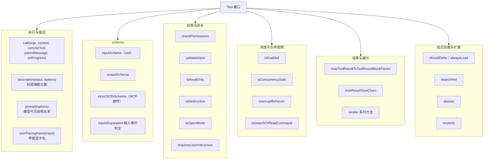
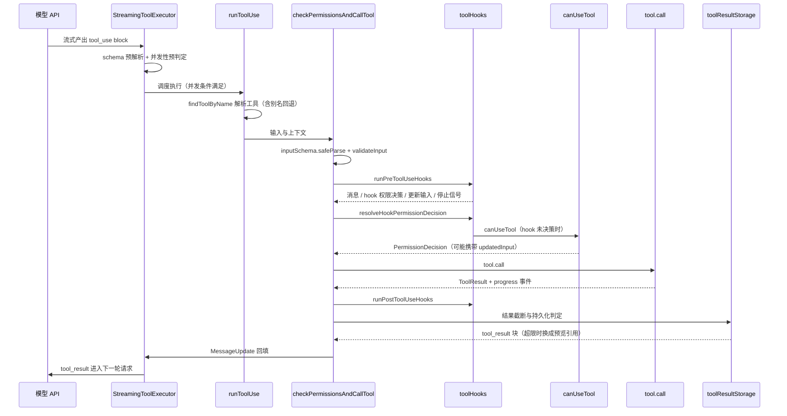
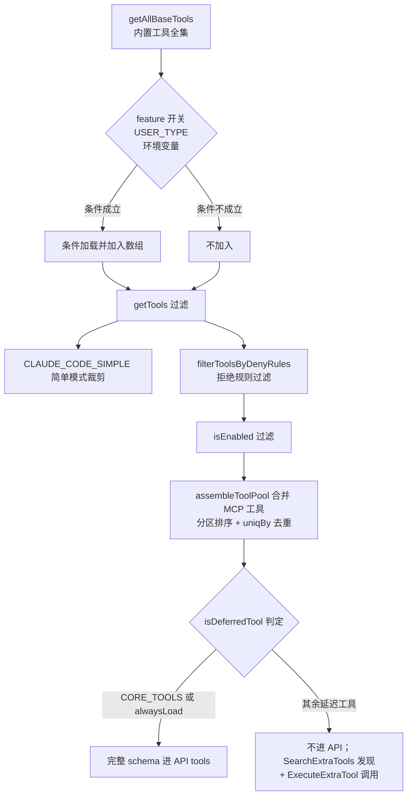
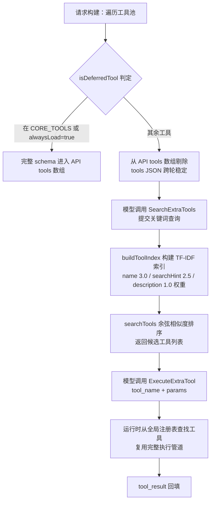

# Tool 模块：工具接口、注册与执行管道

## 1 模块概览

Tool 模块把「模型可调用的能力」统一建模为 `Tool` 对象：一份 zod schema 描述输入，一个 `call` 方法执行动作，一组钩子方法参与权限、并发、渲染与结果截断。模型产出 `tool_use` 之后，经过注册表解析、参数校验、PreToolUse hooks、权限判定、`call` 执行、PostToolUse hooks、结果截断与存储，最后以 `tool_result` 消息回填进对话。


整个模块由九个组件构成：

- `Tool` 接口与 `buildTool` 工厂：定义所有工具的统一形状与保守默认值。
- 工具注册表：`getAllBaseTools`、`getTools`、`assembleToolPool` 三级组装与过滤。
- `CORE_TOOLS` 白名单与延迟工具三件套：`isDeferredTool`、`SearchExtraTools`、`ExecuteExtraTool`，配合 TF-IDF 索引做按需发现。
- 执行管道：`runToolUse`、`checkPermissionsAndCallTool`、hooks 执行器与权限判定函数。
- `StreamingToolExecutor`：流式工具调用的并发调度器。
- `toolResultStorage`：结果截断、持久化与聚合预算。
- 复合工具：`AgentTool` 用工具生成子代理，`ExitPlanMode` 用工具把控制权交还用户。
- `MCPTool` 适配器：外部 MCP 工具获得与内置工具相同的接口形态。

## 2 核心组件与职责

### 2.1 Tool 接口的字段分组

`Tool` 是泛型类型：`Input` 绑定 zod schema，`Output` 绑定返回值。字段按职责分成六组：



各组字段的用途：

- **执行与描述**。`call` 的参数列表定下执行时需要的一切：解析后的输入、会话上下文、权限函数、触发它的 assistant 消息、进度回调。`context: ToolUseContext` 携带 abortController、消息列表、setAppState、MCP 连接等会话环境；`canUseTool` 允许工具在执行过程中嵌套发起权限询问，子代理内部的工具调用复用同一权限函数。`description(input, options)` 接收具体输入，因此每个工具的权限弹窗文案可以按参数生成；`prompt(options)` 的输出进入 API tools 数组，是模型读到的说明文本；`userFacingName` 生成界面显示名。
- **schema**。`inputSchema` 是 zod 类型，同时承担运行时校验、API JSON Schema 生成与 TypeScript 类型推导三种职责；`outputSchema` 可选；`inputJSONSchema` 是旁路，MCP 工具的 schema 来自服务器，直接作为 JSON Schema 传递，无需 zod 转换。`inputsEquivalent(a, b)` 判定两次输入是否等价，供权限系统判断「同一命令再次询问」场景。
- **权限与安全**。`checkPermissions` 承载工具特有权限逻辑；`validateInput` 先于权限检查执行，返回带 errorCode 的业务校验结果；`isReadOnly`、`isDestructive`、`isOpenWorld`、`requiresUserInteraction` 为通用权限系统提供元数据。`isConcurrencySafe(input)` 接收输入、按输入内容决定并发调度。
- **调度与生命周期**。`isEnabled` 在注册表过滤阶段关闭工具；`interruptBehavior` 返回 `'cancel' | 'block'`，决定用户中途发新消息时工具被取消还是继续执行；`isSearchOrReadCommand` 供 UI 折叠搜索类输出。
- **结果与展示**。`mapToolResultToToolResultBlockParam(content, toolUseID)` 把 `call` 返回的数据映射成 API 的 `tool_result` 块；`maxResultSizeChars` 声明本工具的结果持久化阈值；`renderToolResultMessage`、`renderToolUseMessage` 等一组 render 方法负责终端展示。
- **延迟加载与扩展**。`aliases` 支持工具改名后的旧名兼容；`searchHint` 是给延迟工具搜索的能力短语；`mcpInfo` 记录 MCP 服务器与工具原名；`shouldDefer`、`alwaysLoad` 参与延迟加载判定。

接口头部定义：

```ts
export type Tool<
  Input extends AnyObject = AnyObject,
  Output = unknown,
  P extends ToolProgressData = ToolProgressData,
> = {
  aliases?: string[]
  searchHint?: string
  call(
    args: z.infer<Input>,
    context: ToolUseContext,
    canUseTool: CanUseToolFn,
    parentMessage: AssistantMessage,
    onProgress?: ToolCallProgress<P>,
  ): Promise<ToolResult<Output>>
  description(
    input: z.infer<Input>,
    options: {
      isNonInteractiveSession: boolean
      toolPermissionContext: ToolPermissionContext
      tools: Tools
    },
  ): Promise<string>
  readonly inputSchema: Input
  inputJSONSchema?: ToolInputJSONSchema
  outputSchema?: z.ZodType<unknown>
```

### 2.2 buildTool 与 TOOL_DEFAULTS

`buildTool` 给七个方法提供保守默认值：`isConcurrencySafe` 默认 false（假定不安全）、`isReadOnly` 默认 false（假定会写入）、`isDestructive` 默认 false、`checkPermissions` 默认放行交由通用权限系统处理、`toAutoClassifierInput` 默认返回空串、`userFacingName` 默认取工具名。工具定义只需覆盖自己关心的部分，`ToolDef` 类型把这七个键变成可选，`BuiltTool` 在类型层面还原合并结果，调用方永远看到完整的 `Tool`。所有内置工具都经过这个工厂，共享同一份默认语义。

默认值与工厂的合并写法：

```ts
const TOOL_DEFAULTS = {
  isEnabled: () => true,
  isConcurrencySafe: (_input?: unknown) => false,
  isReadOnly: (_input?: unknown) => false,
  isDestructive: (_input?: unknown) => false,
  checkPermissions: (
    input: { [key: string]: unknown },
    _ctx?: ToolUseContext,
  ): Promise<PermissionResult> =>
    Promise.resolve({ behavior: 'allow', updatedInput: input }),
  toAutoClassifierInput: (_input?: unknown) => '',
  userFacingName: (_input?: unknown) => '',
}

export function buildTool<D extends AnyToolDef>(def: D): BuiltTool<D> {
  return {
    ...TOOL_DEFAULTS,
    userFacingName: () => def.name,
    ...def,
  } as BuiltTool<D>
}
```

`userFacingName` 先设成 `() => def.name` 再被 `...def` 覆盖；默认值全部取保守方向，工具声明什么就覆盖什么，未声明的字段保持「安全下限」。

### 2.3 工具注册表的三级组装

组装入口是 `getAllBaseTools()`，返回内置工具全量数组，条件加载分两层完成：

- **模块顶部条件加载**：整份代码只在条件成立时才进入模块图。`REPLTool` 只在特定用户类型时加载，`SleepTool` 在对应 feature 开启时加载，`GoalTool`、`VerifyPlanExecutionTool` 等各有自己的环境变量或 feature 门控。
- **数组内条件展开**：`hasEmbeddedSearchTools()` 为真时省略 Glob/Grep；部分工具只在特定构建出现；任务四件套由 `isTodoV2Enabled()` 控制；`LSPTool` 由环境变量控制；worktree 工具由对应开关控制；`SearchExtraToolsTool` 用乐观判定加入，`ExecuteTool` 恒常存在。

第二级是 `getTools(permissionContext)`，在基础列表上继续过滤：`CLAUDE_CODE_SIMPLE` 简单模式只留 Bash/Read/Edit；剔除需要特殊注入时机的工具；`filterToolsByDenyRules` 按权限拒绝规则过滤，模型看不到被整体拒绝的工具；REPL 模式隐藏被 REPL 包装的原始工具；最后执行 `isEnabled()` 过滤。

第三级是 `assembleToolPool`，合并内置与 MCP 工具：两个分区各自按名称排序后拼接，`uniqBy(..., 'name')` 去重，内置优先；排序保持内置工具为连续前缀，配合服务端 prompt 缓存断点设计，MCP 工具的增删只影响自己所在的分区。

### 2.4 CORE_TOOLS 与延迟工具

`CORE_TOOLS` 是核心工具白名单：文件操作（Bash/PowerShell、Read、Edit、Write、Glob、Grep、NotebookEdit）、Agent 与交互（Agent、AskUserQuestion）、任务管理（TaskOutput、TaskStop、任务四件套、TodoWrite）、规划（EnterPlanMode、ExitPlanMode、VerifyPlanExecution）、Web（WebFetch、WebSearch）、LSP、Skill、Workflow、Sleep、工具发现三件套（SearchExtraTools、ExecuteExtraTool、SyntheticOutput）。

延迟判定函数 `isDeferredTool` 的规则：`alwaysLoad === true` 的工具不延迟，`CORE_TOOLS` 里的工具不延迟，其余全部延迟。API 请求构建时，延迟工具一律不进 tools 数组，模型先用 `SearchExtraTools` 发现、再用 `ExecuteExtraTool` 调用；tools JSON 跨轮稳定，保护 prompt cache。

延迟工具的语义搜索由 TF-IDF 索引支撑：`buildToolIndex` 对每个延迟工具取 `tool.prompt()` 输出作为 description 文本，对 name、searchHint、description 分别以 3.0、2.5、1.0 权重计算 TF-IDF 向量，`searchTools` 用余弦相似度排序返回候选。

### 2.5 执行管道组件

单次工具调用从 `runToolUse(toolUse, assistantMessage, canUseTool, toolUseContext)` 开始，它是 async generator，yield 的类型是 `MessageUpdateLazy`（消息与可选的 contextModifier）。管道各阶段的组件：

- **解析与校验**。先用 `findToolByName` 在「模型可见的工具集」中查找，找不到时回退全量注册表并按别名匹配；工具不存在则直接产出一条 `tool_use_error` 结果。随后 `checkPermissionsAndCallTool` 先做 `tool.inputSchema.safeParse(input)`，失败时用 `formatZodValidationError` 生成带修复指引的错误，再调用 `tool.validateInput` 做业务校验。
- **输入回填**。`backfillObservableInput` 在浅拷贝上执行：hooks 与权限观察者看到扩展字段（例如 FileEditTool 把 file_path 展开为绝对路径），`call()` 收到模型原始值，避免结果文案里的路径与输入不一致。
- **PreToolUse hooks**。`runPreToolUseHooks` 逐个产出六类结果：普通消息、hookPermissionResult（allow/ask/deny）、hookUpdatedInput（无决策只改输入）、preventContinuation、stopReason、stop。hooks 超时、取消、附加上下文都转成 attachment 消息进入对话。
- **权限判定**。`resolveHookPermissionDecision` 维护一条重要规则：hook 的 allow 不能绕过配置里的 deny/ask 规则，规则检查仍然执行；hook 无决策时走 `canUseTool`。`canUseTool` 先经 `hasPermissionsToUseTool` 得到 allow/deny/ask，deny 直接返回，ask 进入交互弹窗，Bash 在弹窗前有 2 秒分类器宽限。权限决策还可能携带 `updatedInput`，允许用户改完参数再执行。
- **执行**。`tool.call` 只有一个调用点 `invokeToolCall`，外层可选择包一层 skill-learning 观察钩子；进度经 `onProgress` 转成 progress 消息进入同一个 Stream。
- **PostToolUse hooks**。`runPostToolUseHooks` 处理 MCP 工具的输出替换、blockingError、preventContinuation；失败路径单独走 `runPostToolUseFailureHooks`。

### 2.6 StreamingToolExecutor：并发调度

`StreamingToolExecutor` 在工具随流到达时立即调度：入队时用 `inputSchema.safeParse` 与 `isConcurrencySafe(input)` 预先计算并发性；并发安全工具可并行，非并发工具独占执行并阻塞后续；结果按到达顺序 yield；progress 消息立即转发；Bash 出错会终止同批兄弟工具并生成合成错误消息。这套规则把「模型并行调用多个工具」约束成可预测的执行顺序。

### 2.7 toolResultStorage：结果持久化与聚合预算

`maybePersistLargeToolResult` 对每条结果做四道判定：空结果补一句占位文案（部分模型在空 tool_result 后停止输出）；无内容直接放行；含图像块直接放行；大小超过阈值才持久化。持久化失败时原样返回完整内容，保证功能可用性优先于节省上下文。

阈值经 `getPersistenceThreshold` 取「工具声明的 `maxResultSizeChars` 与全局 50_000 字符」的较小值，声明 `Infinity` 的工具完全退出持久化。超限结果写入会话目录下的工具结果目录，文件名以 toolUseId 命名，用 `'wx'` 标志防止重复写入；模型只收到约 2000 字节预览加文件路径。

另有消息级聚合预算：单条 API 用户消息内所有 tool_result 合计超过 200_000 字符时，从最大的结果开始持久化替换。`ContentReplacementState` 用 `seenIds` 与 `replacements` 冻结历史判定，保证每次重放产出字节一致的替换文案，维护 prompt cache。

### 2.8 复合工具：AgentTool 与 ExitPlanMode

`AgentTool` 用工具实现「生成一个 agent」。输入 schema 含 `prompt`、`subagent_type`、`description`、`run_in_background` 等；输出 schema 是两个分支的 union：同步 `status: 'completed'` 或异步 `status: 'async_launched'`。`call` 先处理团队与 fork 路由，再进入子代理执行。`isReadOnly()` 恒返回 true，权限检查交给底层工具；`isConcurrencySafe()` 恒返回 true。它的 `prompt()` 是动态的：按当前 MCP 服务器与权限规则过滤可用 agents 后才生成说明文本。

`ExitPlanMode` 用工具把控制权交回用户。`checkPermissions` 返回 `{ behavior: 'ask', message: 'Exit plan mode?' }`，触发权限弹窗；`requiresUserInteraction()` 对主线程返回 true；`validateInput` 拒绝在 plan 模式之外调用。用户批准后 `call` 把权限模式从 `plan` 恢复到进入前的模式，`mapToolResultToToolResultBlockParam` 返回「User has approved your plan. You can now start coding.」，模型收到这条 tool_result 后继续实施计划。计划模式的进入由同族的 EnterPlanModeTool 负责。

### 2.9 MCPTool 适配器：外部工具进入内置形态

`MCPTool` 是模板：`name: 'mcp'` 占位、`isMcp: true`、`inputSchema` 用空对象 passthrough、`checkPermissions` 返回 passthrough，其余方法在适配层覆盖。

`fetchToolsForClient` 向服务器发 `tools/list`，对每个返回的工具展开 `{ ...MCPTool, 覆盖字段 }`：

- `name` 生成 `mcp__server__tool` 形式，SDK 服务器在无前缀模式下用原名；
- `mcpInfo` 记录服务器名与工具原名，供权限与展示使用；
- `description`、`prompt` 使用服务器的 description，超长按上限截断；
- `isConcurrencySafe`、`isReadOnly` 读 `annotations.readOnlyHint`，`isDestructive` 读 `destructiveHint`，`isOpenWorld` 读 `openWorldHint`；
- `inputJSONSchema` 直接透传 JSON Schema；
- `alwaysLoad`、`searchHint` 读 `_meta` 的 `anthropic/*` 前缀键；
- `checkPermissions` 返回 passthrough 并附带「允许该工具」的规则建议；
- `call` 走 `callMCPToolWithUrlElicitationRetry`，携带 `claudecode/toolUseId` 元数据、进度转发、会话过期重试一次；
- `userFacingName` 显示「server - 工具名 (MCP)」。

转换的覆盖写法：

```ts
return toolsToProcess
  .map((tool): Tool => {
    const fullyQualifiedName = buildMcpToolName(client.name, tool.name)
    return {
      ...MCPTool,
      name: skipPrefix ? tool.name : fullyQualifiedName,
      mcpInfo: { serverName: client.name, toolName: tool.name },
      isMcp: true,
      searchHint:
        typeof tool._meta?.['anthropic/searchHint'] === 'string'
          ? tool._meta['anthropic/searchHint']
              .replace(/\s+/g, ' ')
              .trim() || undefined
          : undefined,
      alwaysLoad: tool._meta?.['anthropic/alwaysLoad'] === true,
      async description() {
        return tool.description ?? ''
      },
      async prompt() {
        const desc = tool.description ?? ''
        return desc.length > MAX_MCP_DESCRIPTION_LENGTH
          ? desc.slice(0, MAX_MCP_DESCRIPTION_LENGTH) + '… [truncated]'
          : desc
      },
      isConcurrencySafe() {
        return tool.annotations?.readOnlyHint ?? false
      },
      isReadOnly() {
        return tool.annotations?.readOnlyHint ?? false
      },
      isDestructive() {
        return tool.annotations?.destructiveHint ?? false
      },
      isOpenWorld() {
        return tool.annotations?.openWorldHint ?? false
      },
      inputJSONSchema: tool.inputSchema as Tool['inputJSONSchema'],
```

模板提供 UI、render、`mapToolResultToToolResultBlockParam` 等与协议无关的部分；覆盖的部分把 MCP 协议的 annotations 翻译进 Tool 字段。转换后的对象就是标准 `Tool`，执行管道、权限、截断、UI 全部复用内置路径，MCP 服务器从协议层面参与延迟加载机制。

## 3 关键流程

### 3.1 一次工具调用的完整管道



分步讲解：

1. 模型流式返回 `tool_use`，`StreamingToolExecutor.addTool` 接收并按并发规则决定启动时机。
2. `runToolUse` 用 `findToolByName` 解析工具，失败回退别名匹配，再确认 abort 状态。
3. `checkPermissionsAndCallTool` 先做 zod 校验再做业务校验，随后在浅拷贝上执行 `backfillObservableInput`。
4. `runPreToolUseHooks` 逐个执行 PreToolUse hooks，产出消息与权限决策。
5. `resolveHookPermissionDecision` 合并 hook 决策与规则检查，必要时调用 `canUseTool`。
6. 权限为 allow 时进入唯一调用点 `invokeToolCall` 执行 `tool.call`。
7. `runPostToolUseHooks` 执行 PostToolUse hooks，MCP 工具可替换输出。
8. 结果经 `processPreMappedToolResultBlock` 执行阈值判定与持久化。
9. 结果消息连同反馈标记、图片块、contextModifier 一起进入结果集合。
10. `StreamingToolExecutor` 按序 yield 消息，`markToolUseAsComplete` 清理 in-progress 集合。

### 3.2 工具注册表组装



分步讲解：

1. `getAllBaseTools` 返回内置工具全量数组，条件加载在模块加载层与数组字面量层两级完成。
2. `getTools` 处理简单模式、特殊工具剔除、拒绝规则与 `isEnabled` 过滤。
3. `assembleToolPool` 把内置与 MCP 工具合并，分区排序后 `uniqBy` 去重，内置优先。
4. 请求构建阶段 `isDeferredTool` 逐工具判定，延迟工具从 API tools 数组剔除。
5. 延迟工具经 `SearchExtraTools` 的 TF-IDF 索引发现，再用 `ExecuteExtraTool` 按 `tool_name + params` 调用。

### 3.3 延迟工具发现流程



分步讲解：

1. 请求构建时对每个工具执行 `isDeferredTool` 判定，核心工具保留完整 schema，其余工具从请求中剔除。
2. tools JSON 保持跨轮稳定，模型在任意一轮看到的工具数组结构一致，prompt cache 前缀不受延迟工具增删影响。
3. 模型需要某个未加载的工具时调用 `SearchExtraTools`，传入描述意图的查询文本。
4. 索引构建器把每个延迟工具的 name、searchHint、description 按 3.0、2.5、1.0 权重展开为 TF-IDF 向量。
5. 搜索器计算查询向量与各工具向量的余弦相似度，按分数降序返回候选。
6. 模型拿到候选后调用 `ExecuteExtraTool`，提交 `tool_name` 与原始参数。
7. 执行器从全局注册表查找对应工具，后续走与内置工具完全相同的执行管道。

## 4 设计思想

1. **schema 驱动**。一份 zod 定义同时产出运行时校验、API JSON Schema 与 TypeScript 类型；`inputJSONSchema` 旁路让外部 schema 来源无缝接入。校验放在执行管道最前端，模型参数错误转成带指引的错误文案，降低无效调用的代价。
2. **描述生成进 prompt**。`tool.prompt()` 的输出直接成为 API tool 的 description，而且 prompt 是动态函数：AgentTool 按当前权限上下文过滤 agents 后生成说明，工具可用性变化会即时反映到模型收到的文本里。`description(input)` 按具体参数生成权限文案，同一工具的每一次询问都可以携带上下文。
3. **hooks 环绕执行加权限分层**。PreToolUse 决策、hook allow、deny/ask 规则、交互弹窗是四个层次，hook 的 allow 仍受规则约束；hook 可以只改输入（hookUpdatedInput）或只给提示，每一种副作用都有独立的消息类型。
4. **结果截断换上下文预算**。单条结果超阈值写入磁盘并返回约 2000 字节预览；同一条 API 用户消息内的结果合计还有聚合预算；`ContentReplacementState` 冻结历史判定保证重放字节一致。上下文预算与 prompt cache 稳定性在这里交汇。
5. **单一执行入口加流适配**。全仓库唯一 `tool.call` 调用点让横切逻辑（skill-learning 观察、进度转发、遥测）只写一次；`Stream` 把进度与最终结果合并成同一条 async iterable，上层只消费一种类型。
6. **并发调度模型**。并发安全由输入决定（`isConcurrencySafe(input)`），入队时预计算，调度器让安全工具并行、非安全工具独占并按序回填，Bash 失败级联取消兄弟工具。
7. **适配器统一外部形态**。MCP 工具经模板展开加字段覆盖后成为标准 `Tool`，权限、截断、UI、延迟加载全部复用内置路径，外部服务器只需提供协议字段即可接入全部 harness 设施。
8. **可迁移到其他 agent 项目的做法**：给工具定义统一的接口与默认值工厂；用 zod schema 单源生成类型与 API schema；把工具描述做成可动态计算的函数；用 hooks 层包裹执行并让权限分层可插拔；把大结果持久化到会话目录并回传引用；把并发策略放进调度器，工具只声明自身性质。
