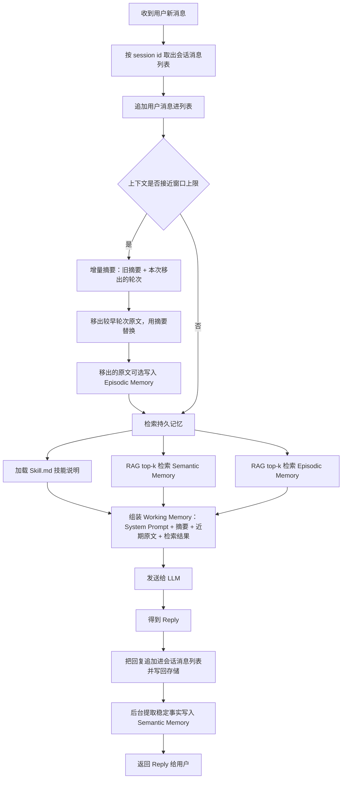
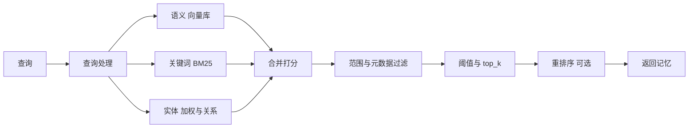

![[Pasted image 20261004114709.png]]

# 分层结构

图把 agent 的记忆分成**会话内的临时上下文**和**会话外的持久记忆**两层。

## 会话内：Working Memory / Context RAM

在 `AI Agent Session` 方框里，所有内容都是临时的（ephemeral）。三路输入汇聚进 Working Memory（上下文内存）：

- User Prompt（用户提问）
- Current Chat History（当前对话历史）
- System Prompt（系统提示词）

Working Memory 再送给 `LLM - Q&A Agent`（GPT、Claude）生成 Reply。这一层容量有限，随会话结束消失。

## 会话外：三类持久记忆

方框下方是从持久存储按需取回、注入 Working Memory 的三类记忆：

| 类型 | 存储介质 | 内容 | 取回方式 |
|------|----------|------|----------|
| Procedural Memory | Files, Text | 怎么行动、技能说明 | 加载 `Skill.md` |
| Semantic Memory | Vector store | 长期事实、用户画像 | RAG（top-k 检索） |
| Episodic Memory | Vector store | 带日期的事件、过去聊天记录 | RAG（top-k 检索） |

# 设计要点

- **分层**：近处的临时上下文（RAM）负责当前一次问答；远处的持久记忆负责跨会话积累。
- **按需注入**：持久记忆不会全部塞进上下文，而是通过技能文件加载或向量检索 top-k 的方式，只把相关内容送进 Working Memory。
- **两类寻回策略**：程序性记忆用文件直接加载，语义与情节记忆用向量库加 RAG 检索。
- **角色分工**：LLM 只负责组装后的上下文推理，记忆的存取由外层机制管理。

# 存储触发时机

图里只画了读取路径（三条箭头指向 Working Memory），没有画写入路径，所以存储触发时机这张图并没有给出。下面按三类记忆分别说明通行的设计。

## Procedural Memory（技能文件）

在编写阶段由人写入，运行时只读。触发时机是开发者新增或修改 `Skill.md` 之类文件，agent 运行过程中不会自动改写它。

## Semantic Memory（事实、用户画像）

在对话过程中由提取环节写入。常见触发点：

- 每一轮回答结束后，后台提取一遍，判断这一轮里有没有值得长期保留的稳定事实（用户偏好、身份、约定）。
- 用户显式下达“记住这件事”之类的指令时立即写入。
- 一次会话结束时做一轮汇总提炼，把散落的事实合并进向量库。

写入前通常要做去重和冲突处理，避免同一事实反复堆积。

## Episodic Memory（带日期的事件、历史对话）

按会话或按轮次记录，触发时机大概有：

- 每轮问答结束时追加一条带时间戳的记录。
- 会话关闭或超时结束时，把整段对话作为一条情节批量写入。
- 上下文接近容量上限时，把较早的内容压缩成摘要后写入，给 Working Memory 腾出空间。

## Working Memory（上下文内存）

每一轮都在读写，随会话结束消失，本身不做持久存储。它的内容靠上面三类记忆按需注入来补充。

需要区分的是：图里的触发时机只讲了读，即什么时候把持久记忆拉进 Working Memory（回答前检索）；而写，即什么时候把内容存进持久记忆，属于另一套机制，图中未体现。

# Mem0 的记忆设计

Mem0 是夹在应用与大模型之间的一层记忆，入口只有两个：一轮交互后调 `add` 写入，下一次调模型前调 `search` 读取。回答生成不在 Mem0 内部，它只把相关记忆交给应用。

## 记忆内容

存的是提取出来的事实句，默认不存逐字对话。用户说「我一向都挑过道坐」，存进去的是 `User prefers aisle seats`。传 `infer=False` 才原样保存用户内容。逐字消息另外存进消息表，供提取时作上下文与审计使用。

## 写入流程

`add` 是一条加法式流水线：

1. 上下文查找：先看已有相关记忆，判断是否重复。
2. 事实提取：大语言模型（LLM）从消息里抽出偏好、决定、计划等稳定信息。
3. 去重与嵌入：给事实算 `md5` 与已有 `hash` 比对，重复丢弃，再用嵌入模型生成向量。
4. 实体提取：用 spaCy 抽出实体并建立关联。
5. 写入：默认只做新增，不覆盖旧记忆；需要纠正时显式调 `update` 或 `delete`。

## 三类存储

| 存储   | 存什么                                                        | 服务什么                               |
| ---- | ---------------------------------------------------------- | ---------------------------------- |
| 向量库  | 记忆向量，载荷含 `data`（事实正文）、`text_lemmatized`、`hash`、时间戳、作用范围字段  | 语义相似度召回                            |
| 实体集合 | 独立向量集合，载荷含 `data`、`entity_type`、`linked_memory_ids`、作用范围字段 | 实体匹配与加权                            |
| SQL  | 历史表记录每次增删改轨迹，消息表存原始消息                                      | 变更审计、提取上下文；新版文档把 SQL 列为事实与元数据的权威来源 |

实体与向量都用同一个向量库提供方，换成不同 collection 区分。实体集合第一次被用到时才创建。

## SQL 日志

SQL 侧用 SQLite 保存（默认 `~/.mem0/history.db`，自托管服务换成 Postgres），里面两张表，作用是审计与提供提取上下文，不参与检索。

history 表记录记忆的每一次改动：

| 字段 | 含义 |
|------|------|
| `id` | 日志主键 |
| `memory_id` | 被改动的记忆 id |
| `old_memory` | 改动前的正文 |
| `new_memory` | 改动后的正文 |
| `event` | `ADD`、`UPDATE`、`DELETE` |
| `created_at` / `updated_at` | 时间戳 |
| `is_deleted` | 是否已删除 |
| `actor_id` / `role` | 触发者与角色 |

读取接口是 `m.history(memory_id)`，按时间给出该记忆的完整变更轨迹。它只追加，不设保留条数。

messages 表按会话范围保存原始消息，字段是 `id`、`session_scope`、`role`、`content`、`name`、`created_at`。它给事实提取提供近期上下文，例如把 `He` 解析成前文里的 `Biscuit`。

messages 表有保留上限：每个 `session_scope` 只保留最近 10 条 message。这里的 10 是消息条数，用户消息与助手消息各算一条，大约相当于 5 轮问答。这个数值在 `save_messages` 与 `get_last_messages(limit=10)` 里固定为 10，开源版没有配置项，`history_db_path` 只能改数据库文件位置。

两个细节：

- 上限按 `session_scope` 分组，`session_scope` 由 `user_id` / `agent_id` / `run_id` 组合而来。
- 同一次 `add` 插入的所有消息共用一个时间戳，「按 `created_at` 倒序取前 10」在批次内部无法区分先后，单次传入超过 10 条时裁剪边界不确定。实际使用时单次传入控制在 10 条以内。

清除的消息只影响后续提取的上下文，之前提取出的事实仍在向量库与实体集合里，检索不受影响。

## 实体设计

- 提取用 spaCy，不走大语言模型。来源有五路：命名实体识别、技术标识符、专名序列、引号内容、话题短语。
- 类别有 `PROPER`、`QUOTED`、`TOPIC`、`IDENTIFIER`。
- 文本归一化后先找完全相同的记录，找不到再做一次语义检索，相似度达到 `0.95` 才当成同一个实体。
- 命中已有实体就把当前记忆 id 追加进 `linked_memory_ids`，让一个实体被多条记忆共享。
- 平台版把实体当成图记忆的节点，实体关系构成边，可以多跳扩展。

## 检索流程

- 四种信号：语义、关键词、实体，平台版另有时间信号。
- `filters` 按 `user_id`、`agent_id`、`run_id`、类别、日期做范围隔离与过滤。
- `threshold` 与 `top_k` 决定返回哪些记忆，`rerank` 决定排列顺序，重排序增加约 150 到 200 毫秒延迟。
- `explain=True` 可查看分项得分，包含语义分、归一化 BM25、实体加权、合并分与所用阈值。

## 写入与读取时机

顺序是先读后写：

1. 调用模型之前：`search` 取回相关记忆，拼进提示词。
2. 调用模型生成回复。
3. 一轮交互之后：`add` 把这一轮值得保留的内容写进去。

`add` 放在回复之后，是因为提取要用整轮消息，包含用户消息与助手回复。助手的回复参与消解指代、补全语义，过早调用只有用户这一条消息，提取质量会下降。

执行形态有三种：

- 同步：回复生成完立即 `add`，等它返回。
- 后台：先把回复返回用户，`add` 放后台任务，不阻塞响应。平台版 `add` 异步执行，返回 `status: "PENDING"` 与 `event_id`，需要时轮询确认。
- 批量补写：会话结束或空闲时，把尚未提取的轮次一次性写入。

例外是用户显式下达「记住这件事」，可以在当轮立即写入，但仍发生在拿到要记的内容之后。

## 设计取舍

- 存事实句、不存逐字对话：上下文更短、召回更干净，代价是丢失原始语气与细节，需要时可从消息表取回原始消息。
- 加法式写入：不会悄悄覆盖或删除，安全；代价是冲突要靠显式操作处理，重复要靠 hash 与语义去重拦截。
- 多索引多信号：召回质量高，覆盖语义、精确词、实体、时间四类需求；代价是写入要同时维护向量库与实体集合，出现不一致时需要重建。
- spaCy 规则提取实体：成本低、结果确定、可离线；覆盖范围受规则限制，遇到领域专名或中文实体时效果取决于模型与规则。

## 与前述分层结构的对应

- Working Memory：由应用组装的当前上下文，Mem0 不涉及。
- Semantic Memory：Mem0 提取的事实与偏好，存进向量库与实体集合。
- Episodic Memory：Mem0 默认不保存逐字事件，带时间元数据的记忆承担类似角色，原始对话落在消息表。
- Procedural Memory：Mem0 不涉及，仍由文件加载。