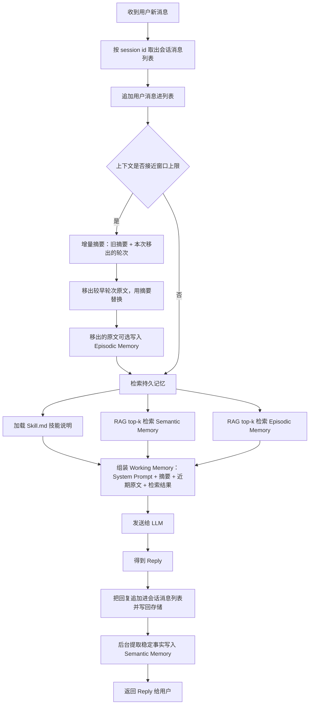

![[Pasted image 20261004114709.png]]

# 分层结构

图把 agent 的记忆分成**会话内的临时上下文**和**会话外的持久记忆**两层。

## 会话内：Working Memory / Context RAM

在 `AI Agent Session` 方框里，所有内容都是临时的（ephemeral）。三路输入汇聚进 Working Memory（上下文内存）：

- User Prompt（用户提问）
- Current Chat History（当前对话历史）
- System Prompt（系统提示词）

Working Memory 再送给 `LLM - Q&A Agent`（GPT、Claude）生成 Reply。这一层容量有限，随会话结束消失。

## 会话外：三类持久记忆

方框下方是从持久存储按需取回、注入 Working Memory 的三类记忆：

| 类型 | 存储介质 | 内容 | 取回方式 |
|------|----------|------|----------|
| Procedural Memory | Files, Text | 怎么行动、技能说明 | 加载 `Skill.md` |
| Semantic Memory | Vector store | 长期事实、用户画像 | RAG（top-k 检索） |
| Episodic Memory | Vector store | 带日期的事件、过去聊天记录 | RAG（top-k 检索） |

# 设计要点

- **分层**：近处的临时上下文（RAM）负责当前一次问答；远处的持久记忆负责跨会话积累。
- **按需注入**：持久记忆不会全部塞进上下文，而是通过技能文件加载或向量检索 top-k 的方式，只把相关内容送进 Working Memory。
- **两类寻回策略**：程序性记忆用文件直接加载，语义与情节记忆用向量库加 RAG 检索。
- **角色分工**：LLM 只负责组装后的上下文推理，记忆的存取由外层机制管理。

# 存储触发时机

图里只画了读取路径（三条箭头指向 Working Memory），没有画写入路径，所以存储触发时机这张图并没有给出。下面按三类记忆分别说明通行的设计。

## Procedural Memory（技能文件）

在编写阶段由人写入，运行时只读。触发时机是开发者新增或修改 `Skill.md` 之类文件，agent 运行过程中不会自动改写它。

## Semantic Memory（事实、用户画像）

在对话过程中由提取环节写入。常见触发点：

- 每一轮回答结束后，后台提取一遍，判断这一轮里有没有值得长期保留的稳定事实（用户偏好、身份、约定）。
- 用户显式下达“记住这件事”之类的指令时立即写入。
- 一次会话结束时做一轮汇总提炼，把散落的事实合并进向量库。

写入前通常要做去重和冲突处理，避免同一事实反复堆积。

## Episodic Memory（带日期的事件、历史对话）

按会话或按轮次记录，触发时机大概有：

- 每轮问答结束时追加一条带时间戳的记录。
- 会话关闭或超时结束时，把整段对话作为一条情节批量写入。
- 上下文接近容量上限时，把较早的内容压缩成摘要后写入，给 Working Memory 腾出空间。

## Working Memory（上下文内存）

每一轮都在读写，随会话结束消失，本身不做持久存储。它的内容靠上面三类记忆按需注入来补充。

需要区分的是：图里的触发时机只讲了读，即什么时候把持久记忆拉进 Working Memory（回答前检索）；而写，即什么时候把内容存进持久记忆，属于另一套机制，图中未体现。

