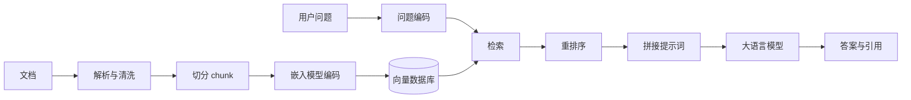
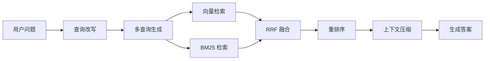
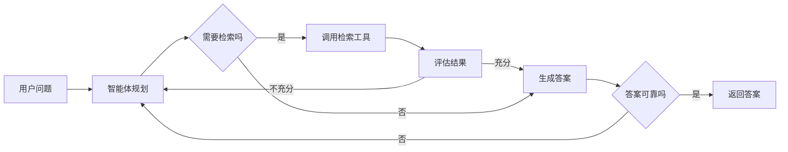

RAG（Retrieval-Augmented Generation）把外部知识检索与大语言模型生成组合在一起。模型回答时依据检索到的真实资料，缓解知识过时、幻觉、私有数据无法进入训练集等问题。

# 整体流程



分为三个阶段：

1. 索引阶段（离线）：文档切分成片段（chunk），用嵌入模型（embedding model）转成向量，写入向量数据库。
2. 检索阶段（在线）：用户问题转成向量，在向量库中做相似度检索，取回最相关的若干片段。
3. 生成阶段：把问题与检索到的片段一起拼进提示词，交给大语言模型生成答案。

# 关键组成

- 文档处理：解析、清洗、切分。切分粒度很关键，片段太大则噪声多，太小则语义不完整，常见做法是带重叠（overlap）的滑动窗口切分。
- 嵌入模型：把文本映射为向量，要求语义相近的文本在向量空间中距离接近。
- 向量数据库：存储向量并支持近似最近邻搜索（ANN），例如 FAISS、Milvus、pgvector、Qdrant。
- 检索器：向量检索之外，常配合 BM25 等关键词检索，形成混合检索（hybrid search）。
- 重排序（rerank）：用交叉编码器（cross-encoder）对初步结果精排。
- 生成模型：接收拼接后的上下文，输出答案，通常要求注明引用来源。

# 检索策略

检索质量决定 RAG 的上限。检索不到正确片段，生成模型再强也无法补救。下面按由基础到进阶的顺序介绍常见策略，每节先讲完整流程，再给出 TypeScript 示例。

## 1. 向量检索（稠密检索）

把问题和文档片段都编码为向量，用余弦相似度或点积衡量相近程度。适合语义相近但用词不同的场景。

检索流程：

1. 离线：文档切分成片段，用嵌入模型（embedding model）编码为向量，连同原文一起写入向量数据库。
2. 在线编码：把用户问题用同一个嵌入模型编码为查询向量。
3. 相似度计算：查询向量与库中每个片段向量逐一计算余弦相似度（或点积）。
4. 排序取回：按相似度从高到低排序，取前 topK 个片段作为检索结果。

```ts
import { pipeline } from "@huggingface/transformers";

// 中文向量模型 BAAI/bge-large-zh-v1.5 的 ONNX 版本
const extractor = await pipeline("feature-extraction", "Xenova/bge-large-zh-v1.5");

async function embed(texts: string[]): Promise<number[][]> {
  // BGE 系列使用 CLS 池化，normalize 把向量归一化为单位向量
  const output = await extractor(texts, { pooling: "cls", normalize: true });
  return output.tolist();
}

function cosineSimilarity(a: number[], b: number[]): number {
  let dot = 0;
  let normA = 0;
  let normB = 0;
  for (let i = 0; i < a.length; i++) {
    dot += a[i] * b[i];
    normA += a[i] * a[i];
    normB += b[i] * b[i];
  }
  return dot / (Math.sqrt(normA) * Math.sqrt(normB));
}

async function vectorSearch(
  query: string,
  chunks: { id: number; text: string; vector: number[] }[],
  topK: number,
): Promise<{ id: number; text: string; score: number }[]> {
  const [queryVector] = await embed([query]);
  return chunks
    .map((chunk) => ({
      id: chunk.id,
      text: chunk.text,
      score: cosineSimilarity(queryVector, chunk.vector),
    }))
    .sort((a, b) => b.score - a.score)
    .slice(0, topK);
}
```

向量检索的短板：对精确名词、编号、专有代码等不敏感。用户问「ERR_4032 错误码」，语义向量可能召回一堆通用错误说明，却漏掉真正提到该编号的片段。

## 2. 关键词检索（稀疏检索）

基于词频与逆文档频率，典型算法是 BM25。它擅长精确匹配术语、编号、人名。示例用 rank_bm25 的思路在 TypeScript 中实现一个简化版本。

检索流程：

1. 离线分词：对每个文档片段分词，统计每个词在片段中出现的次数，构建词表与文档频率表（倒排索引）。
2. 在线分词：对用户问题分词，得到查询词集合。
3. 逐片段打分：对每个片段，按 BM25 公式累加各查询词的分数，综合词频、逆文档频率与文档长度。
4. 排序取回：按分数从高到低排序，取前 topK 个片段。

```ts
// 简化版 BM25，演示打分原理
class BM25 {
  private docs: string[][];
  private docFreq: Map<string, number>;
  private avgLen: number;
  private k1 = 1.5;
  private b = 0.75;

  constructor(docs: string[]) {
    this.docs = docs.map((doc) => this.tokenize(doc));
    this.docFreq = new Map();
    for (const doc of this.docs) {
      for (const term of new Set(doc)) {
        this.docFreq.set(term, (this.docFreq.get(term) ?? 0) + 1);
      }
    }
    this.avgLen = this.docs.reduce((sum, doc) => sum + doc.length, 0) / this.docs.length;
  }

  private tokenize(text: string): string[] {
    // 英文按空白与标点切分，中文可换成 jieba 等分词器
    return text.toLowerCase().split(/[\s\p{P}]+/u).filter(Boolean);
  }

  private idf(term: string): number {
    const n = this.docs.length;
    const df = this.docFreq.get(term) ?? 0;
    return Math.log((n - df + 0.5) / (df + 0.5) + 1);
  }

  score(query: string, docIndex: number): number {
    const terms = this.tokenize(query);
    const doc = this.docs[docIndex];
    const docLen = doc.length;
    let total = 0;
    for (const term of terms) {
      const tf = doc.filter((token) => token === term).length;
      const numerator = tf * (this.k1 + 1);
      const denominator = tf + this.k1 * (1 - this.b + this.b * (docLen / this.avgLen));
      total += this.idf(term) * (numerator / denominator);
    }
    return total;
  }

  search(query: string, topK: number): { index: number; score: number }[] {
    return this.docs
      .map((_, index) => ({ index, score: this.score(query, index) }))
      .filter((item) => item.score > 0)
      .sort((a, b) => b.score - a.score)
      .slice(0, topK);
  }
}
```

## 3. 混合检索（hybrid search）

把稠密与稀疏两路结果合并。合并方式常见两种：

- 分数归一化后加权：`final = alpha * 向量分数 + (1 - alpha) * BM25 分数`。
- 倒数排名融合（RRF，Reciprocal Rank Fusion）：只看排名，不看原始分数，避免两路分数尺度不一致。

检索流程：

1. 同一个问题分别送入稠密检索器与稀疏检索器。
2. 两路各自召回一批候选，例如各取前 20 条。
3. 融合：用倒数排名融合或分数归一化加权，把两路排名合并成一个统一分数。
4. 去重排序后取前 topK，作为最终候选或送交重排序。

```ts
// 倒数排名融合：score = sum(1 / (k + rank))，k 常取 60
function reciprocalRankFusion(
  resultLists: { id: number; text: string }[][],
  k = 60,
): { id: number; text: string; score: number }[] {
  const scores = new Map<number, { id: number; text: string; score: number }>();
  for (const list of resultLists) {
    list.forEach((item, rank) => {
      const entry = scores.get(item.id) ?? { id: item.id, text: item.text, score: 0 };
      entry.score += 1 / (k + rank + 1);
      scores.set(item.id, entry);
    });
  }
  return [...scores.values()].sort((a, b) => b.score - a.score);
}

// 用法：向量检索与 BM25 检索各取 topN，再融合
async function hybridSearch(query: string) {
  const denseResults = await vectorSearch(query, chunks, 20);
  const sparseResults = bm25.search(query, 20).map((item) => ({
    id: item.index,
    text: rawDocs[item.index],
  }));
  return reciprocalRankFusion([denseResults, sparseResults]);
}
```

混合检索能同时覆盖语义相近与精确匹配两类需求，是生产环境常用的默认选择。

## 4. 查询改写（query rewriting）

用户提问往往口语化、含指代、信息不完整，直接拿去检索效果差。先用大语言模型把问题改写成适合检索的形式。

检索流程：

1. 收集对话历史与当前问题。
2. 把二者交给大语言模型，指示补全指代、写成独立完整的一句话。
3. 得到改写后的查询。
4. 用改写后的查询替换原始问题，送入后续检索器。

```ts
async function rewriteQuery(history: string[], question: string): Promise<string> {
  const response = await chatCompletion([
    {
      role: "system",
      content:
        "把用户问题改写成独立、完整、适合检索的一句话。补全指代，保留专有名词，只输出改写结果。",
    },
    {
      role: "user",
      content: `对话历史:\n${history.join("\n")}\n\n当前问题: ${question}`,
    },
  ]);
  return response.trim();
}
```

例：对话里提到「Redis 的持久化」，用户随后问「那它的缺点呢？」，改写后变成「Redis 持久化机制的缺点是什么」，检索才能命中正确文档。

## 5. 多查询检索（multi-query）

让模型对同一个问题生成多个不同角度的子查询，分别检索后合并去重。这样能提升召回覆盖面，缓解单次查询表述偏差。

检索流程：

1. 把问题交给模型，生成若干不同角度、不同措辞的子查询。
2. 每个子查询分别执行检索（可并行），各得到一批结果。
3. 合并所有结果列表。
4. 用倒数排名融合等融合方法去重排序，得到最终候选。

```ts
async function multiQuerySearch(question: string, topK: number) {
  const response = await chatCompletion([
    {
      role: "system",
      content: "针对用户问题生成 3 个不同角度、不同措辞的检索查询，每行一个，只输出查询本身。",
    },
    { role: "user", content: question },
  ]);
  const queries = response.split("\n").map((line) => line.trim()).filter(Boolean);
  const resultLists = await Promise.all(queries.map((query) => vectorSearch(query, chunks, topK)));
  return reciprocalRankFusion(resultLists);
}
```

## 6. HyDE（假设文档嵌入）

先让模型凭空写一段「理想答案」，再把这段答案编码成向量去检索。因为答案与真实文档的措辞风格更接近，检索命中率往往高于直接用问题检索。

检索流程：

1. 把问题交给模型，生成一段假设性的理想答案。
2. 用嵌入模型把这段假设答案编码为向量，而不是编码原始问题。
3. 用该向量在库中做相似度检索。
4. 取回真实文档后，可再用真实文档与问题重新编码做二次检索。
5. 返回检索结果。

```ts
async function hydeSearch(question: string, topK: number) {
  const hypotheticalAnswer = await chatCompletion([
    {
      role: "system",
      content: "针对问题写一段可能出现在知识库文档中的答案，只输出答案内容。",
    },
    { role: "user", content: question },
  ]);
  return vectorSearch(hypotheticalAnswer, chunks, topK);
}
```

## 7. 重排序（rerank）

初步检索通常用双编码器（bi-encoder），速度快但精度有限。重排序用交叉编码器（cross-encoder），把「问题 + 片段」一起送入模型打分，精度更高，代价是速度慢，因此只对初步结果的少量片段精排。

检索流程：

1. 初步检索（向量、关键词或混合）得到一批候选，例如 20 到 50 条。
2. 把「问题 + 每个候选片段」组成一对，得到若干输入对。
3. 交叉编码器对每一对联合编码打分，得到相关性分数。
4. 按新分数重新排序，取前 topN（例如 5 条）送入生成模型。

```ts
import { AutoModelForSequenceClassification, AutoTokenizer } from "@huggingface/transformers";

// 中文交叉编码器 BAAI/bge-reranker-base 的 ONNX 版本
const rerankerId = "Xenova/bge-reranker-base";
const rerankerTokenizer = await AutoTokenizer.from_pretrained(rerankerId);
const rerankerModel = await AutoModelForSequenceClassification.from_pretrained(rerankerId);

async function rerank(
  query: string,
  candidates: { id: number; text: string }[],
  topK: number,
): Promise<{ id: number; text: string; score: number }[]> {
  // 把「问题 + 片段」组成文本对批量送入模型
  const inputs = rerankerTokenizer(candidates.map(() => query), {
    text_pair: candidates.map((item) => item.text),
    padding: true,
    truncation: true,
  });
  const { logits } = await rerankerModel(inputs);
  // 每个片段一个相关性分数
  const scores = logits.tolist().map((row: number[]) => row[0]);
  return candidates
    .map((item, index) => ({ id: item.id, text: item.text, score: scores[index] }))
    .sort((a, b) => b.score - a.score)
    .slice(0, topK);
}
```

完整链路：向量检索与 BM25 各取 20 条，RRF 融合得到候选，再用重排序取前 5 条送给生成模型。

## 8. 父文档检索（parent-child retrieval）

检索时用小块（子块）保证语义聚焦，命中后返回它所属的大块（父块）给模型，兼顾定位精度与上下文完整性。

检索流程：

1. 离线切分：文档切成大块（父块），再把每个父块切成更小的子块，建立子块到父块的映射。
2. 用子块建立向量索引。
3. 在线检索：用问题检索子块，得到命中的子块。
4. 通过映射找到命中子块所属的父块，去重后返回父块原文给模型。

```ts
interface Chunk {
  id: number;
  text: string;
  parentId: number;
}

// 用子块检索，再把命中的子块替换为其父块文本
async function parentChildSearch(query: string, topK: number) {
  const hits = await vectorSearch(query, childChunks, topK);
  const parentIds = [...new Set(hits.map((hit) => childChunks[hit.id].parentId))];
  return parentIds.map((parentId) => ({
    parentId,
    text: parentDocuments[parentId],
    matches: hits.filter((hit) => childChunks[hit.id].parentId === parentId),
  }));
}
```

## 9. 上下文压缩（contextual compression）

检索到的片段常包含与问题无关的句子。用模型或规则只保留真正相关的部分，减少提示词长度，也降低无关内容干扰生成的风险。

检索流程：

1. 检索得到若干片段。
2. 对每个片段，用模型或规则抽取与问题相关的句子，丢弃无关内容。
3. 若某片段完全无关，则整体丢弃。
4. 把压缩后的片段拼接成上下文，送入生成模型。

```ts
async function compressContext(question: string, chunk: string): Promise<string | null> {
  const response = await chatCompletion([
    {
      role: "system",
      content:
        "从给定文档中提取与问题相关的句子。若完全不相关，只输出「无」。只输出提取内容。",
    },
    { role: "user", content: `问题: ${question}\n\n文档: ${chunk}` },
  ]);
  const compressed = response.trim();
  return compressed === "无" ? null : compressed;
}
```

# 生产环境常用组合



# 评估指标

- 上下文召回率（context recall）：应被检索到的相关片段有多少被召回。
- 上下文精确率（context precision）：召回片段中真正相关的比例。
- 忠实度（faithfulness）：答案是否完全依据检索内容，没有凭空添加。
- 答案相关性（answer relevance）：答案是否切合问题。

# 与微调的区分

RAG 让模型访问外部最新或私有知识；微调改变模型的行为方式与任务适配。两者可以同时使用。

# 常见问题

- 召回失败：检索不到正确片段，后续生成无法补救。
- 无关内容误导：召回噪声片段导致模型跑题。
- 上下文截断：片段过长被截断，丢失关键信息。
- 上下文窗口限制：长文档下召回数量与长度受限制。


