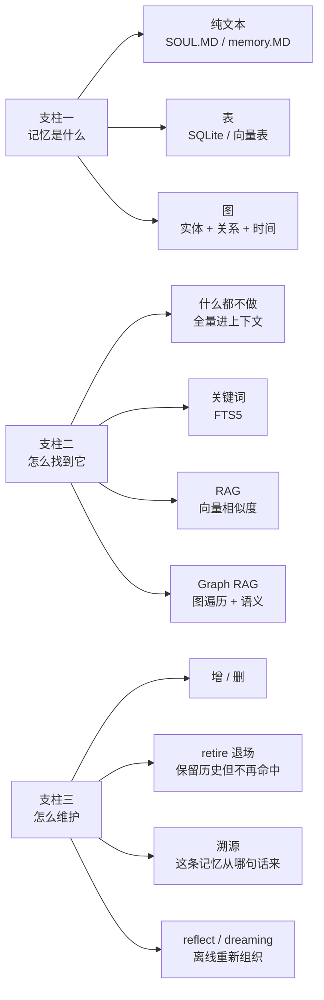
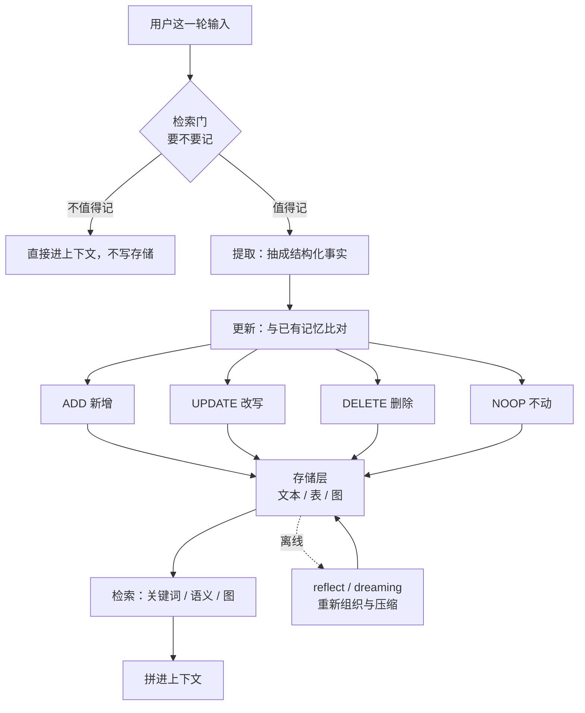
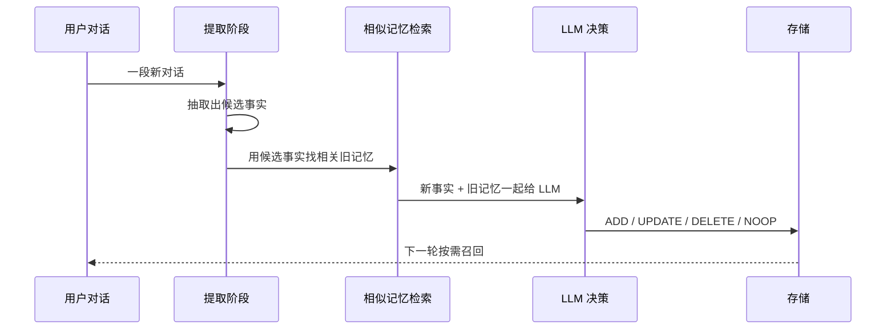
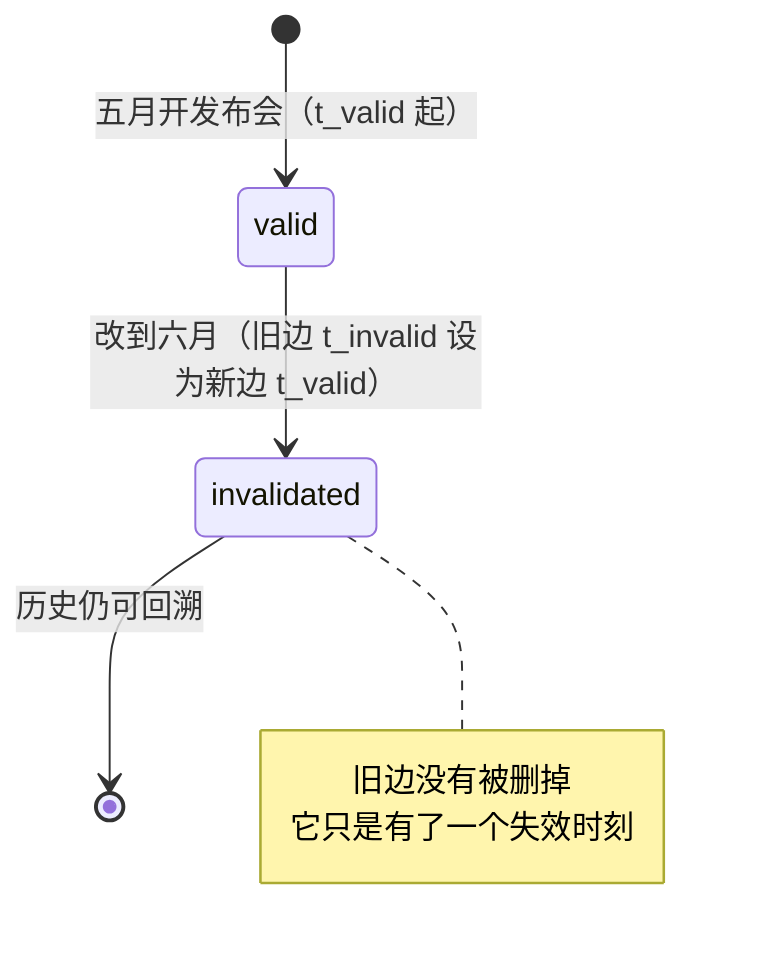

# AI Agent 的五种记忆实现：从纯文本到时序知识图

> 来源视频：[一口气搞懂 AI Agent 五种记忆架构 / SQLite / mem0 / Zep / LangMem 实测竞速](https://www.bilibili.com/video/BV1DabS6vEba/) · UP：肖恩君Sean · 时长 30:27 · 发布 2026-08-16
> 对应英文版：[You Can Learn AI Agent Memory Layers | Graph RAG, Vector DB, SQLite, Hermes, Waku](https://www.youtube.com/watch?v=072eNztI06k)

## 学完你应该获得什么

1. 能用「是什么 / 怎么找到 / 怎么维护」三个支柱描述任何一套 Agent 记忆方案，而不是只会背产品名。
2. 能说清五种记忆层的存储介质、检索方式与维护方式，以及各自的适用规模。
3. 能解释 mem0 的默认行为与它的图模式差别，知道 `infer=False` 会把 mem0 最核心的能力关掉。
4. 能解释 Zep（Graphiti）的双时态模型与边失效，理解为什么检索到一条边不等于这条边还有效。
5. 能判断什么项目**不需要**记忆框架：把记忆指令与存储方式写好就够了，数量少时全量放进上下文反而更稳。
6. 能区分「摄取完成」与「可以查到」是两个不同事件，从而写出不会走样的记忆评测。
7. 能识别几类常见坑：没有时间衰减的存储会召回很久以前的错乱事实、按句提取会放大 token 成本、加密黑盒记忆无法排查召回链路。
8. 能按任务复杂度与数据归属要求，在纯文本、SQLite、向量库、mem0、Zep 之间做选择。

## 一句话总论

每一次 LLM 调用都是从失忆开始的，模型本身不记得你；记忆是模型外部的一套工程系统，五种实现方式的差别集中在三件事上——记忆以什么形态存放、Agent 用什么方式把它取回来、以及谁负责决定一条记忆什么时候失效。

## 适用场景与前置知识

适合：正在给 Agent 加长期记忆的开发者、需要为自用助手选一个记忆存储的人、以及要给记忆系统做评测的人。

前置知识：知道 RAG 的基本流程（切块、向量化、相似度召回）、了解 Agent 循环（推理-调工具-再推理）、看得懂 TypeScript 或 Python 的伪代码。视频里的示例代码是 TypeScript，作者说明主流的两种选择是 TS 与 Python，选哪种都行 [1]。

## 知识地图

视频把记忆分成三个支柱，再按「一层比一层重」的顺序给出五种实现。三个支柱决定了任何方案的形态：



五种实现与三个支柱的对应关系：

| 层 | 存储介质 | 检索方式 | 维护方式 | 适合的规模 |
| --- | --- | --- | --- | --- |
| 一、纯文本 | Markdown 文件（SOUL.MD、Skills、memory.MD） | 直接读进上下文，不做检索 | 人工或 Agent 直接改写文件 | 个人助手、规则类知识，几十条以内 |
| 二、SQLite | 单文件 `state.db`，会话与消息成表 | 关键词（FTS5） | 增删改行，事务保证一致 | 本地优先、需要可读可迁移，几千到几万条 |
| 三、向量库 | Supabase PGVector / Weaviate / Pinecone | 向量相似度召回 | 覆盖写，通常不做事实失效 | 非结构化文本量大、语义问答为主 |
| 四、mem0 | 行记忆（向量为主）+ 可选图记忆 | 语义检索；图模式走实体关系 | LLM 决策 ADD / UPDATE / DELETE / NOOP | 生产级助手，需要「自动决定记什么」 |
| 五、Zep | 时序知识图（Graphiti） | 时间 + 全文 + 语义 + 图算法混合 | 矛盾出现时把旧边标记为在某时刻失效 | 事实随时间变化、需要历史回溯 |



## 三个支柱的细节

### 支柱一：记忆是什么

三种基本形态：纯文本、表、图 [2]。纯文本最容易被人和 Agent 同时读懂，改动成本最低；表适合有明确字段的事实（时间、主体、状态），查询靠索引；图把实体与关系显式存下来，能回答「谁和谁因为什么事产生过联系」这类问题。

### 支柱二：Agent 怎么找到它

从轻到重是四档 [3]：什么都不做（全部塞进上下文）、关键词搜索、RAG 向量召回、Graph RAG（先按图找相关实体，再做语义匹配）。作者给出的判断是：Hermes 与 Waku 这两个 harness 一档都没用上，因为它们的记忆量级小、结构清楚，关键词加全量上下文就够，引入向量库只会增加不可解释的召回路径。

### 支柱三：怎么维护

维护动作有五种：增、删、retire（退场）、溯源、reflect [4]。

- **retire 与删除的区别**：视频用「1000 星到 1300 星」这个例子说明 [5]。事实从 1000 星涨到 1300 星时，旧事实没有错，只是过期；直接把旧行删掉，就失去了「什么时候从多少涨到多少」这段历史，而历史往往正是记忆的价值所在。
- **溯源**：每条记忆要能指回它是从哪句话、哪次对话来的，否则记忆错了没法修。
- **reflect 与 dreaming**：Anthropic 提出的 dreaming 指的是让 Agent 在空闲时重新整理记忆，把碎片合并、把重复压缩、把矛盾收敛 [6]，这与在线写入时的提取是两条路径。

## 五层记忆的实现

### 第一层：纯文本（SOUL.MD、Skills、memory.MD）

实现要点：记忆就是仓库里的 Markdown 文件。SOUL.MD 放身份与价值取向，Skills 放程序性知识（怎么做一件事），memory.MD 放事实与喜好。读取方式是整份读进上下文，没有检索环节，所以不存在召回失败，代价是上下文预算 [7]。

程序性、语义、情节三类记忆在这里被显式分开 [1]：Skills 属于程序性（怎么做），事实属于语义（是什么），会话经历属于情节（发生过什么）。作者自己的开源 Agent（Waku，`ShenSeanChen/waku-agent`）把这一层做成默认记忆——「你的记忆就是一个 SQLite 文件，打开它、读它、它是你的」，并且额外用「检索门」决定要不要记、【整合】决定留下什么 [8]。

### 第二层：SQLite state.db 与关键词搜索

实现要点：单个 SQLite 文件承载会话与消息，检索用 FTS5 做关键词匹配 [9]。作者本机路径是 `~/.waku/state.db`，跨目录共用同一份 [8]。

适用与代价：关键词搜索只能命中字面，理解不了同义表达（例如「database」与「DB」在 FTS5 看来是两个东西）[10]；好处是零依赖、可离线、可以用 SQL 直接审计与迁移，出错时打开文件就能看到原始数据。个人自用、事实条目在几千条以内时，这一层的性价比最高；社区里也有人直接说「短期任务 SQLite 就够了」[11]。

### 第三层：向量库（Supabase PGVector、Weaviate、Pinecone）

实现要点：把记忆切块、向量化、写进向量表，查询时做相似度召回。视频把这一层定位为「成熟的通用做法」，pgvector 属于自建路线，Weaviate 与 Pinecone 属于托管路线 [12]。

关键缺口：这一层存的是文本块，不表达「某条事实什么时候不再成立」。作者仓库里的对照脚本写得直白：Supabase pgvector 版本约 30 行，真实向量、对复述与中文提问都答得对，但「没有任何东西会判断一条事实已经不再为真」，于是「发布会在五月」和「改到六月」两条永远并排躺着 [13]。这个缺口正是后两层存在的理由。

### 第四层：mem0 —— 行记忆与图记忆

实现要点：mem0 采用增量处理，分提取与更新两个阶段 [14]。提取阶段从对话里抽出值得长期保留的事实；更新阶段把新事实与检索到的相似记忆比对，用 function calling 强制 LLM 输出四种结构化决策之一：ADD（新增）、UPDATE（改写）、DELETE（删除）、NOOP（不动）[15]。



两个容易忽略的点：

1. **图记忆是可选形态，不是默认行为。** 控制台里能看到 Graph 与 Entities 页，但在 `mem0ai 2.0.17` 里它不是每次调用的开关（`AddMemoryOptions` 没有图的字段），作者因此没有在图模式下测过 [13]。把 mem0 一律说成「行存储」是不准确的 [13]。
2. **`infer=False` 会关掉 mem0 最核心的能力。** 作者自己的评测台为了让所有后端满足「写入必须成功写入存储」这一条统一接口，调用 mem0 时带了 `infer=False`，这正好把「由它决定记什么」这个特性关掉了 [13]。这一点对读任何横向评测都重要：**统一接口本身会抹平产品的差异**。

论文侧的数字（产品方自评，作为参考）：LOCOMO 基准上 mem0 相对 OpenAI 的记忆方案在 LLM-as-a-Judge 上提升 26%，图记忆版本再高约 2 个百分点；相比把全部历史塞进上下文，p95 延迟低 91%，token 成本省 90% 以上 [16]。

### 第五层：Zep —— 时序知识图

实现要点：核心组件是 Graphiti，一个带时间意识的知识图引擎，同时接收非结构化对话与结构化业务数据，并保留关系的历史 [17]。它用双时态模型在边上记四个时间戳：`t'_created` 与 `t'_expired` 记录系统里这条事实何时被创建与失效，`t_valid` 与 `t_invalid` 记录这条事实在现实世界里成立的区间 [18]。

矛盾处理方式与前面几层不同：新边进来时，系统用 LLM 把它与语义相关的旧边比对，发现时间上重叠的矛盾，就把旧边的 `t_invalid` 设成新边的 `t_valid`，也就是让旧边「从那一刻起不再成立」[18]。查询侧是混合检索：时间、全文、语义、图算法一起用 [19]。



作者实测里值得记住的一条：**检索到一条边，不等于这条边还有效**。普通 `graph.search` 对「发布会在什么时候」仍然会返回五月那条，失效信息挂在边上，必须把时间区间一起读出来，否则召回会一本正经地递给你一条已经过期的旧事实 [20]。

论文侧的数字（Zep 团队自评）：DMR 基准 94.8% 对 MemGPT 的 93.4%，LongMemEval 上准确率提升最高 18.5%，同时响应延迟降低 90% [17]。

### 跨层件：LangMem 是包，不是存储

LangMem 是库而不是服务：没有控制台、没有账号、默认也不持久化，存储就是进程里的一个字典 [21]。它按记忆类型提供提取器——语义记忆（事实与知识）、情节记忆（过去经历，含情境、思考、动作、结果四个字段）、程序性记忆（提示与流程的优化）[22]。用法上通过 `create_memory_manager` 指定模型、`schemas` 与指令，再对一段对话调用它拿到结构化记忆 [22]。

它的取舍与前面几层不同：提取器一次读整段对话，因此在写入之前就能把矛盾收敛掉——作者的三句话实验里，LangMem 是「三句进、两条出」[21]，而 mem0 把矛盾留成了两行 [23]。代价是你要自己准备存储与检索，库本身不管这些。

## 晚宴实验：同一批事实喂给五个存储

实验设计（视频第 18:16 起的部分）[24]：把同一批事实依次写进五个存储，再用同一批问题去问，比较它们各自记住了什么、怎么回答。三个具体场景是「黄仁勋和那瓶辣椒油」、「用中文问 Paul Graham 欠我多少钱」、「把 Elon 的到达时间从七点改成九点」[25][26][27]，最后一步是把 Zep 的图打开，看那条带语义的边 [28]，并讨论时序图什么时候是杀鸡用牛刀 [29]。

作者仓库里同一主题的对照实验（2026-08-12，`lab/memory-native`）给出了可核对的输出，四段脚本各约 60 行，都按产品自己的文档写法，五个动作完全一致：连接、写三句话、原样读回、用三种方式提问、指出控制台位置 [13]。

写入的三句话刻意让第三句与第二句矛盾：

```
I met Yuki at the Lisbon AI meetup in March. She runs a robotics startup.
Our product launch is scheduled for May.
Actually, the launch moved to June.
```

读回与提问的结果 [13]：

| 存储 | 保留了 | 矛盾处理 | 中文提问 |
| --- | --- | --- | --- |
| mem0（默认） | 五月、六月两条独立行，还自行推断了一个没说的年份 | 不处理，两条并存 | 中文问到的是被覆盖的五月，英文问到六月 |
| LangMem | 一条：六月（并注明由五月改动而来） | 写入前收敛，三句进两条出 | 一致 |
| Zep | 五月那条标记为从某时刻失效，六月仍然有效 | 边失效 + 时间戳 | 一致；但普通图检索仍会返回五月 |
| Supabase pgvector | 两条并排永久共存 | 没有任何失效机制 | 复述与中文都答得对 |

这次实验还留下两条对做评测的人很关键的经验：

- **「摄取完成」与「可以查到」是两个事件。** Zep 的 episode 会报 `processed`，但那是必要不充分条件：干净项目上每条 episode 都显示处理完成，而图里还没有任何节点，此时问发布会时间会答成别的旧事。mem0 则完全没有这类标记，而且「等够 3 行事实」也是错的——推断式存储会自己决定你的句子变成几条记忆，那里三句变成了四条，等到三行时「改到六月」还没进来。作者的修法是等行数**不再变化**，而不是等某个标记或某个目标值 [30]。
- **一次同意过的模式（schema）会长期决定 Agent 能记住什么。** 项目级本体（ontology）由 Zep 的引导向导设置，项目里所有用户永久继承：即使把用户全删光、项目验证为空，新建用户仍会拿到 `CTR`、`brand deal`、`retention rate` 这些没人提过的实体。删除用户清不掉本体，干净的对比要么重置本体，要么新建项目 [31]。

## 概念卡

| 概念 | 是什么 | 为什么重要 | 常见误区 |
| --- | --- | --- | --- |
| 三个支柱 | 记忆是什么 / 怎么找到 / 怎么维护 | 用来给任意方案定位，判断缺哪一块 | 只对比产品名与基准分，不看存储与维护方式 |
| 检索门 | 写入前判断这条信息值不值得记 | 决定记忆库的增长速度与噪声水平 | 默认全记，导致噪声随时间累积 |
| 整合（consolidation） | 把碎片合并、重复压缩、矛盾收敛 | 控制上下文预算与召回质量 | 与提取混为一谈，以为写得越多越好 |
| retire 退场 | 事实不再命中，但历史保留 | 保住「从 1000 星到 1300 星」这类演变 | 直接删除，丢掉时间线 |
| reflect / dreaming | 空闲时离线重新组织记忆 | 处理在线写入来不及做的收敛 | 期待在线路径也能做到同样的事 |
| 双时态 | 系统时间与事实时间各记一对 | 支持「当时是什么」与「现在是什么」两类问题 | 只存一个 created_at |
| 边失效 | 矛盾出现时给旧边设失效时刻 | 保留历史同时不误导当前判断 | 以为检索结果天然是当前有效的事实 |
| 记忆类型 | 程序性、语义、情节 | 三类知识的写入与维护方式不同 | 用一套提取器处理所有类型 |

## 选型决策表

| 你的情况 | 选哪一层 | 理由 |
| --- | --- | --- |
| 个人助手、规则与喜好几十条 | 纯文本 | 零检索失败，人和 Agent 都能读改 |
| 本地优先、要能打开文件审计、几千条事实 | SQLite + 关键词 | 单文件、可迁移、成本低 |
| 非结构化文档多、问题以语义问答为主 | 向量库 | 语义召回成熟，但要知道它不做事实失效 |
| 需要系统自动决定记什么、写入量大 | mem0 | 提取与更新两阶段 + 四类结构化操作 |
| 事实随时间变化、要回答「当时」与「现在」 | Zep | 双时态 + 边失效 + 混合检索 |
| 只想拿提取器、存储自己控制 | LangMem | 它是库不是服务，存储与检索由你决定 |
| 任务简单、上下文放得下 | 先不做记忆层 | 全量进上下文往往比引入召回更稳 [32] |

## 实践清单

1. 先写清三个支柱的答案：记忆放哪、怎么找、谁负责让它失效；三个问题答不上来就先别选型。
2. 定义记忆类型边界：程序性知识进 Skills，事实进语义记忆，经历进情节记忆，别混在一张表里。
3. 加检索门，先解决「该不该记」，再解决「怎么记」。
4. 每条记忆带上来源与时间，能回溯到具体那一句话。
5. 需要历史时用 retire 而不是删除；把失效时刻写成字段，而不是覆盖旧值。
6. 评测写入式存储时，等数量稳定再断言，不要等标记，也不要等固定条数。
7. 评测前确认统一接口有没有关掉被测产品的特性（例如 mem0 的 `infer=False`）。
8. 用多语言与复述各问一次同一个问题，检查召回是否稳定。
9. 定期离线整理（reflect），把重复与矛盾清理掉，控制上下文预算。
10. 记录每次写入与召回的 token 成本，记忆库越大，检索成本越高 [11]。

## 坑点与反例

- **没有时间衰减的存储会翻出远古记忆。** 社区里的实际经历：用 mem0 做自用 RAG 时，因为没有时间衰减，用久了各种很久以前的记忆被召回，导致答非所问 [33]。
- **按句提取会放大 token 成本。** 有用户换到 hindsight 后，被「每句对话都提取一次」的默认设置吓退，虽然提取间隔可调，但很难调到合适 [33]。
- **加密黑盒记忆无法排查。** supermemory 的提取方式被认可，但记忆是加密的，看不到提取了什么、召回逻辑是什么，官方维护也较少 [33]。
- **托管意味着数据在对方服务器。** 有人问 Zep 的云服务是不是把所有用户记忆都存在它的服务器上，作者的答复是「对」[34]。数据归属有要求时这条要提前确认。
- **大部分项目不需要记忆框架。** 有观众的判断是：把处理记忆的指令与触发条件写好、把存储方式定好就够了；数量不多时全量放上下文都行 [35][32]。
- **统一接口抹平产品差异。** 为了让「写入必须成功」这一条对所有后端都成立，评测台会关掉推断式存储最核心的行为 [13]。
- **项目级本体长期约束抽取能力。** 一次引导向导设置的本体会决定图愿意学什么，删用户也清不掉 [31]。
- **时序图不是处处适用。** 视频最后专门讨论了什么时候时序图属于杀鸡用牛刀 [29]：事实本身不随时间变化、也不需要回答历史问题时，图带来的只是更贵的写入与更复杂的检索。
- **概念到个人会分化。** 有观众的结论是：记忆的机制大同小异，但每个人的知识组织方式差异很大，最后不如自己写 Skill 来管理记忆 [36]。

## 自测题

1. 三个支柱分别是什么？为什么维护方式比存储介质的差异更难替换？
2. 检索门与整合各自解决什么问题？少了前者会怎样？
3. 「发布会从五月改到六月」这条信息，纯文本、SQLite、向量库、mem0、Zep 各会怎么处理？
4. mem0 的更新阶段有哪四种结构化决策？`infer=False` 会带来什么后果？
5. Zep 的四个时间戳分别是什么？为什么 `graph.search` 可能返回一条已经失效的事实？
6. LangMem 的三类记忆是什么？它为什么被称为「包」而不是「存储」？
7. 做写入式存储的评测时，为什么不能等 `processed` 标记，也不能等固定条数？
8. 什么情况下应该用 retire 而不是删除？举一个你自己的例子。
9. 什么项目不需要引入向量库或图数据库？判断依据是什么？
10. 项目级本体会怎样影响一个 Agent 能记住的东西？

## 证据脚注

1. [视频官方章节表（B站简介，含 44 条时间轴）](https://www.bilibili.com/video/BV1DabS6vEba/)
2. [支柱一：记忆是什么（纯文本、表、图），02:31](https://www.bilibili.com/video/BV1DabS6vEba/)
3. [支柱二：Agent 怎么找到它（什么都不做、关键词、RAG、Graph RAG），05:04](https://www.bilibili.com/video/BV1DabS6vEba/)
4. [支柱三：怎么维护（增、删、retire、溯源、reflect），07:29](https://www.bilibili.com/video/BV1DabS6vEba/)
5. [retire 与删除的区别：1000 星到 1300 星，07:52](https://www.bilibili.com/video/BV1DabS6vEba/)
6. [Reflect 与 Anthropic 提出的 dreaming，09:01](https://www.bilibili.com/video/BV1DabS6vEba/)
7. [第一层：纯文本（SOUL.MD、Skills、memory.MD），09:47](https://www.bilibili.com/video/BV1DabS6vEba/)
8. [Waku Agent 仓库说明：记忆是语义 + 情节 + 程序性，检索门决定是否记、整合决定留下什么，记忆为单个 `~/.waku/state.db`](https://github.com/ShenSeanChen/waku-agent)
9. [第二层：SQLite state.db 与关键词搜索，12:33](https://www.bilibili.com/video/BV1DabS6vEba/)
10. [FTS5 关键词搜索不理解同义表达（database 与 DB）](https://www.reddit.com/r/ClaudeAI/comments/1r1w1m6/what_i_learned_building_a_memory_system_for_my/)
11. [评论：短期任务 SQLite 够用，长期记忆要提前算检索量与 token 成本](https://www.bilibili.com/video/BV1DabS6vEba/)
12. [第三层：向量库（Supabase PGVector、Weaviate、Pinecone），13:13](https://www.bilibili.com/video/BV1DabS6vEba/)
13. [作者的对照实验记录 lab/memory-native：五拍流程、三句矛盾句、四类存储的读回结果与两条评测经验](https://github.com/ShenSeanChen/waku-agent/blob/main/lab/memory-native/README.md)
14. [Mem0 论文：增量处理，提取与更新两个阶段](https://arxiv.org/abs/2504.19413)
15. [Mem0 更新阶段把变更离散成 ADD / UPDATE / DELETE / NOOP 四类操作](https://zhuanlan.zhihu.com/p/2056776351663896521)
16. [Mem0 论文摘要：LOCOMO 上相对 OpenAI 提升 26%，图记忆再高约 2%，p95 延迟低 91%，token 成本省 90% 以上](https://arxiv.org/abs/2504.19413)
17. [Zep 论文摘要：Graphiti 时序知识图，DMR 94.8% 对 MemGPT 93.4%，LongMemEval 准确率提升最高 18.5%、延迟降低 90%](https://arxiv.org/abs/2501.13956)
18. [Zep 论文：双时态四个时间戳与边失效机制](https://arxiv.org/html/2501.13956v1)
19. [Graphiti 文档：按时间、全文、语义与图算法混合检索](https://help.getzep.com/graphiti/getting-started/overview)
20. [对照实验：普通 `graph.search` 仍会返回五月那条已失效的事实](https://github.com/ShenSeanChen/waku-agent/blob/main/lab/memory-native/README.md)
21. [对照实验：LangMem 是库不是服务，默认不持久化，三句进两条出](https://github.com/ShenSeanChen/waku-agent/blob/main/lab/memory-native/README.md)
22. [LangMem 概念指南：语义、情节、程序性三类记忆与 `create_memory_manager` 用法](https://langchain-ai.github.io/langmem/concepts/conceptual_guide/)
23. [对照实验：mem0 默认把矛盾保留为两条独立行](https://github.com/ShenSeanChen/waku-agent/blob/main/lab/memory-native/README.md)
24. [晚宴实验：给五个存储喂同样的事实，18:16](https://www.bilibili.com/video/BV1DabS6vEba/)
25. [实测：黄仁勋和那瓶辣椒油，23:15](https://www.bilibili.com/video/BV1DabS6vEba/)
26. [实测：用中文问 Paul Graham 欠我多少钱，24:19](https://www.bilibili.com/video/BV1DabS6vEba/)
27. [实测：把 Elon 的到达时间从七点改成九点，24:47](https://www.bilibili.com/video/BV1DabS6vEba/)
28. [读懂 Zep 的图：那条带着语义的边，26:32](https://www.bilibili.com/video/BV1DabS6vEba/)
29. [时序图什么时候是杀鸡用牛刀，28:59](https://www.bilibili.com/video/BV1DabS6vEba/)
30. [对照实验：「摄取完成」与「可以查到」是两个事件，等数量稳定而不是等标记](https://github.com/ShenSeanChen/waku-agent/blob/main/lab/memory-native/README.md)
31. [对照实验：Zep 项目级本体长期决定图能学到什么，删除用户清不掉](https://github.com/ShenSeanChen/waku-agent/blob/main/lab/memory-native/README.md)
32. [评论：数量不多时全放上下文都行](https://www.bilibili.com/video/BV1DabS6vEba/)
33. [评论：mem0 无时间衰减导致远古记忆被召回；hindsight 每句提取爆 token；supermemory 提取加密为黑盒](https://www.bilibili.com/video/BV1DabS6vEba/)
34. [评论问答：Zep 云服务的用户记忆存放在其服务器上](https://www.bilibili.com/video/BV1DabS6vEba/)
35. [评论：大部分项目把记忆指令、触发条件与存储方式写好就够了](https://www.bilibili.com/video/BV1DabS6vEba/)
36. [评论：记忆机制因人而异，最后不如自己写 Skill 管理记忆](https://www.bilibili.com/video/BV1DabS6vEba/)

[1]: https://www.bilibili.com/video/BV1DabS6vEba/ "视频官方章节表"
[13]: https://github.com/ShenSeanChen/waku-agent/blob/main/lab/memory-native/README.md "作者对照实验记录"
[16]: https://arxiv.org/abs/2504.19413 "Mem0 论文"
[17]: https://arxiv.org/abs/2501.13956 "Zep 论文"
[18]: https://arxiv.org/html/2501.13956v1 "Zep 论文全文"
[19]: https://help.getzep.com/graphiti/getting-started/overview "Graphiti 文档"
[22]: https://langchain-ai.github.io/langmem/concepts/conceptual_guide/ "LangMem 概念指南"
[8]: https://github.com/ShenSeanChen/waku-agent "Waku Agent 仓库"

## 来源、覆盖与局限

**覆盖情况。** 这个视频的 B站字幕需要登录才能取，本机没有可用的浏览器桥接与语音识别环境（`check_environment.py` 报 `need_login_subtitle: true`、`web-access` 与 `ffmpeg` 均不可用），所以**没有拿到逐句字幕**。笔记内容来自四类可核对的材料：视频官方章节表（44 条时间轴，覆盖全部段落）、作者同一主题的开源对照实验记录（2026-08-12）、视频评论区 58 条（含作者本人回复）、以及 mem0 / Zep / LangMem / Graphiti 的官方文档与论文。

**因此需要说明的地方。**

- 视频里「晚宴实验」三个场景（黄仁勋与辣椒油、Paul Graham、Elon 的到达时间）的具体结论，只能从章节标题与作者仓库的同期实验推断，**逐句结论未被核实**；表里给出的读回结果全部来自作者仓库那次实验，不是视频当场的输出。
- 论文里的基准分（26%、91%、94.8%、18.5%）是各产品团队的自评，属于厂商声明，横向对比时要留意评测口径差异。
- 笔记里的选型建议由视频的框架、作者仓库的结论与评论区的实践经验综合而来，不是 UP 在视频中逐条给出的推荐。
- 原始材料归档在 `D:\tmp\bili_agent_memory\archive`（评论全集、证据索引、元数据与预算文件）。

**参考图。** 作者的系列系统设计白板图（记忆在 harness 中的位置）：[Waku 架构白板](https://raw.githubusercontent.com/ShenSeanChen/waku-agent/main/docs/architecture-whiteboard.png)。
