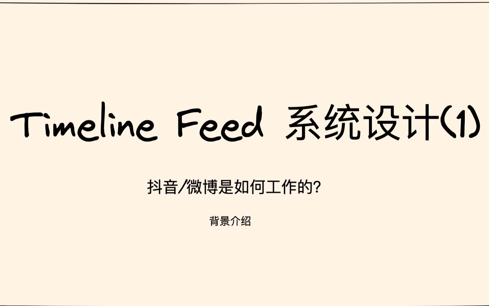

# Timeline Feed 系统设计01 - 背景介绍

> 系列：硬核课堂「系统设计」合集 · Timeline Feed 四期
> 上一期：— ｜ 下一期：[02 feed 发布与订阅的优化](Timeline%20Feed%20系统设计02%20-%20feed%20发布与订阅的优化.md)
> 文字依据：UP 公开的[官方讲稿](https://hardcore.feishu.cn/wiki/wikcn7FQDsq2tn2MOaZSDryv8Lf)（视频本身没有可用字幕，详见文末「来源、覆盖与局限」）

## 学完你应该获得什么

1. 能说清 Feed 是什么、为什么信息分发是互联网应用的基本能力，以及它为什么对延迟和可用性要求极高。
2. 能区分 **Timeline Feed** 与 **Top K Feed**：前者按关注关系召回、按发布时间排序；后者按召回策略取候选、由推荐模型排序。两者的瓶颈完全不同。
3. 能按「名词划服务、动词做接口」的方式把 Feed 系统划分为 User / Item / Feed / Relation / Comment / API 六个服务，并说清各自职责。
4. 能画出四条核心链路的交互顺序：用户注册、用户关注、发布 Item、读取 Feed 列表，外加点赞/收藏/评论/历史与详情页。
5. 会做一次像样的容量估算：以 500M DAU 为基准给出各接口的 p99、平均与峰值 QPS、可用性目标，并算出存储增量（约 1000TB/天）与视频 CDN 出流量（约 100PB/天）。
6. 能说清 **写放大** 与 **读放大** 的时间复杂度、存储代价与分页难题，并知道 Lady Gaga 问题为什么会把这两条路线都逼到墙角（详细解法在 02 期）。

## 一句话总论

Feed 系统就是信息分发系统，它的本质是「一次写入、多次读取」的读多写少负载（读写比约 100:1）；设计的第一道分水岭不是选什么存储，而是选择**写放大**还是**读放大**，这个选择决定了后面所有优化手段的形状。

## 适用场景与前置知识

**适合谁**：要动手做信息流、订阅、通知、动态这类功能的后端工程师；准备系统设计面试、想学一套完整推导过程的人。

**需要先知道**：QPS、p99 延迟、可用性几个 9 的含义；Redis 与关系库的基本使用方式；消息队列的作用；收件箱（inbox）与发件箱（outbox）的直觉。

**不适合谁**：想学 Top K 推荐系统（召回、特征、排序、样本拼接）的读者——那是同一合集里另一条线。本期只在概念层面区分两者。

## 知识地图

本期是四期的地基，结构可以分成「定义 → 目标 → 度量 → 骨架 → 起步方案」五段：

| 段落 | 内容 | 产出 |
| --- | --- | --- |
| 定义 | Feed、信息分发、Timeline Feed 与 Top K Feed | 明确本系列讨论的是 Timeline Feed [1] |
| 目标 | 八条产品功能（发布、关注、订阅流、详情页、个人主页、点赞评论转发、收藏点赞浏览记录与权限、合规审核） | 功能边界 [1] |
| 度量 | 黄金指标表、存储容量、网络带宽、负载特性 | 一份可用来做容量设计的基线 [1] |
| 骨架 | 六个服务与四条主链路 | 服务划分与接口交互 [1] |
| 起步方案 | 纯写放大的初始方案 | 引出 02 期的 Lady Gaga 问题 [1] |

**四期之间的关系**：01 立靶子（初始方案）→ 02 打掉发布订阅侧的写放大爆炸 → 03 打掉详情页侧的高延迟与尾部抖动 → 04 解决关系存储的规模与分片选择。

## 核心概念卡

### Feed 与两类 Feed

- **是什么**：Feed 是承载信息的单元，Feed 系统就是信息分发系统，首页展示的就是 Feed 列表。按召回方式分两类：Timeline Feed 依据用户之间的关注关系召回、按发布时间排序；Top K Feed 依据召回策略取候选、按推荐模型排序。
- **为什么重要**：这个区分决定了延迟预算放在哪里。Timeline 的瓶颈在扇出与聚合，Top K 的瓶颈在特征与模型推理。
- **常见误区**：把 Timeline Feed 当成「简单版推荐系统」，从而低估它在扇出和存储上的成本。[1]

### 读多写少（约 100:1）

- **是什么**：一个用户发 Feed，约有 100 个用户会阅读，读写比约 100:1。
- **为什么重要**：这决定了所有设计都要围绕「读要快」展开，也解释了为什么后面愿意付出写放大这种存储代价。
- **怎么用**：做压测和容量规划时，读接口按 100 倍写入量估算。[1]

### 六个服务的职责边界

| 服务 | 职责 |
| --- | --- |
| User server | 存储用户信息，提供用户维度属性的 CURD |
| Item server | 存储原始内容，提供发布与查询内容的能力 |
| Feed server | 存储 Feed 信息，提供信息流列表、个人主页、浏览记录、收藏列表 |
| Relation server | 存储用户关系（关注/朋友），提供粉丝列表与关注列表 |
| Comment server | 存储评论，拉取评论列表、发布评论、获取评论数 |
| API server | 聚合用户请求，做逻辑控制 |

- **为什么重要**：这些边界决定了后续每一个优化点落在哪个服务上（02 期优化 Feed server 与 Relation 的写路径，03 期优化 Item server 的读路径，04 期优化 Relation 的存储与分片）。
- **怎么用**：新做一个类似业务时，先按名词划边界、再按动词定接口，可以快速得到一张可讨论的架构图。[1]

### 收件箱与发件箱

- **是什么**：Feed 的存储按用户维度分成收件箱（别人写给我的）与发件箱（我写出去的）两个 List。收件箱里存的是 item ID，展示时再按 ID 聚合出作者、内容、关系等信息。
- **为什么重要**：写放大就是把 item 写进粉丝收件箱，读放大就是读自己关注对象的发件箱；后面所有推拉结合的讨论都建立在这对概念上。
- **常见误区**：把收件箱理解成「虚拟视图」。它是实际存储，容量成本正是 02 期用户分级与冷热分离要解决的问题。[1]

### 写放大与读放大

- **写放大**：发布时查粉丝列表，把 item ID 写入每个粉丝的收件箱。写复杂度 O(粉丝数)，读复杂度 O(1)。读快、写慢、存储成倍浪费，必须异步。
- **读放大**：拉取时查自己的关注列表，逐个扇出读关注对象的发件箱，按时间戳合并取最新 20 条。读复杂度 O(关注数)，写复杂度 O(1)。写简单、省存储、读慢，而且**难以实现分页**。
- **常见误区**：以为读放大只是慢一点。实际上合并、去重、合规过滤都要在合并后的列表上做，工程复杂度更高。[1]

### Lady Gaga 问题（本期首次抛出）

- **是什么**：DDIA 里的经典场景。超级大 V 发布一条内容时，纯写放大方案会连续引爆六件事：① 千万级粉丝列表让一次 RPC 无法在 500ms 内返回；② 千万次 RPC 写不完，粉丝收到内容的时间差可能超过半小时；③ 大量点击涌向详情页，把详情页及下游 QPS 一起拉高；④ 评论量激增，评论与评论数缓存的一致性受影响；⑤ 上热搜后大量关注动作压向关系服务，粉丝数与关注数缓存被频繁更新，可能引发缓存穿透；⑥ 全网转发引导大量注册，注册接口流量突增。
- **为什么重要**：它说明 Feed 系统的故障从来不是单点，而是会被热点放大成系统性风险。
- **怎么用**：容量评估必须单列「热点事件」场景，而不是只算平均 QPS。
- **本期留下的悬念**：第一期只把初始方案和问题摆出来，具体解法（推拉结合、用户分级等）在 02 期。评论区有人质疑「异步写入每个粉丝收件箱」的设计，UP 的答复就是「这是第一节，第二节专门讲了这个问题」。[1][3]

## 方法或流程

### 发布 Item

1. 写 item 到 Item 服务。
2. 调用 Relation 服务拿粉丝关系列表。
3. 触发异步任务：审核、转码、NLP 打标签。
4. 异步把内容写入粉丝的收件箱列表，按时间戳（ts = timestamp）排序。

### 读取 Feed 列表

1. 直接从 Feed 服务读自己的收件箱。
2. 收件箱里只有 item ID，按 ID 去 Item 服务聚合作者/内容/关系信息。
3. 执行过滤规则，保证内容有效且合规后放出。

### 点赞 / 收藏 / 评论 / 历史

1. API server 访问 Item 服务完成点赞。
2. 访问 Comment 服务发布评论。
3. 把 item ID 加入 Feed 服务中该用户的收藏/历史列表。

### 点击详情页

1. 判断是否符合规则允许放出。
2. API server 请求 Item 服务拿 item 维度信息。
3. 用其中的作者 userID 去 User 服务查用户信息。
4. 用 Relation 服务查当前用户是否关注了作者。

### 容量估算（照这个顺序算一遍）

1. 定基准：500M DAU。
2. 定指标：Feed 列表接口 p99 ≤ 200ms、平均 60K QPS、峰值 90K QPS、5 个 9；发布接口 p99 ≤ 500ms、平均 6K QPS；详情页与个人主页 p99 ≤ 200ms、平均 2K QPS、4 个 9；关注/点赞/转发 p99 ≤ 50ms、平均 6K QPS、4 个 9；发布评论 p99 ≤ 300ms、平均 2K QPS、3 个 9；读取评论列表 p99 ≤ 200ms、平均 10K QPS、3 个 9；收藏/点赞/浏览记录 p99 ≤ 200ms、平均 1K QPS、3 个 9。
3. 算存储：单条视频 2MB × 6K QPS × 24 × 60 × 60 ≈ 1000TB/天。
4. 算带宽：网络请求带宽可忽略，视频 CDN 出流量按「一次刷 10 条、每条都会被点击」估算，10 × 60K × 2MB × 24h × 60 × 60 ≈ 100PB/天。

## 关键洞察

- **事实描述**：Feed 系统读写比约 100:1；写放大复杂度 O(粉丝数)、读放大复杂度 O(关注数)；行业里每一次 Feed 事故基本都会上热搜。[1]
- **经验判断**：容量估算的难点在带宽与存储，不在请求 QPS——视频 CDN 的量级（PB 级）比请求带宽高出好几个数量级，讨论「省请求」之前先把分发成本算清楚。[1]
- **推荐做法**：先按名词划服务边界、按动词定接口，再讨论每个服务的瓶颈；先写清四条主链路，再谈优化。[1]
- **限制条件**：本期给出的初始方案是纯写放大，能跑通功能但在规模上不成立，这是后面三期的前提。[1]

## 实践清单

- 写设计文档时，第一页放容量估算（DAU、读写比、峰值倍数、存储与带宽），不要只放架构图。
- 每个接口都给出 p99 目标与可用性目标，并说明为什么这个接口可以是 3 个 9 而 Feed 列表必须 5 个 9。
- 收件箱落地前先决定存 item ID 还是存快照：存 ID 省空间但要聚合，聚合要有降级路径。
- 明确异步任务的边界：审核、转码、打标签、扇出写入都是异步，失败要有补偿（补偿机制在 02 期展开）。
- 做压测时单列热点场景，不要只按平均 QPS 验证。

## 坑点与反例

- **正文里 `item` 被拼成 `itme`**：讲稿多处出现，评论区也有人提醒，读的时候不要被带偏。[1]
- **讲稿链接曾经放错**：有读者反馈「视频简介里的飞书文档没有 feed 流这节的讲义」，UP 回复「已经补充」。找讲稿时以合集主页的「系统设计 → Timeline Feed系统设计」条目为准。[3]
- **容易把「详情页 QPS」当成小头**：指标表里详情页平均只有 2K QPS，但它在热点事件下会被 Feed 列表的点击量放大，是典型的「平均值无害、尾部致命」的接口。[1]
- **合规审核不是可选项**：设计目标里明确列出「不能放出非法内容，需要有审核机制」，读取链路上的过滤规则与发布链路上的异步审核是两件不同的事，别只做一边。[1]

## 自测题

1. Timeline Feed 与 Top K Feed 的区别是什么？——前者按关注关系召回、按发布时间排序；后者按召回策略取候选、用推荐模型排序。
2. Feed 系统的读写比大约是多少，这个数字影响什么？——约 100:1，决定了所有优化围绕降低读延迟展开。
3. 六个服务各自负责什么？——User 用户信息、Item 原始内容、Feed 信息流与收藏/历史、Relation 关注关系、Comment 评论、API 聚合与逻辑控制。
4. 写放大和读放大各自的时间复杂度，各自的难受之处是什么？——写放大 O(粉丝数)、读 O(1)，难受在存储与写入延迟；读放大 O(关注数)、写 O(1)，难受在读延迟与分页。
5. 发布一条 Feed 要经过哪几步？——写 Item → 查粉丝列表 → 触发审核/转码/打标签等异步任务 → 异步写入粉丝收件箱并按时间戳排序。
6. Lady Gaga 问题会引发哪几类连锁反应？——写侧超时与顺序不一致、详情页与下游 QPS 抬升、评论与计数一致性、关注行为打爆关系服务缓存、注册流量突增，共六类。
7. 按 500M DAU 估算，一天新增存储和视频 CDN 出流量分别是什么量级？——约 1000TB 与约 100PB。

## 证据脚注

1. [飞书讲稿：背景介绍 / 设计目标 / 评估标准 / 初始方案 / 接口交互](原始材料/timelinefeed_飞书讲稿/Timeline%20Feed系统设计-飞书讲稿.md)
2. [BV1N34y1p7NL 元数据](原始材料/BV1N34y1p7NL_timelinefeed01_背景介绍/metadata/metadata.json)
3. [BV1N34y1p7NL 评论全集](原始材料/BV1N34y1p7NL_timelinefeed01_背景介绍/comments/评论全集.md)
4. [BV1N34y1p7NL 证据索引](原始材料/BV1N34y1p7NL_timelinefeed01_背景介绍/indexes/证据索引.jsonl)

[1]: 原始材料/timelinefeed_飞书讲稿/Timeline%20Feed系统设计-飞书讲稿.md "飞书讲稿"
[2]: 原始材料/BV1N34y1p7NL_timelinefeed01_背景介绍/metadata/metadata.json "视频元数据"
[3]: 原始材料/BV1N34y1p7NL_timelinefeed01_背景介绍/comments/评论全集.md "评论全集"
[4]: 原始材料/BV1N34y1p7NL_timelinefeed01_背景介绍/indexes/证据索引.jsonl "证据索引"

## 来源、覆盖与局限

- 视频：[timeline feed 系统设计01 - 背景介绍](https://www.bilibili.com/video/BV1N34y1p7NL/)，BVID `BV1N34y1p7NL`，UP 硬核课堂，2022-06-30 发布，时长 41:28。
- **字幕覆盖为零**：公开接口探测结果为 `subtitles: []`（`need_login_subtitle: false`），本机没有可用的浏览器 AI 字幕通道与音频转写环境，所以本笔记的文字依据是 UP 公开的官方讲稿，加上视频元数据与评论区，**不等同于视频逐句讲解**。
- 讲稿中的整体架构图是飞书文档内的图片，匿名接口取不到直链（页面原始 HTML 是脚本空壳，第三方阅读器也拿不到），需要看图请打开[讲稿原文](https://hardcore.feishu.cn/wiki/wikcn7FQDsq2tn2MOaZSDryv8Lf)。
- 本期封面已下载到 `原始材料/BV1N34y1p7NL_timelinefeed01_背景介绍/images/cover.jpg`。
- 评论覆盖：抓取 26 条（主评论 18 条、子评论 8 条），本笔记只收录有技术价值的质疑与补充。
