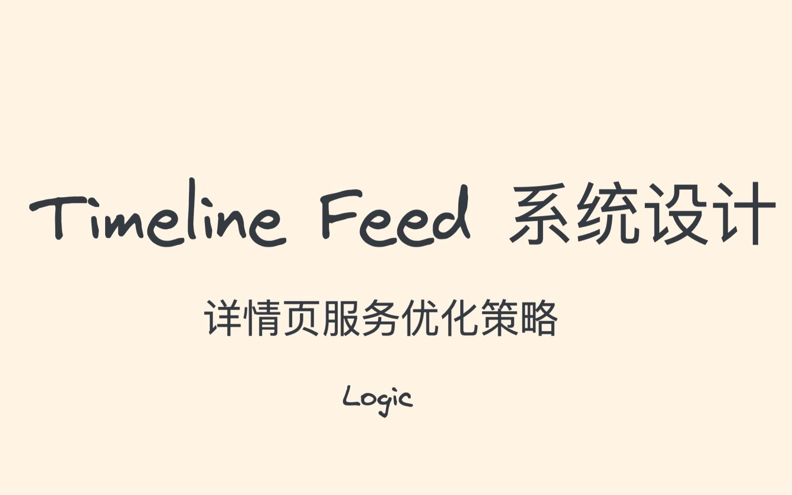

# Timeline Feed 系统设计03 - 详情页优化

> 系列：硬核课堂「系统设计」合集 · Timeline Feed 四期
> 上一期：[02 feed 发布与订阅的优化](Timeline%20Feed%20系统设计02%20-%20feed%20发布与订阅的优化.md) ｜ 下一期：[04 社交关系的存储](Timeline%20Feed%20系统设计04%20-%20社交关系的存储.md)
> 文字依据：UP 公开的[官方讲稿](https://hardcore.feishu.cn/wiki/wikcn7FQDsq2tn2MOaZSDryv8Lf)（视频本身没有可用字幕，详见文末「来源、覆盖与局限」）

## 学完你应该获得什么

1. 能说清详情页为什么会成为延迟与尾部抖动的重灾区：一次查询要扇出多个下游 RPC 聚合作者、内容、关系、状态等信息。
2. 会做核心路径区分：哪些 RPC 可失败可降级、哪些不可失败必须主动取消其余请求。
3. 掌握多级缓存完整方案：本地缓存加分布式缓存，以及穿透、击穿、大 key、热 key 四类问题各自的处理手法。
4. 会用 **Request backup**（来自 The Tail at Scale）压 p99 尾部延迟，并知道它会给下游增加约 5% 的 QPS。
5. 能解释对象池与内存分配器的组合为什么能降低 GC 对在线服务 p99 的影响。
6. 会判断什么时候该把计数（点赞数、评论数、浏览数）独立成 counter server，以及它的写入合并、内存热点读与恰好一次语义。
7. 能正面回答「已经被下架或不存在的内容被反复查询怎么办」这个问题，并识别三种常见答案各自的缺陷。

## 一句话总论

详情页优化的核心是「把不可控的扇出变成可控的路径」：先区分核心与非核心调用，再用多层缓存把绝大多数请求留在内存里，最后用备份请求和对象池把尾部延迟与运行时抖动压下去；计数这类负载特征相反的操作则要独立成服务。

## 适用场景与前置知识

**适合谁**：负责详情页、聚合接口、读路径优化的后端工程师；被 p99 抖动困扰过的人；准备系统设计面试的人。

**需要先知道**：Redis 与本地缓存的基本用法；RPC 扇出与超时控制；GC 对延迟的影响；消息队列与恰好一次语义的大致含义；读过 01 期与 02 期，知道详情页 QPS 会被 Feed 热点放大。

**不适合谁**：只关心写路径与订阅分发的读者（02 期）；只关心关系表分片的读者（04 期）。

## 知识地图

本期从「一个慢请求」讲到「一套读路径体系」：

| 段落 | 内容 | 产出 |
| --- | --- | --- |
| 定位 | 详情页要聚合下游数据、判断是否下架、是否 404 | 明确瓶颈在扇出数量与查询路径长度 [1] |
| 第一层 | 并行调用下游 RPC、先检查状态、拿到数据后打包返回 | 实现简单，5K QPS 量级够用 [1] |
| 第二层 | 多级缓存与四类缓存问题 | 把延迟与可靠性一起拿下 [1] |
| 第三层 | 客户端预加载 | 把用户感知延迟降到最低 [1] |
| 第四层 | Request backup、对象池、新硬件 | 压 p99 与运行时抖动 [1] |
| 第五层 | counter 服务化 | 解决计数与内容的一致性与资源隔离 [1] |
| 开放问题 | 下架/404 内容被反复查询怎么处理 | 三种常见方案都有缺陷，留给读者 [1] |

## 核心概念卡

### 详情页的扇出结构

- **是什么**：详情页请求要聚合 item 维度信息、作者信息、当前用户与作者的关系、内容状态（是否下架、是否 404）等，每一类都要一次 RPC。
- **为什么重要**：扇出数量直接决定 p99；路径越长，延迟越不稳定。
- **怎么用**：第一版就按「并行调用 + 状态预检查 + 打包返回」实现，先保证功能与 5K QPS 量级，再用缓存换延迟。
- **常见误区**：不区分核心与非核心调用，一个非核心 RPC 超时把整个请求拖住。[1]

### 多级缓存

- **结构**：本地缓存解决高热，分布式缓存解决容量。
- **更新方式**：TTL、旁路缓存、基于事件驱动删除 key。
- **四类问题的处理**（按标准定义，讲稿正文把前两者的定义写反了，见「坑点」）：
  - **缓存穿透**：请求的 key 在缓存与 DB 中都不存在，请求反复落到 DB。做法是分布式锁加租约：请求 A 发现为空后用 lua 写一个带租约的锁 key，B、C 自旋等待；A 查 DB 回填缓存并释放；A 失败则租约到期自动过期，B、C 谁先拿到锁谁继续。
  - **缓存击穿**：热点 key 失效的瞬间大量请求打到 DB。做法是缓存空 key，并把空 key 单独维护一个 cache 与有效 key 隔离，避免拉低命中率。
  - **大 key**：String 类型 value 超过 10KB、集合类型元素超过 5000 个、集合单元素总长度超过 10MB 都算大 key，通过拆分 key 解决。
  - **热 key**：用本地内存与磁盘缓存、双 TTL 机制缓解。
- **为什么重要**：缓存是详情页延迟优化的主力，但四类问题处理不好会从「加速器」变成「故障源」。
- **常见误区**：只顾提高命中率，不区分空值与有效值，结果空 key 把缓存挤满。[1][4]

### 客户端预加载

- **是什么**：在 Feed 列表展示时就同步请求详情页内容并缓存在客户端；进一步的做法是多请求几屏内容并异步预加载；再进一步是用户停留在某个 Feed 超过一定时长才预加载。
- **收益**：用户点击时几乎无感知延迟。
- **代价**：产生大量无效请求，需要不断调整预加载策略才能收益最大化。[1]

### Request backup

- **是什么**：来自《The Tail at Scale》。RPC 扇出时区分重要程度：可失败的直接降级，不可失败的失败后主动取消所有无效下游请求；对核心 RPC 统计单机 p95，超时风险高的请求再发一次备份请求来对冲。
- **收益**：提高可用性、降低 p99。
- **代价**：开发复杂，极端情况下给下游增加约 5% QPS。[1]

### 对象池与内存分配器

- **是什么**：Web 服务每次请求会创建大量生命周期很短的小对象。先用 tcmalloc 或 jemalloc 提高分配性能，再在业务层建设对象池，请求结束后把对象回收进池子而不是让 GC 回收（更进一步是关闭 GC 或使用堆外内存）。
- **为什么重要**：后台任务触发的 GC 会直接抬高在线服务的 p99，对象池把内存管理的主动权交回业务。
- **怎么用**：先在压测里确认 GC 是 p99 的主要来源，再上对象池，避免过早引入复杂度。[1]

### counter server（计数服务化）

- **要解决的问题**：Item 服务的读是延迟优先，而点赞/评论/浏览这类计数写是吞吐优先，两类负载特征相反，放在一个服务里会互相拖累；同时计数与内容本身的一致性也需要单独处理。
- **做法**：写操作走消息队列，生产端与消费端都可以做变更合并以减少 RPC 次数、提高吞吐；读操作把最热的 key 放在内存里，提供最低延迟；通过消息队列保证恰好一次执行，计数最终一致。
- **收益**：解决了计数与内容的一致性问题，对写做了吞吐优化，在低延迟、高吞吐、最终一致、可用性之间取得折中。
- **代价**：实现更复杂，研发成本更高。[1]

### 下架内容与 404 查询（讲稿留的思考题）

- **问题**：已经被下架或者不存在的内容会被反复查询，怎么处理最快最省资源？
- **三种常见答案的缺陷**：① 布隆过滤器需要离线构建，且假阳性在这个场景不可接受（合法内容被误判为不存在）；② 请求频率高可以考虑本地化，但本地化后如何保证更新一致性；③ 直接存 map 会带来内存压力，因为要保存全量数据。
- **怎么用**：这三种缺陷本身就是评审清单，任何方案至少要能回答「更新延迟」「误判后果」「内存上限」这三问。[1]

## 方法或流程

### 优化详情页读路径的顺序

1. **先并行化**：把所有下游 RPC 改成并行调用，拿到结果后统一打包返回。
2. **再区分核心路径**：给每个 RPC 标注是否可失败；可失败的降级返回，核心的失败则取消其余无效请求。
3. **前置状态检查**：item 状态为不可见（下架、404）时直接拒绝，不要走完整聚合链路。
4. **上多级缓存**：本地缓存挡高热，分布式缓存挡容量；按穿透、击穿、大 key、热 key 四类分别配置策略。
5. **压 p99**：对核心 RPC 用单机 p95 触发 backup request。
6. **降运行时抖动**：换内存分配器并建设对象池，必要时关闭 GC 或改用堆外内存。
7. **拆出计数服务**：把点赞数、评论数、浏览数迁到 counter server，写入合并，读取走向内存热点。
8. **客户端预加载**：让用户点击前内容已经在本地，但要控制无效请求比例。

### 上线缓存前的自查

1. key 为空时的行为是什么？（穿透）
2. 热点 key 失效瞬间会发生什么？（击穿）
3. 最大的 key 有多大？超过 10KB 或 5000 个元素吗？
4. 最热的 key 命中率是多少，是否有本地缓存兜底？
5. 缓存与实际数据不一致时，用户看到的是什么？

## 关键洞察

- **事实描述**：详情页的延迟问题来自扇出数量与路径长度；计数类操作的负载特征与内容读取相反。[1]
- **经验判断**：缓存命中率是详情页延迟的决定性指标，但「命中率」要靠隔离空值、拆分大 key、本地兜底热 key 来保住，而不是单纯加大容量。[1]
- **推荐做法**：核心路径优先；备份请求只给核心 RPC；对象池在确认 GC 是瓶颈之后再上；计数独立成服务。[1]
- **限制条件**：客户端预加载会增加无效请求；备份请求会给下游加约 5% QPS；持久化 KV 与新硬件能降内存成本，但要求改造基础组件。[1]
- **一条可迁移的判断**：当一个接口同时承担「吞吐优先的写」和「延迟优先的读」时，拆服务比调参数更有效，counter server 就是这条判断的实例。

## 实践清单

- 给每个下游 RPC 标注重要级别，并实现「失败即取消其余请求」的逻辑。
- 状态检查前置：下架、删除、404 的第一时间返回，不进入聚合链路。
- 本地缓存与分布式缓存分层配置，明确各自容量、TTL 与失效方式。
- 空值缓存单独成池，避免污染有效 key 的命中率。
- 大 key 与大 value 设监控阈值（10KB / 5000 元素 / 10MB）。
- 核心 RPC 配置 p95 触发的备份请求，并评估下游 5% 增量。
- 压测确认 GC 影响后，再引入对象池与 tcmalloc/jemalloc。
- 计数独立成服务，写入合并、读走内存热点、用消息队列保证恰好一次。
- 把「下架内容反复查询」的三种方案缺陷写进设计文档，作为方案评审的必答项。

## 坑点与反例

- **讲稿把穿透和击穿写反了**：正文里「穿透」和「击穿」的定义与业界标准定义相反，评论区明确指出「教案里穿透和击穿的概念弄反了」。看这一节时按本笔记「多级缓存」里的标准定义校正：**穿透是 key 在缓存和 DB 里都不存在**，**击穿是热点 key 失效瞬间大量请求落到 DB**。[4]
- **第 03 期视频画面是镜像的**：评论区有人指出「TimeLine-3 的视频是镜像的，是不是压缩的时候出错了」，看视频时注意这一点。[4]
- **不区分核心路径的并行 RPC 会放大故障**：第一版方案里，任一 RPC 失败都会拖住整条链路，讲稿把它列为明确的缺陷。[1]
- **预加载不是越多越好**：无效请求会浪费客户端与后端资源，需要按停留时长等信号控制。[1]
- **永久缓存下架内容不可行**：布隆过滤器假阳性不可接受、本地化有一致性问题、全量 map 有内存问题，讲稿把这个问题留作开放题。[1]
- **counter 与内容的一致性是设计目标而不是副作用**：如果只是把计数挪出去而不设计一致性方案，问题会从「慢」变成「不准」。[1]

## 自测题

1. 详情页为什么容易出现高延迟和 p99 抖动？——一次查询要扇出多个下游 RPC 聚合作者、内容、关系、状态等信息，路径长且依赖多。
2. 什么是核心路径区分，怎么用？——给每个 RPC 标注重要级别，可失败的降级返回，核心的失败就取消其余无效请求。
3. 缓存穿透和缓存击穿的区别与各自的处理方式？——穿透是 key 在缓存与 DB 都不存在（分布式锁加租约，或缓存空 key）；击穿是热点 key 失效瞬间大量请求打到 DB（缓存空 key，空值单独成池）。
4. 大 key 的判定阈值大致是多少？——String value 超过 10KB、集合元素超过 5000 个、集合单元素总长度超过 10MB。
5. Request backup 解决什么问题，代价是什么？——压 p99 尾部延迟；极端情况下给下游增加约 5% QPS。
6. 对象池为什么能降低 p99？——把短生命周期对象的回收从 GC 手里接过来，减少后台 GC 对在线请求的干扰。
7. 为什么要拆出 counter server？——写吞吐优先与读延迟优先的负载特征相反，且计数与内容的一致性需要单独设计。
8. 下架或 404 内容被反复查询时，三种常见方案各自的问题是什么？——布隆过滤器假阳性不可接受且要离线构建；本地缓存有一致性问题；全量 map 有内存压力。
9. 客户端预加载的收益与代价分别是什么？——收益是点击时几乎没有等待；代价是产生大量无效请求，需要精细的策略控制。

## 证据脚注

1. [飞书讲稿：Item Server 优化（延迟 & 可用 & 存储优化）/ 思考题](原始材料/timelinefeed_飞书讲稿/Timeline%20Feed系统设计-飞书讲稿.md)
2. [BV1xf4y1o7Mp 元数据](原始材料/BV1xf4y1o7Mp_timelinefeed03_详情页优化/metadata/metadata.json)
3. [BV1xf4y1o7Mp 证据索引](原始材料/BV1xf4y1o7Mp_timelinefeed03_详情页优化/indexes/证据索引.jsonl)
4. [BV1xf4y1o7Mp 评论全集](原始材料/BV1xf4y1o7Mp_timelinefeed03_详情页优化/comments/评论全集.md)

[1]: 原始材料/timelinefeed_飞书讲稿/Timeline%20Feed系统设计-飞书讲稿.md "飞书讲稿"
[2]: 原始材料/BV1xf4y1o7Mp_timelinefeed03_详情页优化/metadata/metadata.json "视频元数据"
[3]: 原始材料/BV1xf4y1o7Mp_timelinefeed03_详情页优化/indexes/证据索引.jsonl "证据索引"
[4]: 原始材料/BV1xf4y1o7Mp_timelinefeed03_详情页优化/comments/评论全集.md "评论全集"

## 来源、覆盖与局限

- 视频：[Timeline Feed 系统设计03- 详情页优化](https://www.bilibili.com/video/BV1xf4y1o7Mp/)，BVID `BV1xf4y1o7Mp`，UP 硬核课堂，2022-07-12 发布，时长 58:41（本系列最长的一期）。
- **字幕覆盖为零**：公开接口探测结果为 `subtitles: []`（`need_login_subtitle: false`），本机没有浏览器 AI 字幕通道与音频转写环境，文字依据是 UP 公开的官方讲稿，加上元数据与评论区。
- 讲稿中「Item server 缓存与 counter」处的架构图是飞书文档内的图片，匿名接口取不到直链，需要看图请打开[讲稿原文](https://hardcore.feishu.cn/wiki/wikcn7FQDsq2tn2MOaZSDryv8Lf)。
- 本期封面已下载到 `原始材料/BV1xf4y1o7Mp_timelinefeed03_详情页优化/images/cover.jpg`。
- 评论覆盖：抓取 8 条（主评论 7 条、子评论 1 条），数量少但包含「穿透与击穿写反」「视频画面镜像」两条重要纠错。
