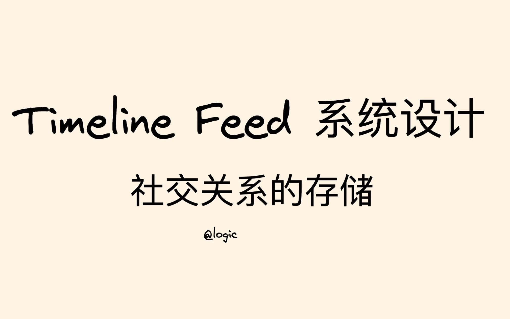

# Timeline Feed 系统设计04 - 社交关系的存储

> 系列：硬核课堂「系统设计」合集 · Timeline Feed 四期
> 上一期：[03 详情页优化](Timeline%20Feed%20系统设计03%20-%20详情页优化.md) ｜ 下一期：—
> 文字依据：UP 公开的[官方讲稿](https://hardcore.feishu.cn/wiki/wikcn7FQDsq2tn2MOaZSDryv8Lf)（视频本身没有可用字幕，详见文末「来源、覆盖与局限」）

## 学完你应该获得什么

1. 能判断关系数据该用关系型 DB 还是 KV / 图数据库，并说清各自的代价。
2. 掌握分库分表的选型方法：range 分表与 hash 分表分别适合什么场景，为什么关系数据更适合 hash。
3. 能解释 `from_user_id` 分片与 `to_user_id` 分片各自优化了哪条查询，以及为什么**单向关系要按粉丝维度存储**。
4. 能说清马太效应在关系存储中的具体表现，以及双向关系为什么可以用联合 hash 规避。
5. 知道关系服务的三条已知风险：超级大 V 导致分片倾斜、分库分表无法在线 join、运维成本高，以及用定期备份到 hive 支撑分析查询的做法。
6. 能把关系存储的结论迁移到「转评赞」这类同构需求上：写吞吐优先、读延迟优先、写先乐观展示、底层异步最终一致。

## 一句话总论

社交关系存储的核心是选对分片键：关系数据是典型的「写吞吐优先、读延迟优先」负载，hash 分片优于 range 分片，而在单向关系里必须按粉丝维度（to_user_id）分片，否则超级大 V 的粉丝数据会把某个分片压垮。

## 适用场景与前置知识

**适合谁**：要设计关注、好友、粉丝、拉黑这类关系表的人；做转评赞、收藏、订阅等「一人一次动作、多人读取」需求的人；准备系统设计面试的人。

**需要先知道**：分库分表的基本概念（range / hash）；关系库索引与 join 的代价；KV 存储与图数据库的大致定位；读过 02 期，知道关系服务承受了热搜带来的关注洪峰。

**不适合谁**：想学 Feed 分发与详情页优化的读者（02、03 期）。

## 知识地图

本期的问题链条很短，但每一步都有取舍：

| 问题 | 讲稿给的答案 | 代价 |
| --- | --- | --- |
| 关系数据用什么存 | 关系型 DB 加 hash 分库分表，起步快 | 分片倾斜、无法在线 join、运维成本高 [1] |
| 分片键选谁 | 单向关系按粉丝维度（to_user_id），双向关系用 to_user_id 与 from_user_id 联合 hash | 超级大 V 仍可能让分片不均 [1] |
| range 还是 hash | hash，因为历史关注也会被频繁查询，冷热差异不明显 | 失去范围查询能力 [1] |
| 怎么支持分析查询 | 周期性备份到 hive，做大规模 join | 数据有延迟 [1] |
| 转评赞这类同构需求 | KV 或图数据库，写先乐观展示、底层异步最终一致 | 一致性靠最终一致兜底 [3] |

## 核心概念卡

### 关系型 DB 做关系存储

- **是什么**：关注关系本质是 (from_user_id, to_user_id) 的二维关系，用关系库存储最自然。
- **收益**：实现简单、对研发要求低、可以快速上线，支持较大规模场景。
- **代价**：超级大 V 粉丝量过十亿时 hash 会造成分片数据量分布不均；分库分表天生无法做在线 join，只能支持简单的单表查询；分库分表难以运维。讲稿里那句「这是传统关系 DB 的最后呻吟」说的就是这三条。[1]

### range 分表与 hash 分表

- **range 分表**：适合冷热数据差异明显的场景。但关系数据里历史关注的用户也会被频繁查询，冷热差异不明显，所以不适合。
- **hash 分表**：适合没有顺序假设的场景，关系存储正好符合。
- **怎么用**：先问「这张表有没有范围查询需求」，没有就选 hash。[1]

### from_user_id 分片与 to_user_id 分片

- **按 from_user_id（关注维度）hash**：同一个用户的关注列表落在一个分片里，**查询关注列表最优**。
- **按 to_user_id（粉丝维度）hash**：同一个用户的粉丝列表落在一个分片里，**查询粉丝列表最优**。
- **为什么重要**：读路径优化必须和「谁读得最多」对齐。Timeline Feed 的读取要走关注列表，但关系服务被热搜打爆的场景恰恰是粉丝列表与关注数的写入，因此不能只看读。[1]

### 马太效应与分片键选择

- **是什么**：单向关系（我关注你、你不一定关注我）下，粉丝分布极度不均，少数大 V 拥有海量粉丝。
- **结论**：单向关系应该**按粉丝维度（to_user_id）存储**，让一个大 V 的粉丝集中在一个分片里，列表查询才高效；双向关系（好友）不存在这种倾斜，用 to_user_id 与 from_user_id 联合 hash 即可。
- **为什么重要**：这是本期最实用的一条结论，直接决定表结构设计。[1]

### 分库分表与在线 join

- **是什么**：分片之后跨分片 join 不可用，能做的只有单表查询。
- **怎么用**：分析类查询通过周期性把数据备份到 hive 表，在数仓里做大规模 join。[1]
- **常见误区**：以为分片之后还能像以前一样随手 join，结果线上查询退化成多次单表查询加内存合并。

### 关系数据与转评赞同构

- **是什么**：点赞、转发、收藏这类数据与关系存储是同一类负载：写吞吐要求高、读延迟要求低，用 KV 或图数据库的比较多。
- **UP 给的实现建议**：写操作可以先在端上给自己展示（例如点赞后立刻显示已点赞），保证数据一致性，底层异步达成最终一致，思路与我讲过的 counter server 类似；点赞数、转发数都适用；**评论是另一个话题，因为一致性要求最高**，需要单独讨论。
- **为什么重要**：把本期结论直接迁移到另一类需求上，是这套内容最有价值的复用方式。[3]

## 方法或流程

### 设计关系表结构时的判断顺序

1. **先定读写特征**：关系数据写吞吐优先、读延迟优先，因此倾向 hash 分片。
2. **再定关系类型**：单向（关注）还是双向（好友/朋友）。
3. **选分片键**：单向按 to_user_id（粉丝维度）；双向用 to_user_id 与 from_user_id 联合 hash。
4. **排除 range**：历史关注也会被频繁查询，冷热差异不明显，不要用 range。
5. **处理超级大 V**：明确分片倾斜的监控与应对（例如对超大粉丝量账号单独处理或加副本读）。
6. **规划分析路径**：周期备份到 hive，支持大规模 join 与统计。
7. **写路径设计**：写先乐观展示、底层异步最终一致；计数类交给 counter server。
8. **评论不要混进来**：它的强一致要求与关系/计数完全不同，单独设计。

### 迁移到转评赞需求的清单

- 存储选型：KV 或图数据库，而不是关系表。
- 写路径：端上先展示、底层异步最终一致。
- 计数：独立成 counter 服务，写入合并。
- 评论：单独处理，倾向强一致，不要复用点赞的折中方案。
- 图数据库的选型要谨慎：评论区有读者反馈实际项目里图数据库性能不佳，这一点讲稿没有给出定量结论。[3]

## 关键洞察

- **事实描述**：关系数据历史关注也会被频繁查询，所以 range 分表不适用；分库分表无法在线 join，只能靠备份到 hive 做分析。[1]
- **经验判断**：单向关系存在马太效应，必须按粉丝维度存储；双向关系没有这个问题，可以用联合 hash。[1]
- **推荐做法**：起步用关系型 DB 加 hash 分片，快速上线；规模压力上来后再评估 KV 或图数据库；分析查询走数仓。[1][3]
- **限制条件**：超级大 V 的粉丝量可以让 hash 分片倾斜；分库分表运维成本高；图数据库的性能在真实项目里存在疑问，缺少定量数据。[1][3]
- **一条可迁移的判断**：凡是「一人一次动作、多人读取」的数据（关注、点赞、收藏、订阅），都该按写吞吐与读延迟两个方向分别优化，并且把强一致的内容（评论）拆出去。

## 实践清单

- 关系表上线前明确记录：分片键、关系类型、每类查询走哪个分片。
- 为分片倾斜设置监控：单分片行数、单分片写入 QPS、超大粉丝量账号列表。
- 分析类查询走数仓，不要在线上关系表上做跨分片统计。
- 写路径准备最终一致方案：失败重试加补偿，或者端上乐观展示加底层异步。
- 评论与点赞使用不同的存储与一致性策略，不要为了省事合并。
- 引入图数据库前先做性能验证，评论区已有实际项目反馈性能不佳的案例。
- 把「超级大 V 的新增粉丝」当成容量测试场景，而不只是功能测试。

## 坑点与反例

- **超级大 V 让 hash 分片不均**：粉丝量过十亿时，即使按粉丝维度分片，单个分片的数据量与写入量仍会明显高于其他分片，需要额外设计。[1]
- **分库分表后不能在线 join**：想让关系数据和内容数据在数据库里一次查出来，这条路走不通。[1]
- **运维成本被低估**：分片扩容、数据迁移、跨分片一致性都要额外投入，讲稿把「难以运维」与分片倾斜并列为主要风险。[1]
- **图数据库的性能疑问**：评论区有人问「图数据库性能跟得上吗？我听说我们有一个需求用了图数据库存关系，说性能不大好」，UP 的答复是关系类数据用 KV 或图数据库较多、写吞吐要求高读延迟要求低，但没有给出图数据库的定量结论；这条属于开放问题，选型前要自己压测。[3]
- **讲稿文档只能在线查看**：评论区有人提到「文档只能在线查看」，要离线保存就得自己导出（本笔记的归档就是把正文抓成 Markdown 的结果）。[3]
- **读者提的一个改进建议**：有读者建议「可以找个例子从头到尾串一下就更棒了」，说明这套内容偏方案清单，缺一个端到端案例；做练习时建议自己补一个（例如以「关注 + 发 Feed + 刷 Feed + 点赞」串一遍）。[3]

## 自测题

1. 关系数据为什么不适合用 range 分表？——历史关注也会被频繁查询，冷热差异不明显。
2. 按 from_user_id 与按 to_user_id 分片分别优化哪条查询？——前者优化关注列表查询，后者优化粉丝列表查询。
3. 为什么单向关系要按粉丝维度存储？——单向关系存在马太效应，粉丝分布极不均匀，按粉丝维度可让同一账号的粉丝集中在一个分片。
4. 双向关系怎么分片？——to_user_id 与 from_user_id 联合 hash，因为不存在马太效应。
5. 分库分表之后如何支持大规模分析查询？——周期性备份到 hive，在数仓里做 join。
6. 关系型 DB 做关系存储的三条主要代价是什么？——分片倾斜、无法在线 join、运维成本高。
7. 转评赞类需求应该怎么设计？——用 KV 或图数据库，写先乐观展示、底层异步最终一致，计数走 counter 服务，评论单独处理。
8. 为什么评论不适合复用点赞的折中方案？——评论的一致性要求最高，端上乐观展示加最终一致不满足它。

## 证据脚注

1. [飞书讲稿：Relation server 延迟 & 可用 & 存储优化](原始材料/timelinefeed_飞书讲稿/Timeline%20Feed系统设计-飞书讲稿.md)
2. [BV11Y4y1j7g1 元数据](原始材料/BV11Y4y1j7g1_timelinefeed04_社交关系的存储/metadata/metadata.json)
3. [BV11Y4y1j7g1 评论全集](原始材料/BV11Y4y1j7g1_timelinefeed04_社交关系的存储/comments/评论全集.md)
4. [BV11Y4y1j7g1 证据索引](原始材料/BV11Y4y1j7g1_timelinefeed04_社交关系的存储/indexes/证据索引.jsonl)

[1]: 原始材料/timelinefeed_飞书讲稿/Timeline%20Feed系统设计-飞书讲稿.md "飞书讲稿"
[2]: 原始材料/BV11Y4y1j7g1_timelinefeed04_社交关系的存储/metadata/metadata.json "视频元数据"
[3]: 原始材料/BV11Y4y1j7g1_timelinefeed04_社交关系的存储/comments/评论全集.md "评论全集"
[4]: 原始材料/BV11Y4y1j7g1_timelinefeed04_社交关系的存储/indexes/证据索引.jsonl "证据索引"

## 来源、覆盖与局限

- 视频：[Timeline Feed 系统设计04 - 社交关系的存储](https://www.bilibili.com/video/BV11Y4y1j7g1/)，BVID `BV11Y4y1j7g1`，UP 硬核课堂，2022-07-23 发布，时长 39:15。
- **字幕覆盖为零**：公开接口探测结果为 `subtitles: []`（`need_login_subtitle: false`），本机没有浏览器 AI 字幕通道与音频转写环境，文字依据是 UP 公开的官方讲稿，加上元数据与评论区。
- 讲稿中本期对应的 Relation server 表格里后续方案在原文档中内容较少，本笔记只整理了文档与评论能支撑的部分；需要完整内容请打开[讲稿原文](https://hardcore.feishu.cn/wiki/wikcn7FQDsq2tn2MOaZSDryv8Lf)。
- 本期封面已下载到 `原始材料/BV11Y4y1j7g1_timelinefeed04_社交关系的存储/images/cover.jpg`。
- 评论覆盖：抓取 12 条（主评论 10 条、子评论 2 条），本笔记收录了转评赞设计、图数据库性能、文档离线查看与「缺少端到端案例」四条有信息量的反馈。
